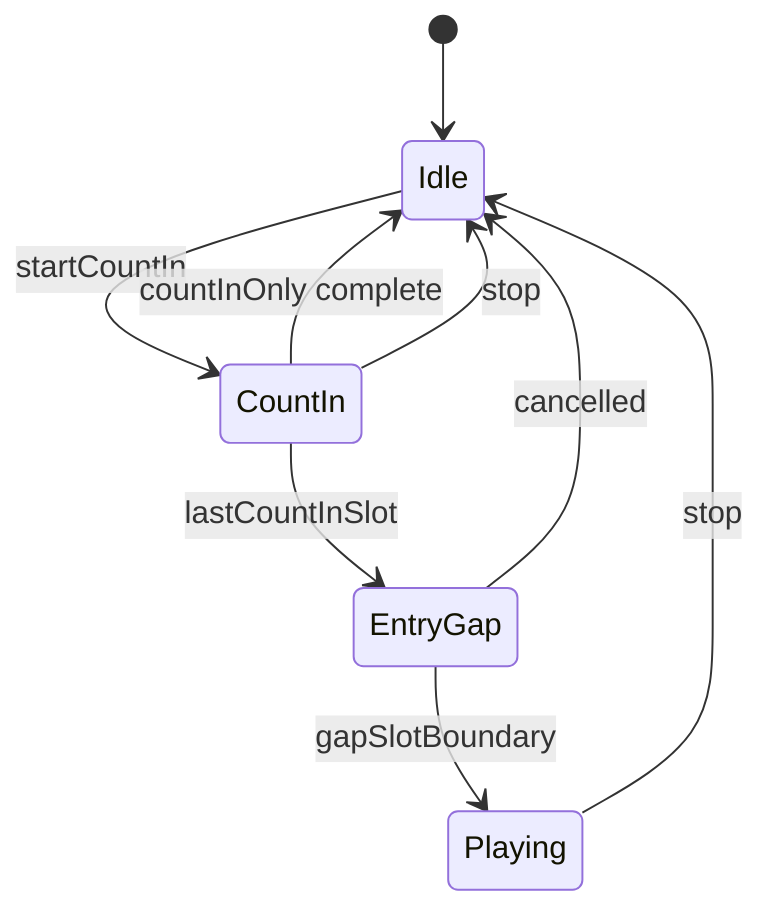

# Metronome and drum timing contract

This document is the source of truth for MIDI playback count-in, during-playback
metronome/drums, and stop/pause behaviour. Changes to metronome timing **must**
update the corresponding tests listed in the regression section below.

## Terminology

| Term | Definition |
|------|------------|
| **abcjs beat** | Unit from tune `L:` (`getBeatsPerMeasure()`, `getBeatLength()`). Drives **music playhead only** via TimingCallbacks. |
| **Rhythm beat** | One entry in `rhythm.beatsPerBar` (e.g. 4 quarters in 4/4 preset). Drives **click/drum spacing**. |
| **Pulse** | Subdivision within a rhythm beat (`pulsesPerBeat[i]`). |
| **Slot** | Smallest grid cell. `slotsPerBar = sum(pulsesPerBeat)`. Slot index 0 = downbeat. |
| **Music second** | `currentTime.current` from `timingProgressToAudioSeconds`. **0 = first note** (audio ratio 0). |
| **Rhythm-grid tempo** | `computeRhythmGridTempo` — BPM for one rhythm beat. Used for all click/drum scheduling. |
| **Music tempo** | `computePlaybackMetronomeTempo` — BPM for abcjs `TimingCallbacks` / music playhead (follows tune `L:` unit). **Do not** use for click spacing. |

**Drum editor subdivision** (standalone metronome / pattern editor): **Beats** groups pulse slots for editing only; **Pulses** (default) matches one toggle per metronome pulse; **Half pulses** doubles `pulsesPerBeat` on the shared click+drum grid. Pulses per beat are set via the metronome controls and apply in drum mode as well.

### abcjs vs rhythm beat units

abcjs `getBeatsPerMeasure()` follows the tune's `L:` default (often **2** half-note
beats per 4/4 bar, or **8** eighth-note beats when `L:1/8`). The metronome rhythm preset
uses **4** quarter-note beats per 4/4 bar. Count-in **must** use `rhythmAlignedCountInInput`
so click count matches the rhythm grid, not raw abcjs beat count.

| Tune `L:` | abcjs beats/bar (typical) | Rhythm grid (4/4 preset) | `computePlaybackMetronomeTempo` vs `computeRhythmGridTempo` |
|-----------|---------------------------|--------------------------|-------------------------------------------------------------|
| `L:1/2` | 2 half-notes | 4 quarters @ 120 | ~60 vs ~120 QPM |
| `L:1/4` | 4 quarters | 4 quarters @ 120 | ~120 vs ~120 QPM |
| `L:1/8` | 8 eighths | 4 quarters @ 120 | ~240 vs ~120 QPM |

`getTimingMusicStartMs` must use `getPlaybackMetronomeTempo` (abcjs beat unit), not raw
`Q:` meta tempo, so `timingProgressToAudioSeconds` matches TimingCallbacks.

## Architecture — single rhythm engine

Tune playback uses **one** phase-driven engine (`rhythmPlaybackController.js`) and
**one** cancellable audio bus (`rhythmOutputBus.js`). The standalone practice tool
(`MetronomePanel` + `Metronome.js`) is separate and unaffected.



| Phase | Clock | What schedules |
|-------|-------|----------------|
| `countIn` | AudioContext time (pre-scheduled) | All count-in slots upfront on the rhythm grid |
| `entryGap` | AudioContext time | Silent gap slot before `onMusicStart` |
| `playing` | AudioContext time (25ms lookahead) | Slots from anchored `downbeatAudioTime` |
| `idle` | — | Nothing; output bus muted |

**Count-in + during-playback:** same controller, no engine swap. Count-in ends at a
virtual timeline boundary (`musicSeconds = 0`); the playing phase continues the same
slot grid from 0.

**Stop/pause:** `stopRhythmPlayback()` bumps a generation token, mutes the output bus
(`silenceRhythmOutputBus`), and clears timers. Pre-scheduled Web Audio clicks are
inaudible within ~50ms — no shortening of playback lookahead.

Slot math lives in `rhythmGrid.js` (formerly inlined in
`musicLockedMetronomeScheduler.js`).

## Count-in

| Case | Clicks (slots) | Gap before music | Music entry |
|------|----------------|------------------|-------------|
| 4/4, 1 bar, no pickup | 4 quarter slots | 1 slot (silent) | `musicSeconds = 0`, slot 0 accented |
| 4/4, 1-beat pickup | 3 slots | 1 slot | Pickup on correct upbeat |
| 6/8, 1 bar | 6 eighth slots | 1 eighth slot | Beat 1 accented |
| 7/8, 9/8, 12/8 | `countInBars × slotsPerBar` (rhythm-aligned) | 1 slot or `delayMs` for fractional pickup | Per `computeMidiMetronomeCountIn` |
| 5/8, 11/8 | Additive presets (`3+2`, `2+2+3+2+2`) | Same as other compound meters | Medium accents on group starts |
| `countInBarOnly` | Full bar from meter, ignore implicit pickup | Standard 1-slot gap | Practice warmups |
| `delayMs > 0` | `floor(totalBeatsBeforeMusic)` clicks | `delayMs` wall wait | Fractional pickup remainder |

**Count-in-only (metronome stops):** `CountIn → EntryGap → Idle`; `onMusicStart`
triggers MIDI via existing delayed-start path.

**Count-in with during-playback:** `CountIn → EntryGap → Playing`; `onMusicStart`
starts TimingCallbacks / MIDI; no overlap with a second scheduler.

## During playback (music playing)

| Requirement | Rule |
|-------------|------|
| Zero drift | Slots derived from **AudioContext time** on a single anchored grid (`rhythmTimeline.js`). |
| Scheduling | 25ms interval schedules slot boundaries in `[now, now + LOOKAHEAD]` onto `audioContext.currentTime`. |
| Lookahead | `DEFAULT_TIMELINE_LOOKAHEAD_SEC` (0.25s). Tempo changes affect at most one lookahead window. |
| Music clock | `beatCallback` updates playhead only; drift watchdog re-anchors after 3 consecutive half-slot misses. |
| Tempo factor | Wall-clock grid tempo uses `computeRhythmGridTempo` (includes `tempoFactor`). Music seconds map via `musicStartAudioTime + musicSeconds / tempoFactor`. |
| Seek | `reanchorRhythm(musicSeconds)` resets schedule state and preserves slot phase. |
| Tempo change | `setRhythmPlaybackTempo` recomputes anchor at current slot. |
| Meter change | `setRhythmPlaybackRhythm` swaps rhythm grid at current slot (from `playbackTimingMap` during play). |
| Section tempo/meter | `buildPlaybackTimingMap` walks inline `Q:` / `M:`; `timingAtMusicSeconds` samples active section. Count-in uses **opening** section only. |
| Stop/pause | `stopRhythmPlayback()` **before** seek-guard early returns in `pauseMidiSynth`. |

## Drums

Drums use the **same slot grid and scheduler as clicks** (`playRhythmSlot` → `playDrumSlot`).

- `drumPattern.resolution` must equal `slotsPerBar(rhythm)` (enforced in `normalizeRhythmConfig`).
- Swing (`drumPattern.swing`, 0–0.5) lengthens the first pulse and shortens the second within each beat that has two or more pulses.

## Additive metres

ABC additive metres (`M:2+2+3`, `M:2+2+3/8`, `M:3+2+3/8`) and typed patterns in the metronome UI map to unequal pulse groups:

| Pattern | Slots/bar | Default accents |
|---------|-----------|-----------------|
| `2+2+3` / `7/8` | 7 | Strong beat 1; **medium** (`tick`) on beats 2–3 |
| `3+2` / `5/8` | 5 | Strong + medium |
| `2+2+3+2+2` / `11/8` | 11 | Strong + medium on each later group |

Off-pulses inside a group use `sub`. Simple `M:7/8` defaults to `2+2+3` grouping.

`meterTextFromAbcMeterElement` reads abcjs `meter.value[]` arrays for additive header/mid-tune `M:` fields.

## Do not

- Use `new Metronome(...)` for tune playback (count-in or during-playback). Standalone `MetronomePanel` only.
- Run two schedulers simultaneously (wall-clock count-in + music-locked) for the same session.
- Use `setTimeout` for beat alignment during playback.
- Pass raw abcjs `getBeatsPerMeasure()` to count-in without rhythm alignment.
- Put timing math inline in `useAbcSynth.js` — use `playbackStateLogic.js`, `metronomeRhythmPresets.js`, `rhythmGrid.js`, `rhythmPlaybackController.js`.

## Regression tests required

Any PR touching metronome timing must pass:

- `src/playbackStateLogic.test.js` (count-in, slot mapping, rhythm alignment)
- `src/metronomeRhythmPresets.test.js`
- `src/musicLockedMetronomeScheduler.test.js` (slot math via `rhythmGrid.js`)
- `src/rhythmTimeline.test.js` (audio-clock slot grid, count-in ranges)
- `src/rhythmPlaybackController.test.js` (phases, stop, count-in, rhythm swap)
- `src/playbackTimingMap.test.js` (mid-tune `Q:` / `M:`, additive metres)
- `src/rhythmOutputBus.test.js` (instant mute on stop)
- `e2e/playback-smoke.js` (count-in, from-start, stop silence)

## Example timelines (4/4, 120 BPM, no anacrusis)

```
Count-in:  |1   2   3   4| gap |MUSIC START (slot 0 accent)
            click click click click  (1 beat)  note...
```

6/8 one bar count-in at 120 BPM (beat = dotted quarter, 6 eighth slots):

```
Count-in:  |1-2-3 4-5-6| gap |MUSIC
            x x x x x x    (1 eighth)  ...
```
