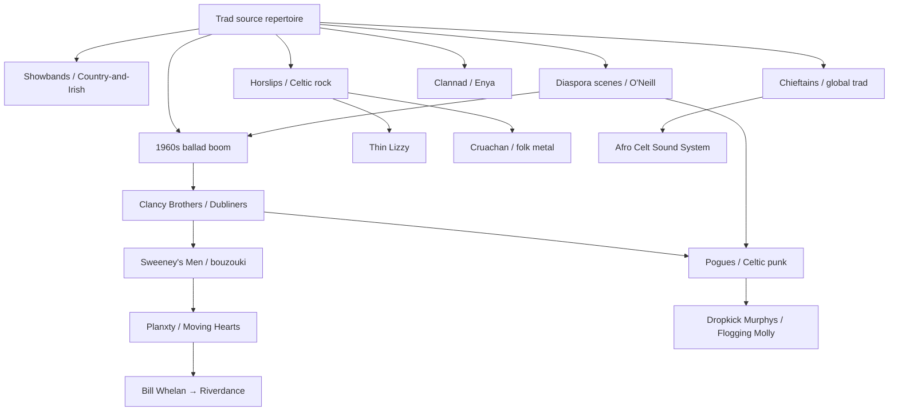

# Representative Fusions and Scenes

**Track:** regions | **Tier:** 7 | **Difficulty:** 6/10
**Prerequisites:** regions-celtic-ireland-06-history
**Tags:** ireland, fusion, celtic-rock, showband, diaspora, riverdance, folk-revival, celtic-punk

## Overview

This lesson maps **how Irish traditional music left the kitchen, the pub session, and the fleadh stage** to meet ballroom crowds, American television, rock amplifiers, jazz harmony, New Age production, Broadway spectacle, and diaspora cities on three continents. It assumes you already know the collectors, Comhaltas, and transmission story from the history lesson — here the focus is **named bands, fusion genres, and scenes** from the 1950s to the present.

Think of Irish music as a tree with many branches, not a single "authentic" trunk. Showbands taught a generation stagecraft; the Clancy Brothers dressed trad for Ed Sullivan; Horslips plugged harps into Marshall stacks; Planxty made the bouzouki a session standard; The Pogues poured Guinness into punk; Riverdance sold step dance to stadiums; Chicago kept O'Neill's tune books alive. Each branch fed back into the others — session players learn from punk albums; metal bands quote slip jigs; country singers cover sean-nós melodies in English.

**Memorable detail:** Almost every fusion act on this list contains at least one musician who also plays straight trad — the boundary is porous, not a wall.

---

## 1. Irish Showbands (1950s–1970s)

### Formation and scene

**Irish showbands** emerged in the late 1950s as the social centre of rural and small-town Ireland shifted to **ballrooms and dance halls** — purpose-built venues and converted cinemas where young people courted, drank, and danced on Saturday nights. Before discos, before television dominated entertainment, the showband was the **house band of a nation on the move**: electrified, horn-led, dressed in matching suits, playing six nights a week on a circuit from Donegal to Kerry.

A typical lineup ran **vocals, electric guitar, bass, drums, saxophone, trumpet or trombone, and keyboards** — sometimes two saxes. Repertoire mixed **chart covers** (Beatles, Motown, country hits), **céilí sets** for the older crowd, and **showmanship**: coordinated steps, comedy patter, costume changes. Bands travelled in vans with their own PA, competing for residency slots at halls like the **Galway Bay Hotel**, the **Crystal Ballroom** in Bundoran, and hundreds of parish halls.

### Key acts and members

Hundreds of bands existed; a few became national names:

| Band | Notes |
|------|-------|
| **The Royal Showband** (Waterford) | Brendan Bowyer — often cited as the first superstar showband vocalist |
| **The Capitol Showband** | Featured **Des Lee** and later **Butch Moore** (Eurovision 1965) |
| **The Miami Showband** | Cross-border lineup; tragically attacked in 1975 — a wound in the Troubles era |
| **Drifters Showband** | Brendan Bowyer after leaving the Royal |
| **The Freshmen** | Harmonic sophistication; Billy Brown arrangements |

Individual musicians rotated between bands the way jazz sidemen did — **learning repertoire breadth and stage presence** that would later surface in folk-rock and country-and-Irish careers.

### Musical approach

Showbands were **dance functional first**: four-to-the-floor rhythms, singalong choruses, medleys to keep feet moving. Horn sections voiced country and soul hits; guitarists learned **country picking** from American records. When a band dropped a reel or polka set, it was usually **simplified and amplified** — not the ornamented session version, but recognisable to dancers who had grown up with ceili bands.

The showband era coincided with **rural electrification and rising car ownership** — teenagers could reach a hall twenty miles away. Radio programmes like **RTÉ's Showband Show** (from 1965) broadcast performances into kitchens, creating national hits overnight.

### Landmark moments

- **Brendan Bowyer** and **"The Hucklebuck"** — showband dance crazes
- **Butch Moore**, *Walking the Streets in the Rain* — Ireland's first Eurovision entry (1965)
- The **Miami Showband massacre** (1975) — political violence intersecting entertainment (not musical legacy, but historical context)

### Legacy

By the late 1970s, **discos, cover bands in hotels, and television** eroded the circuit. Yet showbands matter for trad students because they:

1. **Kept dance music socially central** through a period when pure trad was unfashionable in urban media
2. **Trained musicians** in reading charts, blending, and working crowds — skills Planxty and Moving Hearts would exploit
3. **Bridged American country and Irish melody** — direct ancestor of country-and-Irish

**Memorable detail:** Many future trad and rock players started in showbands; the ballroom was Ireland's conservatoire of popular musicianship.

---

## 2. Country-and-Irish

### Formation and context

**Country-and-Irish** (also **country 'n' Irish** or **Irish country**) fuses **American country music** — pedal steel, Nashville song structure, close harmony — with **Irish ballad melody, fiddle ornament, and themes of emigration, farming, and family**. It is not "trad" in the Comhaltas sense, but it is **deeply Irish popular music**: sung in English (sometimes Irish phrases), sold in record shops from Letterkenny to Limerick, and performed at **cabaret lounges, festivals, and RTÉ television**.

The genre rose as showbands declined and **rural audiences aged into country tastes** shaped by American radio, emigrant letters, and records brought home from Birmingham or Boston.

### Big Tom and The Mainliners

**Formation:** **Tom McBride** ("Big Tom", 1936–2018) from **Castleblayney, County Monaghan**, formed **The Mainliners** in 1966 with guitarist **Seamus McMahon**, saxophonist **Henry McMahon**, drummer **Ronnie Duffy**, bassist **Ginger Morgan**, trombonist **Cyril McKevitt**, and keyboardist **John Beattie**. They were a **showband-turned-country** outfit — not pure Nashville, but horn-backed country ballads with Irish emotional directness.

**Musical approach:** Warm baritone vocals, sentimental lyrics, fiddle and steel colouring Irish step and waltz rhythms. **"Gentle Mother"** (1966), performed on **The Showband Show**, became a defining hit — mothers wept; sales soared. Songs like **"Four Country Roads"** and **"Back to Castleblayney"** rooted identity in place.

**Landmark albums/songs:** *Gentle Mother*, *Four Country Roads*, *Old Love Letters*; decades of studio albums and ballroom tours.

**Legacy:** Big Tom was inaugural inductee to the **Irish Country Music Awards Hall of Fame** (2016). A bronze statue stands on Muckno Street, Castleblayney (unveiled 2018). He proved country-and-Irish could sustain a **forty-year career** without American stardom — domestic fame at stadium scale.

### Daniel O'Donnell

**Formation:** **Daniel O'Donnell** (born 1961, Kincasslagh, Donegal) began professionally in the 1980s, building a career distinct from Big Tom's brassy showband roots — **softer, crooner-led, television-friendly**.

**Musical approach:** Clean production, romantic and nostalgic lyrics, occasional Irish-language songs, duets with **Mary Duff** and others. Less honky-tonk than Big Tom; more **middle-of-the-road country pop** with Irish accent and fiddle fills.

**Landmark work:** Albums such as *I Need You* and relentless touring schedule (often cited among the busiest live acts in Europe); **BBC television specials** brought him British audiences beyond the Irish diaspora.

**Legacy:** Country-and-Irish's **second-generation star** — proof the genre outlived its ballroom origins. For trad musicians, O'Donnell represents the **parallel radio universe** many rural listeners inhabit; knowing his audience helps teachers connect with students whose first Irish music was country, not sean-nós.

**Memorable detail:** Big Tom and Daniel O'Donnell share Donegal–Monaghan border country roots and television visibility, but differ in arrangement — horns versus crooner polish.

---

## 3. The Clancy Brothers and Tommy Makem

### Formation

**Paddy Clancy** (1922–1998), **Tom Clancy** (1924–1990), and **Liam Clancy** (1935–2009) were brothers from **Carrick-on-Suir, County Tipperary**, who emigrated to America and initially pursued acting in New York. **Tommy Makem** (1932–2007) from **Keady, County Armagh**, joined as singer, uilleann piper, and storyteller. Together they became **The Clancy Brothers and Tommy Makem** — the face of Irish folk in the United States during the **1960s folk revival**.

Their mother **Joan Clancy** famously sent **Aran sweaters** to cold New York winters; manager **Marty Erlichman** (later Barbra Streisand's manager) parlayed that visual into **stage identity** — bearded men in white sweaters, belting ballads.

### Key members and roles

| Member | Role |
|--------|------|
| **Liam Clancy** | Lead vocals — warm, theatrical tenor |
| **Tommy Makem** | Vocals, banjo, tin whistle; comic monologues |
| **Paddy Clancy** | Guitar, business mind, founded **Tradition Records** |
| **Tom Clancy** | Vocals, acting career parallel |

### Musical approach

**Unaccompanied or lightly accompanied ballads** — rebel songs, emigration narratives, drinking songs, work songs. Repertoire drew from Irish tradition but was **arranged for American concert halls**: clear diction, strong chorus hooks, deliberate pacing. They were not session players chasing ornament; they were **storytellers with star power**.

### Landmark albums and appearances

- **The Ed Sullivan Show** (1961) — estimated **80 million viewers**; catalysed Irish folk boom
- Albums on **Columbia Records**: *The Clancy Brothers and Tommy Makem* (1961), *The Rising of the Moon* (1956, Tradition), *In Person at Carnegie Hall* (1963)
- Songs: **"The Wild Rover"**, **"The Parting Glass"**, **"Roddy McCorley"**, **"Four Green Fields"**

### Legacy

They **funded visibility** for Irish music in America when Ireland itself was still shaking off post-war cultural conservatism. **Tommy Makem** later solo; **Liam Clancy** became elder statesman of Irish song on television. The Aran sweater became **international shorthand for "Irish folk"** — sometimes mocked, never forgotten.

Direct influence on **The Dubliners**, **Christy Moore's** repertoire choices, and every Irish-American pub session set list. Without the Clancys, the 1960s revival timeline shifts dramatically.

**Memorable detail:** Joan Clancy's sweaters were a wardrobe accident that became the most successful Irish folk branding in history.

---

## 4. The Dubliners

### Formation

**The Dubliners** coalesced in **1962** from Dublin pub sessions — initially **The Ronnie Drew Ballad Group**. **Ronnie Drew** (1934–2008), gravel-voiced singer from Dún Laoghaire, provided anti-romantic charisma. **Luke Kelly** (1940–1984), from Sheriff Street, brought **passionate left-wing politics** and banjo drive. **Barney McKenna** (1939–2012), banjo virtuoso from Donnycarney, was the **instrumental engine**. **Ciarán Bourke** (1935–1988), vocals, guitar, tin whistle. **John Sheahan** (born 1939), classical training on fiddle — later compositions like **"The Marino Waltz"**.

Kelly suggested the name while reading **James Joyce's *Dubliners***.

### Key members and musical approach

Unlike the Clancys' sweater polish, The Dubliners sounded **like the pub**: rough edges, comic banter, sudden beauty. **Barney McKenna's banjo** — fast, rolling, rhythmically aggressive — defined how many outsiders hear Irish banjo. Kelly sang **"The Rocky Road to Dublin"** to fiddle rhythm; McKenna later noted Kelly was the only singer he'd heard match the tune's natural lilt.

**Luke Kelly** interpreted **"Scorn Not His Simplicity"**, **"The Town I Loved So Well"**, and **"Raglan Road"** — poetic, political, unforgettable. **Ronnie Drew** delivered **"Seven Drunken Nights"** (UK charts, 1967) with deadpan humour.

### Landmark albums and songs

- *The Dubliners* (1964 debut) — **"The Rocky Road to Dublin"**
- *A Drop of the Hard Stuff* (1967) — **"Seven Drunken Nights"**
- *Live at the Royal Albert Hall* — concert stature
- **"The Wild Rover"**, **"Molly Malone"**, **"Finnegan's Wake"**

### Legacy

The Dubliners ran **five decades** with rotating membership after Kelly and Bourke died. They proved **Irish ballad groups could be career bands**, not just revival curiosities. Barney's banjo style remains a **template** — copied, debated, and revered. For session musicians, they are the bridge between **pub repertoire** and **international festival stages**.

**Memorable detail:** Luke Kelly's statue on Dublin's Royal Canal stands where he sang for workers — rare honour for a folk singer.

---

## 5. Sweeney's Men

### Formation

**Sweeney's Men** formed in **1966** — a short-lived but pivotal **folk trio** whose alumni reshaped Irish music for forty years. Founding members included **Johnny Moynihan** (vocals, bouzouki, fiddle, tin whistle), **Joe Dolan** (guitar — died soon after formation), and **Andy Irvine** (mandolin, harmonica, later bouzouki). **Terry Woods** (guitar, banjo) joined when Irvine briefly departed.

The name nods to **mad Sweeney** of medieval Irish legend — fitting for experimental, literary folk.

### Johnny Moynihan and the bouzouki

**Johnny Moynihan** is credited with introducing the **Greek bouzouki** to Irish folk — modified tuning (often GDAD), octave pairs on lower courses, and a **sustained drone** that suited modal Irish melody in ways guitar could not. Before Moynihan, Irish trad rarely featured bouzouki; after **Sweeney's Men**, **Planxty**, and **Dónal Lunny**, it became **standard session furniture**.

### Musical approach

**Tight vocal harmony**, intricate mandolin-bouzouki interplay, repertoire mixing **Irish trad, Balkan rhythms, and American folk**. Their 1968 single **"Old Maid in the Garrett" / "The Derby Ram"** showed radio-friendly folk. Album *Sweeney's Men* (1968) — only studio album — includes **"Willy O' Winsbury"**, **"Dance to Your Daddy"**, and instrumentals that feel **chamber-sized** compared to showbands.

### Legacy

The band dissolved by **1969**, but:

- **Andy Irvine** → Planxty, Patrick Street, solo Balkan-Irish fusion
- **Johnny Moynihan** → Planxty (1973–75), De Dannan, solo
- **Terry Woods** → Steeleye Span, Gay & Terry Woods, Dr. Strangely Strange

**Sweeney's Men** is the **missing link** between 1960s ballad boom and 1970s ensemble innovation. One album, enormous downstream influence.

**Memorable detail:** Moynihan reportedly bought his first bouzouki from a Greek sailor in Galway — apocryphal or not, the instrument arrived from outside the tradition and stayed forever.

---

## 6. Horslips

### Formation

**Horslips** formed in **1970** in Dublin — **Celtic rock** before the label existed. Core members: **Jim Lockhart** (keyboards, flute, uilleann pipes), **Barry Devlin** (bass, vocals), **Charles O'Connor** (fiddle, mandolin, vocals), **Eamon Carr** (drums), and guitarists **Gary Moore** (briefly), **Johnny Fean**, and others over the years.

They took **Seán Ó Riada's** idea of ensemble Irish arrangement and **plugged it into rock**: Marshall stacks, prog-rock song structures, **Irish myth as concept-album material**.

### Musical approach

**Electric guitar and bass** doubled fiddle and flute lines; drums drove **reels at rock tempo**. Lyrics drew from **Táin Bó Cúailnge**, **Cú Chulainn**, and Celtic legend. Lockhart's **pipes and flute** maintained trad timbre inside distorted walls of sound. They were **Irish first, rock second** — not a British folk-rock cover band with a tin whistle.

### Landmark albums

| Album | Significance |
|-------|--------------|
| *Happy to Meet – Sorry to Part* (1972) | Debut — trad tunes electrified |
| *The Táin* (1973) | Concept album on Cattle Raid of Cooley — **landmark Celtic rock** |
| *Dancehall Sweethearts* (1974) | Showband-era irony in title and cover |
| *The Book of Invasions* (1976) | Lebor Gabála Erenn mythology |
| *Aliens* (1977) | Emigration theme — Irish diaspora rock |

Songs: **"Dearg Doom"**, **"Táin Bó Cuailgne"**, **"King of the Fairies"** (electric set).

### Legacy

Horslips **legitimised rock volume for Irish trad melody** — without them, Thin Lizzy's trad quotes and later Celtic metal look different. They filled **3Arena-scale venues** in reunion years (2000s–2010s). Jim Lockhart's classical and Ó Riada-informed arranging showed **pipes belong in rock orchestration**.

**Memorable detail:** *The Táin* turned a medieval cattle raid into prog-rock — Irish mythology as stadium material decades before Marvel franchises.

---

## 7. Planxty

### Formation and core lineup

**Planxty** formed in **January 1972** after a one-off **Christy Moore** album *Prosperous* (1972) — recorded with **Andy Irvine**, **Dónal Lunny**, and **Liam O'Flynn**. The chemistry was immediate; they became Ireland's **definitive folk supergroup**.

| Member | Instruments | Contribution |
|--------|-------------|--------------|
| **Christy Moore** | Vocals, guitar, bodhrán | Repertoire curator, political songs, stage warmth |
| **Dónal Lunny** | Bouzouki, guitar, bodhrán | Arrangement architect, open tunings, production |
| **Andy Irvine** | Mandolin, bouzouki, hurdy-gurdy, harmonica | Balkan rhythms, harmony vocals, compositional depth |
| **Liam O'Flynn** | Uilleann pipes, whistle | Ceoltas-trained piper — **trad authority** in electric settings |

### Musical approach

Planxty **transformed Irish folk arrangement**: counterpoint between pipes and bouzouki, **modal harmony** preserved under complex rhythm, songs extended with **instrumental bridges** that respected dance metre. They were **loud enough for festivals, subtle enough for purists** — a balance few achieve.

### Landmark albums and songs

- *Prosperous* (1972) — birth document; **"The Raggle Taggle Gypsy"**
- *Planxty* (1973) — **"Sweet Thames Flow Softly"**, **"Only Our Rivers Run Free"**
- *The Well Below the Valley* (1973)
- *Cold Blow and the Rainy Night* (1974)
- *The Planxty Collection* (1976) — compilation of peak years

### Breakups and reunions

First breakup **1975** — exhaustion, solo ambitions (Moore's career, Lunny's Bothy Band founding). Reformed **1978–1983** with **Matt Molloy** (flute), **Bill Whelan** (keyboards — later *Riverdance*), **Paul Brady** briefly. Final reunion tours **2003–2005** sold out Irish arenas. **Liam O'Flynn** died 2018; the quartet's legacy is sealed.

### Legacy

Planxty taught **three generations** that bouzouki, pipes, and mandolin could share one stage without caricature. **Christy Moore** became Ireland's folk conscience; **Lunny** produced half of trad's landmark albums; **O'Flynn** linked Ceoltas rigour to concert hall. If you learn one fusion ensemble deeply, make it Planxty.

**Memorable detail:** The band was named after the word *planxty* (a tune honouring a patron) — they became patrons of modern Irish arrangement themselves.

---

## 8. Moving Hearts

### Formation

**Moving Hearts** emerged in **1981** when **Christy Moore** and **Dónal Lunny** — reunited after Planxty — sought **jazz-rock fusion** with Irish roots. Lineup included **Liam O'Flynn** (pipes), **Matt Molloy** (flute), **Declan Sinnott** (guitar), **Keith Donald** (saxophone), **Noel Eccles** and **Eoghan O'Neill** (percussion/bass), with **Uileann pipes facing saxophone** — deliberate friction.

### Musical approach

**Irish folk jazz fusion**: complex time signatures, **soprano sax lines** weaving pipe melodies, political lyrics unchanged from Moore's convictions. Arrangements owed as much to **Weather Report and Coltrane** as to Planxty — but tune cores remained **Irish modal**.

### Landmark albums and songs

- *Moving Hearts* (1981) — debut; **"Politics"**, **"Hiroshima Nagasaki Russian Roulette"**
- *The Dark End of the Street* (1982)
- *Live in Dublin* (1984)

Moore departed **1982**; band continued instrumentally, then dissolved. Reunion concerts in **2000s** reminded audiences of the **1981–82 peak**.

### Legacy

Moving Hearts proved **Irish trad could absorb jazz harmony** without becoming "smooth jazz" pastiche. Keith Donald's sax and O'Flynn's pipes **traded phrases** like session partners at a faster harmonic clock. For composers, they are the **template for political art-music fusion** in Ireland.

**Memorable detail:** The same rhythm section braintrust (Lunny) that built Planxty's modal sound built Moving Hearts' jazz structures — one arranger, two revolutions.

---

## 9. The Chieftains

### Formation

**The Chieftains** began in **1962** when **Paddy Moloney** (1938–2021), uilleann piper and **Claddagh Records** producer, assembled studio musicians for a trad album. Moloney (pipes, tin whistle), **Seán Potts** (whistle), **Michael Tubridy** (flute, concertina), **Martin Fay** (fiddle), and **Peadar Mercier** (bodhrán, bones) — later **Derek Bell** (harp), **Kevin Conneff** (bodhrán, vocals), **Matt Molloy** (flute).

### Musical approach

**Concert-hall trad**: precise ensemble balance, **harp and pipes as lead colours**, repertoire spanning airs, reels, and regional styles. Unlike Planxty, largely **instrumental** — vocals occasional (Conneff's **"The Coast of Malabar"**). Production values **high-fidelity**, inviting classical audiences.

### Landmark albums and collaborations

- *The Chieftains* (1964) — debut
- *The Chieftains 4* (1974) — breakthrough international sales
- *Celtic Wedding* (1981) — Breton crossover
- *The Long Black Veil* (1995) — **Sting**, **The Rolling Stones**, **Van Morrison**
- Film scores: *Barry Lyndon*, *Year of the French*, *Gangs of New York*

### Legacy

Six **Grammy Awards**; **first Western group to perform on the Great Wall of China** (1983). Moloney's **global collaboration model** — trad as equal partner, not exotic garnish — shaped **World Music** marketing before the term stuck. For pipers, Moloney's **regulator phrasing on record** is a masterclass.

**Memorable detail:** The Chieftains made the uilleann pipes **diplomatic** — cultural ambassadors with a bodhrán case.

---

## 10. Clannad

### Formation

**Clannad** — from **Clann as Dobhar** ("family from Dore") — are siblings from **Gweedore, County Donegal** Gaeltacht: **Máire Brennan** (Moya), **Ciarán**, **Pól**, and **Noel Duggan**, with twin uncles **Pádraig** and **Noel Duggan** (guitar). Raised in **Irish-language song**, they began professionally in **1970** at **Féile Phobail Bhéal Feirste**.

### Musical approach

**Harmony vocals in Irish and English**, harp, flute, keyboards — increasingly **atmospheric production** in the 1980s. Early work rooted in **Donegal sean-nós and hymnody**; later albums added **synthesizers, electric guitar, and New Age textures** without abandoning Gaelic identity.

### Landmark albums and songs

- *Clannad 2* (1974) — trad foundation
- *Fuaim* (1982)
- *Magical Ring* (1983)
- **"Theme from Harry's Game"** (1982) — UK Top 5; Irish-language television drama theme
- *Legend* (1984) — Robin of Sherwood soundtrack
- *Macalla* (1985) — **Enya** featured before solo career

### Legacy

**"Harry's Game"** proved **Irish-language vocals could be pop** — radio played Gaelic without translation. Soundtrack work (*Robin of Sherwood*, *Last of the Mohicans* contributions) placed Clannad in **international living rooms**. Moya Brennan's solo career extended the family sound; the band influenced **Celtic New Age** and film score aesthetics globally.

**Memorable detail:** British soldiers in Northern Ireland reportedly requested "Harry's Game" on radio — Gaelic harmony crossing the Troubles divide.

---

## 11. Enya

### Formation

**Enya** (Eithne Pádraigín Ní Bhraonáin, born 1961) joined **Clannad** briefly in the early 1980s — keyboards and vocals — before **Nick Ryan** and **Roma Ryan** (manager/producer and lyricist) steered her solo. She is Clannad's **youngest sibling**; her path diverged toward **studio-crafted atmospheric pop**.

### Musical approach

**Layered vocals** — Enya and producer **Nicky Ryan** multitracked hundreds of vocal lines into **choir-of-one** textures. **Synthesizers, reverb, and Gaelic-inflected English lyrics** (often Roma Ryan's poetry). Rhythm subdued; **mood and melody primary**. Not trad, not rock — **New Age / adult contemporary** with Irish timbre.

### Landmark albums and songs

- *Watermark* (1988) — **"Orinoco Flow"** (Sail Away) — global hit
- *Shepherd Moons* (1991) — **"Caribbean Blue"**
- *A Day Without Rain* (2000) — **"Only Time"** — renewed fame after 9/11 media use
- *Themes from Calmi Cuori Appassionati* (2001)

### Legacy

Enya became **one of Ireland's best-selling artists ever** — proof Gaeltacht vocal aesthetics could scale to **hundred-million-selling** production. Trad purists debate her relationship to source material; **music teachers** note she recruits students who later discover sean-nós and Clannad's earlier albums. Different branch, same family tree.

**Memorable detail:** "Orinoco Flow" name-checks Caribbean rivers and Orinoco Studios — Irish mysticism meets yacht-rock wanderlust.

_(cropped).jpg?width=640)

---

## 12. Thin Lizzy

### Formation

**Thin Lizzy** formed in **1969** in Dublin — **Phil Lynott** (1949–1986), born to an Irish mother and Guyanese father, bassist, lead vocalist, and **primary songwriter**. Guitarists **Eric Bell**, **Brian Robertson**, **Scott Gorham**; drummers **Brian Downey** and others. Lynott was **Ireland's first rock star who looked like Ireland** — mixed race in a homogeneous scene, poet and frontman.

### Musical approach

**Twin lead guitars**, driving rock rhythm, Lynott's **melodic bass lines**. Lyrics referenced **Irish history and Dublin streets** alongside cowboy mythology and working-class romance. Not trad repertoire — but **Irish identity explicit** in a hard-rock idiom dominated by British and American acts.

### Landmark albums and songs

- *Thin Lizzy* (1971) — **"The Farmer"** — Irish folk melody in rock clothes
- *Jailbreak* (1976) — **"The Boys Are Back in Town"**, **"Jailbreak"**
- *Black Rose: A Rock Legend* (1979) — **"Waiting for an Alibi"**, **"Do Anything You Want To"**
- *Live and Dangerous* (1978) — classic live album
- **"Whiskey in the Jar"** (1972) — trad tune, rock arrangement — **Irish rock standard**

### Legacy

Lynott's death in **1986** ended the classic era, but **"The Boys Are Back in Town"** and **"Whiskey in the Jar"** remain stadium anthems. Thin Lizzy parallel **Horslips** and **Planxty** — three answers to "what does Irish rock sound like?" Lizzy's answer: **Dublin swagger, not Ceoltas ornament**.

**Memorable detail:** Lynott posed with Irish harp imagery on *Black Rose* — trad symbol, rock album, one iconic sleeve.

---

## 13. The Pogues

### Formation

**The Pogues** formed in **1982** in London — Irish diaspora punks led by **Shane MacGowan** (1957–2023), born in Kent to Irish parents. Original name **Pogue Mahone** (anglicisation of Irish insult). Members included **Jem Finer** (banjo), **James Fearnley** (accordion), **Spider Stacy** (whistle), **Cait O'Riordan** (bass), **Andrew Ranken** (drums), later **Philip Chevron** (guitar).

### Musical approach

**Celtic punk**: trad tunes and ballad melodies at **punk tempo**, rough vocals, beer-soaked authenticity. MacGowan's lyrics mixed **Irish republican history, London immigrant life, and romantic ruin**. Accordion and whistle **not decorative** — they carry hook and harmony.

### Landmark albums and songs

- *Red Roses for Me* (1984) — debut energy
- *Rum Sodomy & the Lash* (1985) — **Elvis Costello** production; **"A Pair of Brown Eyes"**, **"The Sick Bed of Cúchulainn"**
- *If I Should Fall from Grace with God* (1988) — **"Fairytale of New York"** (with **Kirsty MacColl**), **"Thousands Are Sailing"**
- *Hell's Ditch* (1990) — MacGowan's last peak before departure

### Legacy

**"Fairytale of New York"** — Christmas anthem across Britain and Ireland; **session pubs play it beside sean-nós**. The Pogues **recruited punk kids to trad instruments** and made **emigration song** urgent again. MacGowan's death (2023) prompted global tribute — proof the repertoire entered **popular canon**.

**Memorable detail:** "Fairytale of New York" opens with French horn and piano — not punk at all — then MacGowan and MacColl destroy sentimentality together.

---

## 14. Dropkick Murphys and Flogging Molly

### Dropkick Murphys

**Formation:** **1996**, **Quincy, Massachusetts** — **Ken Casey** (bass, vocals), **Matt Kelly** (drums, bodhrán), rotating members. Named after **wrestling trainer "Dropkick" Murphy**.

**Musical approach:** **Boston Irish-American punk** — gang vocals, bagpipes, banjo, **sports-bar solidarity**. Less literary than The Pogues; more **anthem and community** (Boston Red Sox, unions, firefighters).

**Landmarks:** **"Shipping Up to Boston"** (2004, *The Departed* soundtrack), *The Warrior's Code* (2005), annual **St. Patrick's Day** hometown shows at **House of Blues**.

**Legacy:** Soundtrack of **Irish-America at full volume** — recruits players to pipes and fiddle through sheer fun.

### Flogging Molly

**Formation:** **1997**, **Los Angeles** — **Dave King** (vocals), Dublin-born, formerly of **Fastway**; **Bridget Regan** (fiddle, tin whistle, uilleann pipes), **Dennis Casey** (guitar), **Matt Hensley** (accordion), **Nathen Maxwell** (bass), **George Schwindt** (drums). Named after **Molly Malone's** pub where they rehearsed.

**Musical approach:** **Celtic punk with clearer trad instrumentalism** — Regan's fiddle and pipes **lead melodies**; King narrates Irish-American labour and exile.

**Landmarks:** *Swagger* (2000), *Drunken Lullabies* (2002) — title track and **"What's Left of the Flag"**; relentless touring including **Sziget Festival** and **St. Patrick's Day** circuits.

**Legacy:** With Dropkick Murphys, defined **2000s Irish-American festival punk** — parallel to Ireland's trad scene, not derivative of it.

**Memorable detail:** Bridget Regan plays **uilleann pipes in a punk band** — rare crossover even among Celtic punk acts.

---

## 15. Cruachan and Celtic Metal

### Formation

**Cruachan** formed in **1992** in Dublin — among the **earliest folk metal bands** globally. Founded by **Keith Fay** (vocals, guitar, keyboards, bodhrán). Name from **Cruachán** — seat of Connacht kings in Irish legend.

### Musical approach

**Celtic metal**: distorted guitars, blast beats, and **Irish melody on tin whistle, fiddle, and bodhrán**. Vocals alternate **harsh metal and clean folk singing**; lyrics mine **mythology, battles, and colonial history**. Unlike punk's pub pace, metal favours **epic length and orchestral synth**.

### Landmark albums

- *Tuatha Na Gael* (1995) — early black/folk hybrid
- *The Morrigan's Call* (2006) — fan favourite
- *Blood for the Blood God* (2014) — heavier production
- *Nine Year War* (2018) — concept on Williamite War

Related acts: **Waylander** (Northern Ireland), **Primordial** (black metal with Irish themes), **Mael Mórdha** — each trades different metal subgenre balance.

### Legacy

Cruachan **exported Irish myth to metal festival circuits** (Wacken, Bloodstock). Young metal fans discover **tin whistle** through Cruachan the way punk fans discovered it through The Pogues. Controversy occasionally over **political imagery** — metal's drama meets Irish history's live wires.

**Memorable detail:** Keith Fay reportedly started the band to combine his two loves — **Metallica and the Chieftains** — on one stage.

---

## 16. Riverdance

### Formation and key figures

**Riverdance** began as a **seven-minute interval act** at the **Eurovision Song Contest**, Dublin **1994** — produced by **Moya Doherty** and **John McColgan** (husband-wife team, founders of **Tyrone Productions**). Composer **Bill Whelan** (Planxty alumnus) wrote the score; **Anúna** (choir) and dancers **Jean Butler** and **Michael Flatley** featured.

**Michael Flatley** (born 1958, Chicago) — Irish-American step dancer — choreographed and starred. Clashed with producers over control; departed to create **Lord of the Dance** (1996). **Colin Dunne** replaced Flatley in Riverdance; **Jean Butler** co-led.

### Musical approach

**Orchestral Irish fusion**: Bill Whelan's score blends **uilleann pipes, fiddle, bodhrán, and Sean Keane's fiddle solos** with **orchestral and world percussion**. Step dance **front and centre** — hard-shoe rhythm as visual percussion. **Anúna's** Gaelic vocals anchor Irish identity.

### Landmark productions

- **Eurovision interval** (30 April 1994) — **standing ovation**
- **Point Theatre, Dublin** (February 1995) — full show premiere
- **Radio City Music Hall** (1996) — American breakthrough
- Album *Riverdance* (1996) — Grammy for Best Musical Show Album

### Legacy

Riverdance **globalised Irish step dance** — feis entries soared worldwide; trad musicians debated **spectacle versus source**. Bill Whelan proved **Planxty alumni could score Broadway-scale shows**. Flatley's *Lord of the Dance* commercialised further — **stadium Irish entertainment** as export industry.

**Memorable detail:** Seven minutes at Eurovision became a **twenty-five-year touring franchise** — the interval act that refused to leave the stage.

---

## 17. Afro Celt Sound System and World Fusion

### Formation

**Afro Celt Sound System** formed **1995** when **Peter Gabriel's WOMAD** and **Real World Records** connected **Irish and West African musicians**. Core: **Simon Emmerson** (producer), **Iarla Ó Lionáird** (sean-nós singer), **James McNally** (pipes, keyboards), **N'Faly Kouyate** (kora), **Myrdhin** (bodhrán), **Jo Bruce** (keyboards), evolving lineup.

### Musical approach

**Electronic dance meets trad and African griot music**: programmed beats, **kora and uilleann pipes in dialogue**, sean-nós vocals over dub bass. Not Irish-only — **deliberately pan-Celtic and pan-African** branding. Albums *Volume 1: Sound Magic* (1996), *Volume 2: Release* (1999), *Volume 3: Further in Time* (2000) — **"Release"** and **"When You're Falling"** (with Gabriel) charted in UK.

### Legacy

Represented **1990s world-fusion boom** alongside **Enya**, **Clannad**, and **Riverdance** — Irish trad as **one colour in global palette**. Critics asked whether fusion **diluted or enriched** source traditions; audiences voted with festival tickets. For composers, they model **cross-cultural respect** (named collaborators, shared writing credit) versus anonymous sampling.

**Memorable detail:** The name insists on **Afro + Celt** equality — not "Celtic with drums added."

---

## 18. Diaspora Scenes: Chicago, Boston, and Beyond

### Why diaspora matters for fusion

Irish music **left Ireland and returned changed** — 78 rpm records, showband tours, punk bands, and tune books all crossed the Atlantic. **Diaspora cities are not museums**; they are **active scenes** where Irish trad meets American jazz, country, and urban immigrant culture.

### Chicago and Francis O'Neill

**Chicago** — **Francis O'Neill** (1848–1936), Cork-born **Chicago police chief**, collected **3,500+ tunes** from immigrant musicians for *Music of Ireland* (1903) and *O'Neill's The Dance Music of Ireland*. His legacy: **Chief O'Neill's Pub** (trad sessions), **O'Neill Fest**, and the **Irish American Heritage Center** — a hub for classes, concerts, and **Midwest Fleadh** qualifiers.

Chicago's scene blends **South Side Irish** pub culture with **Polish and Mexican neighbourhood** session cross-pollination — a living city, not a postcard.

### Boston

**Boston** — **Comhaltas Northeast Region**, **Irish Cultural Centre** (Canton), **Johnny Cunningham** and **Solas** (1980s–90s supergroup: **Winifred Horan**, **Seamus Egan**, **Karan Casey**) pushed **New England virtuosity**. **Dropkick Murphys** represent punk diaspora; **Boston College** and **Berklee** feed professional players into trad and fusion.

### New York, London, Sydney

- **New York**: **Paddy Reilly's**, **Sligo House** sessions; **Michael Coleman**'s 1920s studio legacy; **Irish Arts Center**
- **London**: **Irish Centre** (Hammersmith), **Comhaltas** branches; breeding ground for **Pogues** and **Irish London** ballad culture
- **Sydney / Melbourne**: **Australian Irish trad** scene — Comhaltas branches, **National Folk Festival** Irish streams

### Fleadh and feedback loop

North American **Comhaltas** branches run **regional fleadhanna** — winners qualify for **All-Ireland** in Ireland. Diaspora players bring **American bowing, Canadian tune variants, and jazz harmony** home to Munster sessions. The loop is **continuous**, not historical.

**Memorable detail:** O'Neill published tunes in Chicago that rural Ireland had forgotten — diaspora as **backup hard drive** for tradition.

---

## Listening map (starting points)

| Scene | Start here | Listen for |
|-------|------------|------------|
| Showband | Brendan Bowyer, "The Hucklebuck" | Horn section, dance tempo |
| Country-and-Irish | Big Tom, "Gentle Mother" | Irish fiddle under Nashville ballad |
| Folk revival | The Dubliners, "Rocky Road to Dublin" | Banjo drive, pub delivery |
| Celtic rock | Horslips, "Dearg Doom" | Electric guitar on myth melody |
| Ensemble peak | Planxty, "Raggle Taggle Gypsy" | Bouzouki + pipes counterpoint |
| Jazz fusion | Moving Hearts, "Politics" | Saxophone vs uilleann pipes |
| Concert trad | The Chieftains, "The Morning Dew" | Ensemble balance |
| Atmospheric | Clannad, "Harry's Game" | Gaelic harmony, synth pad |
| Rock identity | Thin Lizzy, "Whiskey in the Jar" | Trad tune, twin guitars |
| Celtic punk | The Pogues, "Fairytale of New York" | Ballad form, punk grit |
| Spectacle | Riverdance, "Riverdance" | Step rhythm as percussion |
| Diaspora | Solas, "The Lark in the Morning" | American virtuosity on Irish core |

---

## How the branches connect

---

## Quiz Questions

### Q1. Irish showbands of the 1950s–70s primarily played:

- A) Dance halls, mixing chart covers, country hits, and some Irish material
- B) Only medieval chant in monasteries
- C) Strictly atonal chamber music
- D) Exclusive hip-hop battles

**Answer:** A

### Q2. Big Tom and The Mainliners are associated with the country-and-Irish genre and the hit "Gentle Mother."

**Answer:** True

### Q3. The Clancy Brothers became internationally visible partly through appearances on American television, including The Ed Sullivan Show, often wearing Aran sweaters.

**Answer:** True

### Q4. Barney McKenna was the banjo player whose style strongly defined The Dubliners' instrumental sound.

**Answer:** True

### Q5. Johnny Moynihan of Sweeney's Men is credited with early popularisation of which instrument in Irish folk?

- A) Greek bouzouki
- B) Pedal steel guitar
- C) Synthesiser
- D) Highland bagpipes

**Answer:** A

### Q6. Horslips album *The Táin* draws on which Irish literary source?

- A) The Cattle Raid of Cooley (Táin Bó Cúailnge)
- B) The Canterbury Tales
- C) The Lord of the Rings novels only
- D) Italian opera libretti

**Answer:** A

### Q7. Planxty's core founding lineup included all of the following EXCEPT:

- A) Christy Moore
- B) Dónal Lunny
- C) Andy Irvine
- D) Shane MacGowan

**Answer:** D

### Q8. Moving Hearts combined Irish folk with:

- A) Jazz-rock fusion elements, including saxophone
- B) Strictly unaccompanied sean-nós
- C) Only electronic dance music
- D) Baroque counterpoint exclusively

**Answer:** A

### Q9. Paddy Moloney was the uilleann piper who led The Chieftains and pursued extensive international collaborations.

**Answer:** True

### Q10. Enya began her career as a member of Clannad before pursuing solo atmospheric pop.

**Answer:** True

### Q11. Phil Lynott was the frontman and songwriter associated with Thin Lizzy.

**Answer:** True

### Q12. The Pogues' "Fairytale of New York" features a duet with Kirsty MacColl and has become a widely played seasonal song.

**Answer:** True

### Q13. Cruachan are associated with:

- A) Celtic folk metal drawing on Irish mythology
- B) Silent film piano accompaniment only
- C) Strict baroque harpsichord repertoire
- D) Unaccompanied Gregorian chant restoration

**Answer:** A

### Q14. Riverdance began as:

- A) A 1994 Eurovision Song Contest interval act in Dublin
- B) A medieval harp law manuscript from 1200
- C) A jazz standard composed in New Orleans in 1920
- D) A type of uilleann pipe regulator

**Answer:** A

### Q15. Afro Celt Sound System blended Irish traditional elements with:

- A) West African music and electronic production
- B) Only American bluegrass without other influences
- C) Strictly classical string quartet repertoire
- D) Heavy metal exclusively

**Answer:** A

### Q16. Francis O'Neill is significant to diaspora tradition because he:

- A) Collected and published thousands of Irish dance tunes from musicians in Chicago
- B) Invented the electric guitar in Dublin
- C) Banned Irish music in the United States after 1900
- D) Founded Riverdance in 1994

**Answer:** A

### Q17. Dropkick Murphys and Flogging Molly are both associated with:

- A) Irish-American Celtic punk scenes in the United States
- B) Medieval Irish harp restoration only
- C) Strict sean-nós unaccompanied singing exclusively
- D) Opera houses in Vienna

**Answer:** A

### Q18. This lesson primarily surveys fusion genres and representative acts rather than repeating the general history of Irish music collecting and Comhaltas institutions.

**Answer:** True
