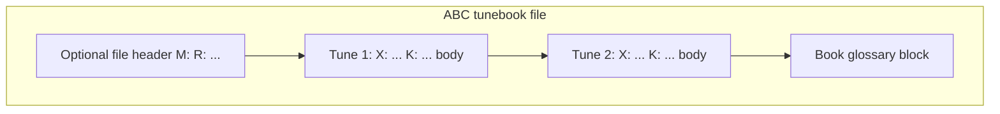

# ABC book glossary at end of file

## Short answer

**Yes, ABC allows it.** The standard defines several kinds of non-music text:

| Kind | Where | Example | Music parsers |
|------|-------|---------|---------------|
| Tune header fields | `X:` … `K:` | `B: o'neills` | Metadata only |
| Comment lines | Anywhere | `% O'Neill's Music of Ireland, 1850` | Ignored |
| Free text | Before / between / after tunes (blank-line separated) | Plain prose block | Ignored by music; may be printed by tunebook apps |
| File header | Before first `X:` | `M:4/4`, `R:Reels` | Sets defaults for following tunes |

Your goal — a **file-level glossary** at the end (e.g. explaining what each `B:` book code means) — maps to **free text** or **`%` comment lines** in the ABC standard ([ABC 2.1 §2.1.3](https://abcnotation.com/wiki/abc:standard:v2.1)).

**Important distinction:** `B:` in a tune header is a **per-tune source tag** (already used by abc2book for collection names), not a glossary entry. A glossary is separate prose that explains those tags.



## What abc2book does today

Parsing lives in [`src/useAbcTools.js`](src/useAbcTools.js):

- **`abc2Tunebook`** splits the whole document on `X:` and feeds each chunk to **`abc2json`**.
- **Comment lines** (`% …`, not `% abcbook-…`) → stored in `tune.abccomments` and round-tripped by **`json2abc`**.
- **Plain text lines** (no `%`, no `Letter:`) → treated as **music** via `isNoteLine` and appended to the last tune's notes — **this will corrupt the last tune**.
- **Sync back to Google Sheets** uses **`tunesToAbc`** only ([`src/useGoogleSheet.js`](src/useGoogleSheet.js) line 70) — no separate file footer field is read or written.

So:

- A trailing glossary **with `%` prefixes** can survive import/export, but it gets **attached to the last tune's `abccomments`**, not stored as file-level metadata.
- A trailing glossary **without `%`** will break the last tune.
- The app has **no UI** to view or edit a file-level glossary; per-tune `B:` values show on the tune page ([`src/components/MusicSingle.js`](src/components/MusicSingle.js)).

## Options (no code changes)

### 1. Comment block on the last tune (works today, imperfect)

Append after the last tune's `% abcbook-…` lines:

```
% --- Book glossary ---
% o'neills — O'Neill's Music of Ireland (1903)
% kerr — Kerr's Merry Melodies
```

- Survives parse → `abccomments` → `json2abc` round-trip.
- Stays in the synced Google Doc.
- Downside: logically tied to the last tune; not shown in the UI unless you open raw ABC.

### 2. Per-tune `H:` or `N:` header fields (standard ABC)

`H:history` and `N:notes` accept free text in the tune header. abc2book stores unknown header keys in `tune.meta` and re-emits them via `renderOtherHeaders`. This is per-tune, not file-level — useful only if each tune needs its own source note.

## Recommended implementation (if you want first-class support)

Add a dedicated **file footer** alongside the existing per-tune model:

1. **Storage format** — after all tunes in the Google Doc / exported ABC:

```
% abcbook-book-glossary
% o'neills|O'Neill's Music of Ireland (1903)
% kerr|Kerr's Merry Melodies
```

   (Or a single `% abcbook-json bookGlossary …` chunked field, mirroring [`src/abcbookJsonFields.js`](src/abcbookJsonFields.js).)

2. **Parse** — extend `abc2Tunebook` in [`src/useAbcTools.js`](src/useAbcTools.js):
   - Strip a trailing glossary block before splitting on `X:`, **or**
   - Detect lines after the final tune separator and populate `bookGlossary` instead of feeding them to `abc2json`.

3. **Serialize** — extend `tunesToAbc` to append the glossary block after all tunes (and deleted-tune tombstones).

4. **State** — hold `bookGlossary` in app state next to `tunes` / `deletedTunes` ([`src/App.js`](src/App.js) `mergeTuneBook` already passes `fullSheet`; preserve glossary through merge/sync).

5. **UI** (optional) — edit/view on Books page or Settings; show expanded names when rendering `Book: o'neills` on tune pages.

## Summary

| Approach | ABC-valid | abc2book today | File-level | UI |
|----------|-----------|----------------|------------|-----|
| Plain free text at end | Yes | Corrupts last tune | Yes | No |
| `%` comments at end | Yes | Attached to last tune | De facto | No |
| Per-tune `B:` | Yes | Supported | No (per tune) | Yes |
| New `% abcbook-book-glossary` block | Yes (via comments) | Needs small extension | Yes | Optional |

**Bottom line:** ABC notation absolutely allows a trailing books block. For abc2book, use `%` comment lines today as a safe workaround, or add a small glossary extension for proper file-level storage and display.
