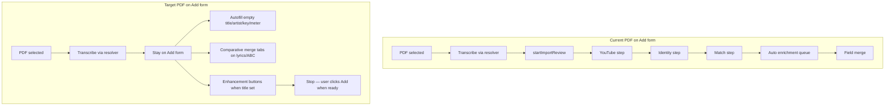

# Add Form & Import Review UX Overhaul

## Problem today

Selecting a PDF/chord sheet on the Add form runs through [`dispatchAddImport`](src/addImportDispatch.js) → `sheetImageFileToCandidates` → [`startImportReview`](src/components/AddSongModal.js), which:

1. Opens [`ImportReviewModal`](src/components/ImportReviewModal.js) at the **YouTube** step
2. Walks **youtube → identity → match → enrichment queue → field merge**
3. [`ImportReviewBridge`](src/components/ImportReviewBridge.js) **auto-starts** enrichment jobs in `pending` status (including `sheetimage` candidates)

The desired UX already exists in pieces:

- **In-form transcription review**: [`ImportSheetImageModal.js`](src/components/ImportSheetImageModal.js) — transcribe, edit title/artist/key/meter, chord/lyric + melody ABC tabs, [`SheetImageImportMergeModal`](src/components/SheetImageImportMergeModal.js)
- **Comparative merge for lookup/analysis**: [`mediaImportWizard/LyricsStep.js`](src/components/mediaImportWizard/LyricsStep.js), [`ChordsStep.js`](src/components/mediaImportWizard/ChordsStep.js), [`NotationStep.js`](src/components/mediaImportWizard/NotationStep.js), [`LyricsMergePanel.js`](src/components/mediaImportWizard/LyricsMergePanel.js)

---

## Part 1: Sheet/PDF on Add form stays in-form

### 1a. New dispatch result for Add context

In [`addImportDispatch.js`](src/addImportDispatch.js):

- Add option `ctx.stayOnForm` (set from Add tab only)
- For `sheetImage` files when `stayOnForm`: return `{ action: 'sheetDraft', body, fileName }` instead of `{ action: 'review', candidates }`
- Refactor [`sheetImageFileToCandidates`](src/importSourceParse.js) to expose `transcribeSheetImageToResult(file, options)` returning raw transcription body (keep `sheetImageFileToCandidates` as a thin wrapper for review/bulk paths)

### 1b. Apply transcription to Add form state

In [`AddSongModal.js`](src/components/AddSongModal.js) `applyImportDispatchResult`:

- Handle `sheetDraft`: populate **only empty** fields (`songTitle`, `songComposer`, `songKey`, `songMeter`)
- Store pending sources in new state, e.g. `pendingSheetDraft: { body, chordText, melodyAbc, warnings }`
- **Do not** call `startImportReview` or open MediaImportWizard
- **Do not** dismiss Add modal

### 1c. Extract shared transcription review UI

Create [`src/components/SheetImageTranscriptionPanel.js`](src/components/SheetImageTranscriptionPanel.js) by extracting from [`ImportSheetImageModal.js`](src/components/ImportSheetImageModal.js):

- Editable meta fields (title, artist, key, meter, aliases optional)
- Chords/lyrics + melody ABC tabs (editable textareas)
- Preview alert + warnings
- Props-driven (no save/navigate — parent owns state)

Refactor `ImportSheetImageModal` to use this panel internally (no behavior change for standalone sheet import route).

Mount the panel in Add form below the import source toolbar when `pendingSheetDraft` is set, with actions:

- **Apply to form** — merge selected parts into `songWords` / `songNotes` / meta fields (reuse merge-option logic from `SheetImageImportMergeModal` inline or embed that modal)
- **Dismiss** — clear pending draft

---

## Part 2: Comparative merge on Add form content blocks

Create [`src/components/ImportContentMergeTabs.js`](src/components/ImportContentMergeTabs.js) — thin wrapper adapting existing merge UIs to plain text:

| Add form field | Current tab | Import sources |
|----------------|-------------|----------------|
| Lyrics (`songWords`) | Current | Transcribed chord/lyric text, lookup lyrics (from search) |
| ABC Notes (`songNotes`) | Current | Transcribed melody ABC, lookup/analysis notation |

Reuse:

- [`LyricsMergePanel`](src/components/mediaImportWizard/LyricsMergePanel.js) for line-by-line lyrics diff
- Overwrite/append toolbar pattern from [`ChordsStep`](src/components/mediaImportWizard/ChordsStep.js) / [`NotationStep`](src/components/mediaImportWizard/NotationStep.js) for chord grid and ABC

Wire into Add form:

- Show merge tabs under **Lyrics** when `pendingSheetDraft.chordText` or lookup lyrics exist
- Show merge tabs under **ABC Notes** when `pendingSheetDraft.melodyAbc` or lookup notation exists
- Lookup results from existing buttons ([`LyricsSearchButton`](src/components/LyricsSearchButton.js), [`AddTuneWebSearchButton`](src/components/AddTuneWebSearchButton.js)) feed into the same `pendingLookupSources` state rather than blind overwrite

### Enhancement buttons (opt-in)

- Keep current gating: search/enhancement affordances appear when `songTitle.trim()` is non-empty (already true for web search / lyrics / YouTube buttons)
- Ensure **no** background enrichment runs from Add form imports
- Lookup results land in merge tabs only; user explicitly applies

---

## Part 3: Stop automatic enrichment globally

In [`ImportReviewBridge.js`](src/components/ImportReviewBridge.js):

- **Remove auto-start** of `pending` enrichment jobs in the `useEffect` (~lines 223–280); jobs stay `awaiting` until user clicks **Enhance**
- In [`createEnrichmentJob`](src/importReviewEnrichmentQueue.js): default **all** jobs to `awaiting` (not `pending` for non-score sources)
- Mark `sourceKind === 'sheetimage'` candidates with `skipEnrich: true` in [`createImportCandidate`](src/importReviewSession.js) / dispatch when building review candidates

In [`handleMatchComplete`](src/components/ImportReviewBridge.js): stop calling `completeIdentificationForCurrent` → enrichment phase automatically; advance directly to import-ready state instead.

---

## Part 4: Unified single-page import review (bulk / queue)

Replace multi-step wizard with one page per candidate in [`ImportReviewModal.js`](src/components/ImportReviewModal.js).

### New layout (one screen per tune)

| Section | Content |
|---------|---------|
| Progress | `3 of 12` header |
| Identity | Title, artist, aliases (always visible) |
| YouTube | Inline field + Search YouTube button — **only when** no YouTube link on candidate |
| Collection matches | **Create new tune** button first, then match list (reuse [`findCollectionMatches`](src/tuneCollectionMatch.js)) |
| Field merge | [`TuneImportFieldPicker`](src/components/TuneImportFieldChooserModal.js) inline when merge target selected; hidden for create-new |

### Interaction (per your choice: inline picker)

- **Create new tune** → show field picker for new import (all fields) → user clicks **Import** → save → advance
- **Merge** on a match → select target, show inline field picker vs existing tune → **Import** → save merge → advance
- No separate Next/Continue steps; no enrichment queue phase before import
- Optional **Enhance** button on review page (manual, per candidate) — opens existing enrichment job flow without blocking import

### Session model changes in [`importReviewSession.js`](src/importReviewSession.js)

- Replace steps `youtube|identity|match|fieldMerge|enrichmentQueue` with simplified flow:
  - `review` (unified page) → `done` for session
- `advanceReviewStep` / `handleMatchComplete` become: save candidate → increment index → reset to `review` or finish
- Add `sessionSummary` when complete: `{ reviewed, created, merged, skipped }`

### Review queue entry points

Same unified UI for:

- Bulk import from Add tab bulk list
- File/multi imports that still use `startImportReview`
- `/review` route ([`ImportReviewHost`](src/components/ImportReviewHost.js) embedded mode already supported via `embedded` prop on modal)

Update [`ImportReviewModal.js`](src/components/ImportReviewModal.js) embedded rendering (used on review page) and fullscreen modal (Add flow) to share the new single-page body.

---

## Part 5: Tests

- [`addImportDispatch.test.js`](src/addImportDispatch.test.js): `stayOnForm` returns `sheetDraft`, not `review`
- [`importReviewSession.test.js`](src/importReviewSession.test.js): unified step advance, summary counts
- New test: ImportReviewBridge does **not** auto-patch job to `running` on `pending`
- Add form integration test (optional): applying `sheetDraft` fills empty title only

---

## Files to change (primary)

| File | Change |
|------|--------|
| [`src/addImportDispatch.js`](src/addImportDispatch.js) | `stayOnForm` + `sheetDraft` action |
| [`src/importSourceParse.js`](src/importSourceParse.js) | Split transcribe helper |
| [`src/components/AddSongModal.js`](src/components/AddSongModal.js) | Sheet draft handling, merge tabs, no review for sheet on Add |
| [`src/components/SheetImageTranscriptionPanel.js`](src/components/SheetImageTranscriptionPanel.js) | **New** — shared transcription UI |
| [`src/components/ImportContentMergeTabs.js`](src/components/ImportContentMergeTabs.js) | **New** — lyrics/notation merge wrapper |
| [`src/components/ImportSheetImageModal.js`](src/components/ImportSheetImageModal.js) | Use shared panel |
| [`src/importReviewSession.js`](src/importReviewSession.js) | Unified review step model |
| [`src/components/ImportReviewModal.js`](src/components/ImportReviewModal.js) | Single-page review UI |
| [`src/components/ImportReviewBridge.js`](src/components/ImportReviewBridge.js) | No auto enrichment; simplified advance |
| [`src/importReviewEnrichmentQueue.js`](src/importReviewEnrichmentQueue.js) | All jobs `awaiting` by default |

## Out of scope

- Multi-page sheet capture (multiple PDF pages in one add)
- Changing MediaImportWizard flow for audio-linked imports (still user-opened wizard)
- Auto-running enhancement from Add form even when resolver is available
