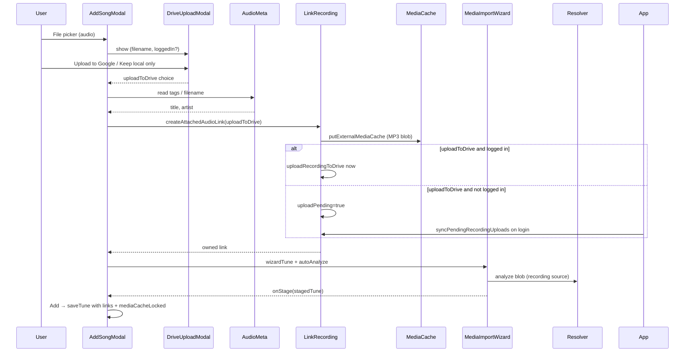

# Audio file as Add wizard source

## Goal

When a user picks an audio file via the existing **File** button in [AddSongModal.js](src/components/AddSongModal.js), the app should:

1. Extract **title** and **artist** from ID3/Vorbis/etc. tags, falling back to filename parsing
2. Pre-fill the Add form and drive web search / merge matching (same as typing title/artist)
3. Store the file as an **owned recording link** with **external media cache** populated immediately
4. Mark the tune **`mediaCacheLocked: true`** so the cache is protected from bulk clears
5. Open **MediaImportWizard** with auto-analyze (when resolver + whisper available), using the cached audio as the defining import source
6. **Ask the user** via a modal whether to upload the audio to Google Drive — shown whether or not they are logged in; if not logged in and they choose yes, queue for sync on next login

## Current architecture (what we reuse)



**Existing pieces to leverage:**

- YouTube pattern in `openMediaWizardFromYouTube` ([AddSongModal.js](src/components/AddSongModal.js) ~439): attach link to `draftTune`, open wizard, stage results via `onStageMedia`
- Owned media + cache: [`createAttachedAudioLink`](src/linkRecording.js) → converts to MP3, saves to `recordings` localforage, writes `putExternalMediaCache`
- Deferred Drive sync: [`syncPendingRecordingUploads`](src/linkRecording.js) already runs on login in [App.js](src/App.js) (~564) for recordings with `uploadPending: true` and no `googleId`
- Cache lock flag: [`mediaCacheLocked`](src/mediaCacheLock.js) (already respected by [`clearExternalMediaCache`](src/externalMediaAudioCache.js) via `getLockedTuneIdSet`)
- Analysis upload path: [`analyzeMediaFromSource`](src/mediaAnalysisClient.js) already supports `source.kind === 'recording'` with a `blob` FormData upload

**Gaps to fix:**

- [`handleAddFileSelected`](src/components/AddSongModal.js) only calls `parseImportFile` (ABC/XML/chord/MIDI)—no audio branch
- [`fileAcceptList`](src/importSourceParse.js) does not include audio MIME/extensions
- [`buildLinkedMediaSource`](src/mediaTranscriptionSources.js) treats `abcbook-recording:` URIs as generic `audio` URLs—analysis would fail against the resolver
- [`addTune`](src/components/AddSongModal.js) deletes `t.id` before save, which would orphan recording/cache keys tied to the draft id

## Implementation plan

### 1. Audio metadata extraction utility

Add [src/audioFileMetadata.js](src/audioFileMetadata.js):

- Add dependency **`music-metadata-browser`** (covers MP3/ID3, FLAC/Vorbis, M4A, OGG, etc. in the browser)
- Export `isAudioImportFile(file)` — check `file.type.startsWith('audio/')` plus common extensions (`.mp3`, `.flac`, `.m4a`, `.ogg`, `.wav`, `.aac`, `.wma`)
- Export `readAudioFileMetadata(file)`:
  - Parse tags via `music-metadata-browser` → map `common.title`, `common.artist` / `common.albumartist` / first `common.composers[]`
  - If title or artist still empty, apply filename fallback: strip extension, split on ` - ` / ` – ` / ` | ` → `{ artist, title }` or `{ title }` only
  - Return `{ title, artist, album?, duration? }`
- Add [src/audioFileMetadata.test.js](src/audioFileMetadata.test.js) with fixture blobs or mocked parser for tag + filename cases

### 2. Extend File picker accept list

In [src/importSourceParse.js](src/importSourceParse.js):

- Add `AUDIO_FILE_ACCEPT` constant (extensions + `audio/*` MIME types)
- Extend `fileAcceptList(resolverAvailable)` to append audio accept patterns (audio import does **not** require resolver for metadata/cache; resolver only needed for wizard analysis)

### 3. Google Drive upload confirmation modal

Add [src/components/AudioDriveUploadModal.js](src/components/AudioDriveUploadModal.js) (small centered modal, same pattern as [QueuePlayConfirmModal.js](src/components/QueuePlayConfirmModal.js)):

- **Always shown** immediately after the user picks an audio file, before metadata extraction or caching
- Props: `fileName`, `loggedIn`, `onUpload`, `onLocalOnly`, `onCancel`
- Copy adapts to login state:
  - **Logged in:** “Upload *{filename}* to Google Drive? The audio is always saved locally on this device.”
  - **Not logged in:** “Upload *{filename}* to Google Drive when you sign in? The audio will be saved locally until then.”
- Buttons:
  - Primary: **Upload to Google Drive** → `onUpload()`
  - Secondary: **Keep local only** → `onLocalOnly()`
  - Optional cancel/close → aborts the import (no link created)

In [src/linkRecording.js](src/linkRecording.js), extend `createOwnedMediaLink` with an explicit **`uploadToDrive`** flag (default `false` for backward compatibility with LinksEditor mic/attach flows, or update those call sites separately):

| `uploadToDrive` | logged in | Result |
|-----------------|-----------|--------|
| `true` | yes | `uploadPending: true` initially, then upload now; clear pending on success |
| `true` | no | `uploadPending: true`, `googleId: null` — picked up by `syncPendingRecordingUploads` on login |
| `false` | either | `uploadPending: false` — local/cache only |

**Important:** Remove the current implicit “upload immediately when token + driveApi present” behavior for the **Add-modal audio import path** so upload only happens after explicit user consent. LinksEditor attach/record can keep current behavior or be aligned in a follow-up.

### 4. Route audio files in AddSongModal

In [src/components/AddSongModal.js](src/components/AddSongModal.js):

Update `handleAddFileSelected`:

```javascript
if (isAudioImportFile(file)) {
  setPendingAudioFile(file)
  setShowAudioDriveUploadModal(true)
  return
}
// existing parseImportFile path unchanged
```

Add `continueAudioImport(file, uploadToDrive)` (called from modal):

1. `readAudioFileMetadata(file)` → `setSongTitle`, `setSongComposer`
2. `createAttachedAudioLink({ tune: draftTune, file, title: metadata.title || file.name, uploadToDrive, token, driveApi })`
3. Build `tuneWithLink = { ...draftTune, name, composer, links: [link], mediaCacheLocked: true }`
4. `setWizardTune(tuneWithLink)`; `setWizardAutoAnalyze(resolverAvailable && features.whisper)`; `setShowMediaWizard(true)`
5. Surface errors via `setImportError` (invalid file, conversion failure, etc.)

Update downstream persistence:

- **`onStageMedia`**: also copy `merged.mediaCacheLocked` into `stagedTune` (or always set lock when staged tune has owned-media links)
- **`addTune`**: stop deleting id for new tunes—set `t.id = draftIdRef.current` so recording + cache keys (`extmedia:{tuneId}:…`) remain valid after save
- **`addTune`**: persist `mediaCacheLocked: true` when present on `stagedTune` or when links contain owned media from this flow
- **`clearForm`**: reset any audio-import busy/error state

### 5. Wire owned recording links into media analysis

**4a. Classify recording links in sources** — [src/mediaTranscriptionSources.js](src/mediaTranscriptionSources.js):

- Import `isOwnedMediaLinkUri` from [linkRecording.js](src/linkRecording.js)
- In `buildLinkedMediaSource`, set `srcType: 'recording'` for owned URIs (not `'audio'`)
- Add `linkIndex: index` on each source object (needed for blob resolution)

**4b. Resolve recording → blob before analyze** — new [src/prepareMediaAnalysisSource.js](src/prepareMediaAnalysisSource.js):

```javascript
export async function prepareMediaAnalysisSource(source, tune, options) {
  if (source.srcType !== 'recording') return source
  const link = tune.links[source.linkIndex]
  const resolved = await resolveRecordingLinkAudio(link, tune.id, source.linkIndex, options)
  return {
    id: source.id,
    kind: 'recording',
    blob: resolved.blob,
    fileName: (link.title || 'recording') + '.mp3',
    label: source.label,
  }
}
```

**4c. Call from analysis job** — [src/useTuneMediaAnalysis.js](src/useTuneMediaAnalysis.js):

- Before `analyzeMediaFromSource`, run `prepareMediaAnalysisSource(source, tune, { accessToken, driveApi })`
- Apply same prep anywhere else that sends linked sources to `/analyze-media` if needed (lyrics transcription path uses the same source shape)

Add tests in [src/mediaTranscriptionSources.test.js](src/mediaTranscriptionSources.test.js) (new) and/or extend existing playback tests to confirm recording links classify correctly.

### 6. Merge flow compatibility

No separate UI work needed: `draftTune` already carries `name`, `composer`, and `links` after audio import, so:

- **Merge into existing** (`startMergeIntoExisting`) will include the owned link + metadata in the merge candidate
- **Matching tunes** sidebar reacts to extracted title/artist via existing `findCollectionMatches` effect

Ensure `ImportReviewHost` merge save preserves `links` and `mediaCacheLocked` from the candidate tune (already passes `candidate.tune` through—verify `mediaCacheLocked` is not stripped anywhere in import review).

## UX notes

- **File button** remains the single entry point; audio files route to the media-import path, score/text files keep the existing import-review path
- **Drive upload modal** is the first step for audio files; closing it cancels the import without side effects
- If user chooses upload but is not logged in, no login prompt is forced in the modal — they can sign in later and existing `syncPendingRecordingUploads` handles the upload (toast already shown in App.js)
- If resolver/whisper unavailable: still extract metadata, cache audio, populate form; skip auto-analyze but allow manual wizard open later (or open wizard with analyze disabled—match YouTube behavior)
- Show a brief busy state while converting/caching large files (reuse `ownedMediaBusy`-style pattern or inline spinner on File button)
- Optional badge near title when audio is staged (similar to existing "Imported (staged)" badge)
- Links with `uploadPending: true` already show sync status via `getOwnedMediaSyncStatus` in LinksEditor (`local` / `pending` / `synced`)

## Files touched (summary)

| File | Change |
|------|--------|
| `package.json` | Add `music-metadata-browser` |
| `src/audioFileMetadata.js` | New: tag + filename extraction |
| `src/audioFileMetadata.test.js` | New: unit tests |
| `src/importSourceParse.js` | Audio accept list |
| `src/components/AudioDriveUploadModal.js` | New: Google Drive upload confirmation |
| `src/components/AddSongModal.js` | Audio branch, drive modal wiring, wizard launch, id/lock persistence |
| `src/linkRecording.js` | Explicit `uploadToDrive` flag; no silent upload on add-import path |
| `src/mediaTranscriptionSources.js` | Recording srcType + linkIndex |
| `src/prepareMediaAnalysisSource.js` | New: blob resolution for analysis |
| `src/useTuneMediaAnalysis.js` | Prep source before analyze |
| Tests for transcription sources / prep | New or extended |

## Out of scope (follow-ups)

- Cleaning up orphaned draft recordings if user closes the modal without saving
- Bulk import of audio files
- Attaching audio from ImportReviewModal directly (Add modal only for now)
