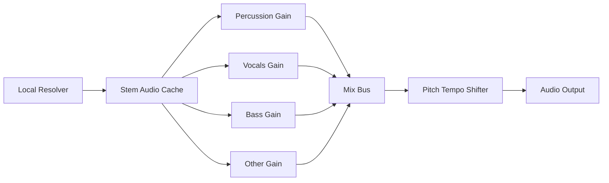

# Audio Filters Tab Plan

## Frontend UI And State

Add a new `Audio Filters` tab beside `Playback` and `Loop` in [`src/components/MediaPlayerOptionsModal.js`](src/components/MediaPlayerOptionsModal.js). The new tab should render a focused panel, likely `AudioFiltersPanel`, modeled after [`src/components/PitchTempoControlsPanel.js`](src/components/PitchTempoControlsPanel.js): local slider state, live controller update, debounced `tunebook.saveTune(updated)`.

Persist settings on the tune as a structured field such as `playbackAudioFilters`:

```js
{
  percussion: 1,
  vocals: 1,
  bass: 1,
  other: 1
}
```

Use `0` as mute and `1` as normal volume, with a reasonable slider range like `0` to `1.5` or `0` to `2`. Add helpers in [`src/pitchTempoUtils.js`](src/pitchTempoUtils.js) for defaults, clamping, normalization, and `playbackNeedsExternalProcessing()` so non-default filter values also select the Web Audio playback path.

UI labels should be user-friendly (`Percussion`, `Vocals`, `Bass`, `Other`) while internal keys and resolver stem names follow htdemucs.

## Playback Engine Changes

Extend the media controller in [`src/useTuneBookMediaController.js`](src/useTuneBookMediaController.js) with an `updateTuneAudioFilterSettings(filters)` method and include filter settings in the existing external-processing decision path.

Update [`src/externalMediaPitchTempo.js`](src/externalMediaPitchTempo.js) and [`src/pitchTempoShifter.js`](src/pitchTempoShifter.js) so the processed playback graph can either:

- Play the original decoded buffer when all filters are neutral.
- Play separated stem buffers through individual `GainNode`s when filters are active.

The stem graph should be conceptually:



If the existing SoundTouch shifter cannot accept a live mixed node directly, decode and mix stems into a new `AudioBuffer` when filters change or use synchronized per-stem shifters. The first option is simpler but filter changes may be less instant; the second is more interactive but higher risk.

## Resolver Requirements

The resolver already uses Demucs in [`local-resolver/detect_melody.py`](local-resolver/detect_melody.py), but only keeps the `vocals` stem for melody tracking. Refactor that into a generic stem-separation helper that keeps all four htdemucs stems from one `apply_model()` run.

Stick with the default `htdemucs` model (`MELODY_DEMUCS_MODEL=htdemucs`), which provides exactly four stems: `drums`, `bass`, `other`, and `vocals`. No `htdemucs_6s` or guitar support is needed. The existing [`local-resolver/prefetch_demucs.py`](local-resolver/prefetch_demucs.py) already prefetches `htdemucs`.

Add a resolver API, for example `POST /separate-stems`, in [`local-resolver/server.py`](local-resolver/server.py). It should accept the same source forms as `/analyze-media`: uploaded recording or `{ sourceUrl, sourceType, sourceName }`. The response should avoid embedding large WAV payloads in JSON; prefer returning stable stem URLs or cache IDs that the frontend can fetch individually for `drums`, `vocals`, `bass`, and `other`.

Map UI names to resolver stems:

- `percussion` -> Demucs `drums`
- `vocals` -> Demucs `vocals`
- `bass` -> Demucs `bass`
- `other` -> Demucs `other` (remaining instruments: keys, guitar, synths, etc.)

The separation helper should write/cache all four stems from the single Demucs pass (the same pass already used for melody vocal isolation). Refactor `_isolate_vocal_stem` so melody detection can still request vocals-only while the new endpoint returns the full stem set.

Cache separated stems by media source and model name, because Demucs is expensive and slider changes should only update browser gain values.

## Integration And Verification

Wire a frontend stem client near [`src/mediaAnalysisClient.js`](src/mediaAnalysisClient.js) or the existing media proxy client layer, then load stems lazily when a user first changes a filter away from neutral. Show resolver availability/status in the new tab, since filters require local-resolver support for linked audio.

Test the plan in layers: helper normalization tests for filter defaults, controller behavior for `playbackNeedsExternalProcessing()`, and a manual playback pass for neutral filters, muted vocals, muted percussion, and muted other.
