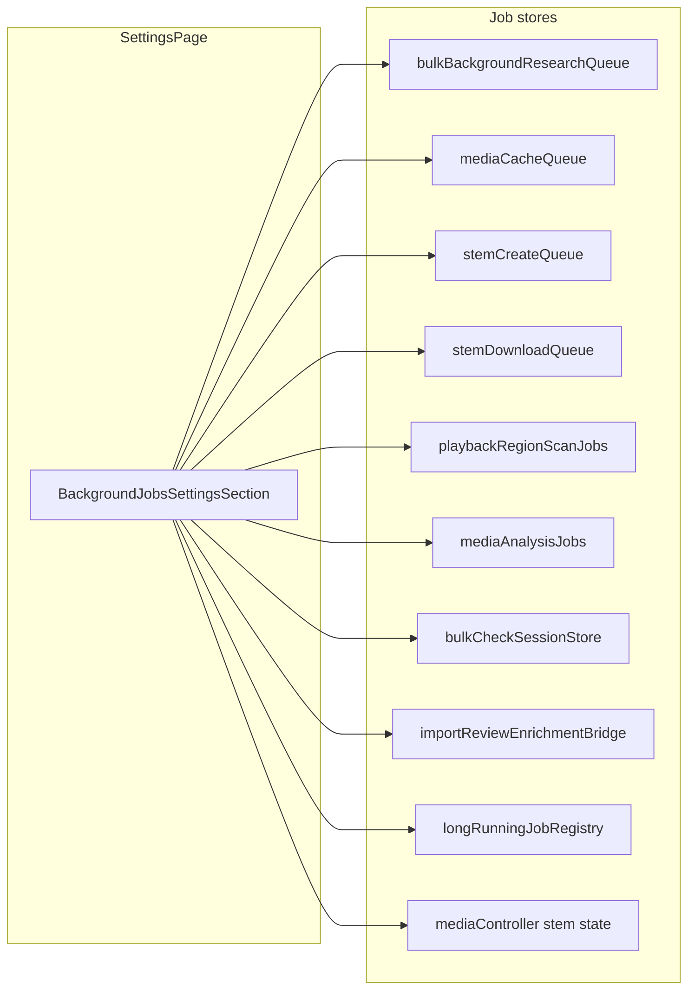

# Background Jobs Settings Panel

## Goal

Add a **Background jobs** block on [`src/pages/SettingsPage.js`](src/pages/SettingsPage.js) with one tab per job category. Tab titles show an incomplete-count badge (e.g. `Media cache (3)`). Each tab exposes the same controls users already have in queue modals: **Cancel** per job, **Cancel all**, and **Clear finished** (or category-appropriate equivalents).



## Tab categories (10 tabs)

| Tab | Store / source | Incomplete count | Cancel one | Cancel all | Clear old |
|-----|----------------|------------------|------------|------------|-----------|
| Background research | [`bulkBackgroundResearchQueue.js`](src/bulkBackgroundResearchQueue.js) | `pending` + `running` | `cancelJob(id)` | `cancelAllJobs()` | `clearFinishedJobs()` |
| Media cache | [`mediaCacheQueue.js`](src/mediaCacheQueue.js) | same | same | same | same |
| Stem create | [`stemCreateQueue.js`](src/stemCreateQueue.js) | same | same | same | same |
| Stem downloads | [`stemDownloadQueue.js`](src/stemDownloadQueue.js) | same | `cancelJob(id)` | **add** `cancelAllJobs()` | `clearFinishedJobs()` |
| Playback scans | [`playbackRegionScanJobs.js`](src/playbackRegionScanJobs.js) | `isScanning` | **add** `cancelPlaybackRegionScanJob(tuneId, linkIndex)` | **add** `cancelAllActivePlaybackRegionScans()` | **add** `clearInactivePlaybackRegionScanJobs()` |
| Media analysis | [`mediaAnalysisJobs.js`](src/mediaAnalysisJobs.js) | `isAnalyzing` | `resetMediaAnalysisJob(tuneId)` | **add** `cancelAllActiveMediaAnalysisJobs()` | **add** `clearInactiveMediaAnalysisJobs()` |
| Bulk check | [`bulkCheckSessionStore.js`](src/bulkCheckSessionStore.js) + [`bulkCheckRunner.js`](src/bulkCheckRunner.js) | `1` when phase is `running-static` / `running-links` or runner active | N/A (single run) | `cancelBulkCheckRun()` | `clearBulkCheckSession()` |
| Import enrichment | **new bridge** synced from [`ImportReviewHost.js`](src/components/ImportReviewHost.js) | `awaiting` + `pending` + `running` | skip single job | `skipAllPendingEnrichmentJobs` | `clearEnrichmentQueue` (skip non-running) |
| Stem separation | `mediaController` via new App prop | `1` when `stemSeparationActive` or `stemAnalysisProgress.active` | `cancelStemAnalysis()` | same (single job) | N/A |
| Active searches | **enhanced** [`longRunningJobRegistry.js`](src/longRunningJobRegistry.js) | active tracked jobs | per-job `onCancel` | cancel all tracked | N/A |

Tabs always render (with empty-state copy when idle) so users can discover all categories. Badge only appears when incomplete count > 0, matching [`BulkCheckModal`](src/components/BulkCheckModal.js) `renderTabTitle` pattern.

## UI architecture

### 1. Shared queue panel (extract from existing modals)

Create [`src/components/backgroundJobs/JobQueueTabPanel.js`](src/components/backgroundJobs/JobQueueTabPanel.js) by extracting the repeated toolbar + `ListGroup` pattern from:

- [`BulkBackgroundResearchQueueModal.js`](src/components/BulkBackgroundResearchQueueModal.js)
- [`MediaCacheQueueModal.js`](src/components/MediaCacheQueueModal.js)
- [`StemCreateQueueModal.js`](src/components/StemCreateQueueModal.js)

Props: `jobs`, optional `running`/`paused`/`overallProgress`, action callbacks, and small render hooks for job title/meta (media-cache type badge, skip-reason labels, etc.).

Refactor the three header modals to render `JobQueueTabPanel` inside their existing `Modal` shells so behavior stays identical.

### 2. Settings section component

Create [`src/components/backgroundJobs/BackgroundJobsSettingsSection.js`](src/components/backgroundJobs/BackgroundJobsSettingsSection.js):

- `Tab.Container` + `Nav variant="tabs"` (Pattern B from `BulkCheckModal`)
- One thin tab panel per category; FIFO tabs wire existing hooks (`useBulkBackgroundResearchQueue`, `useMediaCacheQueue`, `useStemCreateQueue`, `useStemDownloadQueue`)
- Custom panels for non-FIFO categories
- `tunes` prop for resolving tune names on scan/analysis rows

### 3. Wire into Settings

In [`SettingsPage.js`](src/pages/SettingsPage.js), add a new `app-surface-panel App-settings-section` after the **Audio Cache** block (jobs are mostly media-related):

```jsx
<BackgroundJobsSettingsSection
  tunes={tunes}
  mediaController={mediaController}
/>
```

Pass `mediaController` from [`App.js`](src/App.js) (already available there for playback).

Add help text to [`src/formFieldHelpText.js`](src/formFieldHelpText.js) and optional `FormFieldHelp` on the section heading.

### 4. CSS

Add [`settings-background-jobs-*`](src/App.css) classes (tab nav, badge, panel padding, scrollable job list). Reuse existing queue badge/toolbar styles where possible (`bulk-bg-queue-*` as base or alias under a neutral `background-jobs-*` prefix).

## Store / bridge changes

### Stem download parity

[`stemDownloadQueue.js`](src/stemDownloadQueue.js): add `cancelAllJobs()` (mirror other queues). Extend [`useStemDownloadQueue.js`](src/useStemDownloadQueue.js) to expose it.

### Playback region scans

[`playbackRegionScanJobs.js`](src/playbackRegionScanJobs.js):

- `getAllPlaybackRegionScanJobs()` — list keyed jobs with parsed `tuneId` / `linkIndex`
- `cancelPlaybackRegionScanJob(tuneId, linkIndex)` — abort controller + patch status
- `cancelAllActivePlaybackRegionScans()`
- `clearInactivePlaybackRegionScanJobs()` — remove entries where `!isScanning`

New hook `useAllPlaybackRegionScanJobs.js` using `useSyncExternalStore`.

### Media analysis

[`mediaAnalysisJobs.js`](src/mediaAnalysisJobs.js):

- `getAllMediaAnalysisJobs()`
- `cancelAllActiveMediaAnalysisJobs()`
- `clearInactiveMediaAnalysisJobs()`

New hook `useAllMediaAnalysisJobs.js`.

### Import enrichment bridge

New [`src/importReviewEnrichmentBridge.js`](src/importReviewEnrichmentBridge.js):

- `syncImportReviewEnrichment({ jobs, onSkipJob, onSkipAll, onClear })` / `clearImportReviewEnrichmentBridge()`
- `subscribe` + `getSnapshot` for React

[`ImportReviewHost.js`](src/components/ImportReviewHost.js): call `sync` whenever `session.enrichmentJobs` changes; call `clear` when session closes.

Settings tab delegates cancel/clear to bridge callbacks (no duplicate runner logic).

### Active searches registry

Enhance [`longRunningJobRegistry.js`](src/longRunningJobRegistry.js):

- `registerLongRunningJob({ label, onCancel })` (backward-compatible: bare call still works)
- `getActiveTrackedJobs()`, `cancelTrackedJob(id)`, `cancelAllTrackedJobs()`
- Update [`useCancellableAsyncJob.js`](src/useCancellableAsyncJob.js) to register with label + `cancel`
- Update direct `registerLongRunningJob()` callers (`ChordsSearchButton`, `LyricsSearchButton`, `TuneBackgroundSearchButton`, etc.) to pass a human label

### Bulk check tab

New small panel using `useSyncExternalStore(subscribeBulkCheckSession, getActiveBulkCheckSession)` and `subscribeBulkCheckRunner` / `isBulkCheckRunnerActive`. Show phase, link progress (`checkedCount` / `totalCount`), and issue counts. Actions: **Cancel run** (if active), **Clear session**.

## Incomplete-count helper

Centralize in [`src/backgroundJobsCounts.js`](src/backgroundJobsCounts.js) (or inside `BackgroundJobsSettingsSection`) so tab badges stay consistent and testable.

## Tests

- `stemDownloadQueue.cancelAllJobs`
- `playbackRegionScanJobs` list/cancel/clear
- `mediaAnalysisJobs` list/cancel/clear
- `importReviewEnrichmentBridge` sync/clear
- `longRunningJobRegistry` tracked jobs cancel
- Light render test for tab badge counts (optional)

## Out of scope / limitations

- **Server-side** stem jobs in `local-resolver/server.py` remain opaque (no per-job client list).
- Header queue **indicators and modals stay** — Settings is an additional unified view, not a replacement.
- Import enrichment tab is empty unless an import review session is open (bridge inactive).
