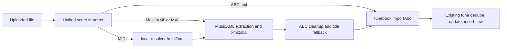

# Better MIDI And MuseScore Imports

## Findings
- ABC Tools is open-source at [seisiuneer/abctools](https://github.com/seisiuneer/abctools) and the live tool at [michaeleskin.com/abctools](https://michaeleskin.com/abctools/abctools.html) uses `xml2abc` for MusicXML-to-ABC.
- Its `.mxl` import reads `META-INF/container.xml` to find the real MusicXML root file. abc2book currently hardcodes `entries['score.xml']` in [src/useFileManager.js](src/useFileManager.js), which will miss many MuseScore/MusicXML containers.
- Its MIDI import sends MIDI bytes to a small Flask service using Python `music21` to produce MusicXML, then converts that MusicXML to ABC in the browser. abc2book already has a `local-resolver` FastAPI service and `fetchViaMediaProxy`, so we can add this locally instead of relying on ABC Tools' public PythonAnywhere endpoint.
- abc2book already vendors `xml2abc` revision 117 under LGPL in [src/xml2abc.js](src/xml2abc.js); upstream ABC Tools has revision 118 plus wrapper cleanup options around title injection, line breaks, tempo injection, measure numbers, and import settings.

## Proposed Architecture

## Implementation Plan
- Add a focused importer module, for example [src/scoreImportClient.js](src/scoreImportClient.js), that accepts a `File` plus options and returns `{ abc, sourceFormat, warnings }`. This keeps format detection and conversion out of the modal components.
- Update MusicXML import in [src/components/ImportXmlModal.js](src/components/ImportXmlModal.js) to use that module instead of directly calling `DOMParser` and `vertaal(xml, { p:'f' })`.
- Replace `.mxl` extraction logic in [src/useFileManager.js](src/useFileManager.js) with container-aware extraction: unzip, read `META-INF/container.xml`, find the first `rootfile full-path`, then load that entry. If `container.xml` is absent, fall back to a clear error and optionally try `score.xml` as a legacy fallback.
- Update [src/xml2abc.js](src/xml2abc.js) from upstream revision 117 to revision 118 after confirming the license header remains LGPL, then wrap it with abc2book-specific defaults rather than scattering raw option objects in UI code.
- Port the useful ABC Tools `importMusicXML` wrapper behavior: validate parser errors, inject a filename-based title when `xml2abc` emits `T:Title`, strip redundant clef key markers, normalize linebreak directives, and expose a small set of import options with sane defaults.
- Add a MIDI endpoint to [local-resolver/server.py](local-resolver/server.py), likely `POST /midi2xml`, using `music21.converter.parseData(binary_data, quarterLengthDivisors=(4, 6))` and returning MusicXML text. Add request size limits, timeouts, JSON error responses, auth/CORS consistency, temp-file cleanup, and `music21` in [local-resolver/requirements.txt](local-resolver/requirements.txt).
- Add a frontend MIDI path that posts `.mid`/`.midi` files through [src/mediaProxyClient.js](src/mediaProxyClient.js), receives MusicXML, then runs the same MusicXML-to-ABC path. Do not call ABC Tools' public conversion service.
- Add UI affordances in [src/components/ImportOptionsModal.js](src/components/ImportOptionsModal.js): either replace the separate ABC/XML buttons with a single “Import score” file picker, or add MIDI/MuseScore support behind the existing import modal while preserving the current book selection behavior.
- Keep native MuseScore `.mscz` as a separate phase unless you specifically want it now. ABC Tools' flow appears centered on MusicXML/MXL, not native `.mscz`; supporting `.mscz` well would probably require a server-side MuseScore CLI install and a larger Docker/runtime impact.

## Testing Plan
- Add unit tests for `.mxl` extraction using a fixture with `META-INF/container.xml` and a non-`score.xml` root path.
- Add tests for MusicXML conversion wrapper behavior: malformed XML error, missing title fallback, `T:Title` replacement, and empty conversion output.
- Add resolver tests for `/midi2xml` using a tiny MIDI fixture, including oversized/invalid MIDI failure cases.
- Run a manual comparison import with the same MIDI and MuseScore/MXL files in ABC Tools and abc2book, checking generated ABC renders, tune title, meter/key, bar structure, and import warnings.

## Risks And Decisions
- `xml2abc` is LGPL; abc2book already includes it, but updating the vendored copy should preserve copyright/license comments.
- MIDI-to-score conversion is inherently lossy. The UI should label MIDI import as experimental and surface warnings instead of silently importing poor output.
- Adding `music21` may increase the resolver image size. If that becomes painful, keep MIDI conversion behind an optional resolver extra or a separate lightweight service image.