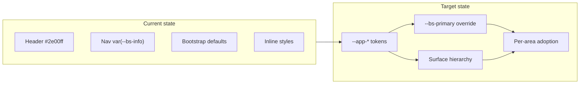

# Blue UI Theme Exploration Plan

## What you have today

The app is **Bootstrap 5 + react-bootstrap** with most styling in [`src/App.css`](src/App.css) (~2,600 lines). There is **no shared color system** — purple header (`#2e00ff`), cyan nav (`var(--bs-info)`), Bootstrap blue buttons, teal list stripes, and light-cyan footer all coexist.

The **best existing reference** for your chosen direction is already in the codebase:

- **Help page** ([`src/App.css`](src/App.css) ~2399): `#3d5a80` links, `#2c3e50` headings, `#e8eef5` hover, `#e8edf2` dividers
- **Practice modal** ([`src/components/PracticeSessionModal.css`](src/components/PracticeSessionModal.css)): `#eef6ff` instruction panel, `#9ec5fe` border — soft blue callout without loud saturation

Your newer features (notation editor, media import wizard, bulk-check-links modal) use dedicated CSS classes and will adopt tokens easily. Older surfaces (Settings, Footer, file inputs) rely on inline styles and Bootstrap defaults — they benefit most *after* tokens exist.



---

## Common pathways to a more appealing, useful UI

These are proven approaches for **professional lean tools** — not flashy consumer apps:

### 1. Design tokens first (your chosen starting point)
Define a small set of CSS variables once, reference them everywhere. Keeps the UI lean while making color/spacing consistent.

**Recommended token groups** (add to [`src/breakpoints.css`](src/breakpoints.css) or new [`src/theme.css`](src/theme.css)):

| Token | Purpose | Suggested starting value |
|-------|---------|--------------------------|
| `--app-brand` | Primary chrome accent | `#3d5a80` (from Help nav) |
| `--app-brand-strong` | Header / active nav | `#2c5282` or `#2563eb` |
| `--app-brand-muted` | Tinted panels | `#eef4fa` |
| `--app-brand-border` | Soft outlines | `#c5d4e8` |
| `--app-surface` | Page background | `#f8fafc` |
| `--app-surface-raised` | Cards, modals | `#ffffff` |
| `--app-border` | Dividers | `#e2e8f0` |
| `--app-text` | Body copy | `#334155` |
| `--app-text-muted` | Secondary labels | `#64748b` |
| `--app-focus-ring` | Keyboard focus | `0 0 0 3px rgba(61, 90, 128, 0.25)` |

Then **override Bootstrap** in the same file:

```css
:root {
  --bs-primary: #3d5a80;
  --bs-primary-rgb: 61, 90, 128;
  --bs-link-color: #3d5a80;
  --bs-link-hover-color: #2c5282;
  --bs-border-color: #e2e8f0;
}
```

Bootstrap 5 reads these at runtime — buttons, links, form focus, and alerts update without touching every component.

### 2. Surface hierarchy (clarity without clutter)
Lean tools feel polished when **depth is expressed with background shifts**, not heavy borders/shadows:

- **Base page**: `--app-surface` (very light gray-blue)
- **Working panels** (toolbars, sidebars): white or `--app-surface-                    -raised`
- **Callouts / instructions**: `--app-brand-muted` + `--app-brand-border` (Practice modal pattern)
- **Chrome** (header): one step darker — `--app-brand-strong`, not neon purple

Replace hard black borders on the header ([`.App-header`](src/App.css) lines 182–196) with `--app-border` or a slightly darker brand shade.

### 3. Semantic color discipline
Keep color **meaningful**, not decorative:

- **Blue/slate** → navigation, primary actions, selection, links
- **Green** → success / add / confirm (keep Bootstrap `--bs-success`)
- **Red** → destructive / recording (keep `--bs-danger`)
- **Yellow/amber** → warnings only
- Avoid using cyan (`--bs-info`) for nav if blue is the brand — it currently clashes with the purple header

### 4. Typography & spacing rhythm
Minimal changes, high payoff:

- Keep system font stack ([`src/index.css`](src/index.css)) — appropriate for a tool
- Standardize **heading scale** (Help section already does: h2 at 1.35rem, muted `#2c3e50`)
- Use Bootstrap spacing utilities (`p-3`, `gap-2`) in refactors instead of one-off `marginTop: '1em'` inline styles
- Reduce **2× checkbox scaling** ([`src/App.css`](src/App.css) ~115) — it reads as legacy; Bootstrap `form-check` at normal size is cleaner

### 5. Component patterns (copy what works)
Extract 3 reusable patterns from your newer CSS:

| Pattern | Source | Reuse for |
|---------|--------|-----------|
| **Instruction callout** | `.practice-session-instruction` | Settings hints, wizard steps, empty states |
| **Sticky side nav** | `.help-layout` / `.help-section-nav` | Settings sections, long modals |
| **Toolbar strip** | `.music-buttons` (needs token colors) | Any fixed action bar |

### 6. Form control modernization
Low-effort visual upgrade: replace gradient pseudo-buttons ([`.custom-file-input`](src/App.css) lines 16–36) with Bootstrap `Button variant="outline-secondary"` + hidden file input. Aligns file pickers with the rest of the app.

### 7. Exploration workflow (how to iterate safely)

**Phase A — Token sandbox (no user-visible change yet)**
1. Add [`src/theme.css`](src/theme.css), import in [`src/App.js`](src/App.js) *after* Bootstrap
2. Define tokens + Bootstrap overrides
3. Add a dev-only `/style-preview` route or Storybook-style static HTML page showing: buttons, forms, callout, header mock, modal chrome — **compare old vs new side by side**

**Phase B — Chrome pilot**
1. Swap header/footer hardcoded hex values for tokens
2. Unify nav button group to use `--app-brand-muted` background instead of `--bs-info`
3. Screenshot before/after on desktop + mobile

**Phase C — Gradual rollout**
Priority order after tokens land:
1. Header + footer + music toolbar (highest visibility)
2. Help page (already close — validate tokens match intent)
3. Settings page ([`src/pages/SettingsPage.js`](src/pages/SettingsPage.js) — currently unstyled `App-settings`)
4. Default modals (react-bootstrap `<Modal>` header/footer classes)
5. Legacy inline-style pages last

**Phase D — Optional polish pass**
- Subtle `transition: background-color 0.15s, border-color 0.15s` on interactive elements
- Consistent `:focus-visible` rings using `--app-focus-ring`
- Empty-state illustrations or icon + one-line guidance in sparse views

---

## What *not* to do (stays lean)

- No full component library migration (MUI, Tailwind) — Bootstrap investment is deep (~130 components)
- No dark mode in v1 — commented-out block exists in App.css; defer until light theme is stable
- No big App.css rewrite upfront — introduce tokens, then replace hex values incrementally with find-and-replace by semantic name
- No custom font unless you have strong preference — system fonts keep load time and "tool" feel

---

## Suggested first deliverable

A **`theme.css` + style preview** that lets you tune the slate/blue palette in one place and see Bootstrap components render correctly before touching production chrome.

Concrete first PR scope (~1–2 hours):
- Create [`src/theme.css`](src/theme.css) with tokens + Bootstrap overrides
- Import in [`src/App.js`](src/App.js)
- Replace 5–10 highest-visibility hardcoded colors in header with `var(--app-*)`
- Add a minimal preview section (could live temporarily on Settings or a hidden route)

Success criteria: header feels cohesive (no purple/cyan clash), primary buttons match Help nav blue, one callout panel uses the Practice modal pattern via tokens.

---

## Open questions for later (not blocking Phase A)

- **Header density**: keep fixed 3.3em height or slightly taller with more breathing room?
- **Icon style**: current Remix-style SVGs in [`src/Icons.js`](src/Icons.js) are fine — any desire for filled vs outline consistency?
- **Notation / piano roll**: DAW-dark editor (`PianoRollEditor.css`) intentionally diverges — keep as isolated dark workspace or soften edges to match slate theme?
- **Print stylesheet**: [`App.css`](src/App.css) print rules should inherit token neutrals when you get there
