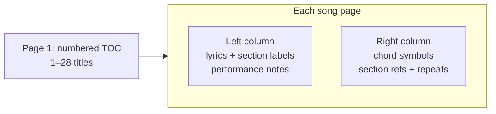
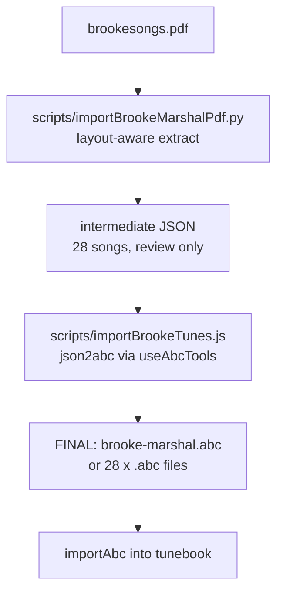

# Brooke Marshal PDF Songbook Import

## PDF structure analysis

The PDF ([`/home/stever/Downloads/brookesongs.pdf`](/home/stever/Downloads/brookesongs.pdf)) is a **31-page rehearsal chart** with **28 songs**. It is **not engraved notation** — it is a **two-column chord/lyric layout**.



### Document-level metadata

| Element | Details |
|---------|---------|
| Songs | 28 numbered entries (page 1 TOC) |
| Layout | ~2 columns: lyrics left, chords/structure right |
| Composer | Brooke Marshal (inferred from book name) |
| Target book | **`brooke marshal`** (existing) |
| Target tag | **`brooke marshal originals`** |
| Title casing | **Title Case** (e.g. `Roots Down`, `What Do You Want Me to Say?`) — not ALL CAPS as in PDF |

### Per-song fields extractable

| Field | Examples | Songs |
|-------|----------|-------|
| **Title** | Roots Down, Walking, Find My Way Home | All 28 (normalized from PDF ALL CAPS) |
| **Number** | 1–28 | All |
| **Capo** | `2nd capo` (BLOTTING PAPER), `CAPO ON THIRD FRET` (FALLING BACK TO YOU), `Capo 3rd` (PIG PEN), `4th fret` (RUB ME THE WRONG WAY) | 4 |
| **Tempo** | `61BPM` (GREY) | 1 |
| **Key / opening chords** | `Em B7 Em B7` (YOUR FOOL), `Gm C7 D7` (RUB ME THE WRONG WAY) | ~2 at title line |

### Section label vocabulary (Brooke-specific)

The PDF uses **abbreviated rehearsal labels** that do **not** match the app's current [`isSectionHeader()`](src/chordSheetUtils.js) patterns without normalization:

| PDF label | Normalized header |
|-----------|-------------------|
| `Intro x 2`, `Intro x 4`, `Intro = v x 2` | `# Intro` |
| `V 1`, `V1`, `V 2`, `Verse 1`, `Verse 1x 2`, `v` | `# Verse 1`, `# Verse 2`, etc. |
| `Ch 1`, `Ch1`, `Ch 2`, `Chorus x 2` | `# Chorus` |
| `Pre Ch` | `# Pre-Chorus` |
| `Bridge`, `B` | `# Bridge` |
| `Interlude x N`, `V interlude` | `# Interlude` |
| `Outro`, `Solo`, `Echo (...)` | `# Outro`, `# Solo`, etc. |

Repeat counts (`x 2`, `x 4`) and performance cues (`HARD STOP`, `hang for 8`, `Fade build stop`) should be preserved as **plain lyric/annotation lines** or appended to section headers, e.g. `# Intro (x 2)`.

### Chord patterns

1. **Standalone chord lines** — `Am G`, `C F Dm`, stacked in right column
2. **Inline with section** — `V1  G F` → split into `# Verse 1` + chord line `G F`
3. **Bar patterns** — `(Am E Am Am) x 4`, `D G x 4` → chord grid lines ending with `|`
4. **Performance chord notes** — `Am up 1 then 2 frets`, `Bflat7 C7` → keep as annotation lines (not chord grid)
5. **Songs with sparse/no chords** — BREATHE, CLUMSY LOVE, WHAT DO YOU WANT ME TO SAY?, HUNG OUT TO DRY, CATCH ME IF YOU CAN, WHERE DOES THE WATER GO, HIGHER, YOU DID SOMETHING TO ME → lyrics-only import

### Parsing challenges

1. **Column interleaving** — plain text extraction merges left/right columns unpredictably; must use **layout-aware extraction** (bounding boxes via `pdfplumber` or `PyMuPDF`)
2. **Multi-page songs** — FIND MY WAY HOME, WHERE DOES THE WATER GO, LOOP DE LOOP, YOU DID SOMETHING TO ME span 2 pages; title may split across lines
3. **Blank separator pages** — e.g. page 3 between ROOTS DOWN and WALKING
4. **Right-column cross-refs** — `Ch x 2  C D` mixes section repeat with chords; parser must split on tab/x-position gap

---

## Import approach (one-off script)

**Final deliverable: ABC notation** — each song saved as standard ABC using the app's [`json2abc`](src/useAbcTools.js) format. JSON is an intermediate parsing format only; the `.abc` files are what get imported and become the durable tune representation in the songbook.

No in-app PDF parser exists today — PDFs are attachments only ([`ImportFilesModal`](src/components/ImportFilesModal.js)). Reuse the existing **chord-sheet pipeline** after extraction:



### ABC output format (per song)

Each tune written using the app's native ABC conventions from [`json2abc`](src/useAbcTools.js):

```
X: 1
T: Roots Down
C:Brooke Marshal
B: brooke marshal
M:4/4
L:1/4
K:C
V:1
"Am""G"|"D""G""A"|
w: # Intro (x 2)
w: Well I've been, free as a bird
...
% abcbook-tags brooke marshal originals
% abcbook-capo 0
Q: 1/4=61
```

Key elements:
- **`T:`** — title-case song name
- **`C:`** — Brooke Marshal
- **`B:`** — `brooke marshal` (book assignment)
- **`w:`** — one line per lyric/section header (interleaved with note lines)
- **`"Chord"`** — chord symbols as ABC annotations on note lines (via `mergeChords`)
- **`% abcbook-tags`** — `brooke marshal originals`
- **`% abcbook-capo`** — where extracted (0 otherwise)
- **`Q:`** — tempo where annotated (e.g. Grey = 61)
- **Rhythmic scaffold** — `z` placeholder bars with chord annotations when no melody exists; `% abcbook-timing-scaffold true` if needed

Output location: `scripts/brooke-marshal-output/brooke-marshal.abc` (single multi-tune file, 28 `X:` entries) **or** `scripts/brooke-marshal-output/<slug>.abc` per song — single combined file preferred for one-shot `importAbc`.

### Step 1 — Python extractor (`scripts/importBrookeMarshalPdf.py`)

- Use `pdfplumber` to extract words/lines with x-coordinates per page
- **Page 1**: parse numbered TOC → `{num, title}` list (28 entries)
- **Title normalization**: convert PDF ALL CAPS to **title case** — capitalize major words; lowercase articles/prepositions/conjunctions (`a`, `an`, `the`, `and`, `but`, `or`, `for`, `nor`, `on`, `at`, `to`, `from`, `by`, `in`, `of`, `de`) unless first word. Examples: `ROOTS DOWN` → `Roots Down`, `WHERE DOES THE WATER GO` → `Where Does the Water Go`, `LOOP DE LOOP` → `Loop de Loop`, `CATCH ME IF YOU CAN` → `Catch Me if You Can`. Preserve apostrophes/contractions (`CAN'T FAKE IT` → `Can't Fake It`; fix obvious omissions like `DONT` → `Don't`). Question marks and punctuation kept.
- **Song pages**: detect song start by number + title pattern; group consecutive pages per song
- Split each line at column boundary (~mid-page x threshold, tuned per page)
- **Left column** → lyrics + section labels + performance notes
- **Right column** → chord lines + structural annotations
- Normalize section abbreviations via mapping table (above)
- Split combined lines like `V1  G F` into header + chord line
- Emit per-song **intermediate JSON** (not the final artifact):

```json
{
  "name": "Roots Down",
  "composer": "Brooke Marshal",
  "books": ["brooke marshal"],
  "tags": ["brooke marshal originals"],
  "capo": null,
  "tempo": null,
  "sheetLines": ["# Intro (x 2)", "Well I've been, free as a bird", "...", "Am G", "..."],
  "sourcePage": 2
}
```

- Write output to `scripts/brooke-marshal-output/` (gitignored) for review
- Print a summary table: song name, line count, chord line count, warnings

### Step 2 — Section header compatibility

Extend [`isSectionHeader()`](src/chordSheetUtils.js) **minimally** to recognize Brooke abbreviations **or** normalize all headers to `# Verse 1` / `# Chorus` form in the Python script (preferred — keeps app changes out of scope for a one-off import).

- Write intermediate JSON to `scripts/brooke-marshal-output/json/` (gitignored) for debugging only

### Step 3 — ABC generator (`scripts/importBrookeTunes.js`)

**This step produces the final songs as ABC notation.**

- Load each intermediate JSON file
- Run through existing utilities:
  - [`classifyLyricChordLines`](src/chordSheetUtils.js) → [`sheetLinesToWizardChords`](src/chordSheetImportUtils.js) + [`sheetLinesToLyricLines`](src/chordSheetImportUtils.js)
- Build tune JSON object with `voices`, `wLines`, metadata
- Merge chords into note lines via `abcjsParser.mergeChords` (same as [`finalizeChordSheetToTune`](src/timedImportFinalizer.js))
- Serialize each tune to ABC via **`tunebook.abcTools.json2abc(tune)`** — no direct localStorage or `saveTune` calls in the script
- Write **`scripts/brooke-marshal-output/brooke-marshal.abc`** containing all 28 tunes
- Validate round-trip: `abc2json` each tune back and confirm `name`, `books`, `tags`, `wLines`, `capo` survive

### Step 4 — Import ABC into tunebook

- Use existing **`importAbc`** path (Import ABC UI or equivalent) to load `brooke-marshal.abc`
- Confirm all 28 tunes land in **brooke marshal** book with tag **brooke marshal originals**
- The imported tunes are stored as ABC internally — same format as the generated files

### Step 5 — Review pass

Before import, inspect **`brooke-marshal.abc`** for:
- Valid ABC syntax (parses cleanly via `abc2json`)
- Column-split errors (chords mixed into lyrics)
- **Title case** correct on all 28 songs (no ALL CAPS remaining)
- Missing songs / duplicate detection against existing `brooke marshal` book
- Capo/tempo on the 5 annotated songs
- Lyrics-only songs have `w:` lines and scaffold bars where needed

### Step 6 — Attach source PDF (optional)

After import, attach [`brookesongs.pdf`](/home/stever/Downloads/brookesongs.pdf) to each tune or to a book-level note via existing `tune.files` mechanism — **skip unless requested** (28 copies is heavy).

---

## Song inventory (all 28, title-case names)

1. Roots Down — chords + sections
2. Walking — chords, complex (scat sections, capo notes)
3. What Do You Want Me to Say? — lyrics-heavy
4. Can't Fake It — inline chords
5. Havoc — full chord chart
6. Ride — full chord chart
7. Wrong Reasons — full chord chart
8. Breathe — lyrics only
9. Your Fool — title chords `Em B7`
10. Blotting Paper — capo 2nd
11. Hung Out to Dry — lyrics-heavy
12. Catch Me if You Can — partial (page cut off in extract)
13. Clumsy Love — lyrics only
14. One Day — chords `D Am`
15. Find My Way Home — 2 pages, hook notation
16. Where Does the Water Go — 2 pages, sparse chords
17. Loop de Loop — 2 pages, bar-pattern chords `G G | D D`
18. Don't Know Why — chords `Am G F C G`
19. Family Tree — bar patterns `(Am E Am Am) x 4`
20. Rub Me the Wrong Way — capo 4th, `Gm C7 D7`
21. You Did Something to Me — 2 pages
22. All I Know — chords `Am G`, `C G Dm F`
23. Internal Dialogue — chords `Am G`, `E7`
24. Grey — tempo 61BPM, `C F Dm`
25. Falling Back to You — capo 3rd, `G D C`
26. Pig Pen — capo 3rd, `A D`
27. Liar Birds — `A D`, `A E`
28. Higher — lyrics-heavy

---

## Files to create

| File | Purpose |
|------|---------|
| [`scripts/importBrookeMarshalPdf.py`](scripts/importBrookeMarshalPdf.py) | Layout-aware PDF → intermediate JSON |
| [`scripts/importBrookeTunes.js`](scripts/importBrookeTunes.js) | Intermediate JSON → **final `.abc` files** via `json2abc` |
| [`scripts/brooke-marshal-output/brooke-marshal.abc`](scripts/brooke-marshal-output/brooke-marshal.abc) | **Final ABC songbook** (28 tunes, gitignored) |
| [`scripts/brooke-marshal-output/json/`](scripts/brooke-marshal-output/json/) | Intermediate parse output (gitignored) |
| `requirements` addition | `pdfplumber` for PDF parsing |

## Dependencies

- Python: `pdfplumber` (add to a scripts-local requirements or one-off `pip install`)
- No app UI changes required for one-off import
- Optional tiny extension to `isSectionHeader` only if normalized `#` headers prove insufficient

## Test plan

1. Run Python extractor; verify 28 intermediate JSON files
2. Run ABC generator; verify **`brooke-marshal.abc`** contains 28 `X:` entries
3. Round-trip test: `abc2json` on 3 spot-check tunes (Roots Down, Breathe, Grey) — title case, tags, capo, `w:` lines intact
4. Import `brooke-marshal.abc` via `importAbc`; confirm **brooke marshal** book + **brooke marshal originals** tag
5. Verify capo on 4 songs and tempo on Grey in the imported ABC
