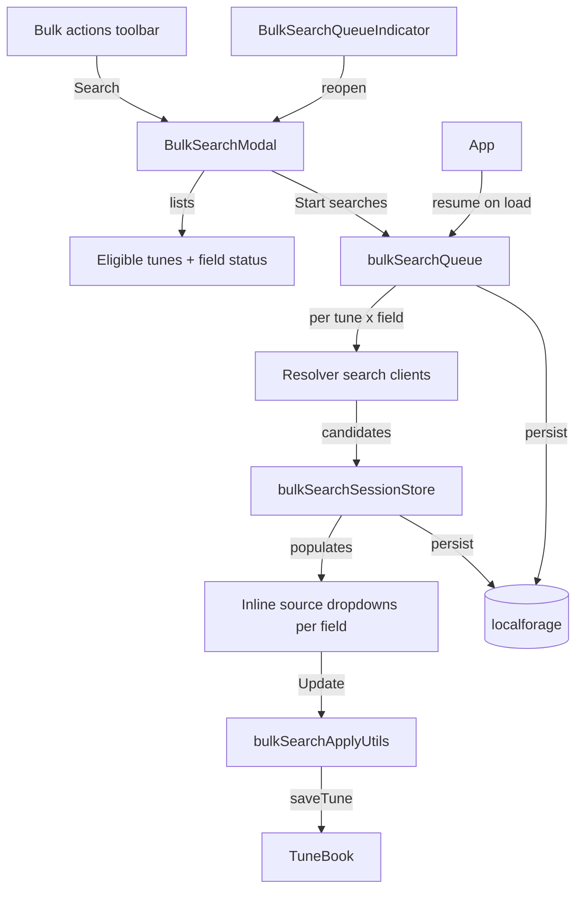

# Bulk search autofill

## Goal

Add a **Search** button to the bulk operations toolbar in [`SelectedItemsModal.js`](src/components/SelectedItemsModal.js). Clicking it opens a **Bulk Search** modal that:

1. Lists selected tunes that can have missing data filled by resolver searches
2. Runs searches for **background info**, **lyrics**, **chords**, and **melody (notation)** in a persistent browser queue
3. Lets the user **choose a source** per field when multiple candidates are returned (inline in the tune list—not nested picker modals)
4. Saves chosen values with a single **Update** button
5. Supports a **Force overwrite** checkbox to treat all selected tunes as updatable and overwrite existing data without confirmation

**Default behavior (force overwrite off):**
- Only show tunes missing at least one searchable field
- Only run searches for fields that are currently empty
- Skip tunes/fields that already have data (same as prior decision for background)

**Force overwrite on:**
- Show all selected tunes
- Search all enabled field types regardless of existing content
- Update applies directly with no per-tune or per-field confirm dialogs

## User flow



## Architecture

Two cooperating modules:

| Module | Responsibility |
|--------|----------------|
| [`bulkSearchSessionStore.js`](src/bulkSearchSessionStore.js) | Session + per-tune state: eligibility, search status, candidates, user selections, force-overwrite flag |
| [`bulkSearchQueue.js`](src/bulkSearchQueue.js) | Sequential job runner; fetches results and writes into session store; does **not** save tunes until user clicks Update |

Persist both to **localforage** (`bulksearchsession` store) so the session survives navigation and full page reload. On app init, restore session and resume queue if it was running.

## 1. Eligibility and field detection

Reuse existing tunebook helpers from [`useTuneBook.js`](src/useTuneBook.js):

| Field | Missing when | Search client |
|-------|--------------|---------------|
| Background | `backgroundInfo` empty | [`researchTuneBackground()`](src/tuneBackgroundResearchClient.js) — requires resolver + `features.llm` |
| Lyrics | `!hasLyrics(tune)` | [`searchLyrics()`](src/lyricsSearchClient.js) |
| Chords | no chord symbols in note lines (same check as [`tuneCompletenessCheck.js`](src/tuneCompletenessCheck.js)) | [`searchChords()`](src/chordsSearchClient.js) |
| Melody | `!hasNotes(tune)` | [`searchNotation()`](src/notationSearchClient.js) |

Extract a small shared `tuneFieldEligibility.js` helper so eligibility logic is testable and used by both the modal and queue.

**Enqueue rules (force overwrite off):** create search jobs only for empty fields.
**Enqueue rules (force overwrite on):** create jobs for all enabled field types on all selected tunes.

Skip tune entirely if no tune name (required for all searches). Dedupe pending/running jobs by `(tuneId, fieldType)`.

## 2. Session store shape

Per session:

```js
{
  sessionId, selectionKey, createdAt,
  forceOverwrite: false,
  enabledFields: { background, lyrics, chords, melody },
  phase: 'idle' | 'searching' | 'review' | 'done',
  queueRunning, queuePaused,
  progress: { completed, total, message },
  tunes: {
    [tuneId]: {
      tuneId, tuneName, title, artist,
      fields: {
        background: { status, candidates[], selectedIndex, error, skipReason },
        lyrics:     { status, candidates[], selectedIndex, error, skipReason },
        chords:     { status, candidates[], selectedIndex, error, skipReason },
        melody:     { status, candidates[], selectedIndex, error, skipReason },
      },
      applyFields: { background, lyrics, chords, melody }  // checkboxes for Update
    }
  }
}
```

When a search returns:
- **Single result:** auto-select `selectedIndex = 0`, auto-check `applyFields[field]` if field was eligible (or force overwrite)
- **Multiple results:** populate `candidates`, leave `selectedIndex` null until user picks; label using same format as [`SearchResultPickerModal.js`](src/components/SearchResultPickerModal.js)
- **Error / no results:** set `status: 'error'` or `'empty'`, show message inline

Candidate objects reuse normalized shapes from existing clients (lyrics lines/text, chords chordText/lyricLines, notation abc/tuneMeta, background text).

## 3. Search queue module

Create [`bulkSearchQueue.js`](src/bulkSearchQueue.js) modeled on [`mediaCacheQueue.js`](src/mediaCacheQueue.js):

- Jobs: `{ id, tuneId, fieldType, title, artist, lyrics, accessToken, status, progress, message }`
- **Sequential** processing (resolver + LLM are heavy; avoids rate limits)
- Calls the appropriate search client per `fieldType`; stores candidates in session store via `bulkSearchSessionStore.setFieldResult()`
- Queue controls: Start, Stop (pause), Cancel job, Cancel all, Clear finished
- `persistState()` debounced after changes; `restoreAndResume()` on init resets `running` → `pending`
- Register with [`longRunningJobRegistry.js`](src/longRunningJobRegistry.js)
- Context: `setBulkSearchQueueContext({ tunebook, accessToken, forceRefresh })` from [`App.js`](src/App.js)

Lyrics disambiguation text: [`lyricLinesToText(tune)`](src/wLinesUtils.js) at job creation time.

## 4. Bulk Search modal (main UI)

Create [`src/components/BulkSearchModal.js`](src/components/BulkSearchModal.js):

**Header:**
- Title: "Search N selected tunes"
- **Force overwrite** checkbox (with short help text)
- Field-type toggles: Background, Lyrics, Chords, Melody (all on by default; disable Background if resolver LLM unavailable)
- Overall **progress bar** while searching
- Queue toolbar: Start / Stop / Cancel all (mirrors media cache queue)

**Body — scrollable tune list:**
Each tune is a card/row showing:
- Tune name + composer
- Per enabled field column/section:
  - Status badge (pending · searching · found · none · error · skipped)
  - `Form.Select` dropdown when `candidates.length > 1` (source label + optional preview truncation)
  - Read-only preview when 1 candidate or selected
  - Checkbox **Apply** (checked by default when a selection exists and field is eligible; always checked under force overwrite when result exists)
- Expand row for longer previews (lyrics snippet, chord lines, ABC snippet)

Only tunes with at least one searchable field appear when force overwrite is off. When on, all selected tunes appear.

**Footer:**
- **Update** button — enabled when at least one tune has checked apply fields with a selection; shows count ("Update 12 fields on 5 tunes")
- **Close** — does not discard session; user can reopen via global indicator

On Update: call [`bulkSearchApplyUtils.js`](src/bulkSearchApplyUtils.js) for each checked field, then `tunebook.saveTune()`, `forceRefresh()`, mark session done / clear applied items.

## 5. Apply selected results

Create [`src/bulkSearchApplyUtils.js`](src/bulkSearchApplyUtils.js) reusing single-tune patterns:

| Field | Apply logic (from existing code) |
|-------|----------------------------------|
| Lyrics | [`setLyricLines(tune, candidate.lines)`](src/wLinesUtils.js) |
| Chords | `abcjsParser.mergeChords(candidate.chordText, currentAbc)` then update tune voices — same as [`AddSongModal.js`](src/components/AddSongModal.js) `handleChordsMerged` |
| Melody | [`importedTuneFromNotationCandidate()`](src/notationImportUtils.js) + [`applyTuneImportSelections()`](src/tuneImportMergeUtils.js) with `voices` (and `words`/`wLines` only if lyrics field not separately applied) |
| Background | `tune.backgroundInfo = candidate.text` — same as [`AbcEditor.js`](src/components/AbcEditor.js) |

When force overwrite is off, apply utils are only called for fields the user checked. When on, apply without confirmation dialogs.

## 6. Global indicator + hook

Create [`src/useBulkSearchSession.js`](src/useBulkSearchSession.js) — subscribe to session store + queue state.

Create [`src/components/BulkSearchQueueIndicator.js`](src/components/BulkSearchQueueIndicator.js):
- Visible when queue is active **or** session has reviewable unsaved results
- Badge: "Search (N)" — pending jobs or tunes awaiting Update
- Opens BulkSearchModal on click
- Mount next to [`MediaCacheQueueIndicator`](src/components/MediaCacheQueueIndicator.js) in [`App.js`](src/App.js)

## 7. Wire-up

| File | Change |
|------|--------|
| [`SelectedItemsModal.js`](src/components/SelectedItemsModal.js) | Add Search `BulkOpsButton` → `BulkSearchModal` |
| [`IndexLayout.js`](src/components/IndexLayout.js) | Pass `token={props.token}` to `SelectedItemsModal` |
| [`App.js`](src/App.js) | Mount indicator; register queue context; call `restoreAndResume()` on load |
| [`longRunningJobRegistry.js`](src/longRunningJobRegistry.js) | Include bulk search queue in active-job checks |
| [`App.css`](src/App.css) | Styles for bulk search modal (`.bulk-search-modal`, tune rows, field columns) |

## 8. Tests

- `tuneFieldEligibility.test.js` — missing-field detection, force-overwrite expands scope
- `bulkSearchSessionStore.test.js` — persist/restore, auto-select single candidate, selection updates
- `bulkSearchQueue.test.js` — job creation respects eligibility, dedup, cancel, running→pending on restore
- `bulkSearchApplyUtils.test.js` — lyrics/chords/melody/background apply without touching unchecked fields

## Key reuse (no server changes)

- Search clients: [`tuneBackgroundResearchClient.js`](src/tuneBackgroundResearchClient.js), [`lyricsSearchClient.js`](src/lyricsSearchClient.js), [`chordsSearchClient.js`](src/chordsSearchClient.js), [`notationSearchClient.js`](src/notationSearchClient.js)
- Candidate labeling: [`SearchResultPickerModal.js`](src/components/SearchResultPickerModal.js) `formatCandidateLabel`
- Tune selection: `tunebook.fromSelection(selected)`
- Queue UX patterns: [`mediaCacheQueue.js`](src/mediaCacheQueue.js) + [`MediaCacheQueueModal.js`](src/components/MediaCacheQueueModal.js)
- Import/merge: [`notationImportUtils.js`](src/notationImportUtils.js), [`tuneImportMergeUtils.js`](src/tuneImportMergeUtils.js)

## Out of scope

- Parallel/concurrent search requests
- Google web-search fallback for bulk (resolver required)
- Per-field import chooser modal (`TuneImportFieldChooserModal`) — bulk melody apply uses a fixed `voices`-only merge; user picks the notation *source*, not individual ABC fields
