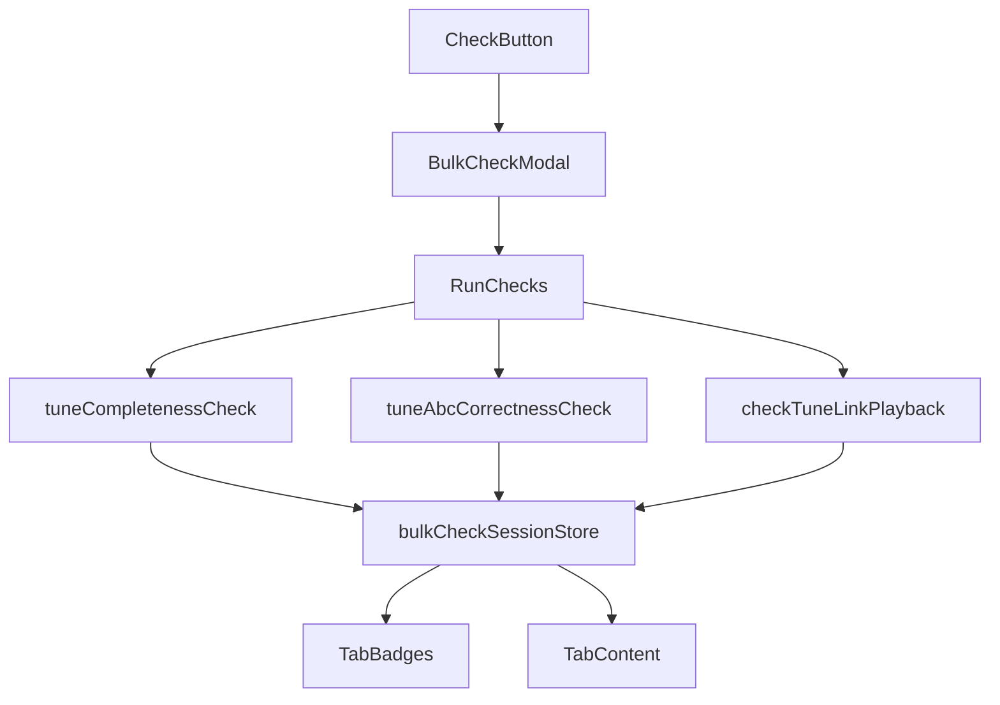
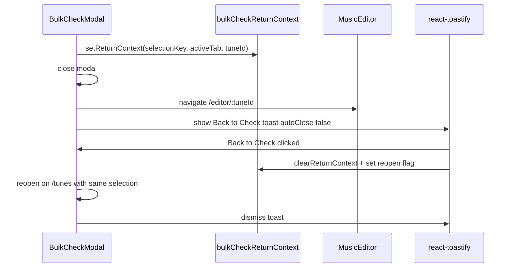

# Bulk Check Modal Expansion

## Goals

- Rename toolbar button **Check Links** → **Check** in [`src/components/BulkCheckLinksModal.js`](src/components/BulkCheckLinksModal.js) (rename file to `BulkCheckModal.js`, update import in [`src/components/SelectedItemsModal.js`](src/components/SelectedItemsModal.js)).
- Add top-level tabs: **Links**, **Record completeness**, **ABC correctness**, each with a badge showing issue count.
- Single **Run checks** action: run completeness + ABC analysis synchronously, then start link playback queue (current async flow).
- Persist results per selection in session storage (generalize [`src/linkCheckSessionStore.js`](src/linkCheckSessionStore.js)).

## Architecture



## Category definitions

### Links (existing UI + playback-region warnings)

Reuse current queue, progress bar, failure grouping, `LinkAllocationRow`, YouTube search, and background playback-region scan. Move this body into a `LinksCheckTab` subcomponent.

**Playback-region warnings (included):** tunes with a playable link URL but missing `startAt` and/or `endAt` are flagged as warnings — they do **not** count as playback failures and do not block a successful link check.

Implementation in [`src/checkTuneLinkPlayback.js`](src/checkTuneLinkPlayback.js) (or a small `linkRegionWarnings.js` helper):

- New export `getLinkRegionWarnings(tunes)` — for each tune with link content (`tuneHasLinkContent`), inspect `links[0]` (and `playbackLoops` active loop via `syncLegacyLinkLoopFields` from [`src/mediaPlaybackUtils.js`](src/mediaPlaybackUtils.js)).
- Warning when URL is non-empty and either `startAt` or `endAt` is blank/whitespace.
- Issue shape: `{ tuneId, tuneName, composer, linkIndex, missing: ['startAt'] | ['endAt'] | ['startAt','endAt'] }`.

**Badge count:** number of tunes with ≥1 link **error** (playback failure or missing URL) **or** ≥1 link **warning** (missing region). Tab body distinguishes them:

- Errors — red `Alert`, existing `LinkAllocationRow` fix flow.
- Warnings — yellow `Alert variant="warning"`, inline `startAt`/`endAt` inputs (reuse patterns from [`src/components/LinksEditor.js`](src/components/LinksEditor.js) / `LINKS_FIELD_HELP`), plus **Detect region** button when resolver + whisper available (`useAutoLinkPlaybackRegionScan`).

Warnings are computed synchronously during the static phase (before playback), so the Links badge is populated immediately when **Run checks** starts; playback failures append afterward.

### Record completeness (new)

A tune is **complete** if it passes **either** path (confirmed):

| Path | Intent | Pass criteria (implemented in new [`src/tuneCompletenessCheck.js`](src/tuneCompletenessCheck.js)) |
|------|--------|--------------------------------------------------------------------------------------------------|
| **A — Lyric + chord layout** | Chord-sheet / timing-scaffold tunes | Has singable lyrics (`getLyricLines`), has `meter`, chord layout exists in ABC (`renderChords` → `splitChordChartIntoBlocks` with `chartBlockHasChords`), lyric stanzas align to chord blocks (`alignChordBlocksToLyrics` from [`src/chordSheetUtils.js`](src/chordSheetUtils.js)), section headers present in lyrics where blocks differ, ABC note lines use `||` at stanza boundaries (`splitMelodyIntoBlocks` from [`src/lyricBarAlignmentUtils.js`](src/lyricBarAlignmentUtils.js) count matches lyric block count). Melody may be rest-only / timing scaffold (`timingScaffold` or `!noteLinesHaveRealMelody`). |
| **B — Melody + embedded chords** | Fully notated tunes | Has real melody (`noteLinesHaveRealMelody`), `meter` + `key`, ≥70% of bars contain notes (reuse bar counting from `lyricBarAlignmentUtils`), embedded chord symbols present (`hasChords` from [`src/useAbcTools.js`](src/useAbcTools.js)), optional lyrics have interleaved `w:` spacing (`buildNotationWLines` from [`src/noteSpacingUtils.js`](src/noteSpacingUtils.js) when lyrics exist). |

**Issue shape:** `{ tuneId, tuneName, composer, suggestedPath: 'A'|'B', issues: [{ code, message, field? }] }`

**Remediation UI** (`CompletenessCheckTab`):

- Accordion per incomplete tune showing issue list, suggested path (A or B), and short guidance (what to fix in the editor).
- Primary action: **Edit tune** — navigates to [`/editor/:tuneId`](src/App.js) (`MusicEditor`), closes the check modal, and shows a persistent **Back to Check** toast (see [Return-to-check flow](#return-to-check-flow) below).
- No inline lyric/chord/meter forms in the modal — full editing belongs on the tune page (Chords tab, notation editor, lyrics fields).
- Optional secondary: **Re-check this tune** — re-runs completeness for one tune after returning without a full bulk re-run.

### ABC correctness (new)

Technical validity separate from musical completeness — avoids duplicating “missing chords/lyrics” checks.

Implemented in [`src/tuneAbcCorrectnessCheck.js`](src/tuneAbcCorrectnessCheck.js):

| Check | Source |
|-------|--------|
| ABC parse failure | `abcjs.parseOnly` / `parseVoiceEvents` |
| Render warnings | `abcjs.renderAbc` warnings array |
| Round-trip drift | compare `justNotesNoMeta` before/after abcjs re-render (pattern from [`src/components/ParserProblemsDiff.js`](src/components/ParserProblemsDiff.js)) |
| Missing recommended headers | `M:`, `K:`, `L:` absent on export |
| Empty / malformed voice body | no note lines, unbalanced barlines |

**Remediation UI** (`AbcCorrectnessTab`):

- Per-tune issue list with severity chips.
- **In-modal quick fixes** (no navigation required):
  - **Fix headers** — fill missing `M:`/`K:`/`L:` from tune fields or sensible defaults, save, re-run ABC check for that tune.
  - **Normalize notation** — abcjs round-trip save with diff preview (reuse [`ParserProblemsDiff`](src/components/ParserProblemsDiff.js) pattern).
- **Edit tune** — same as completeness: navigate to `/editor/:tuneId`, close check modal, show persistent **Back to Check** toast for deeper fixes (notation editor, full ABC tab).
- Collapsed ABC snippet showing first failing line (no full editor embed in v1).

## Return-to-check flow

When the user leaves the check modal to edit a tune, a persistent toast bridges navigation back.



New module [`src/bulkCheckReturnContext.js`](src/bulkCheckReturnContext.js):

- `setBulkCheckReturnContext({ selectionKey, activeTab, tuneId })` — sessionStorage
- `getBulkCheckReturnContext()` / `clearBulkCheckReturnContext()`
- `showBulkCheckReturnToast({ onBack })` — `toast.info` with custom render: message + **Back to Check** `Button`, `{ autoClose: false, closeOnClick: false }` (pattern from [`useYouTubePlaylist.js`](src/useYouTubePlaylist.js) export countdown toast)
- `dismissBulkCheckReturnToast()` — dismiss by stored toast id

**Toast lifetime** — dismissed when any of:

1. User clicks the toast close button
2. User clicks **Back to Check** (navigates to `/tunes`, sets `reopenBulkCheck: true` + `activeTab` in session, reopens `BulkCheckModal` via prop/callback on [`SelectedItemsModal`](src/components/SelectedItemsModal.js))
3. User reopens the check modal directly (bulk ops → Check) — `BulkCheckModal` `onShow` calls `dismissBulkCheckReturnToast()`

**Editor integration:** [`MusicEditor`](src/components/MusicEditor.js) (or a small `useBulkCheckReturnToast` hook mounted in `App.js`) shows the toast on mount when return context matches current `tuneId` and route is `/editor/:tuneId`.

**After return:** modal restores from `bulkCheckSessionStore`; optionally re-run static checks for the edited tune to refresh badge counts.

## Modal UX

```
[Check] button
└─ Modal title: "Check N selected tune(s)"
   Header: [Run checks] [Cancel/Refresh when running]
   Tabs:
     Links (3) | Record completeness (5) | ABC correctness (2)
   Active tab body: category-specific content
```

- Badges use Bootstrap `Badge` on tab titles; count = number of tunes with ≥1 issue in that category (not raw issue count — clearer for bulk). Links tab uses `bg-danger` when any playback errors exist, `bg-warning text-dark` when only region warnings remain, `bg-danger` if both.
- On open: restore session if `selectionKey` matches; show last results + badges without re-running.
- **Run checks** flow:
  1. Set phase `running-static` → run completeness + ABC for all selected tunes.
  2. Update badges + tab bodies.
  3. If any links in queue → continue into existing link playback loop (`phase: running-links`).
  4. `phase: done`.
- Intro copy updated to describe all three categories; remove links-only framing.

## Session store

Generalize [`src/linkCheckSessionStore.js`](src/linkCheckSessionStore.js) → [`src/bulkCheckSessionStore.js`](src/bulkCheckSessionStore.js):

```js
{
  selectionKey,
  phase,           // intro | running-static | running-links | done | cancelled
  links: { failures, warnings, checkedCount, totalCount, progressMessage, progressPercent },
  completeness: { issues: [...] },
  abcCorrectness: { issues: [...] }
}
```

Keep backward-compatible read of old `abc2book.bulkLinkCheckSession` key for one release (migrate on read).

## Files to create / change

| File | Change |
|------|--------|
| [`src/components/BulkCheckModal.js`](src/components/BulkCheckModal.js) | Rename from BulkCheckLinksModal; tab shell, Run checks orchestration |
| `src/components/checkTabs/LinksCheckTab.js` | Extract current links body |
| `src/components/checkTabs/CompletenessCheckTab.js` | Issue list + Edit tune → editor navigation |
| `src/components/checkTabs/AbcCorrectnessTab.js` | Issue list + quick fixes + Edit tune navigation |
| `src/bulkCheckReturnContext.js` | Return context session + persistent Back to Check toast |
| `src/useBulkCheckReturnToast.js` | Hook: show toast on editor mount, wire Back to Check |
| `src/tuneCompletenessCheck.js` | Path A/B validation logic |
| `src/tuneAbcCorrectnessCheck.js` | Technical ABC validation |
| `src/bulkCheckSessionStore.js` | Unified session persistence |
| `src/tuneCompletenessCheck.test.js`, `src/tuneAbcCorrectnessCheck.test.js` | Unit tests for validators |
| [`src/checkTuneLinkPlayback.js`](src/checkTuneLinkPlayback.js) | Add `getLinkRegionWarnings`; tests in existing or new test file |
| [`src/App.css`](src/App.css) | Rename `.bulk-check-links-*` classes to `.bulk-check-*`; add tab badge styles |
| [`src/components/MusicEditor.js`](src/components/MusicEditor.js) | Mount `useBulkCheckReturnToast` |
| [`src/components/SelectedItemsModal.js`](src/components/SelectedItemsModal.js) | Update import; pass `reopenBulkCheck` / `initialCheckTab` to modal |

## Category suggestions (accepted + notes)

Your three categories are the right split:

- **Links** = external media reliability (playback, URL, optional region timing).
- **Record completeness** = domain model for your tunebook (lyric/chord-sheet OR melody+chords) — this is the highest-value new tab.
- **ABC correctness** = machine-parseable, normalized ABC — fixable with wizards without requiring musical judgment.

**Not recommended as separate tabs** (would overlap):
- Metadata-only (title/composer) — fold missing title into completeness as a soft issue on both paths.
- Lyric/chord alignment — already Path A logic using existing `alignChordBlocksToLyrics`.

## Testing plan

- Unit tests: Path A pass/fail, Path B pass/fail, either-path OR logic, bar-density threshold, stanza/double-barline mismatch.
- Unit tests: ABC parse failure, header missing, round-trip drift detection.
- Unit tests: `getLinkRegionWarnings` — URL present + missing startAt/endAt combinations; no warning when both set or URL empty.
- Manual: select mixed tunes → Run checks → verify badges, tab switching, link region warnings; Edit tune from completeness/correctness → editor opens with Back to Check toast → toast dismisses on Back to Check (modal reopens) or toast close; verify selection + check results persist.
