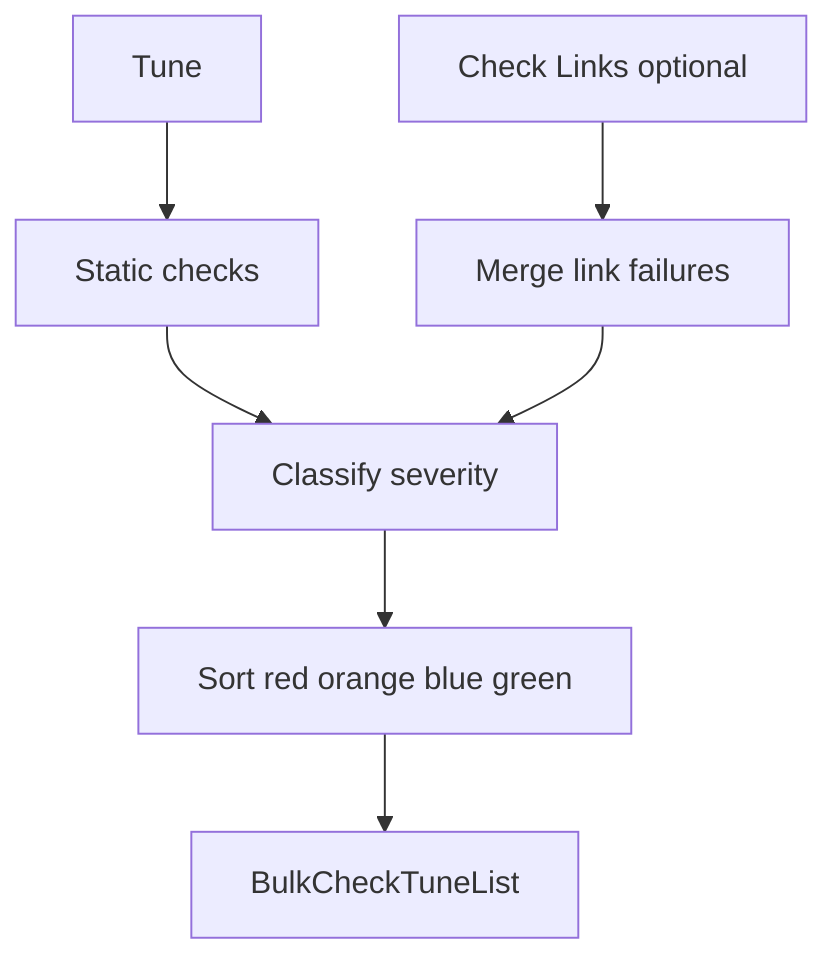

# Bulk Check Overhaul

## 1. Fix the immediate crash

**Root cause:** [`LocalSearchSelectorModal.js`](src/components/LocalSearchSelectorModal.js) initializes `filter` from `value` (line 68) and calls `filter.trim()` (line 427) without guarding against `null`. Tunes with an empty/null `name` pass `null` from [`MusicEditor.js`](src/components/MusicEditor.js) line 116.

**Fix:**
- Add a small helper `normalizeSearchText(value) { return String(value ?? '').trim() }` (or inline `(value ?? '')`) at init, in `useEffect` when `value` changes, and anywhere `.trim()` is called on `filter`.
- Harden call sites: `MusicEditor.js` → `value={tune?.name ?? ''}`.

This unblocks Edit from record completeness and the single-view pencil.

---

## 2. Shared display-name utility

Create [`src/tuneDisplayName.js`](src/tuneDisplayName.js):

```js
export function formatTuneDisplayName(name, fallback = 'Untitled Song') {
  const trimmed = String(name ?? '').trim()
  return trimmed.length > 0 ? trimmed : fallback
}
```

Replace `tune.name || tune.id` in check output paths:
- [`tuneCompletenessCheck.js`](src/tuneCompletenessCheck.js) (line 182)
- [`tuneAbcCorrectnessCheck.js`](src/tuneAbcCorrectnessCheck.js) (line 88)
- [`checkTuneLinkPlayback.js`](src/checkTuneLinkPlayback.js)
- New unified report module (below)

Matches list mode in [`IndexLayout.js`](src/IndexLayout.js) line 419.

---

## 3. Unified tune check report + severity classification

Create [`src/tuneBulkCheckReport.js`](src/tuneBulkCheckReport.js) with tests in [`src/tuneBulkCheckReport.test.js`](src/tuneBulkCheckReport.test.js).

**`buildTuneCheckReport(tune, options)`** aggregates:
- Existing completeness ([`checkTuneCompleteness`](src/tuneCompletenessCheck.js))
- ABC correctness ([`checkTuneAbcCorrectness`](src/tuneAbcCorrectnessCheck.js))
- New warnings: missing `tempo`, missing `composer`
- Optional gaps (blue): empty `backgroundInfo`, practice settings (`suitableForPractice === false` or empty `suitableFor` when tune is otherwise practice-eligible)
- Link results (when link check has run): failures/warnings from session, tunes without links

**Severity rules** (confirmed with you):

| Color | Condition |
|-------|-----------|
| **red** | No title OR (no lyrics AND no notation AND no links) |
| **orange** | Usable but has completeness/ABC/link/warning issues (incl. missing tempo/composer) |
| **blue** | Only optional gaps (background info, practice instrument settings) — no blocking issues |
| **green** | All checks pass |

**Sort:** red → orange → blue → green (stable within tier by title).

**Helpers:** `hasTuneLyrics`, `hasTuneNotation`, `hasTuneLinks` — reuse logic from completeness/practice modules rather than duplicating.



---

## 4. Decouple static check from link check

Refactor [`bulkCheckRunner.js`](src/bulkCheckRunner.js):

- **`startBulkCheckStaticRun(options)`** — runs completeness + ABC only; sets phase `running-static` → `static-done` (new phase, or reuse `done` without link progress).
- **`startBulkCheckLinkRun(options)`** — link playback only; phase `running-links` → `done` / `cancelled`.
- Remove auto-chaining of link checks after static in current `startBulkCheckRun` (or make it a thin wrapper that only calls static).

Update [`bulkCheckSessionStore.js`](src/bulkCheckSessionStore.js) phase helpers if needed (`isBulkCheckPhaseRunning` still covers both).

---

## 5. Bulk ops modal: wider + fullscreen

[`SelectedItemsModal.js`](src/components/SelectedItemsModal.js):
- Add `fullscreen` to the Modal (same pattern as [`AddSongModal.js`](src/components/AddSongModal.js)).
- Update [`.bulk-ops-modal`](src/App.css) CSS to support fullscreen layout (toolbar + tabs use full viewport height).

---

## 6. Bulk check modal: fullscreen unified list

Major refactor of [`BulkCheckModal.js`](src/components/BulkCheckModal.js):

**Remove:**
- Tab layout (`Nav` / `Tab.Container` for Links / Record completeness / ABC)
- Intro descriptive paragraph and tab badge UI
- Navigation-based edit flow via [`beginBulkCheckEditTune`](src/bulkCheckReturnContext.js)

**Add:**
- `fullscreen` Modal (drop `size="xl"`, keep/update `.bulk-check-modal-dialog` CSS for full viewport)
- **`BulkCheckTuneList`** component ([`src/components/BulkCheckTuneList.js`](src/components/BulkCheckTuneList.js)) — scrollable list of color-coded cards:
  - Header: title + artist (no "Suggested path")
  - Actions (right-aligned): **Edit**, **Fix** dropdown, **Ignore**
  - Body: bullet list of issues (link failures included after Check Links runs)
- **`BulkCheckTuneEditorModal`** ([`src/components/BulkCheckTuneEditorModal.js`](src/components/BulkCheckTuneEditorModal.js)) — fullscreen in-modal editor:
  - Info fields from [`AbcEditor.js`](src/components/AbcEditor.js) info sections (title, artist, tempo, meter, key, genre, practice fields, background info, etc.)
  - Lyrics textarea (`wLines` / plain lyrics)
  - Raw ABC textarea (`json2abc` / parse back on save)
  - Save on close → `tunebook.saveTune` → `recheckTune(tuneId)` to refresh that row
- **`BulkCheckFixDropdown`** ([`src/components/BulkCheckFixDropdown.js`](src/components/BulkCheckFixDropdown.js)) — per-tune dropdown wired to existing APIs. Menu order (**Search All at the top**):
  1. **Search All** — sequential run of all applicable actions below (divider after)
  2. **Analyse** — media analysis + playback region (when audio link exists; reuse [`useAutoLinkPlaybackRegionScan`](src/useAutoLinkPlaybackRegionScan.js) / LinksEditor analyse pattern)
  3. **Search ABC** — [`searchNotation`](src/notationSearchClient.js)
  4. **Search Chords And Lyrics** — [`searchChords`](src/chordsSearchClient.js) / [`searchLyrics`](src/lyricsSearchClient.js) (pattern from [`useMediaImportWebSearch.js`](src/components/mediaImportWizard/useMediaImportWebSearch.js))
  5. **Background Info** — [`researchTuneBackground`](src/tuneBackgroundResearchClient.js)
  6. **Stems** — [`enqueueStemCreateJob`](src/stemCreateQueue.js) when tune has separable audio
  - Individual items disabled when not applicable (e.g. Analyse/Stems without audio)
  - After each fix completes → recheck that tune

**Header actions:**
- **Check Links** button (replaces "Refresh check"):
  - Starts `startBulkCheckLinkRun`
  - Progress bar + "Checking {title} ({n} of {total})" underneath
  - Click while running → cancel with toast/message ("Link check cancelled")
- Remove auto link check on initial open

**Bulk ops integration:**
- Pass `autoStartCheck` prop from [`SelectedItemsModal.js`](src/components/SelectedItemsModal.js) when Check is clicked inside bulk ops
- Check button: open route + show modal + call `startBulkCheckStaticRun` immediately (no intro phase)

**Ignore:**
- Store ignored tune IDs in session (`patchBulkCheckSession` → `ignoredTuneIds: []`)
- Hide ignored rows from list; optional "Show ignored" toggle if cheap

---

## 7. Completion toast

Extend [`bulkCheckReturnContext.js`](src/bulkCheckReturnContext.js) with `showBulkCheckCompleteToast({ onOpenCheck })`.

Add [`src/useBulkCheckCompleteToast.js`](src/useBulkCheckCompleteToast.js) — subscribe to [`subscribeBulkCheckRunner`](src/bulkCheckRunner.js) + session store; when phase transitions to `done` after link run, show persistent toast:

> "Bulk check complete — {n} issue(s) found."  
> **[Review results]** → navigates to `/tunes/check`

Mount hook in [`App.js`](src/App.js) (alongside existing [`BulkCheckYoutubeHost`](src/components/BulkCheckYoutubeHost.js)).

---

## 8. CSS updates

In [`App.css`](src/App.css):
- Bulk ops + check modals: fullscreen-friendly body scroll
- Color blocks for list items:
  - `.bulk-check-item--red` (danger tint)
  - `.bulk-check-item--orange` (warning tint)
  - `.bulk-check-item--blue` (info tint)
  - `.bulk-check-item--green` (success tint)
- Check Links progress bar styling below header

---

## 9. Cleanup / compatibility

- Keep [`CompletenessCheckTab.js`](src/components/checkTabs/CompletenessCheckTab.js), [`AbcCorrectnessTab.js`](src/components/checkTabs/AbcCorrectnessTab.js), [`LinksCheckTab.js`](src/components/checkTabs/LinksCheckTab.js) temporarily (or delete if fully unused after refactor)
- Update [`useBulkCheckRouteSync.js`](src/useBulkCheckRouteSync.js) — drop `?tab=` param (single view); keep route for deep-linking to check modal
- Update [`BulkCheckTabPanel.js`](src/components/backgroundJobs/BulkCheckTabPanel.js) summary text for new phases
- Update [`bulkCheckSessionStore.test.js`](src/bulkCheckSessionStore.test.js) if session shape changes

---

## Key files touched

| Area | Files |
|------|-------|
| Bug fix | `LocalSearchSelectorModal.js`, `MusicEditor.js` |
| Logic | `tuneDisplayName.js`, `tuneBulkCheckReport.js`, `bulkCheckRunner.js`, `tuneCompletenessCheck.js` |
| UI | `BulkCheckModal.js`, `BulkCheckTuneList.js`, `BulkCheckTuneEditorModal.js`, `BulkCheckFixDropdown.js`, `SelectedItemsModal.js` |
| Toast | `bulkCheckReturnContext.js`, `useBulkCheckCompleteToast.js`, `App.js` |
| Styles | `App.css` |
| Tests | `tuneBulkCheckReport.test.js`, `tuneDisplayName.test.js`, update runner/session tests |
