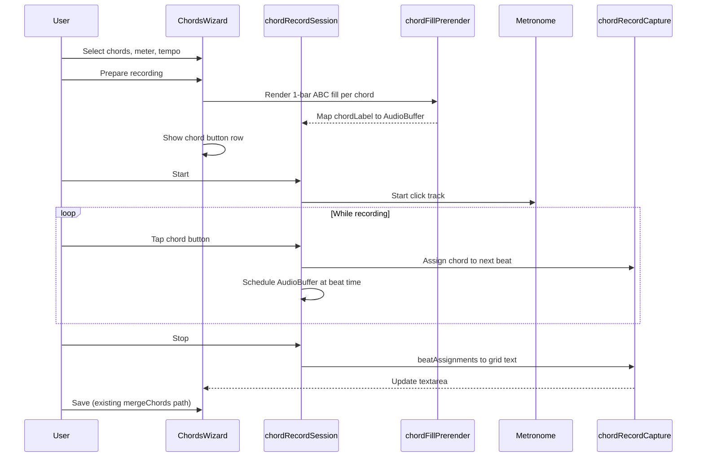

# Chord tap recording (iPad-style)

## Goal

Implement a recording mode in the **Chords editor tab** where the user:

1. Selects the chord symbols for a song + confirms time signature and tempo
2. Clicks **Prepare recording** → chord buttons appear across the top; one-bar block-chord piano fills are pre-rendered to `AudioBuffer`s
3. Clicks **Start** → metronome (with optional 1-bar count-in) begins
4. Taps chord buttons slightly **before** the downbeat where the chord should change → pre-rendered fill plays on that beat; assignment is captured
5. Clicks **Stop** → captured chords are converted to compressed grid text and placed in the existing [`ChordsWizard`](src/components/ChordsWizard.js) textarea for review/Save

## Architecture



## Reuse existing code

| Need | Existing asset |
|------|----------------|
| Chord symbol → note names | `chord-symbol` via `chordParserFactory()` ([`ChordCheatSheetModal.js`](src/components/ChordCheatSheetModal.js)) |
| Metronome click track | [`Metronome.js`](src/Metronome.js) + [`metronomeRhythmPresets.js`](src/metronomeRhythmPresets.js) |
| Soundfont offline render | Same pattern as [`useAbcSynth.js`](src/useAbcSynth.js) (`abcjs.synth.CreateSynth().init().prime()` → `audioBuffers`) |
| Grid text from beat assignments | Adapt [`formatDiscoveredChords`](src/chordDiscoveryFormatter.js) / [`buildVariableMeterBars`](src/timingGridUtils.js) |
| Persist to ABC | Existing `ChordsWizard` Save → `mergeChords` / `finalizeChordSheetToTune` |

No backend changes required; fills are rendered client-side.

## New modules

### 1. `src/chordFillPattern.js`

Generate a minimal one-bar ABC snippet per chord for **block chords on beats 1 and 3**:

- Input: `chordLabel`, `meter` (e.g. `4/4`), `tempo`, optional `key` from tune
- Parse chord with `chordParserFactory()` → `normalized.notes` → ABC pitch tokens (e.g. `[CEG]`)
- Output ABC like:

```abc
X:1
M:4/4
L:1/4
Q:1/4=120
K:C
[CEG]2 z [CEG]2 |
```

- Handle non-4/4 meters: place block chords on beat 1 and midpoint beat (e.g. beat 3 in 4/4, beat 2 in 3/4); odd meters get beat-1 only
- Export `buildChordFillAbc(chordLabel, options)` + unit tests

### 2. `src/chordFillPrerender.js`

Pre-render fills to playable audio:

- `primeChordFills(chordLabels, options)` → `Promise<Map<string, AudioBuffer>>`
- Shared `AudioContext`; for each chord: `abcjs.renderAbc` → `CreateSynth().init().prime()` → take first buffer (one bar)
- Cache in-memory for the session; key = `chord + meter + tempo + key`
- Show loading state in UI while priming ("Preparing piano fills…")

### 3. `src/chordRecordCapture.js`

Beat-quantized capture (no wall-clock drift):

- Session maintains synthetic `beatTimes[]` anchored to metronome start (`startTime + n * 60/tempo`)
- `assignChordOnNextBeat(pressedAtCtxTime, chordLabel)`:
  - Find smallest beat index `i` where `beatTimes[i] > pressedAtCtxTime + minLeadSec` (default ~50–100 ms; taps intentionally early still land on the upcoming downbeat)
  - Store `assignments[i] = chordLabel` (last tap wins for same beat)
- `assignmentsToChordGrid(assignments, meter, options)`:
  - Walk beats in bar groups; emit chord token on change, `.` for held chords
  - Reuse bar-line formatting from `formatDiscoveredChords` (5 bars per line default)
- Unit tests: early tap → next beat, repeated chord → dots, bar boundaries, 3/4 meter

### 4. `src/chordRecordSession.js`

Session state machine (hook-friendly, no React inside):

- States: `idle` → `preparing` → `ready` → `countIn` → `recording` → `stopped`
- Owns: `Metronome` instance, `AudioContext`, fill buffer map, beat clock, assignments
- `startRecording()`: 1-bar count-in (`maxBeats = beatsPerBar`), then continuous metronome; `onSlotChange` updates current beat index
- `onChordPress(label)`: capture + `scheduleFillPlayback(label, targetBeatTime)` via `AudioBufferSourceNode` on shared context
- `stopRecording()`: stop metronome, return grid text from capture module

### 5. `src/components/ChordRecordControls.js`

UI embedded in Chords tab:

**Setup row** (always visible when not recording):
- Chord palette: `CreatableSelect` multi-value (same lib as meter selector) — user adds `C`, `Am`, `G`, etc.
- Tempo: number input (default from `tune.tempo` or 120)
- Buttons: **Prepare recording** | **Cancel** (when ready)

**Recording row** (after prepare):
- Horizontal scrollable chord buttons (large touch targets)
- **Start** / **Stop**
- Live indicator: current bar & beat, last-assigned chord
- Status: "Tap the next chord before the beat"

**Styling**: small CSS block in [`App.css`](src/App.css) or new `ChordRecordControls.css` — sticky top bar, min 48px tap targets

## Integration in ChordsWizard

Extend [`ChordsWizard.js`](src/components/ChordsWizard.js):

- Import `ChordRecordControls` above the chord grid textarea
- On stop: `setChords(gridText)` so user sees result immediately
- Meter `CreatableSelect` remains the source of truth; disable prepare if meter unset (existing behavior)
- Recording does **not** auto-save; user still clicks **Save** (consistent with current chords tab behavior per [`helpContent.js`](src/helpContent.js))

Props passed: `tune`, `meter`, `key`, `tempo`, `onChordsCaptured(gridText)`

## Audio timing details

- **Single shared `AudioContext`** for metronome ticks and fill playback (avoids drift)
- Fill scheduled at exact `beatTimes[targetIndex]` using `source.start(when)`
- If user taps after the last scheduled beat, extend `beatTimes` dynamically (open-ended recording until Stop)
- Volume: reuse `getSoundFontVolumeMultiplier()`; add a session gain node (~0.7) so fills sit under click

## Edge cases

| Case | Behavior |
|------|----------|
| Tap before Start | Ignored |
| Same chord twice in a row | Second beat gets `.` in grid |
| No taps in a bar | Empty / hold previous |
| Prepare with 0 chords | Disable button |
| Prime failure (soundfont) | Show error; retry button |
| Mobile / suspended AudioContext | Resume on first user gesture (Start tap) — same pattern as `Metronome.start()` |

## Tests

- [`src/chordFillPattern.test.js`](src/chordFillPattern.test.js) — ABC output for major/minor/7th, 4/4 and 3/4
- [`src/chordRecordCapture.test.js`](src/chordRecordCapture.test.js) — beat assignment and grid formatting (pure functions, no Web Audio)

## Out of scope (follow-ups)

- Multiple fill styles (arpeggio, etc.) — architecture uses `patternId` in cache key for future extension
- Notation editor integration
- Server-side WAV generation
- Auto-save on stop

## Files to create / modify

**Create:**
- `src/chordFillPattern.js` + test
- `src/chordFillPrerender.js`
- `src/chordRecordCapture.js` + test
- `src/chordRecordSession.js`
- `src/components/ChordRecordControls.js`
- `src/components/ChordRecordControls.css` (optional)

**Modify:**
- [`src/components/ChordsWizard.js`](src/components/ChordsWizard.js) — mount controls, wire capture → textarea
- [`src/formFieldHelpText.js`](src/formFieldHelpText.js) — brief help blurb for chord recording (optional, 1 entry)
