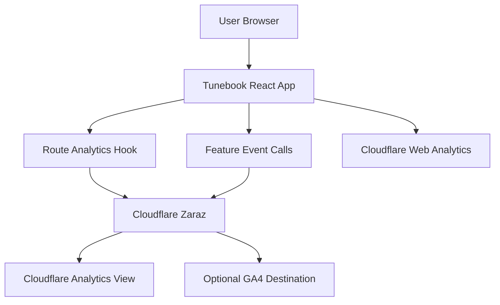

# Cloudflare Analytics Plan

## Recommendation

Use **Cloudflare Zaraz as the main tracking layer**, with optional **Cloudflare Web Analytics** enabled for basic traffic and Web Vitals.

Cloudflare Web Analytics is attractive because it is free, cookie-free, and lightweight. However, it has two important limits for this app:

- It does **not support custom events**, so it cannot answer questions like “did users click Books vs Tags vs Recent?”
- It does **not automatically track hash-based SPA routes**, and this app uses `HashRouter` in [src/App.js](src/App.js)

So the practical Cloudflare plan is:

- **Web Analytics**: total visits, referrers, country/device/browser, Core Web Vitals
- **Zaraz**: app routes, section clicks, feature usage events
- **No PII**: no tune titles, tune IDs, Google user emails, Google document IDs, media URLs, or search text



## Phase 1: Cloudflare setup

1. Put `tunebook.net` behind Cloudflare if it is not already proxied.
2. Enable **Cloudflare Web Analytics** for the site.
3. Enable **Cloudflare Zaraz** for the same zone.
4. Keep Zaraz destinations minimal at first. Start with Zaraz event collection only, then optionally forward events to GA4 later.
5. Document the Cloudflare token/site configuration in `.env.example`, without committing real tokens.

Files likely touched later:

- [public/index.html](public/index.html) or [src/index.js](src/index.js) for script/bootstrap decisions
- [.env.example](.env.example) for public analytics config names

## Phase 2: Add a small analytics wrapper

Create a dedicated analytics module so the rest of the app does not call `window.zaraz` directly.

Proposed file:

- [src/analytics.js](src/analytics.js)

Responsibilities:

- Check whether analytics is enabled via `REACT_APP_CLOUDFLARE_ANALYTICS_ENABLED`
- Check whether `window.zaraz.track` exists
- Normalize event names and properties
- Fail silently offline or when blocked by privacy extensions
- Strip unsafe values and only allow coarse event names

Example event shape:

```js
trackEvent('section_view', { section: 'books' })
trackEvent('feature_use', { feature: 'media_play' })
trackPageView('/tunes/:tuneId')
```

Important: route names should be generalized. For example, `/tunes/abc123` should become `/tunes/:tuneId` before sending.

## Phase 3: Manual route tracking for HashRouter

Because [src/App.js](src/App.js) uses `HashRouter`, do not rely on automatic Cloudflare SPA tracking.

Add a route analytics component or hook near the router tree in [src/App.js](src/App.js):

- Use `useLocation()`
- On route change, derive a coarse route pattern
- Send `page_view` or `route_view` through `analytics.js`

Suggested route groups:

- `/`, `/books`, `/tags`: books/home area
- `/tunes`: tune index
- `/tunes/:tuneId`: tune detail, without sending the ID
- `/editor/:tuneId`: editor, without sending the ID
- `/chords` and `/chords/:instrument`: chord lookup
- `/metronome`, `/tuner`, `/piano`: practice tools
- `/import`, `/importlink`: import flows
- `/print`, `/cheatsheet`, `/review`: study/print flows
- `/settings`, `/help`, `/privacy`: support/meta pages

## Phase 4: Track section usage

Start with the user’s main question: which sections are used?

Instrument [src/pages/BooksPage.js](src/pages/BooksPage.js), which already exposes section IDs via [src/recentTunes.js](src/recentTunes.js):

- `books-page-filters`
- `books-page-recent`
- `books-page-books`
- `books-page-tags`

Track button clicks first, because they are explicit and low-noise:

- `books_section_click` with `section: filters`
- `books_section_click` with `section: recent`
- `books_section_click` with `section: books`
- `books_section_click` with `section: tags`

Optional later: add `IntersectionObserver` to track actual section views, but only after the basic events are useful.

## Phase 5: Track feature usage

After route and section tracking works, add a small set of custom events. Keep this list short at first.

Recommended initial events:

- `abc_play`
- `media_play`
- `playlist_start`
- `editor_open`
- `editor_save`
- `import_open`
- `import_complete`
- `print_open`
- `chords_lookup`
- `pitch_tempo_open`
- `lyrics_transcription_start`
- `chord_discovery_start`

Likely files to inspect and instrument later:

- [src/components/MusicSingle.js](src/components/MusicSingle.js)
- [src/components/MediaPlayerButtons.js](src/components/MediaPlayerButtons.js)
- [src/components/MediaPlaybackRegionPanel.js](src/components/MediaPlaybackRegionPanel.js)
- [src/components/PitchTempoControlsPanel.js](src/components/PitchTempoControlsPanel.js)
- [src/components/LyricsTranscriptionControls.js](src/components/LyricsTranscriptionControls.js)
- [src/components/ChordsWizard.js](src/components/ChordsWizard.js)
- [src/pages/ChordsPage.js](src/pages/ChordsPage.js)

## Phase 6: Privacy policy update

Update [src/components/PrivacyContent.js](src/components/PrivacyContent.js) because it currently says there is no tracking and that the owner does not know how many people use the software.

New wording should say, in plain language:

- Anonymous aggregate analytics are collected through Cloudflare
- Analytics are used to understand usage and improve the app
- No tune content, tune titles, Google account details, document IDs, or media URLs are sent
- No analytics data is used to identify individual users

Also update [README.md](README.md), which currently says there are no tracking features when not logged in.

## Phase 7: Cloudflare dashboard configuration

In Zaraz, create triggers for the event names emitted by `analytics.js`.

Recommended event categories:

- `route_view`
- `books_section_click`
- `feature_use`
- `playback_start`
- `import_action`

If you want GA4 later, add GA4 as a Zaraz destination rather than putting the GA script directly in the app. This keeps third-party scripts managed at Cloudflare’s edge and lets the app keep one analytics API.

## Phase 8: Validation

Test locally with analytics disabled by default.

Then test a deployed preview or production build:

- Confirm Cloudflare Web Analytics receives page-level traffic
- Confirm Zaraz receives manual route events for hash routes
- Confirm section clicks appear for Filters, Recent, Books, Tags
- Confirm no event payload includes tune IDs, tune names, user emails, document IDs, or media URLs
- Confirm the app still works if `window.zaraz` is unavailable

## Suggested first implementation slice

For the first version, implement only:

- Cloudflare Web Analytics enabled in the dashboard
- [src/analytics.js](src/analytics.js)
- Route tracking from [src/App.js](src/App.js)
- Section click tracking in [src/pages/BooksPage.js](src/pages/BooksPage.js)
- Privacy wording in [src/components/PrivacyContent.js](src/components/PrivacyContent.js) and [README.md](README.md)

That should answer:

- How many people visit the tunebook?
- Which main routes are used?
- Are users clicking Filters, Recent, Books, or Tags?

Deeper feature tracking can be added after the first dashboard has real data.