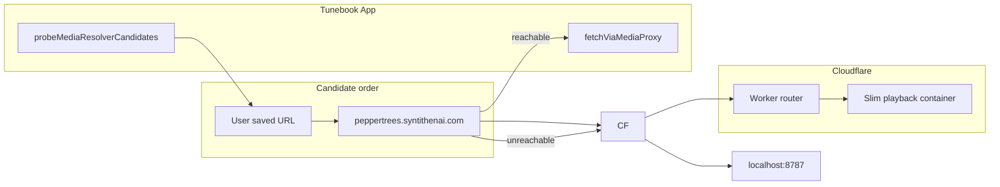

# Cloudflare Resolver Failover

## Context

The resolver ([`local-resolver/server.py`](local-resolver/server.py)) is a FastAPI app with two distinct capability tiers:

| Tier | Endpoints | Home-only? |
|------|-----------|------------|
| **Playback** | `/health`, `/youtube/:id/audio`, `/proxy-audio` | No — suitable for cloud |
| **Analysis** | `/transcribe`, `/detect-chords`, `/analyze-media`, `/midi2xml` | Yes — needs whisper.cpp GPU, autochord/TensorFlow, music21 (~2GB+ image) |

The frontend **already fails over** across resolver URLs via [`src/mediaProxyConfig.js`](src/mediaProxyConfig.js) and [`src/mediaProxyClient.js`](src/mediaProxyClient.js). Adding a Cloudflare URL to the candidate list is straightforward; the real work is deploying a viable cloud instance and handling YouTube's datacenter IP blocking.



## Recommended architecture

**Cloudflare Containers** (not Workers alone) — Workers cannot run subprocesses (`yt-dlp`, `ffmpeg`). Containers run a slim Docker image on Cloudflare's edge, fronted by a Worker that routes all HTTP to a single container instance.

**Scope: playback-only failover.** Analysis features remain on the home resolver. The cloud `/health` response will advertise `capabilities: ["playback"]` so the UI can disable transcribe/chord/melody buttons when on failover.

**Suggested hostname:** `resolver-fallback.syntithenai.com` (or a subdomain under `tunebook.net` if you prefer to keep DNS on Cloudflare there). Requires a CNAME from Namecheap DNS to the Cloudflare Worker route.

---

## Part 1 — Slim cloud resolver

### 1a. `RESOLVER_MODE` feature flag in server.py

Add env var `RESOLVER_MODE=full|playback` (default `full` for backward compatibility):

- **`playback` mode:** register only `/health`, `/youtube/:id/audio`, `/proxy-audio`; return `503` with a clear JSON body for analysis routes
- Extend `/health` response:

```json
{
  "ok": true,
  "requireAuth": true,
  "capabilities": ["playback"],
  "deployment": "cloudflare"
}
```

- Home resolver returns `"capabilities": ["playback", "transcribe", "chords", "melody", "midi"]`

### 1b. Slim Dockerfile

New file: [`local-resolver/Dockerfile.cloudflare`](local-resolver/Dockerfile.cloudflare)

Based on `python:3.11-slim` only — **no** whisper.cpp, autochord, TensorFlow, or music21:

- `ffmpeg`, `curl`, Deno, `yt-dlp[default]`
- `fastapi`, `uvicorn`, `httpx`, `python-multipart` (trimmed [`requirements.txt`](local-resolver/requirements.txt))
- `server.py` + `RESOLVER_MODE=playback`
- Target image size ~400–600 MB (vs multi-GB home image)

Instance type: **`standard-1`** (4 GiB RAM) — enough for yt-dlp + ffmpeg streaming.

### 1c. Cloudflare Worker + wrangler config

New directory: `local-resolver/cloudflare/`

```
local-resolver/cloudflare/
  wrangler.toml        # container + DO binding
  src/index.ts         # Worker: route all requests to container
  Dockerfile -> ../Dockerfile.cloudflare
```

Worker pattern (from [CF Containers docs](https://developers.cloudflare.com/containers/get-started/)):

```typescript
export class ResolverContainer extends Container {
  defaultPort = 8787;
  sleepAfter = "30m";  // keep warm during playback sessions
}
// fetch handler: env.RESOLVER.getByName("primary").fetch(request)
```

Secrets via `wrangler secret put`:

| Secret | Purpose |
|--------|---------|
| `GOOGLE_CLIENT_ID` | Auth (match root `.env`) |
| `ALLOWED_EMAILS` | Allowlist |
| `ALLOWED_ORIGINS` | `https://tunebook.net` |
| `REQUIRE_AUTH` | `true` |
| `YTDLP_COOKIES` | Netscape cookies (base64 or raw) |
| `YTDLP_PROXY` | Residential proxy URL (see Part 2) |

**Operational notes:**
- First deploy takes several minutes to provision containers; subsequent deploys are faster
- Cold starts after idle (`sleepAfter`) add ~10–30s latency — acceptable for failover
- Requires Cloudflare Workers Paid plan ($5/mo) + container usage

---

## Part 2 — YouTube mitigations (layered)

YouTube aggressively blocks datacenter egress IPs. Cloudflare's IPs are well-known and frequently blocked. No single fix is 100% reliable; implement layers:

### Layer 1 — Residential/mobile proxy (most effective)

Add `YTDLP_PROXY` env support in [`build_ytdlp_cmd()`](local-resolver/server.py) (~line 230):

```python
proxy = os.getenv("YTDLP_PROXY", "")
if proxy:
    cmd.extend(["--proxy", proxy])
```

Use a **residential or mobile proxy** provider (e.g. Bright Data, Oxylabs, IPRoyal). Cost ~$5–15/GB; audio-only streams are small (~3–5 MB/song). This is the only mitigation that reliably works from cloud IPs.

**Recommendation:** make this optional but document it as required for reliable YouTube on failover. Home resolver does not need it (residential ISP IP).

### Layer 2 — Cookies + PO tokens

Already supported via `YTDLP_COOKIES_PATH`. On Cloudflare, inject cookies from a secret at container startup (write to `/tmp/youtube-cookies.txt`).

Additionally, add yt-dlp extractor args for PO token support:

```python
cmd.extend(["--extractor-args", "youtube:player_client=web,default"])
```

And optionally integrate [bgutil-ytdlp-pot-provider](https://github.com/Brainicism/bgutil-ytdlp-pot-provider) if cookies alone fail — adds complexity but helps without a proxy in some cases.

### Layer 3 — Client-side graceful degradation

When active resolver's `/health` reports `capabilities` without analysis features:

- Keep **Listen / pitch-tempo playback** enabled (if YouTube resolves)
- Disable **Transcribe**, **Discover chords**, **Analyze media**, **MIDI import** buttons with tooltip: *"Analysis requires the home resolver — unavailable on cloud failover"*
- On YouTube 502 from cloud resolver, show actionable hint: *"YouTube playback blocked from cloud IP. Try again when home resolver is online, or configure a residential proxy."*

Files to touch:
- [`src/mediaProxyClient.js`](src/mediaProxyClient.js) — parse `capabilities` from health probe
- [`src/mediaResolverHealthStore.js`](src/mediaResolverHealthStore.js) — expose `capabilities` in state
- [`src/components/TuneMediaAnalysisButton.js`](src/components/TuneMediaAnalysisButton.js), lyrics/chord clients — gate on capabilities

### Layer 4 — Honest expectations in docs

Document in [`local-resolver/README.md`](local-resolver/README.md) cloudflare section:

- YouTube on cloud failover is **best-effort** without a residential proxy
- Non-YouTube `/proxy-audio` (direct HTTPS URLs) works reliably from Cloudflare
- Analysis always requires home resolver

---

## Part 3 — Frontend failover wiring

### 3a. Add cloud fallback URL to candidate list

In [`src/mediaProxyConfig.js`](src/mediaProxyConfig.js):

```javascript
export const DEFAULT_CLOUDFLARE_FALLBACK = 'https://resolver-fallback.syntithenai.com'

export function getMediaProxyBaseCandidates() {
  // order: saved → home DDNS → CF fallback → localhost → env
}
```

Also add `REACT_APP_MEDIA_PROXY_FALLBACK` to [`.env.example`](.env.example) for override at build time.

### 3b. Per-request failover (already works)

[`fetchViaMediaProxy()`](src/mediaProxyClient.js) already retries the next candidate on network failure. Ensure YouTube 502 from cloud does **not** trigger failover to localhost (user's machine won't have resolver) — only retry on connection errors, not application-level YouTube blocks. Current behavior is correct (502 throws unless 401/403/404).

### 3c. Settings UI

Update [`src/pages/SettingsPage.js`](src/pages/SettingsPage.js) to show the new fallback in the candidate list and display capabilities per candidate (e.g. *"playback only"*).

### 3c. Tests

Extend [`src/mediaProxyConfig.test.js`](src/mediaProxyConfig.test.js) for new candidate ordering.

---

## Part 4 — DNS and deployment checklist

1. Create Cloudflare Worker project in `local-resolver/cloudflare/`
2. `wrangler secret put` all env vars
3. `wrangler deploy` (Docker must be running locally)
4. In Namecheap DNS for `syntithenai.com`: add CNAME `resolver-fallback` → `<worker>.workers.dev` (or custom domain via wrangler)
5. Add `resolver-fallback.syntithenai.com` to `ALLOWED_ORIGINS` on both home and cloud resolvers
6. Verify:

```bash
curl -s https://resolver-fallback.syntithenai.com/health
curl -I "https://resolver-fallback.syntithenai.com/youtube/dQw4w9WgXcQ/audio"
```

7. Simulate failover: stop home resolver, open tunebook.net Settings → confirm cloud candidate becomes active

---

## What we are NOT doing

- **Full resolver on Cloudflare** — whisper/autochord/midi are impractical (no GPU, huge image, slow CPU transcription)
- **Cloudflare Tunnel to home** — that requires home to be up; not true failover
- **Workers-only yt-dlp** — impossible (no subprocess support)

## Cost estimate

| Item | Cost |
|------|------|
| Cloudflare Workers Paid | $5/mo base |
| Container usage | ~$0.01–0.05/hr active (scales to zero when idle) |
| Residential proxy (optional) | ~$5–15/GB pay-as-you-go |

## Risk summary

| Risk | Mitigation |
|------|------------|
| YouTube blocks CF IPs | Residential proxy + cookies; UI degradation |
| Cold start latency | `sleepAfter=30m`; acceptable for failover |
| Stale DDNS points to wrong host | Health probe fails → CF takes over |
| Cookie expiry on cloud | Periodic re-export; document in README |
