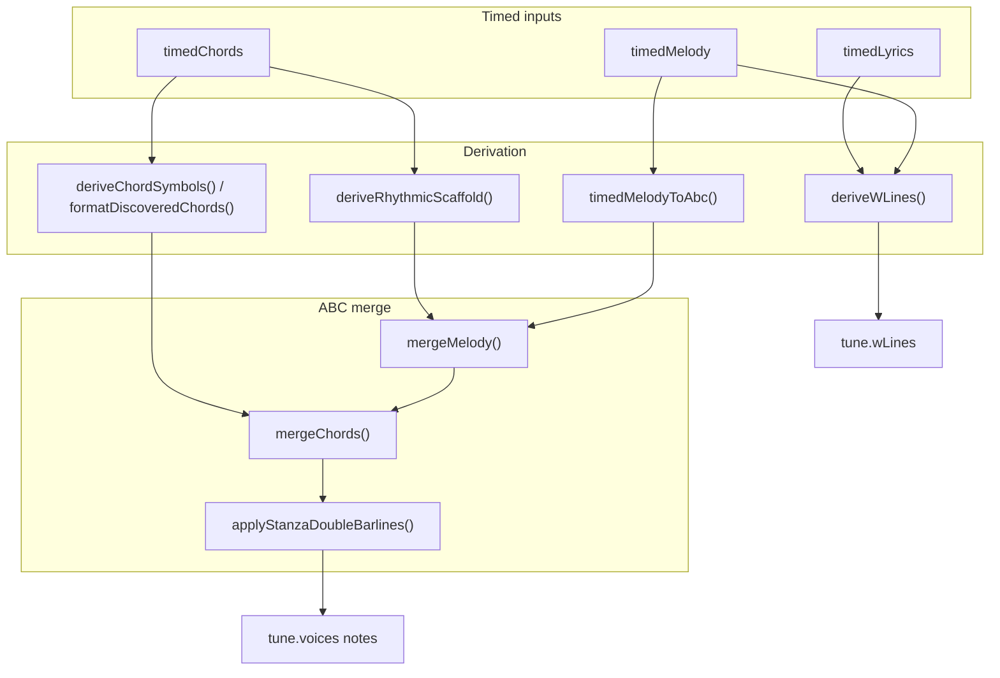
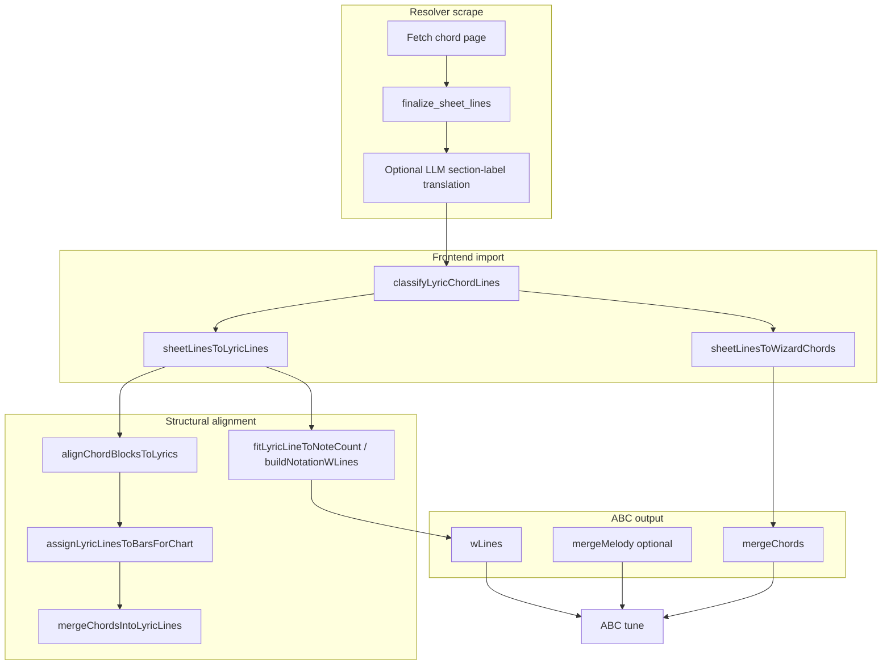
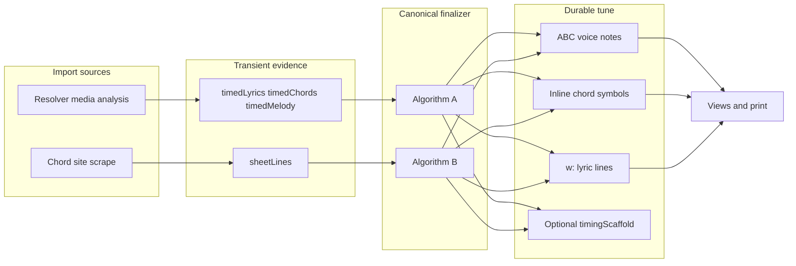

# Collapse Timed Alignment Plan

## Goal

Timed lyrics/chords should become **import-time evidence**, not a long-lived source of truth. The durable tune should carry timing in standard ABC structures: melody/bar timing in the primary voice, inline chord symbols, `w:` lyric lines, stanza/section boundaries, and a small scaffold marker only when no real melody exists.

This plan **supersedes** the persistence-first approach in the older [Timed Lyrics Chords plan](timed_lyrics_chords_0bfd79b5.plan.md), which stored `% abcbook-json timedLyrics/timedChords` as canonical. The collapse direction: extract maximum alignment into ABC/`wLines`, then discard storage-heavy timed JSON for new saves.

## Current Findings

- [`src/components/TimedLyricsChordsView.js`](src/components/TimedLyricsChordsView.js) prefers `tune.timedLyrics` in `buildLinesFromTune()`, so edited `wLines`/`words` can be hidden by stale timed lyric text.
- [`src/mediaImportWizardFinish.js`](src/mediaImportWizardFinish.js) already derives `wLines`, merges chord grids into ABC, applies stanza double barlines, and deletes `timedMelody`, but then persists minimized `timedLyrics` and `timedChords` again.
- [`src/timedAbcDeriver.js`](src/timedAbcDeriver.js) already has most primitives: `deriveWLines()`, `deriveChordSymbols()`, `deriveRhythmicScaffold()`, and `applyRhythmicScaffoldToAbc()`.
- [`src/abcbookJsonFields.js`](src/abcbookJsonFields.js) and [`src/useAbcTools.js`](src/useAbcTools.js) serialize timed JSON into `% abcbook-json timedLyrics/timedChords`, which is the storage-heavy path to retire for new saves.
- Chord-site imports ([`local-resolver/chords_fetch.py`](local-resolver/chords_fetch.py), [`src/chordSheetImportUtils.js`](src/chordSheetImportUtils.js)) produce structural bar/line alignment but do not yet auto-merge into ABC on import (Algorithm B8 gap).

---

## Algorithm A: Timed lyrics/chords/melody → ABC (wall-clock timing)

**Primary code:** [`src/timedAbcDeriver.js`](src/timedAbcDeriver.js), [`src/chordDiscoveryFormatter.js`](src/chordDiscoveryFormatter.js), [`src/melodyFormatter.js`](src/melodyFormatter.js), [`src/useAbcjsParser.js`](src/useAbcjsParser.js), [`src/mediaImportWizardFinish.js`](src/mediaImportWizardFinish.js)

**Inputs (from resolver analysis):**
- `timedLyrics`: `{ lines[], sections[] }` where each line has `start`, `end`, and optional per-word `{ text, start, end }`
- `timedChords`: `{ segments[], beatTimes[], meterChanges[], meter, tempo }` where segments are `{ label, start, end }`
- `timedMelody`: `{ notes[], beatTimes[], meterChanges[], key, meter, noteLength }` where notes are `{ midi, start, end }`

**Outputs (durable ABC tune fields):**
- Primary voice `notes[]` (real melody or rhythmic scaffold)
- Inline chord symbols attached to note/rest slots
- `wLines[]` with ABC note-spacing markers (spaces, hyphens, `~`, `*`)
- Section/stanza barlines (`||` at section ends via `applyStanzaDoubleBarlines`)

### A1. Beat grid and bars (shared foundation)

Used by melody, chords, and scaffold.

1. **`buildVariableMeterBars(beatTimes, meterChanges, beatsPerBar)`** ([`src/timingGridUtils.js`](src/timingGridUtils.js))
   - Walk every detected beat timestamp in order.
   - Start a new bar when: (a) current bar is full (`beatsPerBar`), or (b) a meter change occurs at/after this beat.
   - Each bar stores: `start`, `end`, `meter`, `beatsPerBar`, ordered `beats[]` with global beat indices.

2. **Slots per beat** (default 2, derived from tune `noteLength` + meter via `getDerivationGridOptions()`)
   - One ABC note/rest slot per `(beat × slotsPerBeat)` subdivision.
   - Melody formatter may pick 2/3/4 slots per beat per beat based on note onset density (`chooseSlotsPerBeat` in [`src/melodyFormatter.js`](src/melodyFormatter.js)).

### A2. Melody notes from `timedMelody` (`timedMelodyToAbc` → `formatMelodyNotes`)

1. For each detected note `{ start, end, midi }`:
   - Find beat index containing `start`.
   - Choose `slotsPerBeat` for that beat.
   - Compute slot index within beat from offset / slot duration.
   - Quantize duration to ABC length markers (`2`, `3`, `4`, …) relative to slot size.
   - Spell pitch with `midiToAbcPitch` (respecting key).
2. Emit bar-delimited ABC note text; insert `[M:…]` prefixes when meter changes (`prefixMeterChange`).
3. Empty slots become rests or are skipped according to formatter rules.

**Timing preserved as:** note onset/duration aligned to detected beat grid, not free-form seconds in ABC.

### A3. Chord symbols from `timedChords` (`deriveChordSymbols` → `formatDiscoveredChords`)

1. Build the same variable-meter bar list from `beatTimes` + `meterChanges`.
2. Initialize each bar's slots to `"."` (hold previous chord).
3. For each beat in each bar:
   - Probe time = beat midpoint (between this beat and next beat).
   - **`getChordAtTime(segments, probeTime)`** → normalized label (e.g. `C:maj` → `C`, `A:min` → `Am`).
   - If label differs from previous chord, write it at this beat's first slot; otherwise leave `"."`.
4. Join slots with spaces, append `|`, break lines every `barsPerLine` (default 5).

**Timing preserved as:** chord changes locked to beat/subdivision positions.

### A4. Lyric `w:` lines from `timedLyrics` + `timedMelody` (`deriveWLines`)

Per lyric line, per word:

1. Compute word midpoint: `(word.start + word.end) / 2`.
2. Build melody timeline from `timedMelody.notes` (each note's midpoint).
3. **`findNearestNoteIndex(timeline, midpoint)`** — pick note whose midpoint is closest in time.
4. Emit ABC `w:` spacing:
   - If `nearest > noteCursor`, insert `(nearest - noteCursor)` spaces before this word (each space = one skipped note slot in ABC lyric alignment).
   - Append word text; set `noteCursor = nearest + 1`.
5. Prefix line with `w: ` and collapse runs of spaces.

**Timing preserved as:** syllable-to-note-slot mapping via space count in `w:` lines (ABC standard mechanism).

**Fallback when no melody:** store plain stanza-preserving lyric lines only; do not invent note spacing.

### A5. Rhythmic scaffold when chords exist but melody does not (`deriveRhythmicScaffold`)

1. Same bar structure as A1.
2. Fill every slot with `z` (rest) instead of pitch.
3. Used as the note backbone for `mergeChords` when there is beat timing but no detected melody.

### A6. Merge into tune ABC (canonical finalizer)

Current finish path ([`src/mediaImportWizardFinish.js`](src/mediaImportWizardFinish.js)):

1. **`mergeMelody(melodyText, baseAbc)`** — replace primary voice notes; reattach existing inline chords in note order ([`src/useAbcjsParser.js`](src/useAbcjsParser.js)).
2. **`mergeChords(chordGridText, mergedAbc)`** — parse chord grid into bar/slot layout; map chord names onto parsed note symbols by `(line, bar, beat-slot)` index; create rest-only staff lines if grid is longer than melody.
3. **`applyStanzaDoubleBarlines(noteLines, sections)`** — at each section's last lyric line, upgrade trailing `|` to `||`.
4. Prefer **`deriveWLines`** output over raw merged lyric text when both `timedLyrics` and `timedMelody` exist.

**Gap (plan work):** finish still re-persists minimized `timedLyrics`/`timedChords`; finalizer must stop that and clear timed fields after conversion.

### A7. Display-only timed fallback (`alignChordsToLyricLines`)

Used by [`TimedLyricsChordsView`](src/components/TimedLyricsChordsView.js) for legacy tunes only:

- For each lyric line, probe time = `line.start`.
- **`chordAtTime(timedChords, probe)`** → one chord label above the whole line.
- Coarse (line-level) alignment; not the durable representation.
- **Fix:** lyric text must come from `getLyricLinesForDisplay(tune)`, not `timedLyrics.lines[].text`.

---

## Algorithm B: Chord-site text → ABC (structural timing, no wall-clock)

**Primary code:** [`local-resolver/chords_fetch.py`](local-resolver/chords_fetch.py), [`src/chordSheetImportUtils.js`](src/chordSheetImportUtils.js), [`src/chordSheetUtils.js`](src/chordSheetUtils.js), [`src/lyricBarAlignmentUtils.js`](src/lyricBarAlignmentUtils.js), [`src/noteSpacingUtils.js`](src/noteSpacingUtils.js)

**Important distinction:** Scraped chord sheets (AZChords, e-chords, CifraClub) carry **no absolute timestamps**. Timing is inferred from **bar grid + melody structure + heuristics**.

### B1. Scrape → normalized `sheetLines` ([`local-resolver/chords_fetch.py`](local-resolver/chords_fetch.py))

1. **Discovery:** direct slug URLs (e-chords, CifraClub), then Brave API, with **usable-chord validation** (`has_usable_chord_lines`) so tab-only pages fall through.
2. **Site extractors:** pull `<pre>` / chord-span HTML; strip tab lines, ads, chord dictionaries (AZChords preamble).
3. **`finalize_sheet_lines(raw_lines)`** per line:
   - Drop noise (capo, tuning, tab `E|-3-5-|`, beat-count lines, fret diagrams).
   - Section headers (`[Verse]`, `# Chorus`) pass through.
   - **Mixed lines:** split into separate chord line + lyric line via `token_is_chord` / `CHORD_TOKEN_RE`.
   - Collapse consecutive duplicate chords later at bar level, not here.
4. **CifraClub only:** optional LLM translation of Portuguese/Spanish section labels (`translate_cifraclub_section_labels`) using `RESEARCH_LLM_*` credentials.

**Output:** ordered `sheetLines[]` alternating headers, blanks, chord rows, lyric rows.

### B2. `sheetLines` → editor formats ([`src/chordSheetImportUtils.js`](src/chordSheetImportUtils.js))

1. **`classifyLyricChordLines`** — each line → `{ type: header|chord|lyric|blank }` using `chord-symbol` parser (all tokens must parse as chords for a chord line).
2. **`sheetLinesToWizardChords`** — keep chord lines only; append `|` bar marker; preserve blank-line section breaks.
3. **`sheetLinesToLyricLines`** — keep headers, lyrics, blanks; drop standalone chord lines.

These populate Chords Wizard text + `tune.wLines` today via Search Chords UI; they do **not** yet auto-merge into ABC on import.

### B3. Chord chart bar grid (`extractChordBars`)

From wizard/rendered chart text (bars delimited by `|`):

1. Flatten visual newlines (melody may wrap 4 bars per ABC line; lyrics may use 2 bars per line).
2. Each bar → array of chord tokens starting in that bar; **empty bar = hold previous chord**.
3. **`extractChordSequence`** (display) collapses consecutive duplicate chords across the whole chart.

### B4. Lyric block ↔ melody/chord block alignment (`alignChordBlocksToLyrics`)

1. Split lyrics into blocks on blank lines; peel optional `[Section]` header per block.
2. Split melody chord chart into blocks on double newlines (from `renderChords` / double barlines).
3. Mapping rules:
   - **Section headers present:** map first occurrence of each section type (verse/chorus/bridge) to chord blocks in order.
   - **One chord block, many lyric blocks (hymn):** reuse same chart for every verse.
   - **One lyric block, many chord blocks (instrumental strains):** concatenate all chord blocks and distribute bars across all lyric lines.
   - **Positional fallback:** block index ↔ chord block index.
4. Orphan chord blocks attach to last compatible lyric block.

### B5. Bars ↔ lyric lines (`assignLyricLinesToBarsForChart`)

Given `N` singable lyric lines and `B` chord bars:

1. Compute **`chordChangeBarIndices`** — bar indices where the sounding chord changes.
2. **`detectBarsPerLyricLine(lineCount, barCount, changeBars)`** — score candidate ratios `{0.25, 0.5, 1, 2, 4, 8}` bars per line by how well chord changes align with assigned line start bars; prefer ratios near `barCount/lineCount`.
3. **`assignLyricLinesToBars`** — line `i` covers bar range `[floor(i×ratio), floor((i+1)×ratio)-1]`.

**Timing preserved as:** each lyric line owns a contiguous slice of the bar timeline.

### B6. Chord-over-word placement (`mergeChordsIntoLyricLines`)

For each lyric line after bar assignment:

1. Collect bars belonging to this line.
2. For each bar index `b` within the line, target word index = `round(b × wordCount / barCount)`.
3. Chord display rules:
   - **First bar of line:** always show sounding chord (explicit change or held `runningChord`).
   - **Later bars:** show only when chord differs from `runningChord`.
4. Emit ChordPro tokens `{ chord, text }` per word.

Used for inline display in [`TimedLyricsChordsView`](src/components/TimedLyricsChordsView.js); same bar logic should feed ABC merge.

### B7. Syllable ↔ note slot fit (`noteSpacingUtils`) — ABC `w:` timing without wall-clock

When a melody ABC already exists:

1. **`lyricAssignmentsForMelody(noteLines, lyricLines, chordBlocks)`** — global bar ranges per lyric line (combines B4+B5 across melody strains).
2. For each ABC notation line, sum note/rest slots via **`countLyricSlotsInNoteLine`** (abcjs parse).
3. **`fitLyricLineToNoteCount(line, noteCount)`**:
   - If word count == note count → keep line as-is.
   - Else build syllable units (vowel-split heuristics), merge/split to match target count, add `-` hyphens / `~` melisma / `*` skipped-note fillers.
4. **`buildNotationWLines(tune)`** — one spaced lyric line per staff line for rendering.

**Timing preserved as:** syllable aligned to note/rest slots on the existing melody grid.

### B8. Website → ABC merge (planned finalizer integration)

To fully close the loop (not yet automatic on chord search finish):

1. Take wizard chord text → treat as chord grid input to **`mergeChords`**.
2. If melody exists (from prior media import or manual ABC): **`mergeMelody`** + **`mergeChords`** + **`buildNotationWLines`**.
3. If no melody but meter/tempo known: generate **`deriveRhythmicScaffold`** from beat grid + **`mergeChords`**.
4. If neither: store chord sheet in `wLines` + wizard chords only (current behavior); no invented timing.

---

## Implementation Approach

1. **Fix stale lyrics-with-chords display**
   - [`TimedLyricsChordsView`](src/components/TimedLyricsChordsView.js): lyric text from `getLyricLinesForDisplay(tune)`; timed JSON only for legacy chord hints.
   - [`PrintPage`](src/pages/PrintPage.js): same rule — do not switch to timed rendering just because `tune.timedLyrics` exists.

2. **Add canonical finalizer** (new `timedImportFinalizer.js` or extend finish module)
   - Implements Algorithm A end-to-end.
   - Adds Algorithm B path when source is scraped `sheetLines` + optional existing melody.
   - Outputs: notes, inline chords, `wLines`, optional `timingScaffold` flag; clears timed fields.

3. **Wire finalizer into import + chord search finish**
   - [`mediaImportWizardFinish.js`](src/mediaImportWizardFinish.js): replace minimal timed re-export.
   - Chords Search button path: after `sheetLines` import, run B8 when melody/scaffold available.
   - Keep `timedMediaCache` as temporary heavy-data workspace during wizard; clear on finish.

4. **Retire timed JSON for new saves**
   - [`abcbookJsonFields.js`](src/abcbookJsonFields.js), [`useAbcTools.js`](src/useAbcTools.js): stop writing `% abcbook-json timedLyrics/timedChords` by default; keep import for old books.
   - Optionally add migration action: convert old timed fields through finalizer, then remove them.

5. **Regression tests**
   - Algorithm A: `deriveWLines`, `formatDiscoveredChords`, finalizer output, timed field clearing.
   - Algorithm B: bar assignment, `mergeChordsIntoLyricLines`, `fitLyricLineToNoteCount`, chord-search → ABC when melody present.
   - Stale display: edited `wLines` wins over legacy `timedLyrics`.
   - Update [`src/timedModels.test.js`](src/timedModels.test.js) to assert new saves prefer `wLines`/ABC and omit timed JSON by default.

## End-to-End Data Flow

## Acceptance Checks

- Editing lyrics in the title/lyrics editor immediately updates lyrics-with-chords mode even if legacy `timedLyrics` exists.
- Media import preserves beat/note/chord/lyric alignment in ABC + `wLines`, then drops persisted timed JSON.
- Chord-site import produces inline ABC chords and spaced `w:` lines when a melody or beat scaffold exists; otherwise stores structural chord sheet without fake timestamps.
- New saves omit `% abcbook-json timedLyrics/timedChords` unless explicit legacy/debug export.
- Old timed JSON books still load and can migrate through the same finalizer.

## Risks

- **No melody:** word-to-note `w:` alignment cannot be truly preserved; best durable output is stanza-preserving `wLines` plus chord symbols on beat grid/scaffold.
- **Chord merge fragility:** `mergeChords` has known line-index bugs; finalizer should reuse existing merge paths and add regression tests before relying on them for one-shot conversion.
- **Chord-site timing is heuristic:** Algorithm B preserves bar/line structure, not wall-clock seconds; do not conflate with Algorithm A output.
