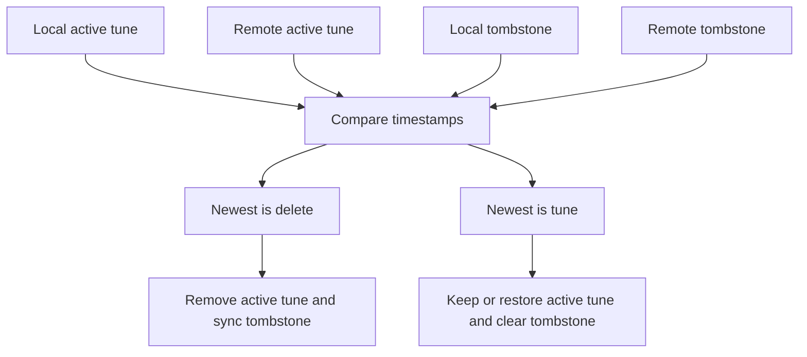

# Delete Sync Plan

## Current Shape
- Local tune data lives in IndexedDB/localforage under `bookstorage_tunes` via [`src/useAppData.js`](/home/stever/projects/abc2book/src/useAppData.js).
- Google persistence writes the whole tune book as ABC into a Drive document named `ABC Tune Book` via [`src/useGoogleSheet.js`](/home/stever/projects/abc2book/src/useGoogleSheet.js) and [`src/useGoogleDocument.js`](/home/stever/projects/abc2book/src/useGoogleDocument.js).
- Merge compares remote ABC tunes against local tunes in [`src/App.js`](/home/stever/projects/abc2book/src/App.js). Missing remote ids land in `localInserts` (not `deletes`, which is always empty), and `applyMergeChanges` re-uploads them via `updateSheet(0)` — that is the resurrection path.
- A second, similar merge/import path exists in [`src/useTuneBook.js`](/home/stever/projects/abc2book/src/useTuneBook.js) for file imports; keep the two paths aligned or extract shared helpers to avoid drift.
- Delete operations in [`src/useTuneBook.js`](/home/stever/projects/abc2book/src/useTuneBook.js) physically remove tunes from local state and save the ABC document, losing the information that the absence was intentional.

## Proposed Design
Add a synced delete ledger keyed by tune id. A deletion records `{ id, deletedAt, name? }` locally and serializes into the Drive ABC document as lightweight metadata. Normal tune lists continue to exclude deleted tunes.

Use ABC comment metadata because the Drive document is already the source of truth:

```text
% abcbook-deleted-tune <tuneId> <deletedAt> <optional name>
```

This keeps the format backward compatible: older app versions ignore the line, while newer versions can parse it before merge.

## Implementation Cautions
- Do **not** simply drop all `localInserts` during merge — that bucket mixes genuinely new offline tunes with remotely-deleted tunes. Tombstones are what disambiguate them.
- Respect `pauseSheetUpdates` timing so a device does not merge its own upload echo and accidentally strip tombstones.
- `deleteTunes` in [`src/useTuneBook.js`](/home/stever/projects/abc2book/src/useTuneBook.js) currently skips `indexes.removeTune`; fix that while touching delete paths.
- [`src/useSyncWorker.js`](/home/stever/projects/abc2book/src/useSyncWorker.js) already models per-file `deleted` + `gDelete` for attachments; use as a pattern reference, but tune sync stays in the ABC document path.

## Implementation Steps
- Extend [`src/useAbcTools.js`](/home/stever/projects/abc2book/src/useAbcTools.js) with helpers to render and parse delete ledger lines, and update `tunesToAbc()` so the cloud document includes both active tunes and tombstones.
- Add app-level `deletedTunes` state in [`src/useAppData.js`](/home/stever/projects/abc2book/src/useAppData.js), persisted in localforage under a new key such as `bookstorage_deleted_tunes`.
- Update delete entry points in [`src/useTuneBook.js`](/home/stever/projects/abc2book/src/useTuneBook.js): `deleteTune`, `deleteTunes`, `deleteAll`, and final-delete branches of `deleteTuneBook` should record tombstones before removing active tunes.
- Update `updateSheet()` in [`src/useGoogleSheet.js`](/home/stever/projects/abc2book/src/useGoogleSheet.js) to load and serialize `bookstorage_deleted_tunes` along with active tunes.
- Rewrite merge comparison in [`src/App.js`](/home/stever/projects/abc2book/src/App.js):
  - Parse remote active tunes and remote tombstones.
  - If a remote tombstone is newer than the local tune `lastUpdated`, delete the local tune.
  - If a local tombstone is newer than the remote tune `lastUpdated`, keep the tune deleted and upload the tombstone.
  - If a remote tune is newer than a local tombstone, treat it as a restore/update and clear the tombstone.
  - Preserve the existing update/local-update warning path for true edit conflicts.
  - Populate a real `deletes` bucket with tunes that **will be removed locally on merge** (remote tombstone wins). Keep `localInserts` for genuinely new local-only tunes only.
- Extend [`src/useTuneBook.js`](/home/stever/projects/abc2book/src/useTuneBook.js) `importAbc` / `applyImportData` with the same tombstone-aware classification so file imports can also surface pending deletes.
- Update warning UIs (see **Warning UI** section below).
- Update the help text that currently documents the delete limitation to describe automatic delete sync and restore behavior.
- Add focused tests around merge classification and serialization, preferably by extracting pure merge helpers from [`src/App.js`](/home/stever/projects/abc2book/src/App.js) into a small module so timestamp rules can be tested without rendering the app.

## Warning UI

Both dialogs must show tunes slated for deletion in a dedicated **Deleted** tab, with a short summary above the action buttons explaining what merge/import will do.

### Merge dialog — [`src/components/MergeWarningDialog.js`](/home/stever/projects/abc2book/src/components/MergeWarningDialog.js)

Current state: the `deletes` tab is mislabeled **"New tunes"** and the bucket is never populated; `localInserts` (local-only tunes) are not shown in tabs at all.

After the fix:

| Bucket | Tab label | Summary copy (example) |
|--------|-----------|------------------------|
| `inserts` | Inserted | "N items will be added from Google Drive." |
| `updates` | Updated | "N items will be updated from Google Drive." |
| `localUpdates` | Local Updates | "N locally changed items will be saved to Google Drive." |
| `localInserts` | New tunes | "N items exist only on this device and will be uploaded." |
| `deletes` | **Deleted** | "N items were deleted on another device and will be removed from this device when you merge." |

- Show the **Deleted** tab only when `deletes` is non-empty.
- Rename the old mislabeled tab: local-only uploads move to **New tunes** (`localInserts`), not **Deleted**.
- Summary paragraph at top should list all non-zero buckets, including deletes, so the user sees the delete count before opening the tab.
- **Discard Local Differences** should remain the escape hatch when the user does not want remote deletes applied.

### Import dialog — [`src/components/ImportWarningDialog.js`](/home/stever/projects/abc2book/src/components/ImportWarningDialog.js)

Currently has no deletes tab. Add the same pattern:

- Populate `importResults.deletes` when importing ABC that contains tombstones newer than local `lastUpdated`.
- Add a **Deleted** tab (same list style as other tabs, with tune name).
- Summary line: "N items will be removed because they were deleted in the imported file."
- Show the tab only when non-empty; include delete count in the top summary before the Import button.

### Shared behaviour

- Each deleted entry should show at least the tune name (from tombstone or last-known local copy).
- `showWarning()` / `showImportWarning()` in [`src/App.js`](/home/stever/projects/abc2book/src/App.js) and [`src/useTuneBook.js`](/home/stever/projects/abc2book/src/useTuneBook.js) must treat a non-empty `deletes` bucket as a reason to show the warning dialog (already partially wired for merge; extend import path).

## Conflict Rules


## Verification
- Unit-test ABC tombstone parse/render round trips.
- Unit-test merge cases: local delete vs stale remote tune, remote delete vs local active tune, edit newer than delete, delete newer than edit, delete all.
- Unit-test that `deletes` bucket population drives warning visibility and tab rendering.
- Manually test two-device flow in development with a small tune book: delete on device A, wait for poll on device B, confirm merge warning shows **Deleted** tab with correct count and copy, merge, confirm tune disappears and does not re-upload.