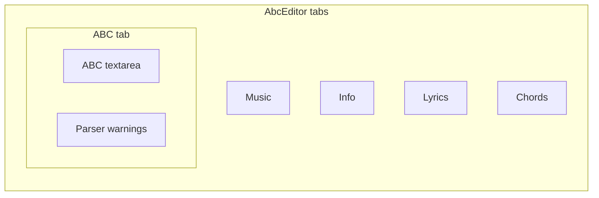
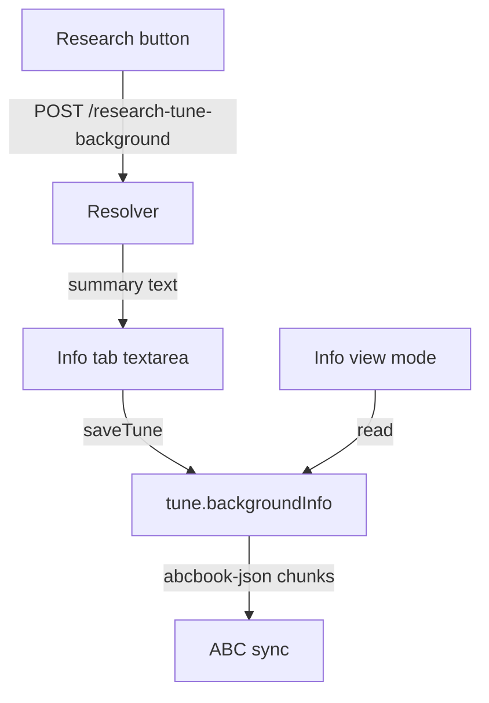

# Editor tidy-up, tune background info, and research resolver

## 1. Editor tab reorganization

**File:** [`src/components/AbcEditor.js`](src/components/AbcEditor.js)

- Remove the top-level `Help` tab (lines 427–437).
- Remove the top-level `Errors` tab (lines 416–423).
- Replace the flat `ABC` tab with nested `Tabs`:
  - **ABC** (default) — existing raw ABC `<textarea>`
  - **Errors** — move current warnings list here; keep dynamic title badge (`count !!`) on the sub-tab
- Fix duplicate tab `id="uncontrolled-tab-example"` by giving the editor tabs a unique id (e.g. `abc-editor-tabs`).

**File:** [`src/pages/HelpPage.js`](src/pages/HelpPage.js)

- Add a new **ABC Notation** tab (or fold into the existing **Editing** tab) containing the content currently in the editor Help tab:
  - ABC intro blurb, example `a2bc a/4bc' | c,d,e, cde ||`
  - Links to the [lesession tutorial](http://www.lesession.co.uk/abc/abc_notation.htm) and [ABC reference](http://abc.sourceforge.net/standard/abc2-draft.html)
- Update the **Editing** tab to mention that the pencil editor has Music / Info / Lyrics / Chords / ABC (with Errors nested under ABC).
- Add a Features bullet for tune background research / Info view mode (new feature).

The `/help` route, Header, and Footer links stay as-is (per your choice).



---

## 2. Tune background info field

### Data model and persistence

Add `tune.backgroundInfo` (plain string, multiline).

**Files:** [`src/useAbcTools.js`](src/useAbcTools.js), [`src/abcbookJsonFields.js`](src/abcbookJsonFields.js), [`src/useTuneBook.js`](src/useTuneBook.js)

- Default `backgroundInfo: ''` in the `abc2json` seed object and `createTune`.
- Persist via existing chunked `% abcbook-json` mechanism (already handles long strings):
  - Extend `renderTimedJsonFields` (or add `renderExtraAbcbookJsonFields`) to emit `backgroundInfo` when non-empty.
  - Parsing already works: `applyAbcbookJsonChunks` assigns any field name onto the tune object dynamically.

### Editor UI (Info tab)

**File:** [`src/components/AbcEditor.js`](src/components/AbcEditor.js)

Add a `Form.Group` at the bottom of the Info tab:

- Label: **Background information**
- Large `<textarea>` (~15–20 rows), debounced save (same pattern as lyrics `wLines` — 500ms timeout)
- Placeholder describing the intended sections (performers, alt names, dates, popularity, labels, anecdotes, musical structure, YouTube links)
- [`TuneBackgroundSearchButton`](src/components/TuneBackgroundSearchButton.js) above the textarea (resolver-gated, see below)

### Info view mode (single tune page)

**Files:** [`src/viewModeUtils.js`](src/viewModeUtils.js), [`src/components/ViewModeSelectorModal.js`](src/components/ViewModeSelectorModal.js), [`src/components/MusicSingle.js`](src/components/MusicSingle.js)

- Add `{ id: 'info', label: 'Info' }` to `VIEW_MODES`.
- Update `normalizeViewMode` to accept `'info'`.
- `showsMusicNotation('info')` → false (no ABC staff).
- In `MusicSingle.js`, when `viewMode === 'info'`:
  - Show tune title + artist header (consistent with chord views)
  - Render `tune.backgroundInfo` in a readable block (`white-space: pre-wrap`, modest padding)
  - Linkify `http(s)://` URLs and YouTube URLs inline
  - Empty state: “No background information yet — use the editor Info tab to add some.”
- Persist `viewMode` on change (already handled).



---

## 3. Resolver: web research + LLM summarization

This is a **new capability** — the resolver currently has no LLM integration ([`lyrics_fetch.py`](local-resolver/lyrics_fetch.py) is search/scrape only).

### New module: `local-resolver/tune_background_research.py`

Orchestration function `research_tune_background(title, artist)`:

**Phase A — structured free sources (no search API key):**
- **Wikipedia** — MediaWiki opensearch + page summary/extract API
- **MusicBrainz** — work/recording search (same public API the app already uses client-side)

**Phase B — web search (pluggable backend via env):**

| Backend | Cost | API key | Notes |
|---------|------|---------|-------|
| `duckduckgo` (default) | Free | None | Use `duckduckgo-search` Python package; good for local dev; ~20 req/min practical limit |
| `brave` | ~$5/mo free credits (~1k queries) | `BRAVE_SEARCH_API_KEY` | Best quality; set spending cap to $5 in Brave dashboard |
| `searxng` | Free (self-hosted) | None | Point `SEARXNG_BASE_URL` at your instance; unlimited if self-hosted |
| `serper` | 2,500 free signup credits | `SERPER_API_KEY` | Good quality, one-time free tier |

**Recommendation:** ship with `duckduckgo` default + optional `brave` when you provide a key. Also call Wikipedia/MusicBrainz directly (more reliable for music metadata than generic search alone).

Run ~5–8 targeted queries per tune, e.g.:
- `"{title}" "{artist}" song history origin`
- `"{title}" alternative names aka`
- `"{title}" first recorded written`
- `"{title}" record label releases`
- `"{title}" musical structure key tempo`
- `"{title}" cover versions youtube`

Collect title, URL, snippet from each result; optionally fetch Wikipedia page text (allow-listed host).

**Phase C — LLM summarization (OpenAI-compatible):**

Call LM Studio (or any compatible endpoint) with assembled research context and a prompt requesting ~800 words covering:
- performers, alt names, first recording/writing date, who popularized it, labels/releases, anecdotes, musical nature/structure, YouTube links (as markdown links when found)

Return shape:

```json
{
  "text": "... ~800 word summary ...",
  "sources": [{"title": "...", "url": "...", "snippet": "..."}],
  "searchBackend": "duckduckgo",
  "model": "google/gemma-3-4b-it"
}
```

**Progress UX:** use NDJSON streaming (same pattern as `/analyze-media`) so the button can show “Searching…”, “Summarizing…” stages. Endpoint: `POST /research-tune-background` with `Accept: application/x-ndjson` optional.

### Server wiring

**Files:** [`local-resolver/server.py`](local-resolver/server.py), [`local-resolver/Dockerfile`](local-resolver/Dockerfile), [`local-resolver/docker-compose.dev.yml`](local-resolver/docker-compose.dev.yml), [`local-resolver/.env.example`](local-resolver/.env.example), [`local-resolver/README.md`](local-resolver/README.md)

New env vars (documented in `.env.example`):

```bash
# Web search
RESEARCH_SEARCH_BACKEND=duckduckgo   # duckduckgo | brave | searxng | serper
BRAVE_SEARCH_API_KEY=
SEARXNG_BASE_URL=
SERPER_API_KEY=

# LLM (LM Studio default)
RESEARCH_LLM_BASE_URL=http://host.docker.internal:1234/v1
RESEARCH_LLM_MODEL=google/gemma-3-4b-it   # your gemma4 model name in LM Studio
RESEARCH_LLM_API_KEY=lm-studio
RESEARCH_LLM_TIMEOUT_SECONDS=120
RESEARCH_TARGET_WORDS=800
```

- Add `httpx` calls to OpenAI-compatible `/chat/completions` (LM Studio needs no real API key; `lm-studio` placeholder is fine).
- Add `duckduckgo-search` to resolver requirements.
- Mount `tune_background_research.py` in dev compose.
- Register endpoint in `/` endpoint list.

**Docker note:** `host.docker.internal:1234` reaches LM Studio on the host from the resolver container (same pattern as other local services).

### Frontend client + button

**New files:**
- [`src/tuneBackgroundResearchClient.js`](src/tuneBackgroundResearchClient.js) — mirrors [`src/lyricsSearchClient.js`](src/lyricsSearchClient.js); calls `fetchViaMediaProxy('/research-tune-background', ...)`, handles NDJSON progress events
- [`src/components/TuneBackgroundSearchButton.js`](src/components/TuneBackgroundSearchButton.js) — mirrors [`src/components/LyricsSearchButton.js`](src/components/LyricsSearchButton.js):
  - Gated on `useMediaResolverHealth().available`
  - Shows progress messages during streaming
  - On success calls `onBackgroundInfo(result)` → parent injects `result.text` into textarea and `saveTune`
  - Graceful fallback when resolver unavailable: link to Google/Wikipedia search

**File:** [`src/mediaProxyClient.js`](src/mediaProxyClient.js) — add `research-tune-background` to `resolverEndpointForPath` analytics map.

### Tests

- [`local-resolver/test_tune_background_research.py`](local-resolver/test_tune_background_research.py) — mock HTTP for search + LLM; verify query assembly, allow-list, error handling
- [`src/tuneBackgroundResearchClient.test.js`](src/tuneBackgroundResearchClient.test.js) — response normalization
- [`src/abcbookJsonFields.test.js`](src/abcbookJsonFields.test.js) or existing timed models test — round-trip `backgroundInfo` string through chunks

---

## 4. Web search options summary (before you provide a Brave key)

| Option | Setup effort | Cost | Best for |
|--------|-------------|------|----------|
| **DuckDuckGo** (default) | None | Free | Local dev, light use; no key |
| **Wikipedia + MusicBrainz** (always used) | None | Free | Structured music metadata |
| **Brave Search API** | Dashboard signup | ~1k queries/mo free ($5 credits) | Production quality when you add `BRAVE_SEARCH_API_KEY` |
| **SearXNG self-hosted** | Docker container | Free, unlimited | Privacy / heavy use without API bills |
| **Serper** | Signup | 2,500 one-time free | Backup if Brave credits run out |

**Not recommended as primary:** scraping Google directly (fragile, ToS risk) — the codebase already avoids this pattern.

You can start immediately with DuckDuckGo + Wikipedia/MusicBrainz and add a Brave key later by setting `RESEARCH_SEARCH_BACKEND=brave` in `local-resolver/.env`.

---

## 5. Implementation order

1. Editor tab refactor (ABC sub-tabs, remove editor Help)
2. HelpPage ABC content + Editing tab update
3. `backgroundInfo` persistence + editor textarea
4. Info view mode in MusicSingle
5. Resolver module + endpoint + env docs
6. Frontend client + research button
7. Tests
