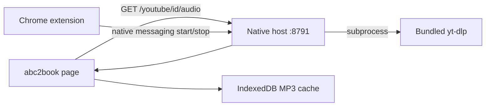

# Chrome YouTube Helper: Extension + yt-dlp (YouTube-only)

## Scope (locked)

- **In scope:** Proxy YouTube audio downloads only (`GET /youtube/:videoId/audio`) for offline cache and pitch/tempo playback.
- **Out of scope:** `/proxy-audio` for arbitrary URLs, Firefox, stem separation, transcribe, chord detect, sheet OCR — those stay on [`local-resolver`](local-resolver/README.md).
- **Platform:** **Chrome only** (not Chromium forks unless users manually adapt paths).
- **Distribution:** GitHub release zip, sideloaded extension (no Chrome Web Store).

abc2book already caches in IndexedDB ([`src/externalMediaAudioCache.js`](src/externalMediaAudioCache.js)). This project replaces only the **YouTube byte fetch** step currently handled by resolver yt-dlp or the Piped fallback ([`src/mediaProxyClient.js`](src/mediaProxyClient.js) `fetchDirectOrProxy`).



---

## Architecture decisions (locked)

### Localhost HTTP host — not native messaging for audio

Chrome caps **host → extension** native messages at **1 MB**. Songs are 3–10+ MB. Audio must **not** flow through native messaging.

The native host runs a minimal HTTP server on **`127.0.0.1:8791`** (fixed port):

- `GET /health` → `{ "ok": true, "youtube": true }`
- `GET /youtube/:videoId/audio` → stream yt-dlp stdout (same as [`build_ytdlp_cmd`](local-resolver/server.py))

abc2book probes and fetches this URL **directly** — same pattern as [`fetchViaMediaProxy`](src/mediaProxyClient.js), no extension byte relay needed.

### Extension role: lifecycle + install UX only

The MV3 extension:

1. On browser startup / install: native message `{ "action": "ensureServer" }` → host starts daemon if not running
2. Popup shows: host running / yt-dlp version / link to re-run install if broken
3. First-run **onboarding page** (opened on `chrome.runtime.onInstalled`) with copy-paste path for **Load unpacked**

The extension does **not** need `externally_connectable` for audio transfer if the page hits localhost HTTP directly.

### yt-dlp command (copied from resolver)

```python
# From local-resolver/server.py — only YouTube path needed
yt-dlp --no-playlist --no-warnings -f ba/b [--cookies PATH] -o - \
  "https://www.youtube.com/watch?v={videoId}"
```

Optional Netscape cookies file for age-restricted videos (advanced step, not required for install).

---

## Minimum-friction Chrome install

Goal: **two user actions** after download, no Docker, no pip, no manual yt-dlp install.

### Release zip layout

```text
abc2book-youtube-helper-vX.Y.Z/
├── extension/           # Load unpacked — select this folder
│   ├── manifest.json    # fixed "key" → stable extension ID
│   └── ...
├── host/
│   ├── abc2book_youtube_host   # Python/Go launcher + embedded logic
│   └── bin/
│       ├── yt-dlp                # bundled per-OS binary
│       └── deno                  # bundled per-OS (needed for cookie auth)
├── install.sh                    # Linux + macOS
├── install.ps1                   # Windows
└── README.md
```

### What `install.sh` / `install.ps1` does (one run)

1. Copies host binary to a fixed user location (e.g. `~/.local/share/abc2book-youtube-host/`)
2. Writes Chrome native messaging manifest to:
   - Linux: `~/.config/google-chrome/NativeMessagingHosts/com.abc2book.youtube_host.json`
   - macOS: `~/Library/Application Support/Google/Chrome/NativeMessagingHosts/`
   - Windows: `HKCU\Software\Google\Chrome\NativeMessagingHosts\`
3. Manifest points at host executable; `allowed_origins` uses **precomputed ID** from extension's fixed `key`
4. Opens `chrome://extensions` and the extension onboarding tab with: **Enable Developer mode → Load unpacked → select `extension/` folder**

No admin required (HKCU / user config dirs only).

### What the user actually does

| Step | Action | Friction |
|------|--------|----------|
| 1 | Download zip from GitHub Releases | Low |
| 2 | Run `install.sh` once | Low |
| 3 | Load unpacked extension (guided by onboarding page) | **Unavoidable for sideload** — one time |
| 4 | Open abc2book | Zero — auto-detects `:8791/health` |

**Optional later:** export YouTube cookies if videos fail (same as resolver docs); not part of initial install.

### Friction we explicitly avoid

- No separate `pip install yt-dlp` — **bundled binary per OS** in release
- No Firefox manifests or AMO signing
- No `/proxy-audio` or resolver URL configuration
- No chunked native messaging implementation
- No Docker

### Remaining unavoidable sideload friction

- **Developer mode + Load unpacked** — Chrome does not allow silent extension install outside Web Store or enterprise policy
- **No auto-update** — users re-download release zip (extension popup can nag when `/health` reports stale version)
- **Corporate Chrome** may block Developer mode — those users keep using Docker resolver

### Why not Chrome Web Store?

Store listing adds review friction and YouTube-downloader policy risk. GitHub sideload is intentional; minimum friction is achieved by **bundling everything + one script + guided Load unpacked**, not by avoiding sideload entirely.

---

## abc2book integration

### Fetch fallback chain (YouTube only)

In [`fetchDirectOrProxy`](src/mediaProxyClient.js), for `srcType === 'youtube'`:

1. **Local YouTube helper** — `http://127.0.0.1:8791/youtube/{videoId}/audio` if `/health` ok
2. **Media resolver** — existing `fetchViaMediaProxy` if configured
3. **Piped** — existing fallback in [`externalMediaAudioLoader.js`](src/externalMediaAudioLoader.js)

Non-YouTube URLs unchanged (direct fetch → resolver proxy-audio → error).

### Health probe

New lightweight probe (sibling to [`mediaResolverHealthStore.js`](src/mediaResolverHealthStore.js)):

- `GET http://127.0.0.1:8791/health` with short timeout (~2s)
- Expose `youtubeHelperAvailable` to UI

Do **not** fold into `resolverFeatures.proxy` globally — helper is YouTube-only. Gate YouTube cache/offline UI on: `resolver proxy OR youtubeHelperAvailable`.

### Copy updates

[`src/formFieldHelpText.js`](src/formFieldHelpText.js) offline media help: mention Chrome YouTube helper as alternative to resolver for YouTube caching.

---

## Maintenance

| Component | Frequency | Action |
|-----------|-----------|--------|
| **yt-dlp** | Weeks–months when YouTube breaks | Ship new release zip with updated bundled binary; or document `host/bin/yt-dlp -U` if self-update enabled |
| **Bundled Deno** | Rare | Same as yt-dlp — bundle in release |
| **Cookies** | User session expiry | Re-export optional cookies file |
| **Extension** | Years (MV3 API) | New release zip, user Load unpacked again (same folder overwrite) |
| **Native host manifest** | Only if extension ID changes | Prevented by fixed `key` in manifest.json |

**Net:** Same yt-dlp maintenance as Docker resolver; extra work is **packaging per-OS binaries** and **Chrome install support**, not extractor logic.

---

## Security

- Host binds **`127.0.0.1` only** — not reachable from network
- Validate `videoId` with same regex as [`extract_youtube_video_id`](local-resolver/server.py) — reject anything else
- No arbitrary URL fetch in host — YouTube watch URLs only
- Cookies file optional, user-local, gitignored if copied from resolver secrets pattern
- GitHub releases: tagged, checksums (SHA256), release notes

---

## Comparison (YouTube cache use case)

| | Docker resolver | Chrome YouTube helper |
|--|-----------------|----------------------|
| YouTube offline cache | Yes | Yes |
| Install | `docker compose up` | Download zip + `install.sh` + Load unpacked |
| Chrome-only friction | N/A (HTTP to :8787) | 3 steps, no Docker |
| Arbitrary URL proxy | Yes | No |
| Analysis / ML features | Yes | No (still need Docker) |
| Updates | `docker compose pull` | Re-download release zip |

---

## Implementation outline

1. **`youtube-helper/host/`** — Python script (~200 lines): HTTP server, yt-dlp subprocess, native messaging `{ ensureServer, status, shutdown }`, bundled binary paths
2. **`youtube-helper/extension/`** — MV3: service worker, popup, onboarding page, fixed manifest `key`
3. **`youtube-helper/install.sh` / `install.ps1`** — OS detection, manifest install, open Chrome extensions
4. **`src/youtubeHelperClient.js`** — health probe + fetch URL builder
5. **Wire into** [`mediaProxyClient.js`](src/mediaProxyClient.js) and offline-cache UI gates
6. **GitHub Actions** (optional) — build release zips for linux-x64, macos-arm64/x64, win-x64 with bundled yt-dlp + Deno

---

## Bottom line

YouTube-only + Chrome-only + minimum sideload friction means: **bundled yt-dlp, one install script, localhost HTTP on a fixed port, thin extension for host lifecycle**. You still maintain yt-dlp, but users skip Docker entirely for YouTube caching. The one irreducible step is **Load unpacked** once per Chrome profile.
