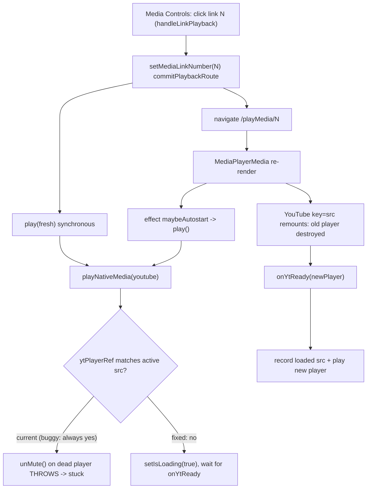

# Fix playback of multiple associated media links

## Confirmed root cause

Your console gives the exact failure when clicking the 2nd link in Media Controls:

```
YT play err TypeError: Cannot read properties of null (reading 'src')
  at X.unMute (www-widgetapi.js)
  at playNativeMedia (useTuneBookMediaController.js:2577)
  at play (useTuneBookMediaController.js:2535)
  at startPlaybackFromGesture (MediaPlayerOptionsModal.js:73)
  at handleLinkPlayback (MediaPlayerOptionsModal.js:105)
```

In [src/components/MediaPlayerMedia.js](src/components/MediaPlayerMedia.js) the player is `<YouTube key={src} ... onReady={mediaController.onYtReady}>`. Changing link changes `src`, so React unmounts the old iframe player and mounts a new one. But `ytPlayerRef.current` in [src/useTuneBookMediaController.js](src/useTuneBookMediaController.js) still points at the destroyed player. `isYoutubePlayerReady()` only checks `typeof ytPlayerRef.current.playVideo === 'function'` (line 1375), which is still true on the dead object, so `playNativeMedia('youtube')` calls `unMute()`/`playVideo()` on it and throws. The play attempt dies with `isLoading` stuck true → permanent waiting icon. The first link works only because its player is the one currently mounted and ready.

## Big picture of the playback paths



## Defects to fix (in priority order)

1. Stale YouTube player used after a link switch (confirmed crash). `playNativeMedia`, `onYtReady`, `isYoutubePlayerReady`.
2. Failure path gives up instead of waiting: the `catch` in `playNativeMedia` youtube branch does `setIsLoading(false)` and never retries, so even after the new player is ready nothing re-drives it deterministically.
3. `onYtReady` autoplay logic is gated by `if (ytPlayerRef.current)` (the OLD ref) and never records which src the player controls.
4. External-media path has the same class of bug: `play()` reuses `externalMediaRef.current` for a new link without checking `externalLoadedSrcRef.current === src` (every other site, e.g. line 2072, does check). Defensive fix so pitch/tempo/filter users do not hit the same stuck state.

## Edits

### 1. Track which source the YouTube player controls

In [src/useTuneBookMediaController.js](src/useTuneBookMediaController.js), near the other refs (after `var ytPlayerRef = useRef()`, line 67), add:

```js
var ytPlayerLoadedSrcRef = useRef(null)
```

Add a helper near `isYoutubePlayerReady` (line 1375):

```js
function getActiveMediaSrc() {
    return getSrc(tuneRef.current || tune, mediaLinkNumberRef.current)
}

function isYoutubePlayerReadyForActiveSrc() {
    return isYoutubePlayerReady()
        && ytPlayerLoadedSrcRef.current === getActiveMediaSrc()
}
```

### 2. Never operate on a stale player in `playNativeMedia` (lines 2573-2604)

- Change the guard from `if (isYoutubePlayerReady())` to `if (isYoutubePlayerReadyForActiveSrc())`.
- In the `catch`, treat a thrown/stale player as "not ready yet" and wait for `onYtReady` instead of giving up:

```js
} else if (srcType === 'youtube') {
    if (isYoutubePlayerReadyForActiveSrc()) {
        try {
            // ...existing unMute/seek/playVideo/pollConfirmYoutubePlaying...
        } catch (e) {
            console.log("YT play err", e)
            if (isAutoplayBlockedError(e)) {
                setTapToPlay(true)
                setIsLoading(false)
            } else if (playingIntentRef.current) {
                // stale/not-truly-ready player: wait for onYtReady to re-drive
                setIsLoading(true)
            } else {
                setIsLoading(false)
            }
        }
    } else if (playingIntentRef.current) {
        setIsLoading(true)   // new iframe still mounting; onYtReady will play it
    } else {
        setIsLoading(false)
    }
}
```

### 3. Make `onYtReady` robust and record the loaded src (lines 2267-2304)

Restructure so the new player and its loaded src are always recorded, and playback is (re)started for the active intent regardless of the previous ref:

```js
function onYtReady(e) {
    cleanupTimers()
    ytPlayerRef.current = e.target
    ytPlayerLoadedSrcRef.current = getActiveMediaSrc()

    if (isSeekGuardActive()) { setIsReady(true); return }
    if (externalMediaActiveRef.current && externalMediaRef.current) {
        setIsReady(true)
        if (hasActivePlaybackIntent()) playExternalMedia()
        return
    }
    setIsReady(true)
    applyNativeMediaPlaybackSettings(playbackSpeed)
    const extDuration = getExternalPlaybackDuration()
    setDuration(extDuration > 0 ? extDuration : e.target.getDuration())
    setCurrentTime(getLinkStartAt())
    if (hasActivePlaybackIntent()) {
        if (externalMediaRef.current && canUseExternalPitchTempo()) {
            playExternalMedia().then(function(ok) {
                if (!ok && hasActivePlaybackIntent()) playNativeMedia('youtube')
            })
        } else {
            playNativeMedia('youtube')
        }
    }
}
```

This removes the `if (ytPlayerRef.current)` gate (which also fixes the long-standing "first ever YouTube does not autostart from onReady" edge) and makes `isYoutubePlayerReadyForActiveSrc()` immediately accurate after a remount.

### 4. Defensive guard for the external-media path

In `play()`:
- Resume-from-pause media branch (around line 2436): change `if (canUseExternalPitchTempo() && externalMediaRef.current)` to also require `externalLoadedSrcRef.current === getSrc(useTune, linkIndex)`.
- Fresh/normal external branch (around line 2502): change `if (externalMediaRef.current)` to `if (externalMediaRef.current && externalLoadedSrcRef.current === src)`.

When the loaded src does not match, the existing `prepareExternalMedia(src, ...)` fall-through destroys the stale processor and loads the correct one, mirroring the already-correct logic in `applyLinkedMediaPlaybackSettings` (line 2072).

### 5. (Optional hardening) reset the YouTube marker on source change

In [src/components/MediaPlayerMedia.js](src/components/MediaPlayerMedia.js) src-change effect (lines 21-56), when `src` changes call a small new controller method `notifyYoutubeSrcChanged()` that does `ytPlayerLoadedSrcRef.current = null`. Not strictly required (the match check already treats a remounting player as not-ready), but makes stale usage impossible during the mount gap.

## Verification

- Manual: open a tune with 2+ YouTube links, open Media Controls, play link 1, pause, play link 2 and link 3. Expect each to start without a stuck spinner and with no `YT play err` in the console.
- Add a pure helper + unit test in [src/playbackStateLogic.js](src/playbackStateLogic.js) and [src/playbackStateLogic.test.js](src/playbackStateLogic.test.js): `shouldUseExistingPlayer(loadedSrc, activeSrc, ready)` returning `ready && loadedSrc === activeSrc`, used by both the YouTube and external checks, with tests for match / mismatch / not-ready.
- Run `npm run test:playback` for the existing playback regression suite.
- Optional: `npm run test:playback:e2e` (needs a browser profile with tune data) to confirm no regressions on single-link play/seek/pause.

## Notes / risk

- Changes are localized to the YouTube ready/play path plus two one-line guards on the external path; no change to MIDI or seek logic.
- The MIDI `beginMidiPlayback` and `<line> attribute NaN` log lines come from the initial autostart on the `playMidi` route and the abcjs renderer; they are unrelated to the link-switch crash and are out of scope unless you want them addressed too.