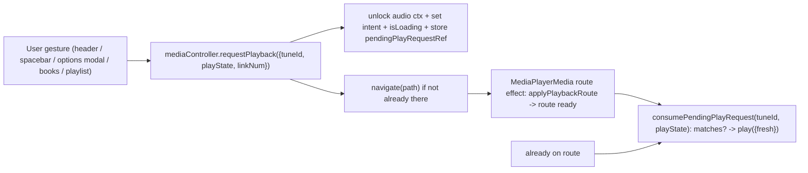

# Fix playback and playlist flows

## Root cause (reproduced live)

Every entry point that must change route does `navigate(path)` then immediately `mediaController.playFromUserGesture()`. `navigate` is async, so when `play()` runs, `playbackRouteRef.current` still reflects the previous view (`mode: 'none'`). In [src/useTuneBookMediaController.js](src/useTuneBookMediaController.js):

```3374:3378:src/useTuneBookMediaController.js
        if (route.mode !== 'media') {
            playingIntentRef.current = false
            setIsLoading(false)
            return
        }
```

This resets intent to false. After navigation remounts the player, `maybeAutostart('playMidi','tune', isFirstTuneLoad=false)` refuses to start because `playingIntentRef` is false and it isn't the first tune load. Result: URL becomes `/playMidi` but `intent:false, isPlaying:false` (verified in-browser). Playing while already on the correct route works fine (`isPlaying:true`), confirming the race is the cause.

The affected entry points share this pattern:
- [src/tunePlaybackActions.js](src/tunePlaybackActions.js) `beginPlayback` (header play button + spacebar via `startTunePlayback`)
- [src/components/MediaPlayerOptionsModal.js](src/components/MediaPlayerOptionsModal.js) `handleMidiPlayback` / `handleLinkPlayback`

The `BooksPage` and queue-advance paths already work because they use `preparePlaybackFromUserGesture()` + deferred engine + `maybeAutostart`-on-mount — but that boolean-intent + `changeType` heuristic is fragile (arming intent + navigating still failed to autostart in testing).

## Fix strategy: one deterministic pending play-request

Replace the fragile "boolean intent + changeType + isFirstTuneLoad" heuristic with an explicit, route-keyed pending request that is consumed exactly when the target route becomes ready.



### 1. Controller: add a pending play-request (core)
In [src/useTuneBookMediaController.js](src/useTuneBookMediaController.js):
- Add `pendingPlayRequestRef = useRef(null)`.
- Add `requestPlayback({ tuneId, playState, linkNum, fromUserGesture })`: unlock audio contexts (as `playFromUserGesture` does), set `playingIntentRef=true`, `userPausedRef=false`, `setIsLoading(true)`, and store `{ tuneId, playState, linkNum }`. If the active route already matches, consume immediately (`play({ fresh: true })`).
- Add `consumePendingPlayRequest(tuneId, playState, linkNum)`: if a pending request matches the now-ready route, clear it and `play({ fresh: true })`.
- Stop resetting intent when the route is not ready: change the `route.mode !== 'media'` branch so that when a matching `pendingPlayRequestRef` exists it keeps intent + loading instead of zeroing intent.
- Clear `pendingPlayRequestRef` in `pause`, `stop`, `abortPlayingIntent`.

### 2. Consume on route-ready
In [src/components/MediaPlayerMedia.js](src/components/MediaPlayerMedia.js) route effect (after `applyPlaybackRoute`, when `changeType` is `tune`/`link`/`playState` and `!suppressAutostart`): call `mediaController.consumePendingPlayRequest(tune.id, playState, route.mediaLinkNumber)`. Keep `maybeAutostart` for queue/first-load compatibility, but the pending request becomes the authoritative start for user gestures.

### 3. Unify entry points onto `requestPlayback`
- [src/tunePlaybackActions.js](src/tunePlaybackActions.js): rewrite `beginPlayback` to call `mediaController.requestPlayback(...)` then navigate (drop the immediate `playFromUserGesture()`). `resumeTunePlayback` stays as-is for true resume.
- [src/components/MediaPlayerOptionsModal.js](src/components/MediaPlayerOptionsModal.js): `handleMidiPlayback` / `handleLinkPlayback` call `requestPlayback` then navigate; keep the double-click `restartPlaybackFromStart` branch.
- Verify `BooksPage.playFilteredCollection` and `handleQueueAdvanceOnEnded` still work (they can migrate to `requestPlayback` for consistency, or keep their `armPlaybackIntent` path).

### 4. Fix stale playback target (`mediaController.tune`)
`beginPlayback` and the options modal build the path from `mediaController.tune.id`, which can lag the viewed tune ([src/tunePlaybackActions.js](src/tunePlaybackActions.js) line 79; modal lines 134/106). Pass the viewed tune (from `useParams`/`props.tunes[params.tuneId]`) into `requestPlayback` so playback targets the tune actually on screen.

### 5. Secondary regressions to verify/fix
- Native audio: the new early-returns in `handleNativePlay`/`handleNativePause` (`if (mediaController.isLoading) return`) in [src/components/MediaPlayerMedia.js](src/components/MediaPlayerMedia.js) can suppress `confirmPlayingStarted()` on the very `onPlay` that should confirm start, leaving `isLoading` stuck. Confirm native audio still leaves loading state (add a fallback confirm via `onTimeUpdate`/`onCanPlayThrough` if needed).
- YouTube watchdog: ensure the 3.5s tap-to-play watchdog does not fire while the player is legitimately `BUFFERING`/`PLAYING` on slower starts (check YT state before prompting).

### 6. Tests (use existing devSeed harness)
Add focused tests (react-scripts/jest) driving the seeded tunebook in [src/devSeed](src/devSeed):
- navigate-then-play (MIDI and media) starts playback (intent + isPlaying true) — regression lock for this bug.
- play while already on the route starts immediately.
- switching link number restarts on the new link.
- queue auto-advance still starts the next tune.
- YouTube autoplay-blocked path surfaces tap-to-play, and the tap starts playback.

## Notes
- The repeated dev seeding appears to have created duplicate/again-seeded tunes (viewing key `...001` but `mediaController.tune.id` was `...003`). Recommend `window.clearTunebook()` + single reseed before verifying, and treating the id/key mismatch as a data artifact, not a core bug.