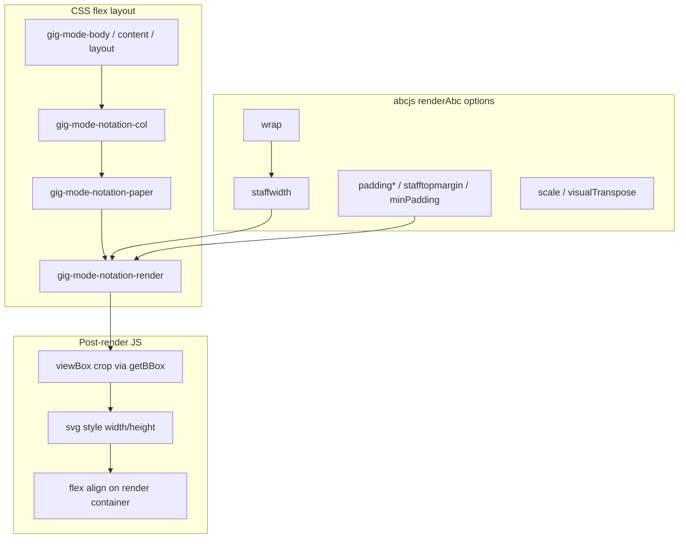

# Gig Mode Notation Fit Controls

## How notation layout is controlled today (and all levers available)

Notation size in gig mode is the product of **four stacked layers**. They interact; changing one without the others causes clipping or wasted grey space.



### 1. Page layout (CSS) — allocates the grey box
Files: [`src/components/GigModeModal.css`](src/components/GigModeModal.css)

| Control | Effect |
|---------|--------|
| `gig-mode-content` / `gig-mode-layout` / `gig-mode-single-pane` | Flex column; must use `flex: 1 1 0` + `min-height: 0` so notation gets remaining height above footer |
| `gig-mode-notation-col` | Column width: **100%** when lyrics hidden; **~50%** when `showSplitLayout` (`@media min-width: 900px`) |
| `gig-mode-notation-paper` | Grey background; `overflow: hidden`; inner padding currently `6px 4px` |
| `gig-mode-notation-render` | Centers SVG (`align-items/justify-content: center`); `--wide` class left-aligns when overflowing |

**ResizeObserver** on `notationColRef` must only **refit** existing SVG (already partially fixed); full `renderAbc` on resize causes loops.

### 2. ABC source text — headers stripped in gig mode
File: [`src/components/GigModeModal.js`](src/components/GigModeModal.js) `stripGigNotationHeaders()`

Removes `T:`, `B:`, etc. but **not** layout directives like `%%staffwidth`, `%%scale`, `%%musicspace`, `%%systemsep`. Those can still affect abcjs output if present in tune ABC.

### 3. abcjs `renderAbc` options — primary layout knobs
Docs: [abcjs renderAbc options](https://docs.abcjs.net/visual/render-abc-options.html)

**Currently set in gig mode** (lines 257–269):
- `staffwidth` — iterated down to squeeze lines horizontally
- `paddingtop/bottom/left/right: 0`, `topmargin/bottommargin: 0`, `stafftopmargin/bottommargin: 0`, `musicspace: 2`
- `visualTranspose`, `foregroundColor`, `add_classes: true`

**Not used in gig mode but relevant:**

| Option | Role for fit |
|--------|----------------|
| `staffwidth` | Controls horizontal spacing and line wrapping; **required** for `wrap` |
| `wrap: { minSpacing, maxSpacing, preferredMeasuresPerLine, ... }` | Auto line breaks to fit a given `staffwidth` (used elsewhere via `responsive` in [`src/components/Abc.js`](src/components/Abc.js)) |
| `responsive: "resize"` | Scales entire SVG to container **width** (Practice/AbcPrint pattern) — fights custom height-fit unless container height is also constrained |
| `scale` | Uniform zoom factor |
| `paddingleft` / `paddingright` / `paddingtop` / `paddingbottom` | **Defaults 15/50/15/30** if omitted — gig sets 0; still verify no leftover in SVG |
| `minPadding` | Extra px between staff items (default 0) — set explicitly to 0 |
| `stafftopmargin` | Extra space above each staff system |
| `expandToWidest` | Re-layout lines to match widest line |
| `lineBreaks` | Explicit measure-per-line control |
| `timeBasedLayout` | Fixed time-based horizontal spacing |
| `format: { ... }` | Pass `musicspace`, `systemsep`, fonts, etc. |
| `oneSvgPerLine` | Per-system SVGs (usually not wanted in gig) |

**ABC `%%` directives** in the tune string can override or duplicate the above (`%%staffwidth`, `%%scale`, etc.).

### 4. Post-render fitting (current custom logic) — source of bugs
File: [`src/components/GigModeModal.js`](src/components/GigModeModal.js) lines 34–106, 233–300

1. `getSvgContentBBox` + `tightenGigNotationSvg` — rewrites `viewBox`
2. Iteration: reduce `staffwidth` until `dims.width * (availH/dims.height) <= availW`
3. `fitGigNotationToHeight` — scales to height, then applies **`fitScale` when width exceeds**, **shrinking height** → **bottom clipping**

**Excess left grey space:** when scaled content is narrower than the paper, `justify-content: center` adds equal side margins; if viewBox still contains asymmetric empty space on the left, cropping is insufficient. abcjs default layout often has more right than left padding internally; over-tight crop + centering can look like a large left gutter.

---

## Root cause summary (current bugs)

1. **Bottom cut off:** `fitScale` in `fitGigNotationToHeight` (lines 92–94) reduces final height when width is tight — defeats vertical fit.
2. **Left padding:** combination of (a) incomplete horizontal crop, (b) centering a narrow SVG in a wide paper, (c) possible residual abcjs left spacing — not a single CSS padding issue.
3. **No user control:** fit mode is hard-coded as “vertical-ish” without a clear horizontal alternative.

---

## Proposed architecture

### Extract fit module
New file: **`src/gigNotationFit.js`** (pure functions, unit-testable)

```javascript
// Modes
export const GIG_NOTATION_FIT_VERTICAL = 'vertical';
export const GIG_NOTATION_FIT_HORIZONTAL = 'horizontal';

// measurePaper(paperEl) -> { availW, availH }
// renderGigAbc(renderEl, abc, options, staffWidth) -> svg
// computeFit(svg, mode, availW, availH) -> { width, height, align }
// applyFit(svg, renderEl, fitResult)
```

**Vertical fit (default):**
- Target scale: `availH / contentHeight` (after viewBox crop with symmetric `padX`/`padY`, e.g. 6px vertical / 2px horizontal)
- If `scaledWidth > availW`: **reduce `staffwidth` and re-render** (binary search or continued multiplicative search) — **never shrink height via `fitScale`**
- If `scaledWidth < availW`: center horizontally in paper (optional small max side margin)
- If still wider after min `staffwidth`: clip horizontally (`overflow: hidden`), **keep full height**

**Horizontal fit:**
- Target scale: `availW / contentWidth`
- Set SVG width = `availW`, height = `scaledHeight` (may be less than `availH`)
- Center vertically in paper (`align-items: center`)

**ViewBox strategy:** prefer tight crop using union of `.abcjs-staff`, `.abcjs-note`, `.abcjs-chord`, `text`, etc. (more reliable than root `getBBox` alone); fall back to root `getBBox`; add slightly **more `padY` than `padX`** to protect stems/ledger lines.

### Persist fit mode
Extend [`src/gigDisplaySettings.js`](src/gigDisplaySettings.js):
- `getGigNotationFitMode()` → `'vertical'` default
- `setGigNotationFitMode(mode)`

### Wire into GigModeModal
File: [`src/components/GigModeModal.js`](src/components/GigModeModal.js)

- State: `notationFitMode` initialized from settings
- `renderNotation` depends on `notationFitMode`
- `refitNotationLayout` calls `applyFit` with current mode (no full re-render)
- ResizeObserver + lyrics/notation toggle + split layout change → refit or re-render

**Measure container:** always `paperEl = colEl.querySelector('.gig-mode-notation-paper')` — automatically reflects 50% width when lyrics panel is open.

### Toolbar UI
In `gig-mode-toolbar`, when `showNotationButton`:

```jsx
<ButtonGroup size="sm" aria-label="Notation fit">
  <Button variant={notationFitMode === 'vertical' ? 'primary' : 'outline-secondary'}
    onClick={() => setNotationFitMode('vertical')}>Fit V</Button>
  <Button variant={notationFitMode === 'horizontal' ? 'primary' : 'outline-secondary'}
    onClick={() => setNotationFitMode('horizontal')}>Fit H</Button>
</ButtonGroup>
```

Labels can be refined (“Vertical” / “Horizontal” with icon-only on small screens matching existing `gig-mode-toolbar-btn-label` pattern).

Place after display toggles or near A−/A+ (notation-related cluster).

### CSS tweaks
File: [`src/components/GigModeModal.css`](src/components/GigModeModal.css)

- Reduce paper padding to minimal symmetric values (e.g. `2px`)
- Replace `--wide` hack with mode-specific classes: `.gig-mode-notation-render--fit-vertical` / `--fit-horizontal`
- Vertical + overflow: `justify-content: center`; horizontal: `align-items: center`

### abcjs render profile (both modes)
Shared baseline in fit module:

```javascript
{
  paddingtop: 0, paddingbottom: 0, paddingleft: 0, paddingright: 0,
  topmargin: 0, bottommargin: 0,
  stafftopmargin: 0, staffbottommargin: 0,
  minPadding: 0,
  musicspace: 2, // or via format.musicspace
  add_classes: true,
  foregroundColor: '#111111',
  visualTranspose,
}
```

Optional for vertical mode: enable `wrap` with tight `minSpacing` so `staffwidth` changes actually reflow lines (improves height-fill when squeezing).

### Tests
New: **`src/gigNotationFit.test.js`**
- `computeFit` vertical: never returns height less than `availH * ratio` when width constrained
- `computeFit` horizontal: width equals `availW`
- Mode persistence in `gigDisplaySettings`

---

## Files to change

| File | Change |
|------|--------|
| [`src/gigNotationFit.js`](src/gigNotationFit.js) | **New** — fit math, abc render helper, viewBox crop |
| [`src/gigNotationFit.test.js`](src/gigNotationFit.test.js) | **New** — unit tests |
| [`src/gigDisplaySettings.js`](src/gigDisplaySettings.js) | Add notation fit mode get/set |
| [`src/components/GigModeModal.js`](src/components/GigModeModal.js) | Use module; fit mode state; toolbar buttons; fix ResizeObserver refit |
| [`src/components/GigModeModal.css`](src/components/GigModeModal.css) | Fit-mode alignment classes; minimal paper padding |

---

## Verification checklist

- Tune with 4+ staves (e.g. Coleman's March): bottom staff fully visible in **Fit V**
- No large asymmetric left gutter in grey box
- Toggle **Fit H**: notation uses full column width; may letterbox vertically
- Open lyrics (50/50 layout): fit recalculates to narrower paper width
- Resize window: no ResizeObserver loop / console spam
- Fit mode persists across gig sessions (localStorage)
