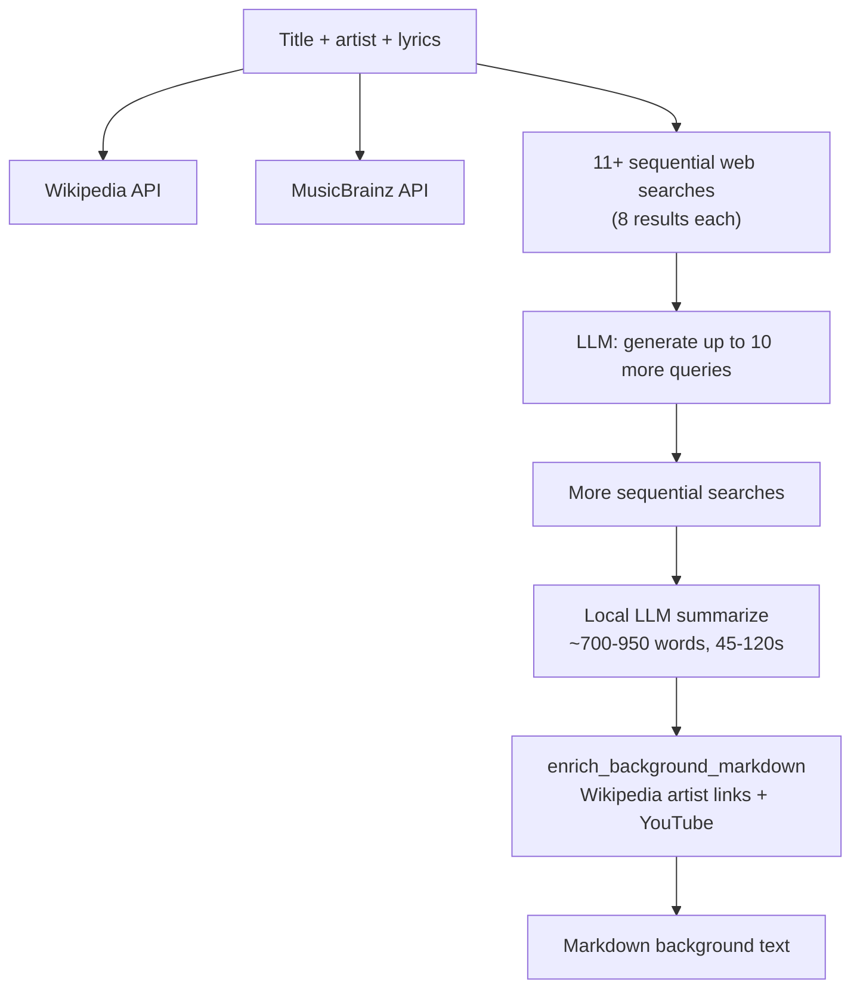
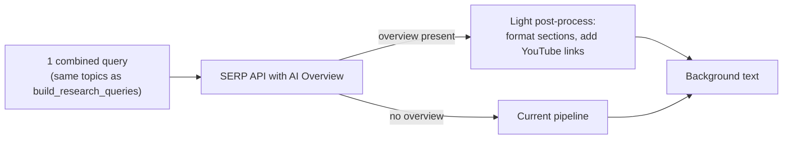

# Google AI Overview for Background Research — Feasibility

## Short answer

**Possible, but not as a complete replacement.** A single Google AI Overview can replace much of the *search + summarize* work for well-known songs, cutting runtime from ~1–2 minutes to roughly **5–15 seconds**. For obscure trad tunes, AI Overviews are often **missing, wrong, or about a different song**—exactly the cases where your current pipeline (lyrics disambiguation, The Session, MusicBrainz, many targeted queries) is most valuable.

---

## What the current pipeline does (and why it is slow)

Your resolver endpoint [`POST /research-tune-background`](local-resolver/server.py) runs [`research_tune_background()`](local-resolver/tune_background_research.py):

Main time sinks:

| Stage | Typical cost | Why |
|-------|-------------|-----|
| Sequential searches | 30–90s+ | [`_run_search_queries`](local-resolver/tune_background_research.py) runs queries **one at a time**; default is ~11 base + up to 10 supplemental |
| Supplemental query LLM | 5–15s | Extra round-trip to local LLM before more searches |
| Summarize LLM | 45–120s | Large prompt (up to 80 source snippets) → 2800 max tokens |
| Enrichment | 10–30s | YouTube + artist Wikipedia link insertion in [`background_markdown_links.py`](local-resolver/background_markdown_links.py) |

The frontend external-link button you added mirrors the **base** search queries from `build_research_queries()`—not the supplemental ones (those depend on live results).

---

## What “Google AI Overview scraping” actually means

Google does **not** offer an official AI Overview API. Options are:

1. **Scrape google.com directly** — unreliable (CAPTCHA, blocks, HTML changes). Your README already notes this problem for chord search; same applies here.
2. **Third-party SERP APIs** — they fetch Google results and return structured JSON. This is the realistic path.

You already have [`SERPER_API_KEY`](local-resolver/.env.example) wired as `RESEARCH_SEARCH_BACKEND=serper`, but [`_search_serper`](local-resolver/tune_background_research.py) only reads `organic` snippets—**AI Overview is ignored today**.

| Provider | AI Overview support | Notes |
|----------|--------------------|-------|
| **Serper** (already integrated) | Partial / inconsistent | Some responses include `aiOverview` text; citation lists are thinner than competitors |
| **SerpApi** | Strong | Dedicated AI Overview endpoint; often needs a follow-up call with a `page_token` for full content |
| **DataForSEO, Bright Data, etc.** | Strong | Higher cost, more setup |

So: **yes, the resolver could consume AI Overview content**, but it means extending (or adding) a SERP backend—not scraping Google yourself.

---

## What you would gain

- **Speed**: 1–2 rich queries instead of 20+ sequential searches + one big summarize call.
- **Cost shift**: Pay per SERP API call (~$0.30–$1/1k) instead of heavy local GPU/CPU time for summarization.
- **Quality for mainstream songs**: Google’s overview often synthesizes Wikipedia, AllMusic, etc. well for famous titles.

A plausible fast path:

---

## What you would lose or risk

**Coverage gaps**

- AI Overviews appear on roughly half of queries (varies by topic/locale), and **less often** for niche trad instrumentals, regional spellings, or ambiguous titles.
- Your pipeline explicitly searches `site:thesession.org`, Discogs, lyric phrases for disambiguation—sources Google may not surface in an overview.

**Accuracy / disambiguation**

- Wrong-song summaries are the biggest risk when title is common and artist is generic (“Traditional”, blank).
- Your lyrics block in [`_build_llm_prompt`](local-resolver/tune_background_research.py) and lyric-based search phrases exist specifically to fix this; a single overview query may not.

**Format and product requirements**

- Your output targets musician-oriented markdown with specific sections (origin, performers, labels, structure) and [`enrich_background_markdown`](local-resolver/background_markdown_links.py) still adds YouTube/Wikipedia links—you’d likely keep at least that post-step.
- AI Overview text is prose, not your section template; you may still want a **short** local LLM pass to reformat (much cheaper than today’s full research summarize).

**Dependency and ToS**

- Another paid API dependency with rate limits.
- Content is Google’s synthesis—not guaranteed stable wording or licensing clarity for redistribution in tunebooks.

**No real “scraping” of the Google UI**

- You’d be paying an API vendor to do the fragile part; self-scraping the AI box in a headless browser would be brittle and high-maintenance.

---

## Comparison: current pipeline vs AI Overview–first

| Dimension | Current multi-search + local LLM | AI Overview via SERP API |
|-----------|----------------------------------|---------------------------|
| Latency | 1–3 min typical | 5–20 sec if overview exists |
| Trad/obscure tunes | Strong (targeted sites + many queries) | Weak |
| Famous songs | Good but overkill | Often sufficient |
| Infrastructure | Local LLM required | SERP API key; LLM optional |
| Citations | You control `sources` list | Depends on API; may need overview citations only |
| Maintenance | Search backends + LLM prompts | SERP API schema changes |

---

## Practical recommendation

**Do not replace the current pipeline entirely** if tunebook users work heavily with folk/trad repertoire.

**Best future direction** (if you revisit implementation later):

1. **Fast path**: When `RESEARCH_SEARCH_BACKEND=serper` (or a new SerpApi backend), issue **one** combined query, extract `aiOverview` + citations if present.
2. **Quality gate**: Accept the overview only if it mentions the title (and artist when non-generic) and passes a minimum length; otherwise fall back.
3. **Keep enrichment**: Still run YouTube/Wikipedia link enrichment—it’s relatively fast and tunebook-specific.
4. **Optional light LLM**: Reformat overview into your section headings (~300–500 tokens), not full research from 80 snippets.
5. **Parallelize current pipeline anyway**: Even without AI Overview, running base searches concurrently would cut latency significantly with no coverage loss.

**Cheaper wins without Google AI** (if speed is the main pain):

- Parallelize `_run_search_queries` (biggest easy win).
- Make supplemental query generation optional (`RESEARCH_MAX_SUPPLEMENTAL_QUERIES=0`).
- Reduce base query count for a “quick research” mode.
- Cache results per `(title, artist, lyrics hash)`.

---

## Bottom line

Using Google AI Overview **through a SERP API** is a viable way to **speed up background research for well-known material**, but it is **not a reliable substitute** for the breadth and disambiguation your resolver already does. The sensible architecture is a **tiered approach**: try AI Overview first, fall back to today’s pipeline when it’s missing or untrustworthy—rather than betting everything on one Google summary.

No code changes are proposed here per your preference for advice only.
