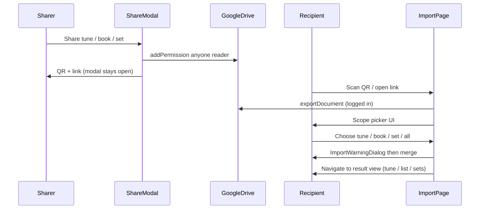
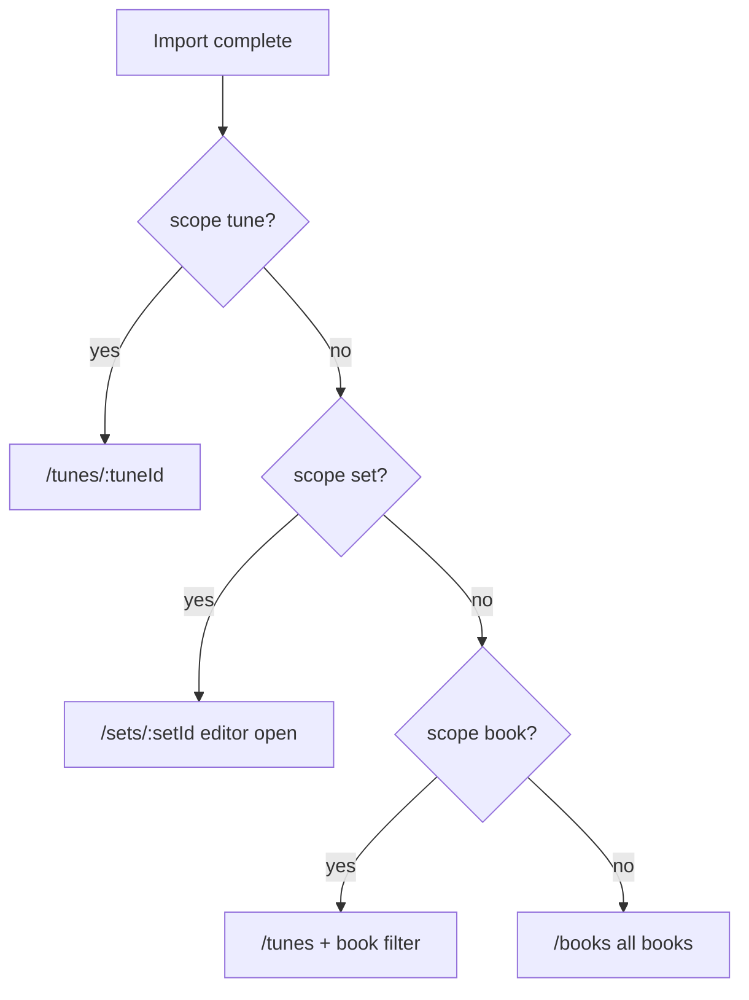

# Google tunebook sharing with QR and import scope picker

## Architecture



**Storage model (unchanged):** one Google Doc holds all tunes + embedded performance sets. Sharing exposes the whole doc on Drive; scope filtering happens only at import time via existing [`importAbc`](src/useTuneBook.js) limits (`limitToTuneId`, `limitToBookName`) plus new set support.

## 1. Share link format

Add [`src/shareTunebookUtils.js`](src/shareTunebookUtils.js):

```javascript
// Examples (use window.location.origin, not hardcoded tunebook.net)
/#/importdoc/{googleDocumentId}/share/tune/{tuneId}
/#/importdoc/{googleDocumentId}/share/book/{bookName}
/#/importdoc/{googleDocumentId}/share/set/{setId}
/#/importdoc/{googleDocumentId}                     // whole tunebook
```

Legacy paths (`/importdoc/:id/tune/:tuneId`, `/book/:bookName`) will route to the same scope-picker page with that context pre-selected (no more silent auto-import).

## 2. Re-enable and redesign share dialog

Refactor [`src/components/ShareTunebookModal.js`](src/components/ShareTunebookModal.js):

- Remove `return null` disable.
- On open: confirm once (existing `bookstorage_tunebook_public` localStorage pattern), call `docs.addPermission(googleDocumentId, {type:'anyone', role:'reader'})`, build link via `shareTunebookUtils`.
- **Modal stays open** (`backdrop="static"`) with **fullscreen** layout (same pattern as [`AddSongModal.js`](src/components/AddSongModal.js)).
- Primary content: large centered QR code (new dep: `qrcode.react`), link text below, **Copy Link**, **Share by Email** (`mailto:` with subject/body).
- Drop Facebook + curation submit from this dialog (out of scope; can restore curation elsewhere later).
- Props: `shareKind` (`tune` | `book` | `set` | `all`), `tuneId`, `currentTuneBook`, `setId`, `googleDocumentId`, `token`, `tunebook`, optional `buttonClassName`/`tiny`.

**Entry points:**

| Location | Change |
|----------|--------|
| [`MusicSingle.js`](src/components/MusicSingle.js) | Replace `SharePublicTuneModal` with `ShareTunebookModal` (`shareKind='tune'`, pass `googleDocumentId`, `tuneId`, `currentTuneBook`) |
| [`TuneBookOptionsModal.js`](src/components/TuneBookOptionsModal.js) | Re-enable book share (`shareKind='book'`) |
| [`SetsPage.js`](src/pages/SetsPage.js) | Add Share button on set editor (`shareKind='set'`, `setId`) |
| [`App.js`](src/App.js) | Pass `token`, `googleDocumentId` into `SetsPage` routes |

Share requires Google login; if no `token`, show Login button in modal (reuse existing `login` callback pattern).

## 3. Import scope picker (recipient flow)

Replace auto-import behavior in [`src/pages/ImportGoogleDocumentPage.js`](src/pages/ImportGoogleDocumentPage.js):

**Load phase** (when logged in):
1. `docs.exportDocument(googleDocumentId)` → full ABC text.
2. Parse preview data: tunes via `abcTools.abc2Tunebook`, sets via `parsePerformanceSetsFromAbc` from [`performanceSetSync.js`](src/performanceSetSync.js).
3. Derive share context from route params (`share/tune/:id`, `share/book/:name`, `share/set/:id`, or legacy `/tune/` `/book/` paths).

**Picker UI** (new [`src/components/ImportScopePicker.js`](src/components/ImportScopePicker.js)):
- Always show: **Import entire tunebook** (N tunes).
- If share context is a tune (or legacy tune route): **Import this tune** — highlight/recommend.
- If tune belongs to book(s): **Import book: {name}** for each containing book; if share context is a book, recommend that one.
- If share context is a set (or set exists in remote doc): **Import set: {name}** — recommend when shared from Sets page.
- Cancel → `/tunes`.

**Import execution** on choice:
- **Tune:** `importAbc(abc, null, tuneId)` — existing filter.
- **Book:** `importAbc(abc, null, null, bookName)`.
- **Whole tunebook:** `importAbc(abc)` + `mergePerformanceSetsFromTuneBookAbc(abc)` after merge.
- **Set:** extend [`importScopeMatch`](src/useTuneBook.js) with optional `limitToTuneIds` array; collect tune IDs from set items; `importAbc(abc, null, null, null, null, tuneIds)`; then new helper in [`performanceSetSyncClient.js`](src/performanceSetSyncClient.js) e.g. `importSinglePerformanceSetFromAbc(abc, setId)` to merge only that set record.

Wire into existing merge UX: call `importAbc` (sets `importResults`) → if `showImportWarning`, let [`ImportWarningDialog`](src/components/ImportWarningDialog.js) handle confirm → `applyImport()` → navigate via post-import helper (below). **Remove** the current immediate `navigate("/tunes")` after import.

When the user picks a scope, stash a **`navigateAfterImport`** payload on the import page (same mechanism as [`ImportLinkPage`](src/pages/ImportLinkPage.js)):

```javascript
{ scope: 'tune' | 'book' | 'set' | 'all', tuneId, bookName, setId }
```

Login gate unchanged: show Login button when `!token` (recipient must use their own Google account per privacy policy).

## 4. Post-import destination screens

After import completes (including through `ImportWarningDialog`), the recipient lands on a **view of what they imported** — not a generic home screen.

Add [`src/shareImportNavigation.js`](src/shareImportNavigation.js) with `applyShareImportNavigation({ scope, tuneId, bookName, setId }, { navigate, setCurrentTuneBook, setTagFilter, setFilter })` used by both `ImportWarningDialog` and the no-warning fast path.

| Import scope | Destination | Filters / UI state |
|--------------|-------------|-------------------|
| **Single tune** | `/tunes/{tuneId}` | Open [`MusicSingle`](src/components/MusicSingle.js) for that tune |
| **Book** | `/tunes` | `setCurrentTuneBook(bookName)`; clear tag filter so list shows only that book's tunes |
| **Whole tunebook** | `/books` | Clear book + tag filters; [`BooksPage`](src/pages/BooksPage.js) shows all imported books |
| **Performance set** | `/sets/{setId}` | [`SetsPage`](src/pages/SetsPage.js) already reads `:setId` from the route and opens the set in the editor form (`setEditingId` + `setDraft`) — no Gig Mode |

Implementation notes:

- Extend [`ImportWarningDialog`](src/components/ImportWarningDialog.js) `handleNavigation` to call `shareImportNavigation` when `navigateAfterImport.scope` is present; keep existing `autoplay` / legacy `tuneId`-only behavior for `ImportLinkPage`.
- Pass `setCurrentTuneBook` and `setTagFilter` into `ImportGoogleDocumentPage` / `ImportWarningDialog` from [`App.js`](src/App.js) (already available at app level).
- For **set** imports: after `importSinglePerformanceSetFromAbc`, navigate to `/sets/{setId}` — the set ID is stable across sharer and recipient because it is embedded in the shared ABC payload.
- For **book** imports: use the shared book name (URL-decoded) as the filter; do not navigate to `/books` — user asked for list view.
- Optional brief toast on arrival: e.g. "Imported 12 tunes into book My Book" (reuse toast pattern from [`performanceSetSyncToast.js`](src/performanceSetSyncToast.js) if lightweight).



## 5. Routes

Update [`src/App.js`](src/App.js) `importdoc` routes:

```javascript
/importdoc/:googleDocumentId
/importdoc/:googleDocumentId/share/tune/:tuneId
/importdoc/:googleDocumentId/share/book/:bookName
/importdoc/:googleDocumentId/share/set/:setId
// keep legacy paths → same page component
/importdoc/:googleDocumentId/tune/:tuneId
/importdoc/:googleDocumentId/book/:bookName
```

Pass `navigateAfterImport` / `setNavigateAfterImport`, `setCurrentTuneBook`, and `setTagFilter` into `ImportGoogleDocumentPage` (same as `ImportLinkPage`) so post-import navigation and list filters work.

## 6. Cleanup and docs

- Remove [`SharePublicTuneModal.js`](src/components/SharePublicTuneModal.js) (user chose Google-only sharing).
- Update [`helpContent.js`](src/helpContent.js) share/import section briefly.
- Add analytics route normalization for new `/share/` segments in [`analytics.js`](src/analytics.js) if needed.

## 7. Tests

- [`src/shareTunebookUtils.test.js`](src/shareTunebookUtils.test.js) — link building, encoding book/set names.
- [`src/shareImportNavigation.test.js`](src/shareImportNavigation.test.js) — correct route + filter side-effects per scope.
- [`src/useTuneBook.js`](src/useTuneBook.js) or dedicated test — `importScopeMatch` with `limitToTuneIds`.
- [`src/performanceSetSyncClient.test.js`](src/performanceSetSyncClient.test.js) — single-set import helper.
- Component/smoke test for `ImportScopePicker` option list given mock parsed data.

## Key files

| File | Role |
|------|------|
| [`src/components/ShareTunebookModal.js`](src/components/ShareTunebookModal.js) | QR share dialog |
| [`src/shareTunebookUtils.js`](src/shareTunebookUtils.js) | Link builder |
| [`src/pages/ImportGoogleDocumentPage.js`](src/pages/ImportGoogleDocumentPage.js) | Load doc + scope picker |
| [`src/components/ImportScopePicker.js`](src/components/ImportScopePicker.js) | Recipient choice UI |
| [`src/useTuneBook.js`](src/useTuneBook.js) | `limitToTuneIds` for set imports |
| [`src/performanceSetSyncClient.js`](src/performanceSetSyncClient.js) | Single-set merge on import |
| [`src/shareImportNavigation.js`](src/shareImportNavigation.js) | Post-import routing + list filters |
| [`src/components/ImportWarningDialog.js`](src/components/ImportWarningDialog.js) | Calls navigation helper after merge |

## Dependency

Add `qrcode.react` to [`package.json`](package.json).
