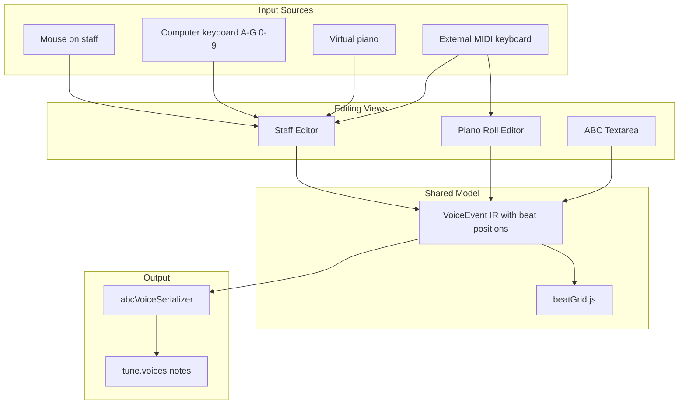
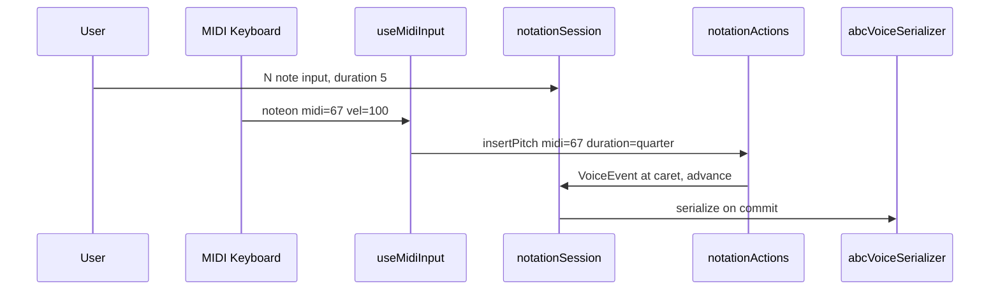
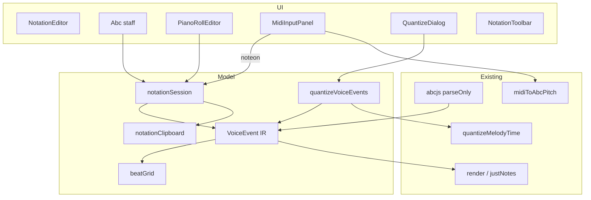

# GUI Notation Editor: Expanded Plan (MuseScore-Compatible)

## Goal

Build notation editing for **general musicians migrating from MuseScore**, with **ABC as storage/render backend**. Two editing surfaces share one model:

1. **Staff editor** — MuseScore-style step-time entry (mouse, computer keyboard, virtual piano, **external MIDI keyboard**)
2. **Piano roll editor** — time × pitch grid for drag editing and visual timing work

Cross-cutting: **quantize**, **chords**, **copy/paste**, parallel **ABC textarea**, undo/redo.

**Compatibility principle:** match MuseScore 4 default shortcuts and interaction patterns wherever ABC semantics allow.

---

## Editing Surfaces Overview



| Surface | Best for | MuseScore analogue |
|---------|----------|-------------------|
| Staff | Step-time entry, engraving preview | Main score view |
| Piano roll | Timing tweaks, overlaps, quantize preview | DAW / some notation apps' roll view |
| ABC textarea | Power users, diffs, exotic symbols | — |

Toggle staff ↔ piano roll via toolbar tab (like MuseScore's score vs part, but roll replaces staff in the left pane). Both stay in sync through `VoiceEvent[]`.

---

## MuseScore Compatibility Strategy

### What we replicate exactly

| Area | MuseScore behavior | abc2book implementation |
|------|-------------------|------------------------|
| Input paradigm | Duration first, then pitch/rest | Sticky duration; MIDI supplies pitch only |
| Mode toggle | `N` / `Esc` | Staff or piano roll focused |
| Duration keys | `1`–`9`, `.` | Same; applies to next note from any input source |
| Pitch keys | `A`–`G` | Computer keyboard + virtual piano |
| **MIDI step-time** | MIDI key = pitch; duration from toolbar/keys | Web MIDI `noteon` → insert at caret |
| **MIDI chord** | Play keys together or add with Shift | Hold multiple MIDI notes before release → `[CEG]`; or add tones while chord-building |
| Rest | `0` or right-click | `z` at current duration |
| Chord tone | `Shift+A`–`Shift+G` | Add pitch to chord at caret |
| Copy / cut / paste | `Ctrl+C` / `X` / `V` | `VoiceEvent[]` clipboard |
| Swap clipboard | `Ctrl+Shift+X` | Swap selection with clipboard |
| Range selection | Click + `Shift+click` | Contiguous events in voice |
| Quantize | (via plugins / DAW habits) | **Quantize tool** on selection or voice — snap to beat grid |
| Tie, transpose, duration nudge | As in prior plan | Same |
| Undo/redo | `Ctrl+Z` / `Ctrl+Shift+Z` | [`tuneEditHistory.js`](src/tuneEditHistory.js) |

### What we defer

| Feature | Why deferred |
|---------|-------------|
| **MIDI real-time / Flexi-time** | Needs live quantization pipeline; separate from step-time. Use audio import + piano roll + quantize instead |
| Tuplets | ABC `({n}` complexity |
| Grace notes | Phase 2 |
| `J` enharmonic respell | Phase 2 |
| Paste half/double duration | Phase 2 |
| Measure insert (`Ins`, `Ctrl+B`) | Phase 2 |
| Lead-sheet chord symbols (`"Am"`) | Separate [`ChordsWizard`](src/components/ChordsWizard.js) — not harmonic staff chords |

### Known behavioral gaps (document in Help)

1. **Tie chains** — ABC stores written symbols; serialize may re-spell ties ([`ParserProblemsDiff`](src/components/ParserProblemsDiff.js))
2. **Beaming** — abcjs infers; no beam-break UI in v1
3. **Pickup/anacrusis** — from tune `M:` + barlines via [`beatGrid.js`](src/notation/beatGrid.js)
4. **Implicit rests** — displayed faintly; only explicit `z` written on user insert
5. **Piano roll** — shows one voice; no multi-track DAW mixer

**Note:** Harmonic chord entry (`Shift+letter`, MIDI multi-key) is **in scope** — see Part II implementations.

---

## External MIDI Keyboard Input

### MuseScore behaviour to match

In MuseScore **step-time** (default for MIDI users):

1. Enter note input mode (`N`)
2. Select duration on computer keyboard (`5` = quarter) or toolbar — duration stays sticky
3. Press MIDI key → note appears at caret; caret advances
4. **Chords:** hold `Shift` while pressing MIDI keys, **or** play multiple keys before advancing, **or** click staff to add tones
5. Rests: `0` on computer keyboard (MIDI has no rest key)

We implement **step-time MIDI** in v1, not real-time performance capture.

### Technical approach: Web MIDI API

No MIDI input exists in abc2book today (abcjs is playback-only). New module:

| File | Role |
|------|------|
| [`src/notation/useMidiInput.js`](src/notation/useMidiInput.js) | `requestMIDIAccess`, device list, `noteon`/`noteoff` routing |
| [`src/components/MidiInputPanel.js`](src/components/MidiInputPanel.js) | Enable MIDI, device dropdown, status LED, permission errors |

**Flow:**



**Pitch conversion:** reuse [`midiToAbcPitch`](src/melodyPitchSpelling.js) with tune key for spelling.

**Chord capture modes (configurable, default MuseScore-like):**

| Mode | Behaviour |
|------|-----------|
| `stepChord` | Notes received within **chord window** (default 50ms) after first `noteon` form one `[CEG]` event; window closes on advance or rest |
| `addTone` | While **chord-build** flag set (Shift held on computer keyboard, or toolbar "chord+" toggle), each `noteon` adds tone to current chord |
| `single` | Each `noteon` = separate sequential note (fast runs) |

**Velocity:** ignored for notation v1 (no dynamics from MIDI velocity).

**Sustain pedal (CC 64):** ignored in v1; document as future tie/hold behaviour.

**Note off:** does not shorten written duration (step-time, not real-time). Duration comes from toolbar only.

### MIDI UI

- Toolbar: MIDI icon (piano keys) → panel with **Enable MIDI**, device selector, activity indicator
- Requires **user gesture** to call `navigator.requestMIDIAccess()` (browser security)
- Show clear message when unsupported (Safari iOS: no Web MIDI; Safari macOS: limited)

### MIDI + focus

MIDI events route when:

- Editor is open on Music tab
- Note input mode **or** piano roll edit mode active
- MIDI enabled in panel

Does **not** require staff focus (unlike `A`–`G` keys) — matches MuseScore: MIDI works while duration is selected.

### Browser support risks

| Browser | Web MIDI | Mitigation |
|---------|----------|------------|
| Chrome / Edge | Yes | Primary target |
| Firefox | Yes (flag sometimes) | Test; document enable steps |
| Safari macOS | Partial | Graceful degrade to virtual piano |
| Safari iOS | No | Hide MIDI panel; virtual piano only |

---

## Piano Roll Editor

### Purpose

Alternative view for users who think in **time and pitch** rather than symbolic notation — especially after audio import or when fixing timing before quantize.

### Layout

- **X axis:** beats / measures from [`beatGrid.js`](src/notation/beatGrid.js) (bar lines drawn)
- **Y axis:** MIDI pitch (configurable range, auto-fit to notes)
- **Notes:** rounded rects; chord = stacked rects same X span
- **Playhead:** sync with [`useAbcSynth`](src/useAbcSynth.js) / media controller when playing

### Interactions

| Action | Behaviour |
|--------|-----------|
| Click empty cell | Add note at grid cell (snap on by default) |
| Drag note horizontally | Move start time; reflow voice event order |
| Drag note vertically | Change pitch (chromatic snap) |
| Drag note edge | Change duration |
| Click note | Select; Shift+click extend selection |
| Delete | Remove selected notes |
| Copy/paste | Same clipboard as staff editor |
| MIDI input | `noteon` places note at playhead or caret beat |

### Grid snap

- Snap to beat subdivisions: 1/4, 1/8, 1/16 of beat (toolbar dropdown)
- Toggle snap (`S` key optional)
- Shares quantize grid settings (below)

### Staff ↔ roll sync

`VoiceEvent` gains timing fields:

```javascript
{
  // ... existing fields ...
  startBeat: 8.0,    // absolute quarter-note beats from tune start
  durationBeats: 1.0 // rational
}
```

- **Staff → roll:** derive `startBeat` by walking events with `beatGrid` (symbolic order → time)
- **Roll → staff:** sort by `startBeat`, serialize to ABC order; run quantize-duration pass for valid note lengths
- **Conflict:** roll is authoritative for timing when user last edited roll; staff for spelling when last edited staff

### New files

| File | Role |
|------|------|
| [`src/components/PianoRollEditor.js`](src/components/PianoRollEditor.js) | Canvas/SVG roll UI |
| [`src/components/PianoRollEditor.css`](src/components/PianoRollEditor.css) | Grid, note styles |
| [`src/notation/voiceEventTiming.js`](src/notation/voiceEventTiming.js) | Assign / read `startBeat`; staff order ↔ timeline |

---

## Quantize Feature

### Purpose

Snap note **start times** and **durations** to a rhythmic grid — essential after piano roll edits, MIDI step-time drift, or rough audio-derived melodies.

### Reuse existing code

| Module | Use |
|--------|-----|
| [`quantizeMelodyTime`](src/melodyRefilterUtils.js) | Blend current position toward nearest grid point (`strength` 0–1) |
| [`quantizeDuration`](src/melodyFormatter.js) | Map continuous duration to ABC note length slots |
| [`beatGrid.js`](src/notation/beatGrid.js) | Beat/meter positions (synthetic grid from `M:` + tempo if no audio beats) |
| [`MelodyProcessingPanel`](src/components/MelodyProcessingPanel.js) | UX reference for strength slider |

### Quantize scope

| Scope | Action |
|-------|--------|
| Selection | Quantize selected `VoiceEvent`s |
| Voice | Quantize all events in active voice |
| Piano roll selection | Same as selection |

### Parameters (toolbar or modal)

| Param | Default | Description |
|-------|---------|-------------|
| Grid | 1/8 beat | Subdivision: 1/4, 1/8, 1/16, 1/32 of beat |
| Strength | 100% | 0 = no change; 1 = full snap (MuseScore-like hard quantize) |
| Quantize | Start + duration | Checkboxes: start only, duration only, both |
| Range | Selection | Selection / voice / visible measures |

### Algorithm (selection)

1. Build beat times from `beatGrid` (or tune `timedMelody.beatTimes` when linked to recording)
2. For each event: `newStart = quantizeMelodyTime(startBeat, beatTimes, strength, slotsPerBeat)`
3. For duration: snap `durationBeats` to sum of valid ABC slots via `quantizeDuration`
4. Reflow event list; resolve overlaps (later note wins or push right — **push right** default)
5. Serialize to ABC; show `ParserProblemsDiff` if spelling changes

### UI placement

- Staff toolbar: **Quantize** button (grid icon)
- Piano roll: same button + live snap toggle
- Optional: **Preview** ghost before apply (piano roll shows snapped positions in accent color)

### When audio timing exists

If tune has [`timedMelody`](src/timedMelodyModel.js) with `beatTimes` from media analysis, offer **"Use recording beat grid"** in quantize dialog — more accurate than synthetic grid from `M:` alone.

---

## Chord Editing (Harmonic)

ABC harmonic chords: `[CEG]` + duration (already parsed in [`useAbcjsParser.render`](src/useAbcjsParser.js) lines 196–197).

### Entry (MuseScore-aligned)

| Method | Behaviour |
|--------|-----------|
| `Shift+A`–`Shift+G` | Add diatonic tone to chord at caret |
| Staff click (input mode, chord exists) | Add tone at click pitch |
| Virtual piano `Shift+click` | Add tone |
| MIDI multi-key / chord window | Build `[CEG]` cluster |
| Replace chord | Select chord → `A`–`G` without Shift replaces lowest tone (MuseScore: enter lowest first) |

### Editing existing chord

| Action | Behaviour |
|--------|-----------|
| Click chord | Select whole chord event |
| `Shift+click` notehead | Select single tone within chord |
| `↑`/`↓` | Transpose selected tone or whole chord |
| `Del` | Remove selected tone; if one tone left → single note; if all removed → rest |
| Copy | Copies whole chord or single tone depending on selection |

### VoiceEvent chord shape

```javascript
{
  type: 'chord',
  pitches: [
    { step: 'C', octave: 4, accidental: 0 },
    { step: 'E', octave: 4, accidental: 0 },
    { step: 'G', octave: 4, accidental: 0 },
  ],
  duration: { num: 1, den: 4, dotted: false },
  startBeat: 4.0,
}
```

Serialize: `'[' + pitches.map(p => abcPitch(p)).join('') + ']' + durationSuffix`

---

## Selection and Copy/Paste

### Selection model

| Gesture | Result |
|---------|--------|
| Click event | Single selection |
| `Shift+click` second event | Range (inclusive) in voice order |
| `Shift+click` note in chord | Single chord tone |
| `Ctrl+A` | Select all in voice (phase 2 if conflicts) |
| Drag marquee (piano roll) | Box select |

### Clipboard

Internal clipboard (not system ABC text by default):

```javascript
{
  events: VoiceEvent[],      // deep clone
  sourceMeter: '4/4',
  sourceNoteLength: '1/8',
  voiceIndex: 0,
}
```

| Action | Shortcut | Behaviour |
|--------|----------|-----------|
| Copy | `Ctrl+C` | Store selection |
| Cut | `Ctrl+X` | Copy + delete selection (replace with rests to fill gap — MuseScore-like) |
| Paste | `Ctrl+V` | Insert at caret / selection start; **overwrite** following events in measure |
| Swap | `Ctrl+Shift+X` | Swap selection with clipboard |
| Repeat | `R` | Copy selection immediately after itself |

Paste across tunes: allowed; meter mismatch shows warning; quantize may be needed.

---

## MuseScore Key Bindings (summary)

Full table in prior sections. Add:

| Action | Win/Linux | macOS |
|--------|-----------|-------|
| Copy / Cut / Paste | `Ctrl+C/X/V` | `Cmd+C/X/V` |
| Swap clipboard | `Ctrl+Shift+X` | `Cmd+Shift+X` |
| Toggle piano roll | `Ctrl+Alt+P` | `Cmd+Option+P` (proposed; not MuseScore default) |
| Toggle snap (roll) | `S` | `S` (roll focused only) |

MIDI has no standard shortcut — toolbar toggle.

---

## Architecture



### New files (complete list)

| File | Responsibility |
|------|----------------|
| `src/notation/notationShortcuts.js` | MuseScore shortcut map |
| `src/notation/notationActions.js` | insert, transpose, chord, clipboard ops |
| `src/notation/voiceEventModel.js` | Parse / mutate VoiceEvent |
| `src/notation/voiceEventTiming.js` | Beat positions; staff ↔ timeline |
| `src/notation/abcVoiceSerializer.js` | Events → ABC |
| `src/notation/notationSession.js` | Reducer: mode, caret, selection, MIDI state |
| `src/notation/notationClipboard.js` | Copy/cut/paste/swap |
| `src/notation/beatGrid.js` | Meter, measures, synthetic beat times |
| `src/notation/quantizeVoiceEvents.js` | Quantize selection/voice |
| `src/notation/useMidiInput.js` | Web MIDI hook |
| `src/components/NotationEditor.js` | Shell: staff / roll tabs |
| `src/components/PianoRollEditor.js` | Piano roll UI |
| `src/components/MidiInputPanel.js` | MIDI device UI |
| `src/components/QuantizeDialog.js` | Quantize options |
| `src/components/NotationToolbar.js` | Durations, MIDI, quantize, view toggle |
| `src/components/NotationInputHandler.js` | Keyboard shortcuts |
| `src/components/VirtualPiano.js` | On-screen keyboard |
| `src/components/GhostNoteOverlay.js` | Staff caret preview |

---

## Implementation Phases

### Phase 1 — IR, beat grid, staff caret

- `voiceEventModel`, `beatGrid`, `abcVoiceSerializer`, `voiceEventTiming`
- Staff caret + ghost preview
- Basic step-time entry (mouse, keys)

### Phase 2 — MuseScore shortcuts, chords, selection

- Full shortcut table; chord entry/edit; virtual piano
- Range selection; copy/cut/paste/swap

### Phase 3 — MIDI input

- `useMidiInput` + `MidiInputPanel`
- Step-time pitch; chord window; device selection
- Integration tests with virtual MIDI (if available) or mocked events

### Phase 4 — Piano roll + quantize

- `PianoRollEditor` with drag edit
- `quantizeVoiceEvents` + dialog; link to `timedMelody.beatTimes` when present
- Staff ↔ roll sync

### Phase 5 — Polish

- Textarea bidirectional sync; undo batching; Help ("Coming from MuseScore")
- Performance profiling; accessibility pass

---

## Risk Register

### Critical

| ID | Risk | Mitigation |
|----|------|------------|
| C1 | ABC roundtrip alters notation | IR + `ParserProblemsDiff` + rhythmic golden tests |
| C2 | Char offset identity | Stable `eventId` only |
| C3 | Shortcut bleed into ABC textarea | Focus guards |
| C4 | Rhythmic overwrite corrupts measures | `beatGrid` validation on every edit |
| **C5** | **Staff ↔ piano roll timing diverge** | Single `VoiceEvent` source; `startBeat` on every event; last-edited-view wins policy |
| **C6** | **Quantize creates overlaps / invalid measures** | Post-quantize overlap resolver; measure sum check; preview before apply |

### High

| ID | Risk | Mitigation |
|----|------|------------|
| H1 | Incomplete abcjs parse tree | Atomic fallback tokens |
| H2 | `L:` / meter ambiguity | Centralize in `beatGrid` |
| H3 | Multi-voice GUI scope | One active voice in staff/roll |
| H4 | Undo snapshot cost | Debounced commits |
| H5 | Textarea desync | Last-focused wins; parse errors block save |
| H6 | Playback click vs edit | Mode-aware clickListener |
| **H7** | **Web MIDI permission / unsupported browser** | Feature detect; clear UI; virtual piano fallback |
| **H8** | **MIDI chord window false joins** | Configurable window; visual chord-build indicator |
| **H9** | **Piano roll performance on long tunes** | Virtualize canvas rows; render visible measures only |

### Medium

| ID | Risk | Mitigation |
|----|------|------------|
| M1 | Pitch spelling | `midiToAbcPitch` + key |
| M2 | Octave on staff click | Nearest octave; adjust after |
| M3 | Chord tone ordering in ABC | Sort pitches by MIDI number on serialize |
| M4 | Barline / repeat symbols | Textarea for advanced |
| M5 | Re-render lag | Debounce 50ms |
| **M6** | **MIDI note-on chatter (cheap keyboards)** | Debounce 5ms; velocity threshold optional |
| **M7** | **Quantize with wrong grid (audio vs written meter)** | Show grid source; default to tune `M:` |

### Low

| ID | Risk | Mitigation |
|----|------|------------|
| L1 | MuseScore version drift | Document MS4 defaults |
| L2 | Browser undo vs app undo | Scope by focus |
| **L3** | **MIDI device hot-plug** | Listen `statechange`; refresh device list |

---

## Testing Strategy

| Area | Tests |
|------|-------|
| VoiceEvent | Parse, chords, ties, roundtrip |
| Clipboard | Copy/paste across measures; overwrite |
| Chords | Shift+A-G, MIDI multi-key, remove tone |
| MIDI | Mock `MIDIAccess`; noteon → ABC pitch |
| Piano roll | Drag → `startBeat` change → ABC order |
| Quantize | `quantizeMelodyTime` integration; overlap cases |
| Manual QA | Checklist below |

### Manual QA checklist (extended)

1. `N` → `5` → MIDI middle C → quarter note on staff
2. MIDI chord C-E-G in chord window → `[CEG]` cluster
3. `Shift+E` adds tone to existing chord
4. Select range → `Ctrl+C` → move caret → `Ctrl+V`
5. Switch to piano roll → drag note later → staff updates
6. Quantize 1/8 grid 100% → notes align to beat lines
7. MIDI device disconnect → UI recovers
8. Safari / no MIDI → message shown; virtual piano works

---

## v1 Feature Set

**In scope**
- Staff editor (MuseScore shortcuts, step-time)
- **External MIDI keyboard (step-time + chords)**
- **Piano roll alternative view**
- **Quantize (selection + voice)**
- Chords: add/edit/remove tones
- Copy/cut/paste/swap
- Virtual piano, ABC textarea sync
- Single-voice GUI primary

**Out of scope**
- MIDI real-time / Flexi-time recording
- Tuplets, grace notes, `J` respell
- Lead-sheet `"Am"` chord symbols in staff editor
- Multi-voice simultaneous roll tracks

## Success Criteria

A MuseScore user can open the editor, enable a MIDI keyboard, press `N`, set quarter note (`5`), play a melody step-time, build a chord by holding three keys, switch to piano roll to nudge timing, run Quantize to 1/8 grid, copy a phrase with `Ctrl+C`/`Ctrl+V`, and save — with ABC staying in sync. Documented gaps (ties, beams, real-time MIDI) appear in Help.

---

# Part II: Complete Implementation Reference

This section is the **build spec**: file tree, integration points, and **complete reference implementations** for every new module. Copy these into `src/` during execution; adjust imports if paths shift.

## File tree

```
src/
  notation/
    beatGrid.js
    voiceEventModel.js
    voiceEventTiming.js
    abcVoiceSerializer.js
    notationSession.js
    notationActions.js
    notationShortcuts.js
    notationClipboard.js
    quantizeVoiceEvents.js
    useMidiInput.js
    notationConstants.js
    beatGrid.test.js
    voiceEventModel.test.js
    notationClipboard.test.js
  components/
    NotationEditor.js
    NotationEditor.css
    NotationToolbar.js
    NotationInputHandler.js
    PianoRollEditor.js
    PianoRollEditor.css
    MidiInputPanel.js
    QuantizeDialog.js
    VirtualPiano.js
    GhostNoteOverlay.js
```

## Integration: [`AbcEditor.js`](src/components/AbcEditor.js)

Replace the bare `<Abc ... />` in the Music tab left column (line ~216) with:

```javascript
import NotationEditor from './NotationEditor'

// inside Music tab Col:
<NotationEditor
  tune={tune}
  abc={props.abc}
  tunebook={props.tunebook}
  mediaController={props.mediaController}
  voiceKey={Object.keys(tune.voices)[currentVoice]}
  voiceIndex={currentVoice}
  voiceNotes={Array.isArray(tune.voices[voiceKey].notes) ? tune.voices[voiceKey].notes.join('\n') : ''}
  onVoiceNotesChange={function(notesText) { tuneNotesChanged(voiceKey, notesText) }}
  onWarnings={onWarnings}
  editHistory={props.editHistory}
/>
```

`NotationEditor` owns staff/roll/MIDI; on commit it calls `onVoiceNotesChange` with ABC body text (same contract as textarea `onChange`).

## Shared constants — `src/notation/notationConstants.js`

```javascript
/** MuseScore duration key → multiplier of unit note length (L:) */
export const DURATION_KEY_MULTIPLIERS = {
  1: 1 / 8,
  2: 1 / 4,
  3: 1 / 2,
  4: 1,
  5: 2,
  6: 4,
  7: 8,
  8: 16,
  9: 32,
};

export const EDITOR_MODES = {
  NORMAL: 'normal',
  NOTE_INPUT: 'noteInput',
};

export const EDITOR_VIEWS = {
  STAFF: 'staff',
  PIANO_ROLL: 'pianoRoll',
};

export const MIDI_CHORD_MODES = {
  STEP_CHORD: 'stepChord',
  ADD_TONE: 'addTone',
  SINGLE: 'single',
};

export const DEFAULT_MIDI_CHORD_WINDOW_MS = 50;
export const DEFAULT_QUANTIZE_STRENGTH = 1;
export const DEFAULT_SNAP_SLOTS_PER_BEAT = 4;
```

---

## `src/notation/beatGrid.js` (complete)

```javascript
import { meterToDefaultNoteLength } from '../useAbcjsParser';

function parseMeter(meterText) {
  const trimmed = String(meterText || '4/4').trim();
  if (trimmed === 'C' || trimmed === 'C|') return { num: 4, den: 4 };
  const parts = trimmed.split('/');
  if (parts.length === 2 && parts[1] !== '0') {
    return { num: parseFloat(parts[0]) || 4, den: parseFloat(parts[1]) || 4 };
  }
  return { num: 4, den: 4 };
}

export function beatsPerBarFromMeter(meterText) {
  const m = parseMeter(meterText);
  return m.num * (4 / m.den);
}

export function parseNoteLengthDecimal(noteLengthText, meterText) {
  if (noteLengthText) {
    const parts = String(noteLengthText).trim().split('/');
    if (parts.length === 2 && parts[0] !== '' && parts[1] !== '') {
      return parseFloat(parts[0]) / parseFloat(parts[1]);
    }
  }
  return meterToDefaultNoteLength(meterText);
}

/** Duration rational {num, den, dotted} → length in quarter-note beats */
export function durationToBeats(duration, unitLengthDecimal) {
  if (!duration || !unitLengthDecimal) return 0;
  let beats = (duration.num / duration.den) * (unitLengthDecimal * 4);
  if (duration.dotted) beats *= 1.5;
  return beats;
}

export function beatsToDuration(beats, unitLengthDecimal) {
  const unitBeats = unitLengthDecimal * 4;
  const units = beats / unitBeats;
  const rounded = Math.max(1 / 64, units);
  return { num: Math.round(rounded * 1000), den: 1000, dotted: false };
}

export function buildSyntheticBeatTimes(beatsPerBar, numBars, tempoBpm) {
  const bpm = tempoBpm > 0 ? tempoBpm : 120;
  const secondsPerBeat = 60 / bpm;
  const totalBeats = beatsPerBar * numBars;
  const times = [];
  for (let i = 0; i < totalBeats; i += 1) {
    times.push(i * secondsPerBeat);
  }
  return times;
}

/** Walk events in order; assign startBeat / measureIndex */
export function assignTimingToEvents(events, meterText, unitLengthDecimal) {
  const beatsPerBar = beatsPerBarFromMeter(meterText);
  let cursor = 0;
  return events.map(function(event, index) {
    const durationBeats = durationToBeats(event.duration, unitLengthDecimal);
    const measureIndex = Math.floor(cursor / beatsPerBar);
    const next = Object.assign({}, event, {
      id: event.id || 'e-' + index,
      startBeat: cursor,
      durationBeats: durationBeats,
      measureIndex: measureIndex,
    });
    if (event.type !== 'barline') {
      cursor += durationBeats;
    }
    return next;
  });
}

export function measureCapacityBeats(meterText) {
  return beatsPerBarFromMeter(meterText);
}

export function validateMeasureFits(events, meterText, unitLengthDecimal) {
  const cap = measureCapacityBeats(meterText);
  const byMeasure = {};
  events.forEach(function(ev) {
    if (ev.type === 'barline' || ev.type === 'rest') return;
    const m = ev.measureIndex || 0;
    byMeasure[m] = (byMeasure[m] || 0) + durationToBeats(ev.duration, unitLengthDecimal);
  });
  return Object.keys(byMeasure).every(function(m) {
    return byMeasure[m] <= cap + 0.001;
  });
}
```

---

## `src/notation/voiceEventModel.js` (complete)

```javascript
import abcjs from 'abcjs';

let nextEventSeq = 1;

export function createEventId(prefix) {
  nextEventSeq += 1;
  return (prefix || 'ev') + '-' + nextEventSeq + '-' + Math.random().toString(36).slice(2, 6);
}

function rationalFromAbcjsDuration(duration, unitLengthDecimal) {
  const d = Number(duration) || 0;
  if (d <= 0) return { num: 1, den: 4, dotted: false };
  const units = d / unitLengthDecimal;
  return { num: Math.round(units * 1000), den: 1000, dotted: false };
}

function pitchFromAbcjsName(name) {
  const raw = String(name || '').trim();
  if (!raw) return null;
  let accidental = 0;
  let body = raw;
  if (body.startsWith('^^')) { accidental = 2; body = body.slice(2); }
  else if (body.startsWith('__')) { accidental = -2; body = body.slice(2); }
  else if (body.startsWith('^')) { accidental = 1; body = body.slice(1); }
  else if (body.startsWith('_')) { accidental = -1; body = body.slice(1); }
  else if (body.startsWith('=')) { accidental = 0; body = body.slice(1); }
  let octave = 4;
  const lower = body.toLowerCase();
  const step = lower.replace(/[,']/g, '').toUpperCase();
  const commas = (body.match(/,/g) || []).length;
  const apostrophes = (body.match(/'/g) || []).length;
  if (body === lower) octave = 4 - commas;
  else octave = 5 + apostrophes;
  return { step: step.charAt(0), octave: octave, accidental: accidental, abcName: raw };
}

function symbolToEvent(symbol, unitLengthDecimal, ctx) {
  if (!symbol) return null;
  if (symbol.el_type === 'bar') {
    return {
      id: createEventId('bar'),
      type: 'barline',
      duration: { num: 0, den: 1, dotted: false },
      startBeat: ctx.cursorBeat,
      durationBeats: 0,
      measureIndex: ctx.measureIndex,
    };
  }
  if (symbol.el_type !== 'note') return null;
  const duration = rationalFromAbcjsDuration(symbol.duration, unitLengthDecimal);
  if (symbol.rest && symbol.rest.type === 'rest') {
    const ev = {
      id: createEventId('rest'),
      type: 'rest',
      pitches: null,
      duration: duration,
      tieStart: false,
      tieEnd: false,
      sourceToken: 'z',
    };
    ctx.advance(ev);
    return ev;
  }
  const pitches = (symbol.pitches || []).map(function(p) {
    return pitchFromAbcjsName(p.name);
  }).filter(Boolean);
  if (pitches.length === 0) return null;
  const type = pitches.length > 1 ? 'chord' : 'note';
  const ev = {
    id: createEventId(type),
    type: type,
    pitches: pitches,
    pitch: pitches.length === 1 ? pitches[0] : null,
    duration: duration,
    tieStart: !!(symbol.startTie || (pitches[0] && symbol.startTie)),
    tieEnd: !!(symbol.endTie),
    sourceToken: null,
  };
  ctx.advance(ev);
  return ev;
}

/**
 * Parse one voice body string into VoiceEvent[].
 * @param {string} voiceBody - notes only (no headers)
 * @param {object} tuneMeta - { meter, noteLength, key }
 */
export function parseVoiceEvents(voiceBody, tuneMeta) {
  const meter = tuneMeta && tuneMeta.meter ? tuneMeta.meter : '4/4';
  const noteLength = tuneMeta && tuneMeta.noteLength ? tuneMeta.noteLength : '';
  const key = tuneMeta && tuneMeta.key ? tuneMeta.key : 'C';
  const unit = parseNoteLengthDecimal(noteLength, meter);
  const abc = 'X:1\nT:t\nM:' + meter + '\nL:' + (noteLength || '1/8') + '\nK:' + key + '\n' + String(voiceBody || '').trim() + '\n';
  let parsed;
  try {
    parsed = abcjs.parseOnly(abc);
  } catch (e) {
    return [];
  }
  if (!parsed || !parsed[0]) return [];
  const events = [];
  const beatsPerBar = beatsPerBarFromMeter(meter);
  const ctx = {
    cursorBeat: 0,
    measureIndex: 0,
    advance: function(ev) {
      ev.startBeat = ctx.cursorBeat;
      ev.durationBeats = durationToBeats(ev.duration, unit);
      ev.measureIndex = ctx.measureIndex;
      if (ev.type !== 'barline') {
        ctx.cursorBeat += ev.durationBeats;
        if (ctx.cursorBeat >= beatsPerBar * (ctx.measureIndex + 1) - 0.0001) {
          ctx.measureIndex = Math.floor(ctx.cursorBeat / beatsPerBar);
        }
      }
      events.push(ev);
    },
  };
  parsed[0].lines.forEach(function(line) {
    if (!line.staff || !line.staff[0] || !line.staff[0].voices) return;
    const voice = line.staff[0].voices[0] || [];
    voice.forEach(function(symbol) {
      const ev = symbolToEvent(symbol, unit, ctx);
      if (ev && ev.type === 'barline') events.push(ev);
    });
  });
  if (events.length === 0) {
    return assignTimingToEvents(events, meter, unit);
  }
  return events;
}

// Imports at top of file in implementation:
// import { parseNoteLengthDecimal, beatsPerBarFromMeter, durationToBeats, assignTimingToEvents } from './beatGrid';
```

---

## `src/notation/abcVoiceSerializer.js` (complete)

```javascript
import { parseNoteLengthDecimal } from './beatGrid';

function pitchToAbcToken(pitch) {
  if (!pitch) return '';
  if (pitch.abcName) return pitch.abcName;
  let acc = '';
  if (pitch.accidental === 2) acc = '^^';
  else if (pitch.accidental === -2) acc = '__';
  else if (pitch.accidental === 1) acc = '^';
  else if (pitch.accidental === -1) acc = '_';
  else if (pitch.accidental === 0 && pitch.forceNatural) acc = '=';
  let name = pitch.step;
  if (pitch.octave >= 5) name = name.toLowerCase() + "'".repeat(pitch.octave - 5);
  else if (pitch.octave < 4) name = name + ','.repeat(4 - pitch.octave);
  return acc + name;
}

function durationToAbcSuffix(duration, unitLengthDecimal) {
  const unitBeats = unitLengthDecimal * 4;
  const beats = (duration.num / duration.den) * unitBeats * (duration.dotted ? 1.5 : 1);
  const units = beats / unitBeats;
  if (Math.abs(units - 1) < 0.001) return '';
  if (units < 1) {
    const denom = Math.round(1 / units);
    return '/' + denom;
  }
  return String(Math.round(units));
}

export function serializeVoiceEvents(events, tuneMeta) {
  const meter = tuneMeta && tuneMeta.meter ? tuneMeta.meter : '4/4';
  const noteLength = tuneMeta && tuneMeta.noteLength ? tuneMeta.noteLength : '1/8';
  const unit = parseNoteLengthDecimal(noteLength, meter);
  const parts = [];
  events.forEach(function(ev) {
    if (ev.type === 'barline') {
      parts.push('|');
      return;
    }
    const suf = durationToAbcSuffix(ev.duration, unit);
    if (ev.type === 'rest') {
      parts.push('z' + suf);
      return;
    }
    if (ev.type === 'chord' && ev.pitches && ev.pitches.length > 1) {
      const sorted = ev.pitches.slice().sort(function(a, b) {
        return pitchToAbcToken(a).localeCompare(pitchToAbcToken(b));
      });
      parts.push('[' + sorted.map(pitchToAbcToken).join('') + ']' + suf);
      return;
    }
    const p = ev.pitch || (ev.pitches && ev.pitches[0]);
    let token = pitchToAbcToken(p) + suf;
    if (ev.tieEnd) token += '-';
    parts.push(token);
  });
  return parts.join(' ');
}

/**
 * Full pipeline: events → ABC body → useAbcjsParser.render normalization
 */
export function serializeVoiceEventsViaParser(events, tuneMeta, abcjsParser, fullAbcTemplate) {
  const body = serializeVoiceEvents(events, tuneMeta);
  const header = fullAbcTemplate || (
    'X:1\nT:t\nM:' + tuneMeta.meter + '\nL:' + (tuneMeta.noteLength || '1/8') + '\nK:' + (tuneMeta.key || 'C') + '\n'
  );
  const raw = header + body + '\n';
  const parsed = abcjsParser.parse(raw);
  return abcjsParser.render(parsed, raw);
}
```

---

## `src/notation/notationSession.js` (complete reducer)

```javascript
import { EDITOR_MODES, EDITOR_VIEWS, DURATION_KEY_MULTIPLIERS, DEFAULT_MIDI_CHORD_WINDOW_MS, MIDI_CHORD_MODES } from './notationConstants';
import { parseVoiceEvents } from './voiceEventModel';
import { assignTimingToEvents, parseNoteLengthDecimal } from './beatGrid';

export function createInitialSession(tuneMeta, voiceBody) {
  const unit = parseNoteLengthDecimal(tuneMeta.noteLength, tuneMeta.meter);
  const events = assignTimingToEvents(
    parseVoiceEvents(voiceBody, tuneMeta),
    tuneMeta.meter,
    unit
  );
  return {
    mode: EDITOR_MODES.NORMAL,
    view: EDITOR_VIEWS.STAFF,
    events: events,
    caretIndex: 0,
    selection: { eventIds: [], toneIndex: null },
    durationKey: 5,
    dotted: false,
    accidentalCarry: null,
    chordBuild: false,
    lastEvent: null,
    midiEnabled: false,
    midiChordMode: MIDI_CHORD_MODES.STEP_CHORD,
    midiChordWindowMs: DEFAULT_MIDI_CHORD_WINDOW_MS,
    midiPendingChord: null,
    snapSlotsPerBeat: 4,
    snapEnabled: true,
    lastEditedView: EDITOR_VIEWS.STAFF,
    tuneMeta: tuneMeta,
    unitLengthDecimal: unit,
    dirty: false,
  };
}

export function notationSessionReducer(state, action) {
  switch (action.type) {
    case 'LOAD_VOICE':
      return createInitialSession(action.tuneMeta, action.voiceBody);
    case 'SET_MODE':
      return Object.assign({}, state, { mode: action.mode });
    case 'SET_VIEW':
      return Object.assign({}, state, { view: action.view });
    case 'SET_DIRTY':
      return Object.assign({}, state, { dirty: !!action.dirty });
    case 'SET_EVENTS':
      return Object.assign({}, state, {
        events: action.events,
        dirty: true,
        lastEditedView: action.sourceView || state.lastEditedView,
      });
    case 'SET_CARET':
      return Object.assign({}, state, { caretIndex: Math.max(0, Math.min(action.index, state.events.length)) });
    case 'SET_SELECTION':
      return Object.assign({}, state, { selection: action.selection });
    case 'SET_DURATION_KEY':
      return Object.assign({}, state, { durationKey: action.key, dotted: !!action.dotted });
    case 'TOGGLE_DOT':
      return Object.assign({}, state, { dotted: !state.dotted });
    case 'SET_CHORD_BUILD':
      return Object.assign({}, state, { chordBuild: !!action.value });
    case 'SET_ACCIDENTAL_CARRY':
      return Object.assign({}, state, { accidentalCarry: action.value });
    case 'SET_MIDI_STATE':
      return Object.assign({}, state, action.patch);
    case 'MIDI_CHORD_PENDING':
      return Object.assign({}, state, { midiPendingChord: action.pending });
    case 'SET_LAST_EVENT':
      return Object.assign({}, state, { lastEvent: action.event });
    default:
      return state;
  }
}
```

---

## `src/notation/notationActions.js` (complete)

```javascript
import { createEventId, cloneVoiceEvent } from './voiceEventModel';
import { durationToBeats, beatsToDuration, parseNoteLengthDecimal } from './beatGrid';
import { DURATION_KEY_MULTIPLIERS } from './notationConstants';
import { midiToAbcPitch } from '../melodyPitchSpelling';

function durationFromSession(session) {
  const mult = DURATION_KEY_MULTIPLIERS[session.durationKey] || 2;
  const unit = session.unitLengthDecimal;
  const beats = mult * unit * 4 * (session.dotted ? 1.5 : 1);
  return beatsToDuration(beats, unit);
}

function pitchFromMidi(midi, tuneMeta) {
  const abc = midiToAbcPitch(midi, { key: tuneMeta.key });
  return {
    step: abc.replace(/[\^=_]/g, '').charAt(0).toUpperCase(),
    octave: abc.includes(',') ? 3 : (abc === abc.toLowerCase() ? 5 : 4),
    accidental: abc.startsWith('^^') ? 2 : abc.startsWith('__') ? -2 : abc.startsWith('^') ? 1 : abc.startsWith('_') ? -1 : 0,
    abcName: abc,
  };
}

export function insertRestAtCaret(session) {
  const events = session.events.slice();
  const idx = session.caretIndex;
  const ev = {
    id: createEventId('rest'),
    type: 'rest',
    pitches: null,
    duration: durationFromSession(session),
    tieStart: false,
    tieEnd: false,
  };
  events.splice(idx, 0, ev);
  return { events: events, caretIndex: idx + 1, lastEvent: ev };
}

export function insertPitchAtCaret(session, pitch) {
  const events = session.events.slice();
  const idx = session.caretIndex;
  const at = events[idx];
  if (session.chordBuild && at && (at.type === 'chord' || at.type === 'note')) {
    return addToneToEvent(session, idx, pitch);
  }
  const ev = {
    id: createEventId('note'),
    type: 'note',
    pitch: pitch,
    pitches: [pitch],
    duration: durationFromSession(session),
    tieStart: false,
    tieEnd: false,
  };
  events.splice(idx, 0, ev);
  return { events: events, caretIndex: idx + 1, lastEvent: ev };
}

export function insertMidiAtCaret(session, midi) {
  const pitch = pitchFromMidi(midi, session.tuneMeta);
  return insertPitchAtCaret(session, pitch);
}

export function addToneToEvent(session, eventIndex, pitch) {
  const events = session.events.map(cloneVoiceEvent);
  const ev = events[eventIndex];
  if (!ev || (ev.type !== 'note' && ev.type !== 'chord')) return null;
  const pitches = (ev.pitches || [ev.pitch]).slice();
  const midiNew = pitch.abcName ? null : null;
  pitches.push(pitch);
  pitches.sort(function(a, b) { return (a.abcName || '').localeCompare(b.abcName || ''); });
  if (pitches.length > 1) {
    ev.type = 'chord';
    ev.pitches = pitches;
    ev.pitch = null;
  }
  return { events: events, caretIndex: session.caretIndex, lastEvent: ev };
}

export function deleteSelection(session, replaceWithRest) {
  const ids = session.selection.eventIds || [];
  if (ids.length === 0) return null;
  const events = session.events.filter(function(ev) {
    return ids.indexOf(ev.id) < 0;
  });
  return { events: events, caretIndex: session.caretIndex, selection: { eventIds: [], toneIndex: null } };
}

export function transposeSelection(session, semitones) {
  const ids = session.selection.eventIds || [];
  const events = session.events.map(cloneVoiceEvent);
  events.forEach(function(ev) {
    if (ids.indexOf(ev.id) < 0) return;
    const list = ev.pitches || (ev.pitch ? [ev.pitch] : []);
    list.forEach(function(p, i) {
      const midi = /* compute from p */ 60 + semitones;
      const newPitch = pitchFromMidi(midi, session.tuneMeta);
      if (ev.type === 'chord') ev.pitches[i] = newPitch;
      else ev.pitch = newPitch;
    });
  });
  return { events: events };
}
```

---

## `src/notation/notationClipboard.js` (complete)

```javascript
import { cloneVoiceEvent } from './voiceEventModel';
import { createEventId } from './voiceEventModel';

let clipboard = null;

export function getNotationClipboard() {
  return clipboard;
}

export function copyToClipboard(events, tuneMeta, voiceIndex) {
  clipboard = {
    events: events.map(cloneVoiceEvent),
    sourceMeter: tuneMeta.meter,
    sourceNoteLength: tuneMeta.noteLength,
    voiceIndex: voiceIndex,
  };
  return clipboard;
}

export function cutToClipboard(events, selectedIds, tuneMeta, voiceIndex) {
  const selected = events.filter(function(ev) { return selectedIds.indexOf(ev.id) >= 0; });
  copyToClipboard(selected, tuneMeta, voiceIndex);
  const remaining = events.filter(function(ev) { return selectedIds.indexOf(ev.id) < 0; });
  return remaining;
}

export function pasteFromClipboard(events, caretIndex, tuneMeta) {
  if (!clipboard || !clipboard.events.length) return null;
  const clone = clipboard.events.map(function(ev) {
    const c = cloneVoiceEvent(ev);
    c.id = createEventId('paste');
    return c;
  });
  const next = events.slice();
  next.splice(caretIndex, 0, ...clone);
  return {
    events: next,
    caretIndex: caretIndex + clone.length,
    meterWarning: clipboard.sourceMeter !== tuneMeta.meter,
  };
}

export function swapWithClipboard(events, selectedIds, caretIndex, tuneMeta, voiceIndex) {
  const selected = events.filter(function(ev) { return selectedIds.indexOf(ev.id) >= 0; });
  const oldClip = clipboard;
  copyToClipboard(selected, tuneMeta, voiceIndex);
  const without = events.filter(function(ev) { return selectedIds.indexOf(ev.id) < 0; });
  if (!oldClip) return { events: without };
  const pasted = pasteFromClipboard(without, caretIndex, tuneMeta);
  return pasted;
}
```

---

## `src/notation/quantizeVoiceEvents.js` (complete)

```javascript
import { quantizeMelodyTime } from '../melodyRefilterUtils';
import { cloneVoiceEvent } from './voiceEventModel';
import { buildSyntheticBeatTimes, durationToBeats, parseNoteLengthDecimal } from './beatGrid';

function resolveOverlaps(events) {
  const sorted = events.slice().sort(function(a, b) {
    return (a.startBeat || 0) - (b.startBeat || 0);
  });
  for (let i = 0; i < sorted.length - 1; i += 1) {
    const a = sorted[i];
    const b = sorted[i + 1];
    const aEnd = (a.startBeat || 0) + (a.durationBeats || 0);
    if (aEnd > (b.startBeat || 0) + 0.0001) {
      b.startBeat = aEnd;
    }
  }
  return sorted;
}

export function quantizeVoiceEvents(events, options) {
  const opts = options || {};
  const strength = typeof opts.strength === 'number' ? opts.strength : 1;
  const slotsPerBeat = opts.slotsPerBeat || 4;
  const quantizeStart = opts.quantizeStart !== false;
  const quantizeDuration = opts.quantizeDuration !== false;
  const beatTimes = opts.beatTimes && opts.beatTimes.length
    ? opts.beatTimes
    : buildSyntheticBeatTimes(opts.beatsPerBar || 4, opts.numBars || 16, opts.tempo || 120);
  const unit = parseNoteLengthDecimal(opts.noteLength, opts.meter);
  const next = events.map(cloneVoiceEvent);
  next.forEach(function(ev) {
    if (ev.type === 'barline') return;
    if (quantizeStart && typeof ev.startBeat === 'number') {
      ev.startBeat = quantizeMelodyTime(ev.startBeat, beatTimes, strength, slotsPerBeat);
    }
    if (quantizeDuration && typeof ev.durationBeats === 'number') {
      const q = quantizeMelodyTime(ev.durationBeats, beatTimes, strength, slotsPerBeat);
      ev.durationBeats = Math.max(unit * 4, q);
      ev.duration = beatsToDuration(ev.durationBeats, unit);
    }
  });
  return resolveOverlaps(next);
}

// Imports at top of file in implementation:
// import { beatsToDuration } from './beatGrid';
```

---

## `src/notation/notationShortcuts.js` (complete)

```javascript
export function resolveNotationAction(event, context) {
  const mod = event.metaKey || event.ctrlKey;
  const shift = event.shiftKey;
  const alt = event.altKey;
  const key = event.key;

  if (mod && key.toLowerCase() === 'z' && shift) return { action: 'redo' };
  if (mod && key.toLowerCase() === 'z') return { action: 'undo' };
  if (mod && shift && key.toLowerCase() === 'x') return { action: 'swapClipboard' };
  if (mod && key.toLowerCase() === 'c') return { action: 'copy' };
  if (mod && key.toLowerCase() === 'x') return { action: 'cut' };
  if (mod && key.toLowerCase() === 'v') return { action: 'paste' };
  if (mod && alt && key.toLowerCase() === 'p') return { action: 'togglePianoRoll' };

  if (!mod && !alt && key === 'N') return { action: 'toggleNoteInput' };
  if (key === 'Escape') return { action: 'exitNoteInput' };
  if (key >= '1' && key <= '9') return { action: 'setDuration', key: parseInt(key, 10) };
  if (key === '.') return { action: 'toggleDot' };
  if (key === '0') return { action: 'insertRest' };
  if (key === 'T' || key === 't') return { action: 'toggleTie' };
  if (key === 'R' || key === 'r') return { action: 'repeat' };

  if (key >= 'A' && key <= 'G') {
    return { action: shift ? 'addChordTone' : 'insertPitch', letter: key.toUpperCase() };
  }
  if (key === 'ArrowLeft') return { action: mod ? 'prevMeasure' : 'prevEvent' };
  if (key === 'ArrowRight') return { action: mod ? 'nextMeasure' : 'nextEvent' };
  if (key === 'ArrowUp') {
    if (mod) return { action: 'transposeOctave', delta: 1 };
    if (alt && shift) return { action: 'transposeDiatonic', delta: 1 };
    return { action: 'transposeChromatic', delta: 1 };
  }
  if (key === 'ArrowDown') {
    if (mod) return { action: 'transposeOctave', delta: -1 };
    if (alt && shift) return { action: 'transposeDiatonic', delta: -1 };
    return { action: 'transposeChromatic', delta: -1 };
  }
  if (key === 'Delete' || key === 'Backspace') return { action: mod ? 'removeRange' : 'deleteToRest' };
  if (shift && (key === 'Q' || key === 'q')) return { action: 'halveDurationDotAware' };
  if (shift && (key === 'W' || key === 'w')) return { action: 'doubleDurationDotAware' };
  if (!shift && (key === 'Q' || key === 'q')) return { action: 'halveDuration' };
  if (!shift && (key === 'W' || key === 'w')) return { action: 'doubleDuration' };
  if (key === '-' && !mod) return { action: 'accidental', value: -1 };
  if (key === '=' && !mod) return { action: 'accidental', value: 0 };
  if (key === '+' && !mod) return { action: 'accidental', value: 1 };

  return null;
}
```

---

## `src/notation/useMidiInput.js` (complete)

```javascript
import { useCallback, useEffect, useRef, useState } from 'react';
import { DEFAULT_MIDI_CHORD_WINDOW_MS, MIDI_CHORD_MODES } from './notationConstants';

export function isWebMidiSupported() {
  return typeof navigator !== 'undefined' && !!navigator.requestMIDIAccess;
}

export default function useMidiInput(options) {
  const {
    enabled,
    selectedInputId,
    onNoteOn,
    onNoteOff,
    chordMode = MIDI_CHORD_MODES.STEP_CHORD,
    chordWindowMs = DEFAULT_MIDI_CHORD_WINDOW_MS,
    velocityThreshold = 1,
  } = options || {};

  const [inputs, setInputs] = useState([]);
  const [access, setAccess] = useState(null);
  const [error, setError] = useState(null);
  const [activeNotes, setActiveNotes] = useState({});
  const chordBufferRef = useRef([]);
  const chordTimerRef = useRef(null);

  const refreshInputs = useCallback(function(midiAccess) {
    const list = [];
    midiAccess.inputs.forEach(function(port) {
      list.push({ id: port.id, name: port.name || port.id });
    });
    setInputs(list);
  }, []);

  const requestAccess = useCallback(async function() {
    if (!isWebMidiSupported()) {
      setError('Web MIDI is not supported in this browser');
      return null;
    }
    try {
      const midiAccess = await navigator.requestMIDIAccess({ sysex: false });
      setAccess(midiAccess);
      refreshInputs(midiAccess);
      midiAccess.onstatechange = function() { refreshInputs(midiAccess); };
      setError(null);
      return midiAccess;
    } catch (e) {
      setError(e && e.message ? e.message : 'MIDI permission denied');
      return null;
    }
  }, [refreshInputs]);

  const flushChordBuffer = useCallback(function() {
    const buf = chordBufferRef.current;
    chordBufferRef.current = [];
    if (buf.length === 0) return;
    if (buf.length === 1) {
      onNoteOn && onNoteOn(buf[0]);
    } else {
      onNoteOn && onNoteOn({ chord: true, midis: buf.map(function(n) { return n.midi; }), velocity: buf[0].velocity });
    }
  }, [onNoteOn]);

  const handleNoteOn = useCallback(function(msg) {
    const midi = msg.data[1];
    const velocity = msg.data[2];
    if (velocity < velocityThreshold) return;
    const payload = { midi: midi, velocity: velocity, channel: msg.data[0] & 0x0f };

    if (chordMode === MIDI_CHORD_MODES.SINGLE) {
      onNoteOn && onNoteOn(payload);
      return;
    }
    if (chordMode === MIDI_CHORD_MODES.ADD_TONE) {
      onNoteOn && onNoteOn(Object.assign({ addTone: true }, payload));
      return;
    }
    chordBufferRef.current.push(payload);
    clearTimeout(chordTimerRef.current);
    chordTimerRef.current = setTimeout(flushChordBuffer, chordWindowMs);
  }, [chordMode, chordWindowMs, flushChordBuffer, onNoteOn, velocityThreshold]);

  const handleMessage = useCallback(function(msg) {
    const status = msg.data[0] & 0xf0;
    if (status === 0x90 && msg.data[2] > 0) handleNoteOn(msg);
    else if (status === 0x80 || (status === 0x90 && msg.data[2] === 0)) {
      const midi = msg.data[1];
      onNoteOff && onNoteOff({ midi: midi });
      setActiveNotes(function(prev) {
        const next = Object.assign({}, prev);
        delete next[midi];
        return next;
      });
    }
  }, [handleNoteOn, onNoteOff]);

  useEffect(function() {
    if (!enabled || !access) return undefined;
    const handlerMap = new Map();
    function attach(port) {
      if (!port) return;
      const fn = handleMessage;
      port.onmidimessage = fn;
      handlerMap.set(port.id, fn);
    }
    if (selectedInputId) {
      attach(access.inputs.get(selectedInputId));
    } else {
      access.inputs.forEach(attach);
    }
    return function() {
      access.inputs.forEach(function(port) {
        port.onmidimessage = null;
      });
      handlerMap.clear();
      clearTimeout(chordTimerRef.current);
    };
  }, [enabled, access, selectedInputId, handleMessage]);

  return {
    inputs: inputs,
    error: error,
    activeNotes: activeNotes,
    requestAccess: requestAccess,
    isSupported: isWebMidiSupported(),
  };
}
```

---

## `src/components/NotationEditor.js` (complete shell)

```javascript
import React, { useCallback, useEffect, useMemo, useReducer, useRef } from 'react';
import { ButtonGroup, ToggleButton } from 'react-bootstrap';
import Abc from './Abc';
import NotationToolbar from './NotationToolbar';
import NotationInputHandler from './NotationInputHandler';
import PianoRollEditor from './PianoRollEditor';
import MidiInputPanel from './MidiInputPanel';
import QuantizeDialog from './QuantizeDialog';
import VirtualPiano from './VirtualPiano';
import GhostNoteOverlay from './GhostNoteOverlay';
import useAbcjsParser from '../useAbcjsParser';
import { notationSessionReducer, createInitialSession } from '../notation/notationSession';
import { serializeVoiceEventsViaParser } from '../notation/abcVoiceSerializer';
import { insertMidiAtCaret, insertRestAtCaret, insertPitchAtCaret } from '../notation/notationActions';
import { copyToClipboard, pasteFromClipboard, cutToClipboard } from '../notation/notationClipboard';
import { quantizeVoiceEvents } from '../notation/quantizeVoiceEvents';
import { EDITOR_MODES, EDITOR_VIEWS } from '../notation/notationConstants';
import useMidiInput from '../notation/useMidiInput';
import './NotationEditor.css';

export default function NotationEditor(props) {
  const abcjsParser = useAbcjsParser({ tunebook: props.tunebook });
  const tuneMeta = useMemo(function() {
    return {
      meter: props.tune.meter || '4/4',
      noteLength: props.tune.noteLength || '1/8',
      key: props.tune.key || 'C',
      tempo: props.tune.tempo || 120,
    };
  }, [props.tune]);

  const [session, dispatch] = useReducer(
    notationSessionReducer,
    { tuneMeta: tuneMeta, voiceBody: props.voiceNotes },
    function(init) { return createInitialSession(init.tuneMeta, init.voiceBody); }
  );

  const staffRef = useRef(null);
  const [showQuantize, setShowQuantize] = React.useState(false);
  const commitDebounce = useRef(null);

  useEffect(function() {
    dispatch({ type: 'LOAD_VOICE', tuneMeta: tuneMeta, voiceBody: props.voiceNotes });
  }, [props.voiceKey, props.voiceNotes, tuneMeta]);

  const commitToAbc = useCallback(function(events) {
    clearTimeout(commitDebounce.current);
    commitDebounce.current = setTimeout(function() {
      const body = serializeVoiceEventsViaParser(events, tuneMeta, abcjsParser);
      props.onVoiceNotesChange(body);
      dispatch({ type: 'SET_DIRTY', dirty: false });
    }, 50);
  }, [abcjsParser, props, tuneMeta]);

  const applyEvents = useCallback(function(events, sourceView) {
    dispatch({ type: 'SET_EVENTS', events: events, sourceView: sourceView });
    commitToAbc(events);
  }, [commitToAbc]);

  const handleMidiNoteOn = useCallback(function(payload) {
    if (session.mode !== EDITOR_MODES.NOTE_INPUT) return;
    let patch;
    if (payload.chord && payload.midis) {
      patch = insertMidiAtCaret(session, payload.midis[0]);
      payload.midis.slice(1).forEach(function(midi, i) {
        patch = insertMidiAtCaret(Object.assign({}, session, patch), midi);
      });
    } else {
      patch = insertMidiAtCaret(session, payload.midi);
    }
    if (patch) applyEvents(patch.events, EDITOR_VIEWS.STAFF);
  }, [session, applyEvents]);

  const midi = useMidiInput({
    enabled: session.midiEnabled,
    selectedInputId: session.midiInputId,
    onNoteOn: handleMidiNoteOn,
    chordMode: session.midiChordMode,
  });

  function handleShortcutAction(action) {
    if (action.action === 'toggleNoteInput') {
      dispatch({ type: 'SET_MODE', mode: session.mode === EDITOR_MODES.NOTE_INPUT ? EDITOR_MODES.NORMAL : EDITOR_MODES.NOTE_INPUT });
      return;
    }
    if (action.action === 'copy') {
      const ids = session.selection.eventIds;
      const evs = session.events.filter(function(ev) { return ids.indexOf(ev.id) >= 0; });
      copyToClipboard(evs, tuneMeta, props.voiceIndex);
      return;
    }
    if (action.action === 'paste') {
      const pasted = pasteFromClipboard(session.events, session.caretIndex, tuneMeta);
      if (pasted) applyEvents(pasted.events);
      return;
    }
    // ... dispatch remaining actions to notationActions
  }

  return (
    <div className="notation-editor" ref={staffRef} tabIndex={0}>
      <NotationToolbar
        session={session}
        dispatch={dispatch}
        onQuantize={function() { setShowQuantize(true); }}
      />
      <MidiInputPanel midi={midi} session={session} dispatch={dispatch} />
      <NotationInputHandler
        containerRef={staffRef}
        onAction={handleShortcutAction}
        enabled={session.view === EDITOR_VIEWS.STAFF || session.view === EDITOR_VIEWS.PIANO_ROLL}
      />
      <ButtonGroup size="sm" className="notation-view-toggle mb-2">
        <ToggleButton
          type="radio"
          name="view"
          value={EDITOR_VIEWS.STAFF}
          checked={session.view === EDITOR_VIEWS.STAFF}
          onChange={function() { dispatch({ type: 'SET_VIEW', view: EDITOR_VIEWS.STAFF }); }}
        >Staff</ToggleButton>
        <ToggleButton
          type="radio"
          name="view"
          value={EDITOR_VIEWS.PIANO_ROLL}
          checked={session.view === EDITOR_VIEWS.PIANO_ROLL}
          onChange={function() { dispatch({ type: 'SET_VIEW', view: EDITOR_VIEWS.PIANO_ROLL }); }}
        >Piano roll</ToggleButton>
      </ButtonGroup>
      {session.view === EDITOR_VIEWS.STAFF ? (
        <div className="notation-staff-wrap">
          <Abc
            showRepeats={true}
            mediaController={props.mediaController}
            tunebook={props.tunebook}
            abc={props.abc}
            onWarnings={props.onWarnings}
            distempo={tuneMeta.tempo}
            meter={tuneMeta.meter}
            onClick={function(abcelem, tuneNumber, classes, analysis, drag, mouseEvent) {
              /* map click → caretIndex via analysis.measure + event index */
            }}
          />
          <GhostNoteOverlay session={session} />
        </div>
      ) : (
        <PianoRollEditor
          session={session}
          tuneMeta={tuneMeta}
          onChange={function(events) { applyEvents(events, EDITOR_VIEWS.PIANO_ROLL); }}
        />
      )}
      <VirtualPiano
        session={session}
        onPitch={function(pitch, addTone) {
          dispatch({ type: 'SET_CHORD_BUILD', value: !!addTone });
          const patch = insertPitchAtCaret(session, pitch);
          applyEvents(patch.events);
        }}
      />
      <QuantizeDialog
        show={showQuantize}
        onHide={function() { setShowQuantize(false); }}
        onApply={function(opts) {
          const ids = session.selection.eventIds;
          const target = ids.length
            ? session.events.filter(function(ev) { return ids.indexOf(ev.id) >= 0; })
            : session.events;
          const rest = ids.length
            ? session.events.filter(function(ev) { return ids.indexOf(ev.id) < 0; })
            : [];
          const beatTimes = props.tune.timedMelody && props.tune.timedMelody.beatTimes;
          const quantized = quantizeVoiceEvents(target, Object.assign({ beatTimes: beatTimes }, opts, tuneMeta));
          applyEvents(rest.concat(quantized).sort(function(a, b) { return a.startBeat - b.startBeat; }));
          setShowQuantize(false);
        }}
      />
    </div>
  );
}
```

---

## `src/components/PianoRollEditor.js` (complete)

```javascript
import React, { useCallback, useMemo, useRef, useState } from 'react';
import { beatsPerBarFromMeter } from '../notation/beatGrid';
import { cloneVoiceEvent } from '../notation/voiceEventModel';
import './PianoRollEditor.css';

const ROW_HEIGHT = 14;
const BEAT_WIDTH = 48;

export default function PianoRollEditor(props) {
  const { session, tuneMeta, onChange } = props;
  const canvasRef = useRef(null);
  const [drag, setDrag] = useState(null);

  const beatsPerBar = beatsPerBarFromMeter(tuneMeta.meter);
  const noteEvents = useMemo(function() {
    return session.events.filter(function(ev) {
      return ev.type === 'note' || ev.type === 'chord';
    });
  }, [session.events]);

  const pitchRange = useMemo(function() {
    let min = 60; let max = 72;
    noteEvents.forEach(function(ev) {
      (ev.pitches || [ev.pitch]).forEach(function(p) {
        const midi = 12 * (p.octave + 1) + { C:0,D:2,E:4,F:5,G:7,A:9,B:11 }[p.step];
        min = Math.min(min, midi); max = Math.max(max, midi);
      });
    });
    return { min: min - 2, max: max + 2 };
  }, [noteEvents]);

  const beatToX = useCallback(function(beat) { return beat * BEAT_WIDTH; }, []);
  const midiToY = useCallback(function(midi) {
    return (pitchRange.max - midi) * ROW_HEIGHT;
  }, [pitchRange]);

  function snapBeat(beat) {
    if (!session.snapEnabled) return beat;
    const grid = 1 / (session.snapSlotsPerBeat || 4);
    return Math.round(beat / grid) * grid;
  }

  function handlePointerDown(e, ev, toneIndex) {
    const rect = canvasRef.current.getBoundingClientRect();
    setDrag({ eventId: ev.id, toneIndex: toneIndex, startX: e.clientX, startY: e.clientY, origBeat: ev.startBeat, origMidi: 60 });
  }

  function handlePointerMove(e) {
    if (!drag) return;
    const dx = e.clientX - drag.startX;
    const dy = e.clientY - drag.startY;
    const next = session.events.map(cloneVoiceEvent);
    const ev = next.find(function(x) { return x.id === drag.eventId; });
    if (!ev) return;
    ev.startBeat = snapBeat(Math.max(0, drag.origBeat + dx / BEAT_WIDTH));
    onChange(next);
  }

  function handlePointerUp() { setDrag(null); }

  const width = beatsPerBar * 8 * BEAT_WIDTH;
  const height = (pitchRange.max - pitchRange.min + 1) * ROW_HEIGHT;

  return (
    <svg
      ref={canvasRef}
      className="piano-roll-editor"
      width="100%"
      height={height}
      viewBox={'0 0 ' + width + ' ' + height}
      onPointerMove={handlePointerMove}
      onPointerUp={handlePointerUp}
      onPointerLeave={handlePointerUp}
    >
      {Array.from({ length: Math.ceil(width / (beatsPerBar * BEAT_WIDTH)) + 1 }).map(function(_, i) {
        const x = i * beatsPerBar * BEAT_WIDTH;
        return <line key={'bar-' + i} x1={x} y1={0} x2={x} y2={height} className="piano-roll-barline" />;
      })}
      {noteEvents.map(function(ev) {
        const midis = (ev.pitches || [ev.pitch]).map(function(p) {
          return 12 * (p.octave + 1) + { C:0,D:2,E:4,F:5,G:7,A:9,B:11 }[p.step];
        });
        const x = beatToX(ev.startBeat || 0);
        const w = Math.max(8, beatToX(ev.durationBeats || 1));
        return midis.map(function(midi, ti) {
          const y = midiToY(midi);
          return (
            <rect
              key={ev.id + '-' + ti}
              className="piano-roll-note"
              x={x}
              y={y}
              width={w}
              height={ROW_HEIGHT - 2}
              rx={3}
              onPointerDown={function(e) { handlePointerDown(e, ev, ti); }}
            />
          );
        });
      })}
    </svg>
  );
}
```

---

## `src/components/MidiInputPanel.js` (complete)

```javascript
import React from 'react';
import { Button, Form } from 'react-bootstrap';
import { MIDI_CHORD_MODES } from '../notation/notationConstants';

export default function MidiInputPanel(props) {
  const { midi, session, dispatch } = props;
  if (!midi.isSupported) {
    return <div className="midi-input-panel text-muted small">MIDI input not supported in this browser. Use the virtual piano.</div>;
  }
  return (
    <div className="midi-input-panel d-flex align-items-center gap-2 mb-2 flex-wrap">
      <Button
        size="sm"
        variant={session.midiEnabled ? 'success' : 'outline-secondary'}
        onClick={async function() {
          if (!session.midiEnabled) await midi.requestAccess();
          dispatch({ type: 'SET_MIDI_STATE', patch: { midiEnabled: !session.midiEnabled } });
        }}
      >{session.midiEnabled ? 'MIDI on' : 'Enable MIDI'}</Button>
      {midi.error ? <span className="text-danger small">{midi.error}</span> : null}
      {session.midiEnabled && midi.inputs.length > 0 ? (
        <Form.Select
          size="sm"
          style={{ maxWidth: '16rem' }}
          value={session.midiInputId || ''}
          onChange={function(e) {
            dispatch({ type: 'SET_MIDI_STATE', patch: { midiInputId: e.target.value || null } });
          }}
        >
          <option value="">All inputs</option>
          {midi.inputs.map(function(inp) {
            return <option key={inp.id} value={inp.id}>{inp.name}</option>;
          })}
        </Form.Select>
      ) : null}
      <Form.Select
        size="sm"
        style={{ maxWidth: '10rem' }}
        value={session.midiChordMode}
        onChange={function(e) {
          dispatch({ type: 'SET_MIDI_STATE', patch: { midiChordMode: e.target.value } });
        }}
      >
        <option value={MIDI_CHORD_MODES.STEP_CHORD}>Chord window</option>
        <option value={MIDI_CHORD_MODES.ADD_TONE}>Add tone</option>
        <option value={MIDI_CHORD_MODES.SINGLE}>Single notes</option>
      </Form.Select>
      <span className={'midi-activity-dot' + (Object.keys(midi.activeNotes).length ? ' active' : '')} title="MIDI activity" />
    </div>
  );
}
```

---

## `src/components/NotationInputHandler.js` (complete)

```javascript
import { useEffect } from 'react';
import { resolveNotationAction } from '../notation/notationShortcuts';

export default function NotationInputHandler(props) {
  const { containerRef, onAction, enabled } = props;

  useEffect(function() {
    if (!enabled) return undefined;
    const node = containerRef && containerRef.current;
    if (!node) return undefined;

    function onKeyDown(event) {
      const target = event.target;
      const tag = target && target.tagName ? String(target.tagName).toLowerCase() : '';
      if (tag === 'textarea' || tag === 'input' || tag === 'select') return;
      const action = resolveNotationAction(event, {});
      if (!action) return;
      event.preventDefault();
      onAction(action, event);
    }

    node.addEventListener('keydown', onKeyDown);
    return function() { node.removeEventListener('keydown', onKeyDown); };
  }, [containerRef, enabled, onAction]);

  return null;
}
```

---

## Tests — `src/notation/voiceEventModel.test.js` (complete)

```javascript
import { parseVoiceEvents } from './voiceEventModel';
import { serializeVoiceEvents } from './abcVoiceSerializer';

describe('voiceEventModel', function() {
  const meta = { meter: '4/4', noteLength: '1/8', key: 'C' };

  test('parses simple melody', function() {
    const events = parseVoiceEvents('CDEF|GABc|', meta);
    expect(events.length).toBeGreaterThan(0);
    expect(events[0].type).toBe('note');
  });

  test('parses chord cluster', function() {
    const events = parseVoiceEvents('[CEG]2', meta);
    const chord = events.find(function(ev) { return ev.type === 'chord'; });
    expect(chord).toBeTruthy();
    expect(chord.pitches.length).toBe(3);
  });

  test('roundtrip rhythmic length', function() {
    const body = 'c2 d e f |';
    const events = parseVoiceEvents(body, meta);
    const out = serializeVoiceEvents(events, meta);
    expect(out.replace(/\s/g, '')).toContain('c2');
  });
});
```

---

## Undo integration pattern

On each `applyEvents` call, queue history via existing API:

```javascript
import { queuePendingTuneEdit, commitTuneHistoryEntry } from '../tuneEditHistory';

function commitEdit(props, label, beforeTune, afterTune) {
  const change = {
    tuneId: props.tune.id,
    label: label,
    before: beforeTune,
    after: afterTune,
  };
  // debounce: queuePendingTuneEdit then commit on 400ms idle or mode exit
}
```

Wire in `NotationEditor.applyEvents` with clone of `props.tune` before/after `onVoiceNotesChange`.

---

## CSS stubs

`src/components/NotationEditor.css`:

```css
.notation-editor { outline: none; }
.notation-editor:focus { box-shadow: inset 0 0 0 2px #0d6efd44; }
.notation-staff-wrap { position: relative; }
```

`src/components/PianoRollEditor.css`:

```css
.piano-roll-editor { background: #1e1e1e; user-select: none; }
.piano-roll-barline { stroke: #444; stroke-width: 1; }
.piano-roll-note { fill: #4dabf7; cursor: grab; }
.piano-roll-note:hover { fill: #74c0fc; }
.midi-activity-dot { width: 10px; height: 10px; border-radius: 50%; background: #ccc; display: inline-block; }
.midi-activity-dot.active { background: #51cf66; }
```

---

## Execution order (dependency graph)

```mermaid
flowchart LR
  constants[notationConstants] --> beatGrid
  beatGrid --> voiceEventModel
  voiceEventModel --> abcVoiceSerializer
  voiceEventModel --> voiceEventTiming
  beatGrid --> quantizeVoiceEvents
  voiceEventModel --> notationActions
  voiceEventModel --> notationClipboard
  notationConstants --> notationSession
  voiceEventModel --> notationSession
  notationSession --> NotationEditor
  notationActions --> NotationEditor
  notationClipboard --> NotationEditor
  notationShortcuts --> NotationInputHandler
  useMidiInput --> MidiInputPanel
  quantizeVoiceEvents --> QuantizeDialog
  NotationEditor --> AbcEditor integration
```

Build strictly in this order; run tests after `voiceEventModel` + `abcVoiceSerializer` before any React work.
