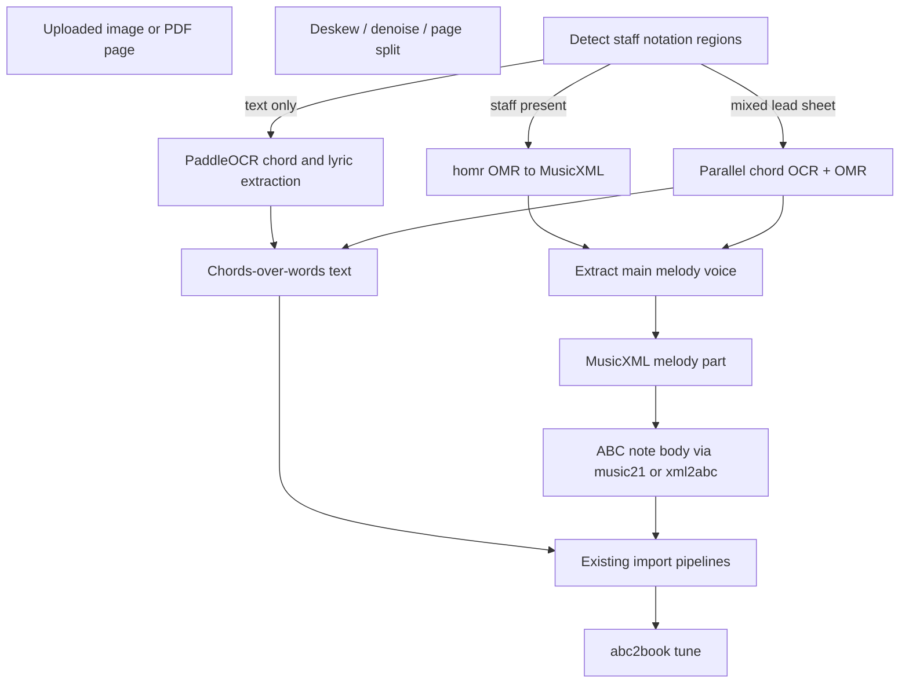

# Image import plan: chord sheets + melody notation (self-hosted)

## Scope

The feature must handle **two content types** in uploaded images (often on the same page):

1. **Chord charts** — lyrics, section headers, chord symbols (text/layout OCR)
2. **Staff notation** — detect when present and extract the **main melody only** as ABC note bodies

This is a **hybrid pipeline**: document OCR for text/chords, OMR for melody staves. Vision LLMs are **not** reliable for reading noteheads; use dedicated OMR for melody.

Existing code to reuse:

- Chord/lyric import: [`src/chordSheetUtils.js`](src/chordSheetUtils.js), [`src/chordProFormatUtils.js`](src/chordProFormatUtils.js)
- Melody ABC import: [`src/scoreImportClient.js`](src/scoreImportClient.js) (`musicXmlToAbc`), or server-side music21 in [`local-resolver/server.py`](local-resolver/server.py)
- Audio melody precedent: [`local-resolver/detect_melody.py`](local-resolver/detect_melody.py) + [`src/melodyFormatter.js`](src/melodyFormatter.js) (quantize to ABC) — useful reference for post-OMR cleanup
- PDF chord extraction precedent: [`scripts/importBrookeMarshalPdf.py`](scripts/importBrookeMarshalPdf.py)



---

## Best tools by job

### 1) Lyrics + stanza structure + chord symbols (text charts)

| Rank | Tool | Why |
|------|------|-----|
| **1** | **[PaddleOCR](https://github.com/PaddlePaddle/PaddleOCR) + PP-Structure** | Best self-hosted default for layout OCR. Apache 2.0. Returns bounding boxes needed for chord-above-lyric alignment. Handles skewed phone photos. |
| **2** | **[Qwen2.5-VL](https://github.com/QwenLM/Qwen2.5-VL) (3B/7B)** | Fallback for messy/handwritten text charts. Structured JSON output. Fits existing OpenAI-compatible LLM config in resolver. Validate chords with rules, not blind trust. |
| **3** | **[docTR](https://github.com/mindee/doctrb)** | Simpler PyTorch-only OCR alternative. |

**Chord alignment approach** (no off-the-shelf tool does this perfectly):

1. OCR with bounding boxes
2. Python heuristics mirroring [`tokenIsChord`](src/chordSheetUtils.js) / [`isSectionHeader`](src/chordSheetUtils.js)
3. X-position alignment of chord tokens to lyric syllables
4. Optional LLM cleanup via existing `RESEARCH_LLM_*` endpoint

### 2) Detecting whether notation is present

Before running heavy OMR, classify the page:

| Method | Role |
|--------|------|
| **Staff segmentation model** (from [oemer](https://github.com/liebharc/oemer) / [homr](https://github.com/liebharc/homr)) | Detect horizontal staff regions; strongest signal |
| **Heuristic staff-line density** | Fast pre-filter on CPU |
| **PaddleOCR layout regions** | Distinguish text blocks from image/staff areas |

Route to OMR only when staff regions are found with sufficient confidence. On **lead sheets**, run chord OCR on text regions and OMR on staff regions **in parallel**.

### 3) Main melody from staff notation (OMR)

Goal: **single melodic voice in ABC**, not full score reconstruction.

| Rank | Tool | Why it fits |
|------|------|-------------|
| **1** | **[homr](https://github.com/liebharc/homr)** | Best open-source choice for **phone photos** of printed notation. End-to-end to MusicXML. Benchmarks ahead of Audiveris/oemer on many real-world samples. Same ecosystem as oemer. |
| **2** | **[oemer](https://github.com/liebharc/oemer)** | Strong on printed Western notation; lighter than Audiveris; good fallback if homr fails on a page. |
| **3** | **[Audiveris](https://github.com/Audiveris/audiveris)** | Most mature and CPU-friendly; best when GPU unavailable and input is clean scans. Slower to integrate (Java CLI). |
| **4** | **[JAZZMUS](https://huggingface.co/JuanCarlosMartinezSevilla/jazzmus-model)** | Only if you need **handwritten** jazz lead sheets (melody + chord symbols on staff). Niche training set. |

**Not recommended for melody OMR:**

- **Vision LLMs (GPT-4o, Claude, Qwen-VL)** — poor at note pitch/rhythm; high hallucination rate on notation
- **Audio tools (Whisper, CREPE, Sheet Sage)** — wrong input modality
- **Full polyphonic OMR as-is** — user only wants main melody; must post-process

**Melody extraction from OMR MusicXML** (new `local-resolver` helper, music21):

1. Parse MusicXML from homr/oemer
2. Select the **main melody part** using rules in order:
   - part named `Melody`, `Voice`, or similar if present
   - else top staff / Part 1
   - else highest average pitch among monophonic or near-monophonic parts
3. Drop accompaniment staves, lyrics staves, and chord-symbol-only layers
4. If OMR returns polyphony on one staff, keep the **highest sounding pitch per onset** (lead-sheet simplification)
5. Detect key/time signature from score metadata
6. Convert melody part to ABC via music21 ABC export or return MusicXML for client [`musicXmlToAbc`](src/musicXmlToAbc.js)

This matches how lead sheets are typically written: one melodic line + chord symbols above.

### 4) Mixed lead sheets (melody + chords + lyrics on one page)

Common format: melody on staff, chord names above staff, lyrics below.

| Content | Tool |
|---------|------|
| Melody notes | homr → melody extraction → ABC |
| Chord symbols above staff | homr may capture some; supplement with PaddleOCR on upper margin, or parse chord text from OMR output |
| Lyrics below staff | PaddleOCR on lyric region |

Merge in the response as a single tune: ABC melody voice + `w:` lyric lines + chord grid.

---

## Recommended architecture

### Backend: unified endpoint

Prefer one endpoint over two, since pages can be mixed:

`POST /transcribe-sheet-image` in [`local-resolver/server.py`](local-resolver/server.py)

```python
{
  "title": "Song Title",
  "artist": "Artist",
  "pageType": "chord_chart" | "lead_sheet" | "mixed" | "notation_only",

  # Chord/lyric path (may be empty)
  "chordSheet": {
    "format": "chords-over-words",
    "text": "...",
    "lines": [...],
    "sections": [...],
    "confidence": 0.0-1.0
  },

  # Melody path (may be empty)
  "melody": {
    "abc": "CDEF ...",           # note body only, or full voice snippet
    "musicXml": "...",           # optional, for client-side re-conversion
    "key": "C",
    "meter": "4/4",
    "source": "homr",
    "confidence": 0.0-1.0,
    "warnings": ["polyphony_simplified"]
  },

  "warnings": [...]
}
```

**Processing steps**

1. Accept `image/*` or PDF page(s)
2. Preprocess: auto-rotate, denoise, perspective correction
3. **Classify regions**: staff vs text
4. If text regions → PaddleOCR → chord/lyric reconstruction
5. If staff regions → **homr** OMR → MusicXML → **main melody extraction** → ABC
6. If low confidence on text → Qwen2.5-VL fallback (chords/lyrics only, not notes)
7. Return combined result for preview/edit

**Docker:** add optional `vision` / `omr` GPU profile in [`local-resolver/docker-compose.yml`](local-resolver/docker-compose.yml):

- PaddleOCR (CPU ok, faster on GPU)
- homr + PyTorch (GPU strongly recommended)
- Audiveris as optional CPU-only fallback container if GPU unavailable

### Frontend

- New import modal (or extend [`ImportFilesModal.js`](src/components/ImportFilesModal.js))
- Client module similar to [`lyricsTranscriptionClient.js`](src/lyricsTranscriptionClient.js)
- Preview tabs: **Chords/Lyrics** (editable text) + **Melody** (editable ABC or notation preview)
- Import:
  - chord text → [`createTuneFromChordSheet()`](src/chordProFormatUtils.js)
  - melody ABC → existing tune voice import (same as Media Import Wizard notation step)

---

## Tool choice matrix

| Requirement | Best tool |
|-------------|-----------|
| Self-hosted chord/lyric OCR | PaddleOCR + heuristics |
| Self-hosted melody from staff photo | **homr** → music21 melody pick → ABC |
| CPU-only server (no GPU) | PaddleOCR + **Audiveris** for OMR |
| Handwritten jazz lead sheet | JAZZMUS (melody) + PaddleOCR (lyrics) |
| Clean scanned lead sheet | homr or oemer |
| Detect notation vs text-only chart | homr/oemer staff segmentation |
| Lowest hallucination risk on notes | OMR only; never vision-LLM for pitch/rhythm |
| Hardest chord layouts | Qwen2.5-VL fallback (text only) |

---

## Suggested rollout

### Phase 1 — MVP
- Page classifier (staff detection)
- PaddleOCR chord/lyric path
- homr melody path with music21 main-melody extraction → ABC
- Upload UI with preview for both outputs

### Phase 2 — quality
- Confidence scores and warnings (polyphony simplified, low OCR confidence)
- Qwen2.5-VL fallback for chord text only
- PDF multi-page support
- Audiveris CPU fallback when homr unavailable

### Phase 3 — polish
- Region-aware mixed lead sheet merging (chords from margin OCR + melody from staff OMR)
- Human-in-the-loop editor for OMR errors before import
- Benchmark suite on real user photos

---

## Bottom line

For **self-hosted image import** covering both chord charts and melody notation:

1. **Chords + lyrics + stanzas:** PaddleOCR + your existing chord-sheet heuristics
2. **Main melody ABC:** **homr** (primary OMR) → MusicXML → **music21 melody-voice selection** → ABC
3. **Notation detection:** staff segmentation from the OMR toolchain before running full transcription
4. **Do not use vision LLMs for note transcription** — use OMR; reserve VLMs for text/chord cleanup only
5. **Reuse abc2book import paths** — chord text and ABC/MusicXML already have mature client-side import code

Next step after plan approval: build Phase 1 with a benchmark set that includes chord-only pages, notation-only pages, and mixed lead sheets.
