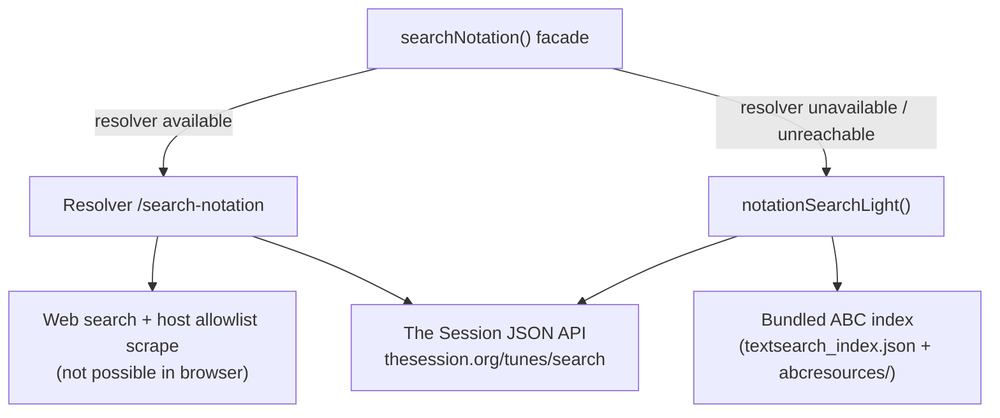

# Lightweight Notation Search (No Resolver Fallback)

## Feasibility

**Yes, with clear limits.** Much of the stack already exists client-side; the resolver mainly adds **web search + server-side HTML scraping** that browsers cannot do safely.



| Capability | Resolver | Lightweight fallback |
|---|---|---|
| Bundled local ABC (FolkTuneFinder, Norbeck, Folkinfo, etc.) | No | **Yes** — already used by [`useTextSearchIndex.js`](src/useTextSearchIndex.js) |
| The Session API | Yes | **Yes** — proven in [`TheSessionSearchSelectorModal.js`](src/components/TheSessionSearchSelectorModal.js) via direct `axios.get` |
| Web search (DuckDuckGo/Serper/Brave) | Yes | **No** — needs server + API keys |
| Scrape abcnotation.com, folkinfo pages, `.abc` on random hosts | Yes | **No** — blocked by CORS in browser |
| Same result shape for import/merge | Yes | **Yes** — reuse [`normalizeNotationSearch`](src/notationSearchClient.js) + [`importedTuneFromNotationCandidate`](src/notationImportUtils.js) |

**Gap today:** When the resolver is down, [`LocalSearchSelectorModal.js`](src/components/LocalSearchSelectorModal.js) stops after local index search (lines 285–289) and shows external links — it never tries The Session from the browser. [`bulkCheckFixActions.js`](src/bulkCheckFixActions.js) calls `searchNotation` which always goes through [`fetchViaMediaProxy('/search-notation')`](src/notationSearchClient.js) and fails without a resolver.

---

## Recommended architecture

### 1. New module: `src/notationSearchLight.js`

Pure async functions (no React hooks):

**A. Local collection search**
- Extract the search/load logic from [`useTextSearchIndex.js`](src/useTextSearchIndex.js) into reusable helpers (or import shared helpers from a new `src/localAbcCollectionSearch.js`).
- Lazy-load `textsearch_index.json` once (same `resourceUrl` pattern as the hook).
- Given `title` (+ optional `artist`), return top match(es) as notation candidates:
  - `abc` text via `loadTuneTexts` + `abcTools.json2abc`
  - `source`: collection label from [`textSearchIndexUtils.js`](src/textSearchIndexUtils.js)
  - Reuse [`isStrongLocalMatch`](src/textSearchIndexUtils.js) to short-circuit like [`AddTuneWebSearchButton.js`](src/components/AddTuneWebSearchButton.js) does.

**B. The Session search**
- Port the resolver’s The Session path from [`local-resolver/notation_fetch.py`](local-resolver/notation_fetch.py) into JS:
  - `GET https://thesession.org/tunes/search?format=json&perpage=50&q=...`
  - Fetch top N tune details; build full ABC with headers (`build_thesession_setting_abc` equivalent)
  - Extract `tuneMeta` (`extract_thesession_tune_meta` equivalent)
  - Score title/artist matches (port `score_title_artist_match` logic from Python or add a small JS scorer mirroring [`textSearchIndexUtils`](src/textSearchIndexUtils.js) patterns)
- Return candidates in the **same shape** as `normalizeSingleNotationResult` expects (`abc`, `source`, `sourceUrl`, `title`, `artist`, `tuneMeta`, `preview`).

**C. Orchestrator: `searchNotationLight({ title, artist, songType, onProgress, signal })`**
- Order (mirrors [`AddTuneWebSearchButton.run`](src/components/AddTuneWebSearchButton.js)):
  1. Local collection (fast, offline-capable)
  2. If no strong local match → The Session
- Return `{ multiple: false, ... }` or `{ multiple: true, candidates: [...] }` compatible with existing pickers and `mergeImportedTune`.

### 2. Facade in `src/notationSearchClient.js`

Add routing (fallback-only per your choice):

```javascript
export async function searchNotation(options) {
  const useResolver = options.forceResolver !== false
    && (options.resolverAvailable ?? await probeResolverIfNeeded())

  if (useResolver) {
    try {
      return await searchNotationViaResolver(options)
    } catch (err) {
      if (!isMediaResolverInfrastructureError(err)) throw err
    }
  }
  return searchNotationLight(options)
}
```

- Keep existing resolver path unchanged (rename current body to `searchNotationViaResolver`).
- Callers that already check `useMediaResolverHealth()` can pass `resolverAvailable: false` to skip the attempt entirely.

### 3. Wire existing UI to benefit automatically

| Caller | Change |
|---|---|
| [`bulkCheckFixActions.js`](src/bulkCheckFixActions.js) | Pass `resolverAvailable` from health store (or let facade probe); **Search ABC / Search All** work offline for trad tunes |
| [`LocalSearchSelectorModal.js`](src/components/LocalSearchSelectorModal.js) | When `!useUnifiedSearch`, after local results call `searchNotationLight` instead of stopping |
| [`AddTuneWebSearchButton.js`](src/components/AddTuneWebSearchButton.js) | Optional: replace bespoke local-then-resolver flow with unified `searchNotation` facade |

No resolver changes required for v1 fallback.

### 4. Tests

- **`src/notationSearchLight.test.js`**: The Session ABC header wrapping, candidate scoring, local strong-match short-circuit (mock fetch/axios).
- **`src/notationSearchClient.test.js`**: facade falls back on infrastructure error; uses resolver when available.
- Reuse Python test fixtures from [`local-resolver/test_notation_fetch.py`](local-resolver/test_notation_fetch.py) as JSON mocks for Session responses.

---

## What users will notice

- **Resolver running:** unchanged — full web ABC discovery (abcnotation.com, `.abc` snippets, etc.).
- **Resolver off:** Search ABC / Search All can still find notation from **your bundled collections** and **The Session**; pop/rock tunes that only exist on Ultimate Guitar–style sites or abcnotation.com pages will still miss unless they’re in the local index.

---

## Out of scope (unless you ask later)

- Browser-side web search (would expose API keys or require a CORS proxy).
- Duplicating the widened host allowlist / snippet scraping from [`notation_fetch.py`](local-resolver/notation_fetch.py) in the client.
- Replacing the resolver entirely.
