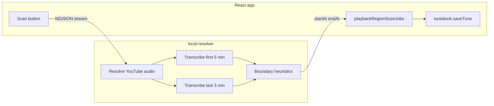

# Link Scan for Playback Region Detection

## How well will this work? (honest assessment)

**Good fit — your main use case (YouTube host talk before the tune):**
- Session videos, concert uploads, and lesson intros often have 30–120s of *spoken* introduction, then the music starts.
- Whisper already returns timed segments in the resolver ([`local-resolver/server.py`](local-resolver/server.py) `_normalize_whisper_segments`).
- A practical v1 rule — *find the last speech cluster at the beginning, then look for a gap before sustained music* — should cut most "blah blah before the tune" intros reasonably well.

**Mixed / weak cases:**
| Scenario | Expected behavior |
|---|---|
| Instrumental tune, no intro speech | `startAt` stays empty (0) — correct |
| Song starts singing immediately after talk | Often OK if there is a pause between talk and verse; fails if speech flows straight into sung vocals |
| Sung intro from second 0 | Whisper transcribes lyrics as speech — **cannot** distinguish from host talk without extra signals |
| Music under quiet speech (DJ voice-over) | Unreliable |
| Applause / crowd noise | Whisper may hallucinate short segments or stay silent — boundary can be fuzzy |
| Trailing "subscribe / thanks for watching" | Similar to intro speech; tail scan can find it, but applause/outro music blurs the cut |
| Long videos (10+ min) | Full-file Whisper is slow; **must** scan only head + tail windows |

**Recommendation:** Position this honestly in UI/help as **"detect intro/outro speech"**, not "detect music." For YouTube intro trimming it should be useful often, but not magic. A hybrid algorithm (Whisper segments + simple RMS/energy onset after the last intro speech block) will outperform transcription alone for instrumental starts after talking.



---

## Architecture

### 1. New resolver endpoint: `POST /detect-playback-region`

Add [`local-resolver/playback_region_detect.py`](local-resolver/playback_region_detect.py) with pure, testable boundary logic:

**Input:** `sourceUrl` (+ optional `sourceType`), same audio resolution path as [`/transcribe`](local-resolver/server.py) via existing `_resolve_audio_payload`.

**Processing (with streamed progress):**
1. `resolve` (5%) — fetch YouTube/audio bytes
2. `convert` (15%) — ffmpeg → 16 kHz wav; ffprobe duration
3. `transcribe_intro` (20–55%) — whisper **first 300s** only (`ffmpeg -t 300`)
4. `transcribe_outro` (55–85%) — whisper **last 180s** only (`ffmpeg -ss max(0,duration-180)`)
5. `analyze` (90%) — compute boundaries
6. `done` (100%) — return result

**Boundary heuristics (v1):**
- **startAt:** Walk segments in intro window in time order. Build an "intro speech run" while inter-segment gaps stay below ~4s. After the run ends, require either (a) a gap ≥ ~2.5s to the next segment, or (b) an RMS energy rise in the wav shortly after the last intro segment (numpy on decoded samples — no new dependency). `startAt = last_intro_segment.end + 0.3s` (rounded to 0.1s). If no intro speech found → `startAt: 0` (leave field empty on client).
- **endAt:** Mirror on tail segments — first "outro speech run" that starts after a ≥2.5s gap from prior content. `endAt = outro_run.start - 0.3s`. If none found → `endAt: 0` (play to end).
- Return `{ startAt, endAt, duration, confidence, method, debug: { introSegments, outroSegments } }` for tests; omit verbose debug in production JSON if desired.

**Streaming:** Follow existing NDJSON pattern from [`stream_analyze_media_events`](local-resolver/server.py) / [`search-lyrics`](local-resolver/server.py):
- `Accept: application/x-ndjson` → `{type:progress, message, progress, stage}` lines + final `{type:result, body}`
- Non-streaming JSON fallback for older clients

**Whisper options for scan:** Use `format_as_lyrics=False`, short prompt tuned for speech (similar to [`VOICE_WHISPER_OPTIONS`](local-resolver/voice_command.py)) — avoid stanza line-break formatting that obscures timing.

Register endpoint in health `endpoints` list; gate with `require_resolver_feature("whisper")`.

**Tests:** [`local-resolver/test_playback_region_detect.py`](local-resolver/test_playback_region_detect.py) — unit tests for boundary logic with synthetic segment fixtures (intro talk → gap → silence; trailing talk; no speech; sung-from-start edge case).

---

### 2. Frontend client: [`src/playbackRegionScanClient.js`](src/playbackRegionScanClient.js)

Mirror [`src/lyricsSearchClient.js`](src/lyricsSearchClient.js) / [`src/mediaAnalysisClient.js`](src/mediaAnalysisClient.js):
- `scanPlaybackRegion({ sourceUrl, sourceType, accessToken, signal, onProgress })`
- `handlePlaybackRegionScanStreamEvent(event, onProgress)`
- NDJSON reader + JSON fallback

---

### 3. Background job store: [`src/playbackRegionScanJobs.js`](src/playbackRegionScanJobs.js)

Mirror [`src/mediaAnalysisJobs.js`](src/mediaAnalysisJobs.js), keyed by **`tuneId:linkIndex`** (multiple links per tune):

```js
{ isScanning, status, progress, error, result }
```

- Job continues when user closes Links modal or navigates away (no `AbortController` on unmount).
- Optional cancel only if user clicks Scan again while same link is scanning (same pattern as [`useTuneMediaAnalysis`](src/useTuneMediaAnalysis.js)).

**Completion handler** (in [`src/usePlaybackRegionScan.js`](src/usePlaybackRegionScan.js)):
1. Load live tune from `tunebook` / `tunes[tuneId]`
2. Set `links[linkIndex].startAt` / `endAt` as string seconds (matching [`LinksEditor`](src/components/LinksEditor.js) format)
3. Call `tunebook.saveTune(tune)` — **no confirmation dialog**
4. If parent `onChange` callback is wired, propagate updated links so open modal stays in sync

Wire provider at app level similar to `TuneMediaAnalysisProvider` (can reuse same deps: `tunebook`, `tunes`, `token`, `forceRefresh`).

---

### 4. UI: [`src/components/LinksEditor.js`](src/components/LinksEditor.js)

Per link row, beside **Start At (seconds)**:

```
[ Start At input ]  [ Scan ]
<SearchProgressBar when scanning this link>
```

**Visibility:** `resolverAvailable && features.whisper && link.link` is a non-empty http(s)/YouTube URL (not inline `data:audio/`).

**Button behavior:**
- Idle: label **Scan**
- Scanning: label shows live `status` from job store (e.g. "Transcribing intro...")
- Click while idle → `runPlaybackRegionScan(tuneId, linkIndex, link)`
- Click while scanning same link → cancel (optional, matches analyze pattern)

Use existing [`SearchProgressBar`](src/components/SearchProgressBar.js) below the row (same as [`LyricsSearchButton`](src/components/LyricsSearchButton.js)).

Pass `tune`, `token` (or use context provider) into `LinksEditor` from [`LinksEditorModal`](src/components/LinksEditorModal.js).

**Help text:** Extend [`LINKS_FIELD_HELP.startAt`](src/formFieldHelpText.js) to mention Scan auto-detects intro/outro speech when resolver Whisper is available.

---

## Files to touch (summary)

| Area | Files |
|------|-------|
| Resolver | `playback_region_detect.py`, `server.py`, `test_playback_region_detect.py` |
| Client | `playbackRegionScanClient.js`, `playbackRegionScanJobs.js`, `usePlaybackRegionScan.js` |
| UI | `LinksEditor.js`, `LinksEditorModal.js`, `App.js` (provider), `formFieldHelpText.js` |
| Tests | `playbackRegionScanClient.test.js` (stream parser), resolver unit tests |

---

## Out of scope (v1)

- MediaPlaybackRegionPanel / loop rows (user chose Links editor only)
- Auto-scan on link paste (manual Scan only)
- Undo toast after auto-apply (could add later; tune edit history may already help)
- Full-song transcription (too slow; head/tail windows only)
