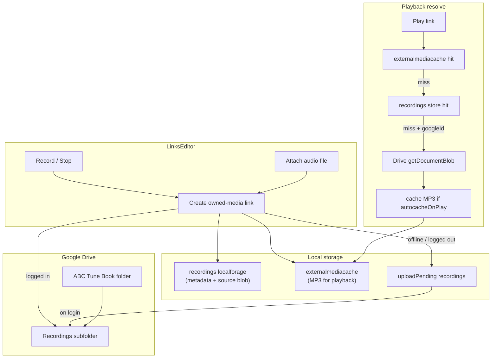

# Links Editor Recording + Attach + Drive Sync

## Current state

- [LinksEditor.js](src/components/LinksEditor.js) supports YouTube URLs, manual URLs, and (gated by `bookstorage_inlineaudio`) inline `data:audio/` file attach — **no mic recording**, and inline attach **does not sync to Drive**.
- [RecordingsManager.js](src/components/RecordingsManager.js) has working mic capture via [useAudioUtils.js](src/useAudioUtils.js) but is **disconnected** from links.
- Linked-media offline cache lives in [externalMediaAudioCache.js](src/externalMediaAudioCache.js) via [mediaCacheQueue.js](src/mediaCacheQueue.js) — **not synced to Drive**.
- Drive uploads today go to the `ABC Tune Book` folder root. There is **no `Recordings` subfolder** yet.
- Offline settings in [offlineMediaSettings.js](src/offlineMediaSettings.js): `autocacheOnPlay` controls whether linked HTTP/YouTube media is cached on playback start.

## Unified “owned media” model

**Mic recording and file attach share one pipeline.** Both produce a link backed by the same storage and sync rules — only the audio source differs (mic blob vs picked file).

Use URI scheme `abcbook-recording:{recordingId}` for both (keeps ABC compact; `recordingId` is a generic local asset id, not “mic-only”).



## Link data model

Extend `tune.links[]` entries with optional owned-media metadata:

| Field | Purpose |
|-------|---------|
| `link` | `abcbook-recording:{recordingId}` |
| `recordingId` | Localforage key in `recordings` store |
| `googleId` | Drive file id after upload (serialized to ABC for cross-device) |
| `uploadPending` | `true` when saved locally but not yet on Drive |
| `source` | Optional: `'mic'` or `'file'` (UI label only; not required for playback) |

**ABC serialization** — extend [useAbcTools.js](src/useAbcTools.js):

- `% abcbook-link-recording-id-{k}`
- `% abcbook-link-google-id-{k}`

**Delete behavior (confirmed):** Removing a link only splices the link array. The Drive file stays in `Recordings/` and local blobs are retained.

## New module: `src/linkRecording.js`

Centralize owned-media link logic:

### Create (record or attach)

1. **`createRecordingLink({ tune, blob, title? })`** — mic WAV blob from `useAudioUtils`
2. **`createAttachedAudioLink({ tune, file })`** — user-picked `File` from file input

Shared internal **`createOwnedMediaLink({ tune, audioBlob, title, source })`**:

- Generate `recordingId` via `utils.generateObjectId()`
- Decode input (WAV, MP3, OGG, etc.) → MP3 (96 kbps) via [MP3Converter.js](src/MP3Converter.js)
- Write MP3 to `externalmediacache` immediately (key: `extmedia:{tuneId}:{linkIndex}:{linkUri}`)
- Save to `recordings` localforage: `{ id, tuneId, tuneName, name, type: 'audio/mpeg', data/blob, googleId, uploadPending, source, createdTimestamp }`
- Return link object `{ title, link: 'abcbook-recording:'+id, recordingId, startAt:'', endAt:'' }`
- If `token` present: call `uploadRecordingToDrive`; else set `uploadPending: true`

### Upload

3. **`uploadRecordingToDrive({ recording, token })`**
   - `findTuneBookFolderInDrive()` → **`findOrCreateRecordingsFolderInDrive(parentId)`** (new in [useGoogleDocument.js](src/useGoogleDocument.js))
   - `createDocument(filename, mp3Blob, 'audio/mpeg', 'Recording from TuneBook', recordingsFolderId)`
   - Patch recording + any tune links with `googleId`, clear `uploadPending`
   - Trigger `updateSheet(0)`

4. **`syncPendingRecordingUploads({ token, tunes, saveTune })`**
   - On login: upload all `uploadPending && !googleId` recordings; patch tunes; toast count

### Resolve (playback + on-demand Drive load)

5. **`resolveRecordingLinkAudio(link, tuneId, linkIndex, accessToken, options)`**

   Resolution order:

   1. **`externalmediacache`** — preferred for playback (MP3, fast)
   2. **`recordings` localforage** — convert/re-cache to MP3 if needed
   3. **Google Drive** — if `link.googleId` (or recording record’s `googleId`) and `accessToken`: `getDocumentBlob(googleId)`, decode → MP3
   4. Fail with clear error if offline and nothing local

   **Caching after Drive fetch** (respect [offlineMediaSettings.js](src/offlineMediaSettings.js)):

   - **Always** write MP3 to `externalmediacache` when resolving for **active playback** (user is listening; must work offline next time on same device)
   - When resolving outside playback (e.g. bulk prefetch): only cache if `autocacheOnPlay` is enabled — same semantics as existing linked-media cache in [useTuneBookMediaController.js](src/useTuneBookMediaController.js) `scheduleOfflineMediaQueueJobs`
   - Optionally enqueue a `mediaCacheQueue` job for owned-media links when `autocacheOnPlay` is on and tune is played (consistent with YouTube/HTTP links)

   Cross-device flow: Device B receives ABC with `googleId` but no local blob → first play fetches from Drive → caches locally → plays.

## Playback integration

- [mediaLinkResolve.js](src/mediaLinkResolve.js): `recording` src type for `abcbook-recording:` URIs; treat as local-first, cacheable
- [checkTuneLinkPlayback.js](src/checkTuneLinkPlayback.js): attempt resolve; report “needs login” if only `googleId` exists and offline
- [useTuneBookMediaController.js](src/useTuneBookMediaController.js):
  - `getSrcType()` returns `recording` for `abcbook-recording:` links
  - `startLinkedMediaPlayback` / `prepareExternalMedia`: call `resolveRecordingLinkAudio`; play via blob URL (cached native path)
  - `scheduleOfflineMediaQueueJobs`: for `recording` type with `googleId` but cache miss, trigger resolve+cache when `autocacheOnPlay` is on
- Region scan / media import wizard: treat resolved recording blob like `data:audio/` where the wizard needs a fetchable source

## UI changes in LinksEditor

Toolbar (next to “New Link”), **always visible** (no `bookstorage_inlineaudio` gate for this flow):

| Control | Action |
|---------|--------|
| **Record** | Mic capture via `useAudioUtils`; on stop → `createRecordingLink` |
| **Attach** | File input `accept="audio/*"`; on pick → `createAttachedAudioLink` with filename as default title |
| Existing **New Link** / YouTube | Unchanged for external URLs |

Per owned-media link card (`abcbook-recording:` prefix):

- Hide editable URL field
- Show source badge: **Recording** / **Attached file**
- Sync badge: **Synced** / **Pending upload** / **Local only**
- Download button (export MP3)
- Delete link only (Drive file kept)

**Replace** the old gated `data:audio/` inline attach in LinksEditor with this Drive-backed attach path. Legacy `data:audio/` links already in tune books continue to play as today.

## Login / deferred sync

In [App.js](src/App.js), after tune book is found on login:

```javascript
syncPendingRecordingUploads({ token, tunes, saveTune: tunebook.saveTune })
```

## Tests

- `createRecordingLink` / `createAttachedAudioLink` produce link + cache entries
- `resolveRecordingLinkAudio`: cache hit → local store → Drive fallback (mocked)
- Drive fetch writes to `externalmediacache` on playback resolve
- `autocacheOnPlay` off: Drive fetch on play still caches for playback; prefetch path respects setting
- ABC round-trip for `recordingId` + `googleId`
- `syncPendingRecordingUploads` clears `uploadPending`

## Files to touch (primary)

| File | Change |
|------|--------|
| `src/linkRecording.js` | **New** — create (record + attach), upload, resolve, sync |
| `src/components/LinksEditor.js` | Record, Attach, owned-media link cards |
| `src/useGoogleDocument.js` | `findOrCreateRecordingsFolderInDrive` |
| `src/useAbcTools.js` | Serialize/deserialize recording link fields |
| `src/mediaLinkResolve.js` | `recording` src type |
| `src/useTuneBookMediaController.js` | Playback + Drive fallback + cache settings |
| `src/App.js` | Login-triggered pending upload sync |
| `src/checkTuneLinkPlayback.js` | Bulk check support |
| `src/linkRecording.test.js` | **New** tests |

## Out of scope

- Re-enabling legacy `/recordings` routes or `RecordingsManagerModal`
- Re-activating `useSyncWorker`
- Embedding full audio as `data:audio/` in ABC for new attaches
- Deleting Drive files when a link is removed
- Bulk download of all Recordings from Drive on login (on-demand per play only)
