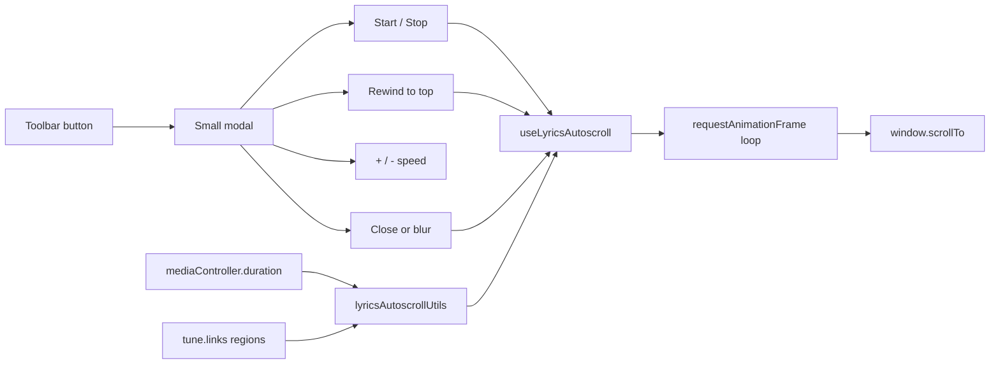

# Lyrics autoscroll for single view

## Context

Single-tune view lives in [`src/components/MusicSingle.js`](src/components/MusicSingle.js). Lyrics render in several layouts depending on view mode:

- **Lyrics + chords** (`chordsBlock` / `chordsInline`): `.lyrics` or [`TimedLyricsChordsView`](src/components/TimedLyricsChordsView.js)
- **Music and lyrics** (`musicAndLyrics`): `.full-lyrics-panel` inside `.music-and-lyrics-text`

Notation autoscroll already uses `window.scrollTo` during MIDI playback ([`src/components/AbcSynth.js`](src/components/AbcSynth.js) ~274–284). Lyrics autoscroll will use the same page-level scroll approach so it works on phone without touching the screen.

Media duration is available on `props.mediaController.duration` (and via `getPlaybackProgress().duration` when loaded). Playback region boundaries are already modeled in [`src/mediaPlaybackUtils.js`](src/mediaPlaybackUtils.js) (`getLinkRegionStart`, `getLinkRegionEnd`).

## Implementation

### 1. Pure utilities — `src/lyricsAutoscrollUtils.js`

Extract testable logic:

- **`LYRICS_AUTOSCROLL_DEFAULT_DURATION_SEC = 180`** (3-minute fallback)
- **`getEffectiveMediaDurationSeconds(tune, totalMediaDuration, linkIndex)`**
  - If `totalMediaDuration <= 0` → return 180
  - Use active link (index 0 or current `mediaLinkNumber`) with `getLinkRegionStart` / `getLinkRegionEnd`
  - If `end > start` → `end - start`
  - Else if `start > 0` → `totalMediaDuration - start`
  - Else → full `totalMediaDuration`
- **`findLyricsScrollRoot(musicSingleEl)`** — query first visible lyrics container:
  `.full-lyrics-panel`, `.timed-lyrics-chords-view`, or `.lyrics`
- **`getLyricsScrollMetrics(scrollRootEl)`** — compute `startY` (top of lyrics in document coords) and `distance` (pixels from lyrics top to bottom of lyrics content, capped at page max scroll)
- **`computePixelsPerSecond(distancePx, durationSec, speedMultiplier)`** — `(distance / duration) * multiplier`
- Speed step constants for +/- (e.g. multiply/divide by ~1.2, clamp multiplier roughly 0.25×–4×)

Add **`src/lyricsAutoscrollUtils.test.js`** covering duration math (full file, start marker, loop region, zero duration fallback).

### 2. Scroll hook — `src/useLyricsAutoscroll.js`

State: `isScrolling`, `speedMultiplier` (session-only, resets on tune change).

**On Start:**
1. Find lyrics root inside `.music-single`
2. `window.scrollTo(0, startY)` — begin at top of lyrics
3. Compute base duration from `getEffectiveMediaDurationSeconds(tune, mediaController.duration, linkIndex)`
4. Start rAF loop: each frame `scrollY += pixelsPerSecond * deltaSec`; stop when `scrollY >= startY + distance` or user stops

**On Stop / cleanup:** cancel rAF; reset `isScrolling`.

**On Rewind:** stop any active scroll, then `window.scrollTo(0, startY)` using freshly resolved lyrics metrics (does not auto-restart).

**Lifecycle:** stop when tune id changes, component unmounts, user taps Stop, **modal closes** (`onHide`), or **modal loses focus** (blur on the modal dialog element via `onBlur` with `relatedTarget` check so focus moves outside the modal). Reopening the dialog always shows a stopped state.

### 3. UI component — `src/components/LyricsAutoscrollModal.js`

Follow existing modal-button pattern from [`BoostSettingsModal`](src/components/BoostSettingsModal.js):

- Toolbar **Button** with a scroll-style icon (add `scrollDown` to [`src/Icons.js`](src/Icons.js) — simple down-arrow-over-lines SVG)
- **`Modal size="sm" centered"`** — intentionally compact even on narrow viewports (do not use fullscreen `useResponsiveModalProps` here)
- Body layout:
  - **Start / Stop** toggle button (green/red, uses existing `play` / `pause` or `stop` icons)
  - **Rewind** button (uses existing `arrowgoback` icon) — scrolls to top of lyrics; also stops autoscroll if running
  - **Row:** `−` button | speed label (e.g. `100%` or `~3:00`) | `+` button
- **Stop on dismiss:** wire `onHide` to call `stop()` before closing; attach `onBlur` to the modal content wrapper so tapping outside / losing focus stops scroll and closes (or stops then closes via backdrop click)
- `setBlockKeyboardShortcuts(show)` while modal open (same as other modals)
- Props: `tune`, `tunebook`, `mediaController`, `mediaLinkNumber`, `setBlockKeyboardShortcuts`, `visible` (only rendered when lyrics exist)

Speed label shows multiplier relative to media-calibrated base (100% = scroll finishes in effective media duration).

### 4. Integrate into MusicSingle

In [`src/components/MusicSingle.js`](src/components/MusicSingle.js):

- Import `LyricsAutoscrollModal`
- Show in toolbar (`music-buttons-col-right`) when `plainLyricLines.length > 0` and lyrics are visible in the current view (`isChordLayout || isMusicAndLyricsView`)
- Hide during practice playback-only mode (`practiceHidesVisibleUi`)
- Pass `mediaController`, `tune`, `mediaLinkNumber` (existing state), `setBlockKeyboardShortcuts`

No changes to lyrics markup required — root element is discovered at scroll start.

### 5. CSS (minimal)

Small scoped rules in [`src/App.css`](src/App.css) or inline in the modal:

- Centered button group for speed controls
- Adequate touch targets on mobile (`min-width` / padding on +/- buttons)

## Edge cases

| Case | Behavior |
|------|----------|
| No media loaded (`duration === 0`) | 180s base duration |
| Media loads after dialog opened | Base duration recalculated next time user presses Start |
| Very short lyrics (fits on screen) | `distance ≈ 0` → Start is a no-op / show brief “nothing to scroll” in modal |
| User scrolls manually while autoscrolling | rAF continues from current `window.scrollY` (no fight) |
| Modal closed (backdrop, X, or navigate away) | Autoscroll stops immediately |
| Modal blurs (focus leaves dialog) | Autoscroll stops immediately |
| Rewind pressed mid-scroll | Scroll stops, page jumps to lyrics top |
| Tune navigation (swipe) | Hook cleanup stops scroll |

## Files to add/change

| File | Action |
|------|--------|
| `src/lyricsAutoscrollUtils.js` | **Add** |
| `src/lyricsAutoscrollUtils.test.js` | **Add** |
| `src/useLyricsAutoscroll.js` | **Add** |
| `src/components/LyricsAutoscrollModal.js` | **Add** |
| `src/Icons.js` | **Add** `scrollDown` icon |
| `src/components/MusicSingle.js` | **Wire** toolbar button |
| `src/App.css` | **Minor** modal layout styles |

## Test plan

- Unit tests for duration calculation (region, fallback, multiplier)
- Manual on phone/narrow viewport:
  - Open tune with lyrics in chord view → Start → lyrics scroll without touch
  - Tune with linked audio (~4 min) → scroll completes in ~4 min at 100%
  - +/- adjusts speed visibly
  - Stop halts immediately
  - Close modal or tap outside → scroll stops
  - Rewind jumps to lyrics top
  - Tune without media → ~3 min scroll at 100%
