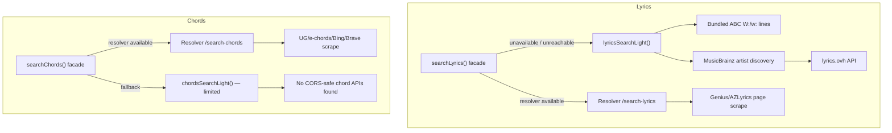

# Lightweight Lyrics & Chords Search (No Resolver Fallback)

## Feasibility summary



| Capability | Resolver | Lightweight fallback |
|---|---|---|
| **Lyrics** from lyrics.ovh | Yes | **Yes** — `access-control-allow-origin: *` (verified) |
| Artist discovery (MusicBrainz) | Yes | **Yes** — CORS `*` on `/ws/2/recording` (verified) |
| Genius / AZLyrics HTML scrape | Yes | **No** — Genius API has no ACAO; page fetch blocked by CORS |
| **Lyrics** from bundled ABC `W:`/`w:` | No | **Yes** — same index as notation ([`localAbcCollectionSearch.js`](src/localAbcCollectionSearch.js)) |
| **Chord sheets** from UG/e-chords/azchords | Yes | **No** — sites block cross-origin fetch (403 / no ACAO) |
| Bing RSS / Brave web search | Yes (server + API key) | **Unlikely** — Bing RSS returned no ACAO in probe |
| Public chord API (like lyrics.ovh) | N/A | **None found** in repo or quick external scan |

**Bottom line:** Lyrics fallback is worth building and will materially improve Bulk Check **Search All** and offline trad/pop searches when an artist is known or discoverable. Chords fallback cannot match resolver quality; implement the same facade pattern for consistency, run a short CORS probe spike on any candidate URLs, and fail with a clear message rather than pretending parity.

---

## Part 1 — Lyrics (primary value)

Mirror the notation architecture already in place.

### 1. Shared utilities (reuse where possible)

- Reuse [`notationMatchUtils.js`](src/notationMatchUtils.js) for title/artist scoring (same algorithm as [`lyrics_fetch.py`](local-resolver/lyrics_fetch.py)).
- Port **lyrics text cleanup** from Python (`parse_plain_lyrics_text`, `finalize_lyrics_lines`, noise-line filters) into `src/lyricsParseUtils.js` — keep behavior aligned with [`local-resolver/test_lyrics_fetch.py`](local-resolver/test_lyrics_fetch.py).

### 2. New modules

**`src/recordingArtistsClient.js`**
- Browser client for artist discovery via MusicBrainz only (Genius search API lacks CORS; skip in v1).
- Port logic from [`recording_artists.py`](local-resolver/recording_artists.py): `_discover_artists_musicbrainz`, generic-artist filtering, prepend user-supplied artist.

**`src/lyricsOvhClient.js`**
- `GET https://api.lyrics.ovh/v1/{artist}/{title}` via `axios`.
- Normalize to candidate shape: `{ text, lines, stanzas, source, sourceUrl, title, artist, preview }`.

**Extend [`localAbcCollectionSearch.js`](src/localAbcCollectionSearch.js)**
- Add `searchLocalCollectionLyrics({ title, abcTools, textSearchIndex, limit })`:
  - Reuse `searchLocalCollection` + `loadAbcTextsFromIndexIds`.
  - Parse tunes with `abcTools.abc2Tunebook`; extract `words` / `wLines` via existing [`wLinesUtils.js`](src/wLinesUtils.js) (`getPlainLyricLines` pattern).
  - Short-circuit on [`isStrongLocalMatch`](src/textSearchIndexUtils.js) like notation.

**`src/lyricsSearchLight.js`**
- Orchestrator order (mirrors resolver + notation light):
  1. Local collection lyrics (fast, offline)
  2. If no strong local match: MusicBrainz artists → lyrics.ovh per artist
  3. Merge, score, dedupe; return `{ multiple: false }` or `{ multiple: true, candidates }`
- Reuse normalize helpers (extract to `src/lyricsSearchNormalize.js` if needed to avoid circular imports — same pattern as [`notationSearchNormalize.js`](src/notationSearchNormalize.js)).

### 3. Facade in [`lyricsSearchClient.js`](src/lyricsSearchClient.js)

Copy routing from [`notationSearchClient.js`](src/notationSearchClient.js):

```javascript
export async function searchLyrics(options) {
  if (shouldUseResolver(options)) {
    try { return await searchLyricsViaResolver(options) }
    catch (err) {
      if (!isMediaResolverInfrastructureError(err)) throw err
    }
  }
  return searchLyricsLight(options)
}
```

- Rename current body to `searchLyricsViaResolver`.
- `shouldUseResolver`: same rules as notation (`resolverAvailable`, `forceLightweight`, health store, proxy configured).

### 4. Wire callers

| Caller | Change |
|---|---|
| [`bulkCheckFixActions.js`](src/bulkCheckFixActions.js) | Pass `resolverAvailable` + ensure chord failure still falls through to lyrics (already does); lyrics light makes **Search Chords And Lyrics** / **Search All** useful offline |
| [`BulkCheckFixDropdown.js`](src/components/BulkCheckFixDropdown.js) | Already passes `resolverAvailable` — extend to lyrics/chords calls |
| [`AddTuneWebSearchButton.js`](src/components/AddTuneWebSearchButton.js) | Pass `resolverAvailable` into `searchLyrics` / `searchChords` |
| [`useMediaImportWebSearch.js`](src/components/mediaImportWizard/useMediaImportWebSearch.js) | Same |
| [`importReviewEnrichment.js`](src/importReviewEnrichment.js) | Same |

### 5. Field augmentation button UI (required)

Centralize the pattern in [`LyricsSearchButton.js`](src/components/LyricsSearchButton.js) and [`ChordsSearchButton.js`](src/components/ChordsSearchButton.js) (optionally extract a tiny shared `FieldLookupButtonGroup` helper for the ButtonGroup markup). **Do not** duplicate resolver/availability branching at each call site — callers keep using these two components only.

**Rule:** automatic in-app lookup available → **ButtonGroup**; otherwise → **external link only**.

| Field | Automatic lookup? | UI |
|---|---|---|
| **Lyrics** | **Always** (light fallback: local ABC + lyrics.ovh + MusicBrainz; resolver adds scrape when up) | `[ Search ] [ ↗ ]` — main button runs in-app search; right button opens Google lyrics search in new tab |
| **Chords** | Only when resolver reachable (no browser chord sources) | Resolver up: `[ Search ] [ ↗ ]` (+ existing **Update lyrics** toggle beside group in ChordsWizard). Resolver down: single external-link control only (no disabled Search stub) |

**ButtonGroup layout** (match existing lyrics external-link pattern):

```text
┌─────────────────┬───┐
│ Search (icon+label on wide) │ ↗ │
└─────────────────┴───┘
```

- Main button label: **Search** (not "Search Lyrics" / "Search Chords"); show **Cancel** while busy (existing job pattern).
- Right button: `tunebook.icons.externallink`, `target="_blank"`, `rel="noreferrer"`, opens [`buildGoogleLyricsSearchUrl`](src/components/LyricsSearchButton.js) or [`buildGoogleChordsSearchUrl`](src/chordSearchSites.js).
- Remove the current resolver-off behavior where the main button *becomes* the external link ([`LyricsSearchButton.js`](src/components/LyricsSearchButton.js) lines 141–160).
- Add the missing external-link sibling to [`ChordsSearchButton.js`](src/components/ChordsSearchButton.js) when resolver is available (today it only has Search + Update lyrics toggle).
- Pass `resolverAvailable` into `searchLyrics` / `searchChords` from both button components.

**Call sites to verify (all use shared components — no one-off markup):**

| Location | Component |
|---|---|
| [`AbcEditor.js`](src/components/AbcEditor.js) — lyrics tab toolbar | `LyricsSearchButton` |
| [`AddSongModal.js`](src/components/AddSongModal.js) — lyrics field | `LyricsSearchButton` |
| [`TitleAndLyricsEditorModal.js`](src/components/TitleAndLyricsEditorModal.js) | `LyricsSearchButton` |
| [`ChordsWizard.js`](src/components/ChordsWizard.js) — chords step | `ChordsSearchButton` |

Update [`helpContent.js`](src/helpContent.js) copy that says lyrics/chords buttons are hidden without resolver — lyrics **Search** stays visible always; chords shows external link only when resolver is off.

---

## Part 2 — Chords (investigate + graceful degradation)

### Investigation spike (before coding light fetch)

Probe from browser-equivalent `curl -H Origin:` for any candidate that might expose chord HTML/JSON cross-origin:

- Bing RSS (used by resolver for azchords discovery)
- DuckDuckGo HTML (if used anywhere)
- Any “direct slug” hosts from [`build_direct_candidates`](local-resolver/chords_fetch.py) (e-chords, cifraclub)
- Public APIs mentioned in external search (Musixmatch unofficial libs, Lyrica self-hosted) — **reject** third-party hosted scrapers unless you explicitly opt in later (ToS/reliability)

**Expected outcome:** no usable browser fetch target; document in code comments + user-facing error.

### Minimal `chordsSearchLight.js`

- Export `searchChordsLight()` that:
  - Optionally tries probed sources behind a feature flag / explicit allowlist (only if spike finds ACAO)
  - Otherwise throws `Chords search requires the media resolver (Ultimate Guitar and similar sites cannot be fetched from the browser)`
- No fake “success” with empty sheets.

### Facade in [`chordsSearchClient.js`](src/chordsSearchClient.js)

Same pattern as lyrics/notation: `searchChordsViaResolver` + `searchChords()` with infrastructure fallback to `searchChordsLight`.

### UI / combined search behavior

- [`ChordsSearchButton.js`](src/components/ChordsSearchButton.js): follow **Field augmentation button UI** rules above — external-link-only when resolver off; Search + ↗ when resolver on.
- [`LyricsSearchButton.js`](src/components/LyricsSearchButton.js): always Search + ↗ (light path always available).
- [`bulkCheckFixActions.js`](src/bulkCheckFixActions.js) `searchChordsAndLyricsForTune`: already catches chord errors and tries lyrics — **lyrics light makes this path succeed** even when chords light fails.
- Do **not** block Search All on chord failure (current try/catch per action is fine).

---

## Part 3 — Tests

**`src/lyricsSearchLight.test.js`**
- lyrics.ovh response normalization (fixtures from [`test_lyrics_fetch.py`](local-resolver/test_lyrics_fetch.py))
- Local strong-match short-circuit (mock `localAbcCollectionSearch`)
- MusicBrainz + ovh orchestration (mock axios)
- Plain-lyrics parsing / noise-line stripping

**Extend [`lyricsSearchClient.test.js`](src/lyricsSearchClient.test.js)**
- Facade uses light when `resolverAvailable: false`
- Falls back on infrastructure errors

**`src/chordsSearchClient.test.js`** (extend)
- Facade routing + light path throws clear message
- Combined bulk helper still returns lyrics when chords light fails (unit test on `searchChordsAndLyricsForTune` logic)

**Component tests** (optional, lightweight)
- `LyricsSearchButton`: always renders Search + external link; Search enabled without resolver
- `ChordsSearchButton`: Search + external link when `resolverAvailable`; external-link-only when not

---

## What users will notice

| Resolver | Lyrics button | Chords button |
|---|---|---|
| Running | **Search** + ↗ (full resolver + light fallback) | **Search** + ↗ (resolver scrape) |
| Off | **Search** + ↗ (local ABC + lyrics.ovh; ↗ for manual lookup) | **↗ only** (no in-app chord fetch; Google chord search) |

Bulk Check **Search All** offline: ABC + lyrics can still fill; chords step skips gracefully; background info still needs resolver.

---

## Out of scope (unless requested later)

- Browser Genius/AZLyrics scraping (CORS)
- Bundling a chord-sheet index (no existing asset)
- Musixmatch unofficial client libraries (fragile, ToS)
- Self-hosted Lyrica or other third-party lyric APIs
- Replacing resolver chord discovery entirely
