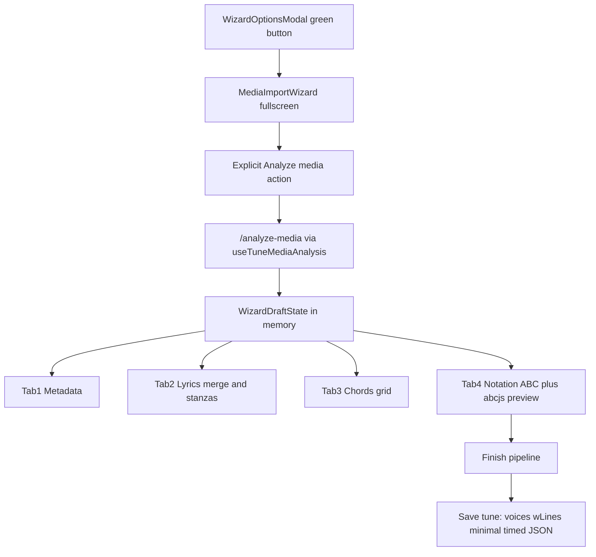

# Media Import Wizard and ABC Lyrics Refactor

## Goals

- **ABC output:** only time-aligned `w:` lyrics (interleaved with music lines per ABC rules); omit `W:` / `tune.words`.
- **Persisted timed JSON:** strip confidence/backend/noise/silences; keep only what [`TimedLyricsChordsView`](src/components/TimedLyricsChordsView.js) needs for chord-over-lyrics display. `timedMelody` is wizard-session only and **not** saved to ABC.
- **Editor revert:** remove melody tab and all analysis/transcription/derivation UI from [`AbcEditor`](src/components/AbcEditor.js); restore simple chords + `w:` lyrics editing.
- **New wizard:** green button in [`WizardOptionsModal`](src/components/WizardOptionsModal.js), full-screen multi-tab flow with explicit **Analyze media** before lyrics/chords/notation steps.

## Architecture



### Wizard draft state (session-only)

New [`src/mediaImportWizardState.js`](src/mediaImportWizardState.js) holds:

| Field | Source | Discarded on Finish? |
|-------|--------|----------------------|
| `rawAnalysis` | resolver response | yes |
| `timedLyrics` (full) | `buildTimedModelsFromAnalysis` | stripped to minimal |
| `timedChords` (full) | same | stripped to minimal |
| `timedMelody` (full) | same | **yes, entirely** |
| `melodyAbcText`, `chordGridText` | formatters | merged into `voices`, draft cleared |
| `sections` | user-edited stanza breaks | drives `||` + minimal `sections` |
| `mergedLyricLines` | lyrics step output | becomes `wLines` |
| `metadata` | title/composer/meter/key | written to tune fields |
| `notationAbc` | notation step textarea | written to voice 1 |

Reuse existing [`useTuneMediaAnalysis`](src/useTuneMediaAnalysis.js) / [`mediaAnalysisJobs.js`](src/mediaAnalysisJobs.js) for the analyze action (background-safe). Wizard subscribes to job status for the current tune.

**Tab gating:** Lyrics / Chords / Notation tabs disabled until analysis succeeds (per your choice: explicit analyze, not auto on open).

---

## 1. ABC serialization changes

### [`src/useAbcTools.js`](src/useAbcTools.js)

- **Stop emitting `W:`** — remove `renderWordHeaders(tune)` from `json2abc`; deprecate `tune.words` in hash (use `wLines` only).
- **Interleave `w:` with music lines** — replace batch `renderWLines` after all voices with per-line interleaving:

```javascript
// For each voice note line written, append matching w: line if tune.wLines[i] exists
voicesAndNotes.push(noteLine)
if (tune.wLines[i]) voicesAndNotes.push('w: ' + tune.wLines[i])
```

- **Import migration:** on `abc2json`, parse `w:` into `tune.wLines`; if legacy `W:` present and `wLines` empty, migrate `W:` → `wLines` (one-time compat).
- **Minimal timed export** — new [`src/timedExportUtils.js`](src/timedExportUtils.js):

```javascript
// timedLyrics → { v:1, lines:[{t,s,e,sectionId?}], sections:[{id,startLine,endLine,label?}] }
// timedChords → { v:1, beatTimes, segments:[{s,e,label}], meter?, meterChanges? }
```

Wire into [`renderTimedJsonFields`](src/abcbookJsonFields.js) so only minimal shapes are written; full models used only inside wizard.

### [`src/timedAbcDeriver.js`](src/timedAbcDeriver.js)

- Extend finish helper to:
  - build `w:` lines from merged lyric lines + melody note grid (`deriveWLines`)
  - insert `||` at stanza-ending barlines (map `sections[].endLine` → bar index via beat grid / melody structure)
  - call `mergeMelody` then `mergeChords` on voice 1

---

## 2. Media Import Wizard UI

New files:

- [`src/components/MediaImportWizard.js`](src/components/MediaImportWizard.js) — fullscreen `Modal` (`dialogClassName` full viewport), top bar with **Previous / Next** + tab list.
- [`src/components/MediaImportWizard.css`](src/components/MediaImportWizard.css) — layout (top nav, step body scroll).
- Step components under `src/components/mediaImportWizard/`:
  - `AnalyzeStep.js` — media source picker (reuse pattern from [`TuneMediaAnalysisButton`](src/components/TuneMediaAnalysisButton.js)) + **Analyze media** button + progress; populates draft.
  - `MetadataStep.js` — title, composer, meter, key (`CreatableSelect` patterns from AbcEditor info tab).
  - `LyricsStep.js` — stanza + merge UI (see below).
  - `ChordsStep.js` — compressed grid textarea (reuse [`ChordsWizard`](src/components/ChordsWizard.js) layout without Save/Listen).
  - `NotationStep.js` — split view: [`Abc`](src/components/Abc.js) left, ABC textarea right, `onChange` re-renders preview (debounced ~300ms).

**[`WizardOptionsModal`](src/components/WizardOptionsModal.js):** add green `variant="success"` button **Import from media** opening `MediaImportWizard` (pass `tune`, `tunebook`, `token`, `abc`, `forceRefresh`).

**Finish button** (on last tab + persistent in footer): runs finish pipeline → `tunebook.saveTune` → `forceRefresh` → close wizard.

---

## 3. Lyrics step — alignment and stanzas

### Libraries / approach (research summary)

| Option | Fit |
|--------|-----|
| [`react-diff-viewer-continued`](package.json) (already installed) | Side-by-side line diff for existing `w:` vs transcribed text |
| Custom DTW line aligner (port pattern from [umbra-lyrics `word-alignment.ts`](https://github.com/noxaur/umbra-lyrics/blob/main/src/lib/word-alignment.ts)) | Align transcribed segments to existing lyric lines by token similarity |
| [`lyricsMergeUtils.js`](src/lyricsMergeUtils.js) (existing) | Per-line merge choices after alignment |
| JustLyrics / Liricle | Playback/sync formats — **not** needed for static merge UI |

**Recommended UI (LyricsStep):**

1. **Stanza panel** — auto-detect via [`buildSectionsFromLines`](src/timedLyricsModel.js) (gap threshold); user can split/merge stanzas, rename labels (Verse/Chorus/Bridge).
2. **Per-stanza line table** — columns: Existing `w:` line | Transcribed line | Action (keep existing / use transcribed / edit / both / omit). Pre-fill via DTW alignment + [`buildLyricsLineDiff`](src/lyricsMergeUtils.js).
3. **Optional diff expand** — `react-diff-viewer-continued` for selected stanza (same component pattern as [`ParserProblemsDiff`](src/components/ParserProblemsDiff.js)).
4. **Output** — ordered `mergedLyricLines[]` + `sections[]` stored in wizard draft (not saved to tune until Finish).

Stanza structure flows to Finish as:
- minimal `timedLyrics.sections`
- `||` at last bar of each stanza in merged notation

---

## 4. Revert tune editor

### [`src/components/AbcEditor.js`](src/components/AbcEditor.js)

| Tab | After |
|-----|-------|
| **Lyrics** | Remove `LyricsTranscriptionControls`, `LyricsTranscriptionMerge`, `TimedDerivationControls`. Single textarea bound to `tune.wLines` (one line per `w:` row), **debounced save** (~500ms, pattern from [`IndexSearchForm`](src/components/IndexSearchForm.js)). Optional helper text: "One line per music line (`w:`)". |
| **Chords** | Revert [`ChordsWizard`](src/components/ChordsWizard.js) to pre-analysis behavior (see git `f52b6506fa`): load grid via `abcjsParser.renderChords(props.abc)` on mount/`props.notes` change only; **Save** merges via `mergeChords` into voice 1; remove `TuneMediaAnalysisButton`, `TimedDerivationControls`, `timedMediaCache`, analysis `useEffect`s. |
| **Melody** | **Remove tab entirely** |

### Other cleanup

- [`TitleAndLyricsEditorModal`](src/components/TitleAndLyricsEditorModal.js) — remove transcription/merge controls; edit `wLines` textarea only.
- Remove or stop importing in editor context: [`LyricsTranscriptionControls`](src/components/LyricsTranscriptionControls.js), [`LyricsTranscriptionMerge`](src/components/LyricsTranscriptionMerge.js), [`MelodyWizard`](src/components/MelodyWizard.js), [`TimedDerivationControls`](src/components/TimedDerivationControls.js) from AbcEditor/ChordsWizard.
- [`MelodyProcessingPanel`](src/components/MelodyProcessingPanel.js) — move into wizard Analyze step (optional settings before analyze).

---

## 5. Display / search migration (`words` → `wLines`)

Update consumers to read `tune.wLines` (blank line in `wLines` = stanza break, same convention as old `words`):

- [`MusicSingle.js`](src/components/MusicSingle.js) — stanza grouping
- [`PrintPage.js`](src/pages/PrintPage.js)
- [`IndexLayout.js`](src/components/IndexLayout.js) preview
- [`useTuneBook.js`](src/useTuneBook.js) text search
- [`TimedLyricsChordsView.js`](src/components/TimedLyricsChordsView.js) — fallback from `wLines` when minimal `timedLyrics` absent

---

## 6. Finish pipeline (single function)

New [`src/mediaImportWizardFinish.js`](src/mediaImportWizardFinish.js):

1. Apply metadata fields to tune.
2. Set `tune.wLines` from merged lyrics.
3. `mergeMelody(wizard.melodyAbcText, abc)` → `mergeChords(wizard.chordGridText, …)` (or use notation step ABC if user edited).
4. Apply stanza `||` barlines at section boundaries.
5. Re-derive interleaved `w:` positions if notation line count changed (re-run `deriveWLines` or map by bar index).
6. Write `tune.timedLyrics` / `tune.timedChords` via `timedExportUtils`; **delete** `tune.timedMelody`, `tune.words`, `tune.timingScaffold`.
7. `clearTimedMediaDraft(tune.id)`; `tunebook.saveTune(tune)`.

---

## 7. Tests

- [`src/timedExportUtils.test.js`](src/timedExportUtils.test.js) — minimal JSON strips confidence/backend.
- [`src/useAbcTools.test.js`](src/useAbcTools.test.js) or extend [`timedModels.test.js`](src/timedModels.test.js) — `w:` interleaving, no `W:` output, `W:`→`wLines` import migration.
- [`src/lyricsAlignmentUtils.test.js`](src/lyricsAlignmentUtils.test.js) — DTW line alignment cases.
- Update/remove tests tied to editor transcription flow.

---

## Implementation order

1. `timedExportUtils` + ABC `w:` interleaving / drop `W:` (foundation)
2. Revert AbcEditor chords + lyrics tabs; remove melody tab
3. Wizard shell + Analyze step + draft state
4. Metadata, Chords, Notation steps (reuse existing formatters/parsers)
5. Lyrics step (stanza editor + alignment + merge)
6. Finish pipeline + WizardOptionsModal entry
7. Migrate `words` consumers → `wLines`; update tests
