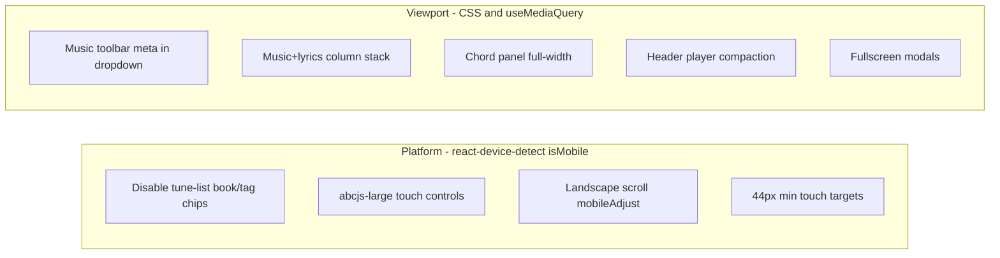

# Mobile UX — Complete Implementation Plan

## Verdict (unchanged)

The app is **partially** mobile-ready. Newer surfaces (music single view, search, media import) are solid. Header, tune list, chord panel, and accessibility need systematic fixes.

---

## Design principle: dual detection model

Two complementary signals—**not** a single `matchMedia` replacement everywhere.



| Signal | Source | Use for | Must NOT use for |
|--------|--------|---------|------------------|
| **`isMobile`** | `react-device-detect` | Platform/touch behavior independent of window size | Layout column stacking |
| **`useMediaQuery`** | `matchMedia('(max-width: …)')` | Layout reflow when viewport is narrow | Disabling tune-list chips |
| **CSS `@media`** | [`App.css`](src/App.css) | Pure presentation (fonts, flex direction) | JS click handlers |

### Tune-list book/tag chips (explicit product rule)

**Keep `disabled={isMobile}` on book/tag filter chips in [`IndexLayout.js`](src/components/IndexLayout.js)** — intentional on **mobile platforms regardless of screen size** (phone landscape, large phone, mobile browser on tablet UA).

- A desktop browser resized to 320px: chips **remain enabled** (viewport narrow, platform desktop).
- Mobile Safari on iPad landscape (wide viewport): chips **remain disabled** (platform mobile).

**Implementation:**

1. Add `src/platformUtils.js`:
   ```js
   import { isMobile } from 'react-device-detect';
   export function isMobilePlatform() { return isMobile; }
   ```
2. Replace raw `isMobile` imports in [`IndexLayout.js`](src/components/IndexLayout.js) with `isMobilePlatform()`.
3. Extract chip rendering to a small `TuneListFilterChips` component with `disabled={isMobilePlatform()}` and `aria-disabled` + `title="Filtering from the list is available on desktop"` for screen readers.
4. On mobile platform, optionally **hide** `.tune-list-filter-btns` via CSS class `tune-list-filter-btns--mobile-platform { display: none }` when `document.documentElement` has class `platform-mobile` set once in [`App.js`](src/App.js) (`useEffect` on mount)—reduces visual clutter while keeping disabled semantics if shown.
5. **Do not** add a mobile alternative inline filter in list rows; users filter via [`CollectionNav`](src/components/CollectionNav.js), book/tag selector modals in header/toolbar, and search (document in help if needed).

---

## Shared infrastructure

### 1. Breakpoint tokens — [`src/breakpoints.css`](src/breakpoints.css) (new) + import in [`src/index.js`](src/index.js)

```css
:root {
  --bp-compact: 620px;   /* search stack */
  --bp-narrow: 768px;    /* music layout, toolbar, modals */
  --bp-wide-split: 900px; /* media import wizard */
  --bp-header-auth: 480px; /* hide inline auth */
}
```

Migrate existing magic numbers in [`App.css`](src/App.css), [`MediaImportWizard.css`](src/components/MediaImportWizard.css), [`Header.js`](src/components/Header.js) to these variables.

### 2. `useMediaQuery` hook — [`src/useMediaQuery.js`](src/useMediaQuery.js) (new)

```js
export default function useMediaQuery(query) {
  const [matches, setMatches] = useState(() => window.matchMedia(query).matches);
  useEffect(() => {
    const mql = window.matchMedia(query);
    const handler = (e) => setMatches(e.matches);
    mql.addEventListener('change', handler);
    setMatches(mql.matches);
    return () => mql.removeEventListener('change', handler);
  }, [query]);
  return matches;
}
```

Export helpers: `useIsNarrowViewport()` → `(max-width: 768px)`, `useIsCompactViewport()` → `(max-width: 620px)`.

### 3. Consolidate resize — [`src/useWindowSize.js`](src/useWindowSize.js)

- Refactor [`Header.js`](src/components/Header.js) `verySmallScreen` to `useMediaQuery('(max-width: 480px)')` instead of duplicate resize listener.
- Remove unused `useWindowSize` import from [`PDFPreviewViewer.js`](src/components/PDFPreviewViewer.js) or wire it for responsive width.

### 4. Platform class on `<html>` — [`App.js`](src/App.js)

```js
useEffect(() => {
  if (isMobile) document.documentElement.classList.add('platform-mobile');
  return () => document.documentElement.classList.remove('platform-mobile');
}, []);
```

---

## Phase 1 — Accessibility (all platforms)

### 1.1 Icon-only control labels

| Component | Element | `aria-label` |
|-----------|---------|--------------|
| [`MusicSingle.js`](src/components/MusicSingle.js) | `#dropdown-basic` toggle | `"Tune actions"` + menu icon (e.g. `icons.menu` or Bootstrap list icon) |
| [`MusicSingle.js`](src/components/MusicSingle.js) | Zoom in/out buttons | `"Zoom in"` / `"Zoom out"` |
| [`ViewModeSelectorModal.js`](src/components/ViewModeSelectorModal.js) | Toggle | `aria-label={label}` always (label stays in a11y tree when `.view-mode-label` hidden) |
| [`ViewModeSelectorModal.js`](src/components/ViewModeSelectorModal.js) | Active item | `aria-current="true"` on active `Dropdown.Item` |
| [`Header.js`](src/components/Header.js) | Nav `Dropdown.Toggle` | `"Main menu"` |
| [`BoostSettingsModal.js`](src/components/BoostSettingsModal.js) | Trigger | `"Confidence and difficulty"` |
| [`BookMultiSelectorModal.js`](src/components/BookMultiSelectorModal.js) | Trigger | `"Books"` |
| [`TagsSelectorModal.js`](src/components/TagsSelectorModal.js) | Trigger | `"Tags"` |
| [`LinksEditorModal.js`](src/components/LinksEditorModal.js) | Trigger | `"Media links"` |
| [`IndexLayout.js`](src/components/IndexLayout.js) | Row icon buttons (music, guitar, lyrics, link) | Descriptive labels per action |

Use `aria-hidden="true"` on decorative SVG icons inside labeled buttons.

### 1.2 Fix invalid dropdown nesting

In [`Header.js`](src/components/Header.js) and [`MusicSingle.js`](src/components/MusicSingle.js):

- Replace `Dropdown.Item > Link > Button` with `Dropdown.Item as={Link} to="…"` or `onClick` + `navigate()`.
- Same for Delete/Print items: `Dropdown.Item onClick={…}` with text + icon, no inner `<Button>`.

### 1.3 [`TitleAndLyricsEditorModal.js`](src/components/TitleAndLyricsEditorModal.js)

Replace:
```jsx
<span onClick={handleShow} style={{fontWeight:'bold'}}>{tune ? tune.name : ''}</span>
```
With:
```jsx
<button type="button" className="title-lyrics-edit-trigger" onClick={handleShow}>{tune ? tune.name : ''}</button>
```
Style in [`App.css`](src/App.css): borderless, bold, inherit font, underline on focus-visible.

### 1.4 [`AddSongModal.js`](src/components/AddSongModal.js) keyboard

- Remove mount-only `setBlockKeyboardShortcuts(true)` (lines 83–85).
- On `show` change: `setBlockKeyboardShortcuts(show)`; cleanup on unmount sets `false`.
- Change `keyboard={false}` to `keyboard={true}` (allow Escape) unless `backdrop="static"` requires explicit cancel—keep static backdrop, allow Escape via `onHide`.

### 1.5 Global keyboard shortcut guard — [`App.js`](src/App.js) + [`useKeyPress.js`](src/useKeyPress.js)

- Track `openModalCount` or `blockKeyboardShortcuts` set by any modal `onShow`/`onHide`.
- In `useKeyPress` handler: skip if `event.target` is `input`, `textarea`, `select`, or `[contenteditable]`.
- Modals that don't use search fields should call `setBlockKeyboardShortcuts(true)` on show (Tags, Book, Links, Title/Lyrics).

### 1.6 Editor font on mobile — [`AbcEditor.js`](src/components/AbcEditor.js)

Change `fontSize:(props.isMobile?'0.8em':'1em')` to **`1em` on all platforms** (or `1.05em` on `isMobile` if slightly larger is desired).

---

## Phase 2 — High-impact functionality gaps

### 2.1 Chord block side panel — [`MusicSingle.js`](src/components/MusicSingle.js) + [`App.css`](src/App.css)

**Current:** `position: fixed`, `width: 40%`, `minHeight: 800px`, `zIndex: 999`.

**Implementation:**

1. Add class `chord-diagram-panel` to the panel div; move inline layout styles to CSS.
2. Desktop (>768px): keep fixed right panel behavior.
3. Narrow viewport (`@media (max-width: 768px)`):
   - `position: relative`, `width: 100%`, `min-height: auto`, `right: auto`, `top: auto`.
   - Render panel **below** lyrics block in DOM order (conditional render order or CSS `order` in flex parent).
4. Zoom-chords expanded mode: already `width: 100%`—ensure `position: relative` on mobile.
5. Add collapse toggle always visible on mobile: "Show chord diagrams" / arrow button with `aria-expanded`.

### 2.2 Header crowding — [`Header.js`](src/components/Header.js) + [`App.css`](src/App.css)

1. Wrap media player + skip buttons in `.header-media-controls`.
2. `@media (max-width: 768px)`: hide skip prev/next; move media controls into nav dropdown as last section (same pattern as auth on `verySmallScreen`).
3. `@media (max-width: 480px)`: hide inline auth (existing `verySmallScreen` via `useMediaQuery`).
4. Fixed chrome stack: set `.music-buttons-fixed { top: calc(4.2em + env(safe-area-inset-top, 0px)); }` and `.App-header` with `padding-top: env(safe-area-inset-top)`.

### 2.3 Duplicate DOM — [`MusicSingle.js`](src/components/MusicSingle.js)

**tuneMetaControls:**

```js
const isNarrow = useIsNarrowViewport();
// Render tuneMetaControls once:
// - if isNarrow: only inside dropdown col-meta
// - else: only in music-tune-meta-inline
```

Remove CSS `display: none` toggle for duplicate instances.

**Dual `<Abc>` players:**

Replace conditional dual mount with single `<Abc autoStart={autoStart} … />`—verify `autoStart` prop change re-triggers correctly; if not, key={`${tune.id}-${autoStart}`} on single instance.

### 2.4 Index list row layout — [`IndexLayout.js`](src/components/IndexLayout.js) + [`App.css`](src/App.css)

1. Replace per-row `float: right` clusters with `.tune-list-item` flex container:
   - Row 1: tune name link (flex 1)
   - Row 2 (wrap): metadata buttons, filter chips (hidden on `.platform-mobile`), boost, key/tempo
2. Chips: `TuneListFilterChips` with `disabled={isMobilePlatform()}` — **no re-enable on mobile**.
3. Fix unstable `id={JSON.stringify(selected)}` on search wrapper → static `id="tune-search-panel"`.
4. Shift+click range select: add optional long-press multi-select later (out of scope unless time); document desktop-only in code comment.

---

## Phase 3 — Medium-impact functionality gaps

### 3.1 Swipe vs scroll — [`MusicSingle.js`](src/components/MusicSingle.js)

Update `useSwipeable` config:

```js
const handlers = useSwipeable({
  onSwipedLeft: () => navigate next,
  onSwipedRight: () => navigate prev,
  delta: 50,
  trackMouse: false,
  preventScrollOnSwipe: false,
  swipeDuration: 500,
  touchEventOptions: { passive: true },
});
```

Add guard: only navigate if `Math.abs(deltaX) > Math.abs(deltaY) * 1.5` (use `onSwiping` to track). Optionally attach handlers to a slim `.music-single-swipe-edge` strip instead of full div—defer edge strips if gesture guard is sufficient.

### 3.2 Fullscreen modals on narrow viewport

Create [`src/useResponsiveModalProps.js`](src/useResponsiveModalProps.js):

```js
export function useResponsiveModalProps() {
  const narrow = useIsNarrowViewport();
  return narrow ? { fullscreen: true } : {};
}
```

Apply to: [`TagsSelectorModal.js`](src/components/TagsSelectorModal.js), [`BookMultiSelectorModal.js`](src/components/BookMultiSelectorModal.js), [`LinksEditorModal.js`](src/components/LinksEditorModal.js), [`TitleAndLyricsEditorModal.js`](src/components/TitleAndLyricsEditorModal.js), [`GroupBySelectorModal.js`](src/components/GroupBySelectorModal.js), [`BookSelectorModal.js`](src/components/BookSelectorModal.js).

Spread on `<Modal {...useResponsiveModalProps()} …>`.

[`TitleAndLyricsEditorModal.js`](src/components/TitleAndLyricsEditorModal.js): replace `height: 30em` textarea with `min-height: 12em; max-height: 50vh`.

### 3.3 Print from tune page — [`MusicSingle.js`](src/components/MusicSingle.js)

Replace `window.print` in actions dropdown with:

```js
navigate('/print', { state: { tuneIds: [tune.id] } });
```

Or open `PrintPage` with query `?ids=tuneId` if route supports it—verify [`PrintPage.js`](src/pages/PrintPage.js) accepts pre-selected tunes via location state or URL params; extend if needed.

Ensure print dropdown item label: "Print (formatted)".

### 3.4 `abcjs-large` — [`Abc.js`](src/components/Abc.js)

On container div wrapping abcjs render:

```js
import { isMobile } from 'react-device-detect';
// className includes isMobile ? 'abcjs-large' : ''
```

Apply to element that wraps `.abcjs-inline-audio` output (inspect render path ~line 100 `responsive: "resize"`).

### 3.5 Media import wizard viewport — [`MediaImportWizard.css`](src/components/MediaImportWizard.css)

Replace `100vh` with `100dvh` for modal shell and split panes.

### 3.6 Touch target sizing — meta modals

In [`App.css`](src/App.css):

```css
.platform-mobile .music-tune-meta-group .btn,
.platform-mobile .music-actions-dropdown-col-meta .btn {
  min-width: 2.75rem;
  min-height: 2.75rem;
}
```

Adjust [`BoostSettingsModal.js`](src/components/BoostSettingsModal.js) etc. inline `width/height: 2.6em` to `min-width/min-height: 2.75rem` when `isMobile`.

---

## Phase 4 — PWA and polish

### 4.1 [`public/index.html`](public/index.html)

- Fix `<meta name="description" content="Collate abc format music into a tunebook">` (replace erroneous `name="Tune Book"`).
- Add `<meta name="mobile-web-app-capable" content="yes">`.
- Viewport: `width=device-width, initial-scale=1, viewport-fit=cover`.

### 4.2 Manifest alignment

- Update [`manifest.template.json`](manifest.template.json) and root [`manifest.json`](manifest.json) to match [`public/manifest.json`](public/manifest.json): `display: "standalone"`, `start_url: "."`, include `scope: "/"`.
- Add maskable icon entry (`purpose: "maskable"`) using existing 512 asset or generate from [`scripts/generate-icons.py`](scripts/generate-icons.py).
- Verify build copies template → `public/manifest.json`.

### 4.3 Help page images — [`App.css`](src/App.css)

```css
@media (max-width: 768px) {
  #youtube .help-figure img,
  .youtube-help-content img {
    max-width: 100%;
    width: 100%;
  }
}
```

### 4.4 Range slider thumbs — [`App.css`](src/App.css)

Increase `input[type=range]` thumb to 28px on `.platform-mobile` for seek/progress sliders.

### 4.5 Dropdown positioning — [`MusicSingle.js`](src/components/MusicSingle.js)

On narrow viewport, set actions dropdown `drop="up"` or `popperConfig={{ strategy: 'fixed' }}` to avoid clipping below fold.

---

## Testing checklist

| Scenario | Expected |
|----------|----------|
| iPhone portrait | Chips hidden/disabled; meta in dropdown; lyrics stack; chord panel below content |
| iPhone landscape (wide) | Chips **still** disabled (platform mobile) |
| Desktop window 400px wide | Chips **enabled**; CSS narrow layout applies |
| iPad Safari | Chips disabled; layout may be side-by-side if >768px width |
| VoiceOver / TalkBack | All toolbar controls named; view mode announces current mode |
| Keyboard | Arrow keys work when no modal; blocked when modal open; Escape closes AddSong |
| PWA install | Manifest valid; icons render; standalone display |
| Print from tune | Opens formatted print flow, not raw screen |

---

## File change summary

| File | Changes |
|------|---------|
| `src/platformUtils.js` | New — `isMobilePlatform()` |
| `src/useMediaQuery.js` | New |
| `src/breakpoints.css` | New |
| `src/useResponsiveModalProps.js` | New |
| `src/App.js` | `platform-mobile` class; modal keyboard coordination |
| `src/App.css` | Breakpoint vars, chord panel, header, chips, help images, touch targets, safe-area |
| `src/components/MusicSingle.js` | Toolbar, chord panel, swipe, print, dedupe meta, a11y |
| `src/components/IndexLayout.js` | Flex rows, TuneListFilterChips, platform chip rule |
| `src/components/Header.js` | a11y, media compact, useMediaQuery, dropdown items |
| `src/components/ViewModeSelectorModal.js` | aria-label, aria-current |
| `src/components/Abc.js` | abcjs-large |
| `src/components/AbcEditor.js` | font size |
| `src/components/AddSongModal.js` | keyboard blocking fix |
| `src/components/TitleAndLyricsEditorModal.js` | button trigger, responsive modal |
| `src/components/*Modal.js` (tags, book, links, etc.) | aria-label, fullscreen, touch size |
| `src/components/MediaImportWizard.css` | 100dvh |
| `public/index.html` | meta fixes, viewport-fit |
| `manifest.template.json`, `manifest.json` | align with public |

---

## Conclusion

This plan implements **all** audit findings: every high/medium functionality gap, accessibility item, and PWA polish note. The key product clarification—**tune-list book/tag chips stay disabled on mobile platforms at any screen size**—is preserved via `isMobilePlatform()`, separate from viewport-based layout reflow.

Execution order: shared infrastructure → Phase 1 a11y → Phase 2 high impact → Phase 3 medium → Phase 4 polish → testing checklist.
