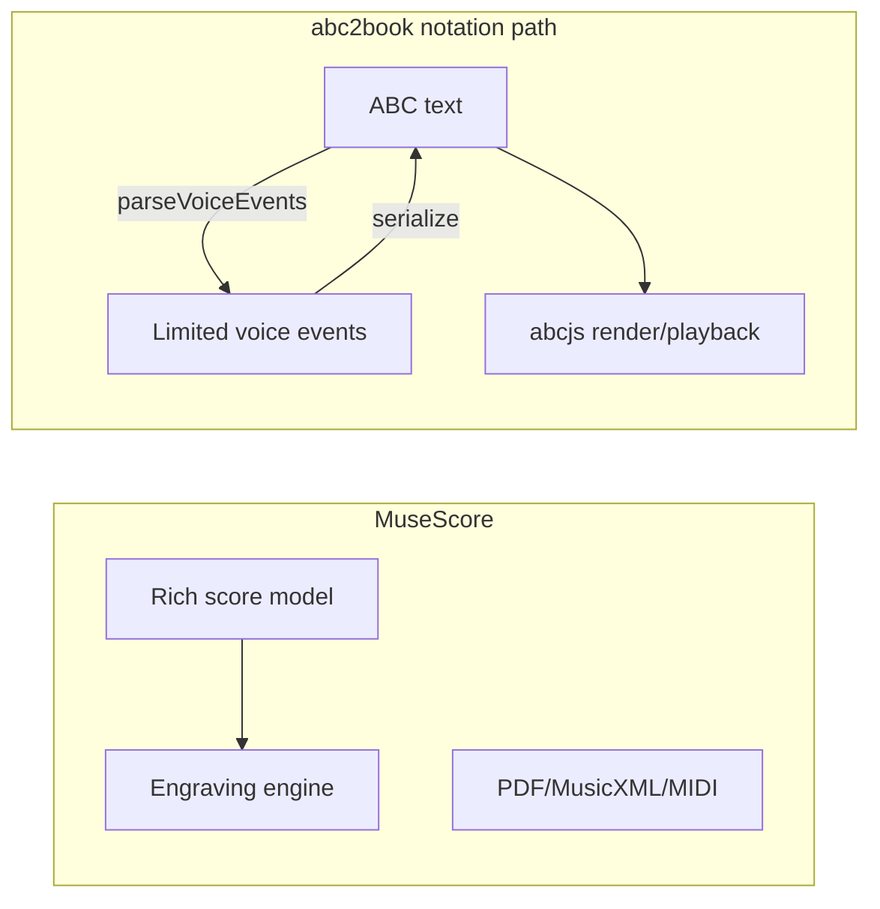

# MuseScore vs abc2book: Feature Gap Analysis

## Scope framing

These are different products with different goals:

| | **MuseScore** | **abc2book** |
|---|---|---|
| Primary use | Full score creation, engraving, parts, publishing | Personal/community tune book: ABC tunes, lyrics, chords, linked recordings |
| Native format | Internal score model + MusicXML | ABC text (`voices[]` with metadata) |
| Rendering | MuseScore engraving engine | [abcjs](https://github.com/paulrosen/abcjs) |
| Strength | Orchestral/choral/piano engraving, layout control | Tune management, media links, practice, bulk checks, transcription import |

The notation editor ([`NotationEditor.js`](src/components/NotationEditor.js)) explicitly models itself after MuseScore **note input** (duration keys 1–9, N for input mode, etc.) per [`NotationEditorHelp.js`](src/components/NotationEditorHelp.js), but the underlying event model in [`voiceEventModel.js`](src/notation/voiceEventModel.js) is melody-centric and ABC-limited.

**Critical round-trip limitation:** Visual editing goes through `parseVoiceEvents` → edit → `serializeVoiceEvents` ([`abcVoiceSerializer.js`](src/notation/abcVoiceSerializer.js)). That pipeline only preserves **notes, chords, rests, barlines, line breaks, and tie-end markers**. Grace notes, slurs, tuplets, articulations, dynamics, voltas, etc. may exist in ABC text or survive MusicXML import via [`xml2abc.js`](src/xml2abc.js), but **editing in Staff/Piano roll can strip them** on save.

---

## What abc2book already has (MuseScore overlap)

### Notation editor (MuseScore-inspired subset)
- Staff, piano roll, and ABC text views ([`viewModeUtils.js`](src/viewModeUtils.js))
- Note input mode with MuseScore-style duration keys ([`notationConstants.js`](src/notation/notationConstants.js), [`notationActions.js`](src/notation/notationActions.js))
- Chords (Shift+A–G), rests, dotted durations, bar lines, system/line breaks
- Multi-voice ABC (add/switch/rename voices; show multiple voices in preview) — [`NotationVoiceSelector.js`](src/components/NotationVoiceSelector.js)
- Selection, caret navigation, transpose, duration Q/W, delete-to-rest
- Clipboard copy/cut/paste/swap ([`notationClipboard.js`](src/notation/notationClipboard.js))
- Quantize dialog + piano-roll snap ([`QuantizeDialog.js`](src/notation/quantizeVoiceEvents.js))
- Web MIDI step input + virtual piano ([`useMidiInput.js`](src/notation/useMidiInput.js), [`VirtualPiano.js`](src/components/VirtualPiano.js))
- Layout wizards: auto-fix, halve/double lengths, bar layout ([`WizardOptionsModal.js`](src/components/WizardOptionsModal.js))
- Tune-level undo/redo ([`useTuneBook.js`](src/useTuneBook.js) + [`MusicEditor.js`](src/components/MusicEditor.js))

### Score I/O (partial MuseScore parity)
- Import: ABC, MusicXML/MXL, MIDI (via resolver → MusicXML → ABC) — [`scoreImportClient.js`](src/scoreImportClient.js)
- Export: ABC, MusicXML (“MuseScore”), MIDI, JSON, CSV — [`tuneDownloadActions.js`](src/tuneDownloadActions.js)

### Playback & practice (some overlap)
- ABC synth playback with tempo, repeats, soundfonts — [`useAbcSynth.js`](src/useAbcSynth.js)
- Linked media playback with pitch/tempo/loop/stems — [`useTuneBookMediaController.js`](src/useTuneBookMediaController.js)
- Metronome page, tuner, standalone virtual piano
- Practice sessions with tempo ramp — [`usePracticeSession.js`](src/usePracticeSession.js)

### Beyond MuseScore (abc2book strengths)
- Tune books, tags, filters, search, sync, bulk edit
- YouTube/audio link management + playback region detection
- Media import wizard (transcription → melody ABC)
- Bulk ABC correctness, completeness, and link checks
- Lyrics editor, chord grid/wizard, capo/transpose for chord views
- Offline media caching, playlists, print/cheat sheets with QR codes

---

## Missing vs MuseScore — by category

### 1. Notation symbols & expressive markup (largest engraving gap)

| MuseScore feature | abc2book status |
|---|---|
| **Ties** (interactive) | Parsed/serialized partially; `T` shortcut defined in [`notationShortcuts.js`](src/notation/notationShortcuts.js) but **no handler** in `NotationEditor` |
| **Slurs / phrasing** | Not in event model; only via raw ABC / import |
| **Tuplets** (3:2, etc.) | Not in event model; MusicXML import may emit ABC tuplets, but visual editor cannot edit them |
| **Grace notes / acciaccatura** | Not in event model |
| **Articulations** (staccato, tenuto, accent, marcato, etc.) | abcjs can render ABC decorations; **no visual editor support** |
| **Ornaments** (trill, mordent, turn) | Same — ABC/import only |
| **Dynamics** (p, f, mf, hairpins) | Same — ABC/import only |
| **Fermata, breath marks, caesura** | Same |
| **Pedal marks** | Not supported |
| **Ottava lines** (8va/8vb) | Not supported |
| **Tremolo, arpeggio, glissando** | Not supported |
| **Fingerings, string numbers** | Not supported |
| **Rehearsal marks, tempo text, expressions** | Tune-level tempo in Info tab only; no score text items |
| **Cue notes, ossia staves** | Not supported |
| **Percussion / drum notation** | Not supported (ABC drum kits not modeled) |

### 2. Layout, engraving, and score structure

| MuseScore feature | abc2book status |
|---|---|
| **Multiple instruments / staves / parts** | ABC “voices” only (same staff family); no instrument parts, no linked staves |
| **Clef changes mid-piece** | Not in editor; fixed by key/header |
| **Key/meter/time signature changes mid-score** | Single key + meter per tune (Info tab) |
| **Pickup/anacrusis** | Limited ABC support; no dedicated UI |
| **First/second endings (voltas)** | May survive import as ABC; not editable in visual editor |
| **D.S. / D.C. / coda / segno** | ABC tokens possible in text; no UI |
| **Cross-staff beaming, manual beam breaks** | Automatic via abcjs only |
| **Page layout** (margins, systems per page) | Web flow layout only; print uses [`AbcPrint.js`](src/components/AbcPrint.js) |
| **Frames** (title, composer, text blocks) | Metadata fields (title, composer, etc.) only |
| **Brackets, braces, instrument names** | Not supported |
| **Engraving style / house rules** | No style editor |
| **Part extraction** (“parts” from score) | Not supported |
| **Tablature editing** | Header field exists in [`AbcEditor.js`](src/components/AbcEditor.js); **no tab staff editor** |

### 3. Input modes & editing workflow

| MuseScore feature | abc2book status |
|---|---|
| **Mouse-driven note placement on staff** | Click selects/caret; pitch entry is keyboard/MIDI, not click-to-place pitch |
| **Real-time MIDI recording** | Step-time only; no record-to-staff |
| **MIDI chord modes** (step chord, add tone) | Constants + hook in [`useMidiInput.js`](src/notation/useMidiInput.js); UI **hardcodes SINGLE mode** |
| **Inspector / properties panel** per element | No element property UI |
| **Drag notes on staff** (pitch move) | Staff is display + selection; pitch edits via keyboard transpose or piano roll |
| **Split/merge measures, join scores** | Not supported |
| **Templates** (orchestra, piano, etc.) | Not supported |
| **Plugins / scripting** | Not supported |
| **Local notation undo** inside editor | Global tune undo only; in-editor undo/redo shortcuts are no-ops |

### 4. Playback & production

| MuseScore feature | abc2book status |
|---|---|
| **Per-part mixer** (mute/solo/volume/pan) | Single synth stream; stem separation is for **linked audio**, not score parts |
| **SoundFont per instrument** | Per-tune sound font fields; not a full mixer |
| **Swing, humanize** | Not supported |
| **Export PDF** (engraved score) | Print page / browser print; no dedicated PDF engraver |
| **Export audio** (rendered score) | Download linked audio; no “bounce score to WAV” |
| **Video score sync** | Media seek bar for practice; not frame-accurate score-follow |

### 5. Collaboration & publishing

| MuseScore feature | abc2book status |
|---|---|
| **MuseScore.com publishing** | Share public tune link only ([`SharePublicTuneModal.js`](src/components/SharePublicTuneModal.js)) |
| **Version control / score comments** | Tune edit history (local); cloud sync when logged in |
| **Full MusicXML fidelity** | Lossy round-trip through ABC ([`xml2abc.js`](src/xml2abc.js)) |

---

## Partially implemented (closest to “missing but started”)

These are the smallest gaps between intent and current code:

1. **Tie toggle** — shortcut exists, model fields exist, no `toggleTie` in [`NotationEditor.js`](src/components/NotationEditor.js)
2. **MIDI chord input modes** — `MIDI_CHORD_MODES` in [`notationConstants.js`](src/notation/notationConstants.js); UI not exposed
3. **Delete voice** — `deleteVoice()` in [`AbcEditor.js`](src/components/AbcEditor.js); no button
4. **Rich ABC via ABC view** — user can type decorations/tuplets in ABC text view, but switching to Staff and saving may **lose** them due to event-model round-trip
5. **Help as a view** — documented in help text; implemented as modal only

---

## Practical summary: what is “missing here”?

If the benchmark is **MuseScore as a general-purpose scorewriter**, abc2book is missing roughly **80–90% of engraving features** by design. It is not a drop-in MuseScore replacement for piano/orchestral/choral work.

If the benchmark is **MuseScore-style melody editing for folk/session tunes**, the core gaps are:

- **Expressive notation** — slurs, articulations, dynamics, ornaments, tuplets, grace notes
- **Interactive ties** and richer tie modeling
- **Score structure** — mid-piece key/meter/clef changes, voltas, codas, multiple instruments
- **Staff-centric editing** — click-to-place notes, drag pitch on staff, element inspector
- **Real-time MIDI capture** and fuller MIDI chord input
- **Publishing-quality layout** — page/system control, parts, PDF engraving
- **Lossless MusicXML** — import/export is ABC-mediated, not a native score model

What abc2book adds that MuseScore does **not** focus on: tune-book organization, linked recordings/YouTube, transcription-from-media, practice sessions, bulk quality checks, and offline media workflows.

---

## Suggested prioritization (if closing gaps)

Only relevant if you want to move toward MuseScore parity; otherwise the current ABC-first scope is coherent.

**High value for folk/session use (low–medium effort):**
- Wire tie toggle (`T` shortcut)
- Expose MIDI chord modes in toolbar
- Preserve non-event ABC markup when round-tripping (store “raw tail” tokens or extend event model for decorations)
- Delete-voice UI

**Medium value (medium effort):**
- Tuplets and grace notes in event model + toolbar
- Slurs (at least tie-like spanning)
- Articulations/dynamics as decoration attachments on events
- Real-time MIDI record with quantize

**Low priority / architectural (high effort, conflicts with ABC-first design):**
- Multi-instrument score layout
- Part extraction
- Full engraving/style system
- Native MusicXML score model (bypass ABC)
- PDF engraving pipeline

No implementation is proposed here — this is an analysis-only plan.
