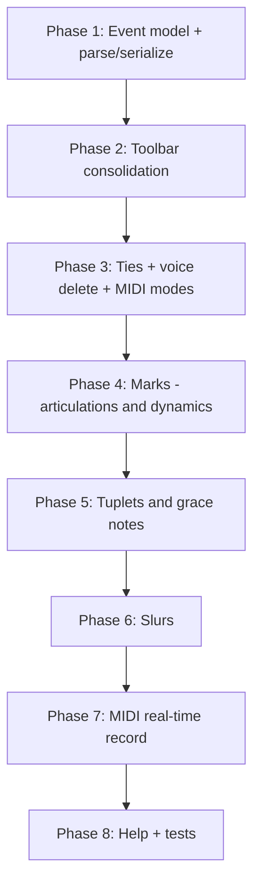

# MuseScore-Style Melody Editor — Implementation Plan

## Goal and scope

Bring the notation editor ([`NotationEditor.js`](src/components/NotationEditor.js)) closer to **MuseScore-style melody editing** for folk/session tunes. Multi-part writing stays on the existing **ABC voices** model ([`NotationVoiceSelector.js`](src/components/NotationVoiceSelector.js)) — no separate instrument staves.

**In scope (high + medium value from gap analysis):**
- Tie toggle, slurs, articulations, dynamics, tuplets, grace notes
- MIDI chord modes + real-time MIDI record with quantize
- ABC round-trip preservation for unmodeled tokens
- Delete voice UI
- Toolbar consolidation to save horizontal space

**Out of scope:** orchestral layout, part extraction, clef/key/meter changes mid-score, percussion kits, PDF engraving, native MusicXML score model.

---

## Target toolbar layout (UI spec)

Today staff view uses two wide rows: 9 duration buttons + ~6 toolbar buttons + inline MIDI device select. **Replace with compact split-button dropdowns**, matching the existing barline pattern in [`NotationToolbar.js`](src/components/NotationToolbar.js).

### Row A — Input & durations (replaces [`NotationDurationToolbar.js`](src/components/NotationDurationToolbar.js))

| Control | Type | Main click | Dropdown |
|---------|------|------------|----------|
| **Note input** | Toggle btn `✎` | Toggle note input (`N`) | — |
| **Duration** | Split btn | Re-apply current duration to selection | All 9 MuseScore duration keys (`64`…`1..`) with keyboard hint |
| **Dot** | Toggle `.` | Toggle dotted | — |
| **Accidentals** | Split btn `♮` | Set natural carry (`=`) | `♭` (`-`), `♯` (`+`), `𝄫`, `𝄪` (double flat/sharp carry) |

Duration main button label shows active duration (e.g. `4` for quarter). Selected duration stays highlighted in menu.

### Row B — Marks, layout, MIDI (replaces/extends [`NotationToolbar.js`](src/components/NotationToolbar.js))

Left to right:

| Control | Type | Main click | Dropdown contents |
|---------|------|------------|-------------------|
| **Help** | Btn `?` | Open help modal | — |
| **Tools** | Split btn `⚙` | Open layout wizards | • Layout wizards<br>• Quantize… (selection or whole voice)<br>• System break `↵` (`!`) |
| **Bar lines** | Split btn `\|` | Insert single bar `\|` | *(keep existing 7 options)* |
| **Marks** | Split btn `♪` | Toggle **tie** on selection / note before caret (`T`) | **Phrasing:** Slur mode on/off, Clear slur<br>**Articulations:** Staccato `.`, Tenuto, Accent, Staccatissimo, Breath<br>**Ornaments:** Trill, Mordent, Turn, Pralltriller<br>**Dynamics:** p, mp, mf, f, ff + cresc/dim start/end<br>**Other:** Fermata, Upbow, Downbow |
| **Tuplets & grace** | Split btn `(3` | Start/stop **triplet input mode** | • Duplet 2:3, Triplet 3:2, Quadruplet 4:3, Quintuplet 5:4, Sextuplet 6:4<br>• End tuplet mode<br>• Grace before (acciaccatura `{…}`)<br>• Grace before (appoggiatura, longer grace) |
| **MIDI** | Split btn (midi icon) | Toggle MIDI enable | • Input device select<br>• Chord mode: Single / Step chord / Add tone<br>• Chord window ms (step chord only)<br>• **Record** start/stop (real-time capture) |

**Responsive behavior** ([`NotationEditor.css`](src/components/NotationEditor.css)):
- `≥992px`: Row A and Row B sit on one line inside `.notation-editing-controls` (flex, nowrap).
- `<992px`: Row A on top, Row B below; MIDI device select moves inside MIDI dropdown only (remove always-visible `Form.Select` from inline bar).

### Voice row changes ([`NotationVoiceSelector.js`](src/components/NotationVoiceSelector.js))

| Addition | Behavior |
|----------|----------|
| **Delete voice** `×` | Shown when `voiceNames.length > 1`; deletes active voice via existing `deleteVoice()` in [`AbcEditor.js`](src/components/AbcEditor.js) |
| **Confirm modal** | Warn if active voice has note content; switch to voice 0 after delete |
| **Duplicate voice** (optional stretch) | Copy active voice ABC into new voice — useful for harmony parts |

Wire `onDeleteVoice` from `AbcEditor` → `NotationEditor` → `NotationVoiceSelector`.

### Status indicators (compact, no extra row)

Small badges inline in Row B when modes are active:
- `Tuplet 3` when tuplet input mode on
- `Slur` when slur-span mode on
- `● REC` red dot when MIDI recording
- `Tie` not needed (applied immediately)

---

## Data model extensions

Centralize notation token tables in new [`src/notation/notationTokens.js`](src/notation/notationTokens.js) (ABC decoration strings, reused by parse/serialize/UI).

### Extended voice event shape

Extend types in [`voiceEventModel.js`](src/notation/voiceEventModel.js) — all note-like events (`note`, `chord`, `graceGroup`):

```js
{
  // existing: id, type, pitch(es), duration, tieStart, tieEnd, startBeat, …

  slurStart: boolean,
  slurEnd: boolean,
  slurGroupId: string | null,      // links start/end in same slur span

  decorations: string[],           // canonical keys, e.g. 'staccato', 'accent', 'p'
                                    // maps to ABC prefix tokens via notationTokens.js

  graceNotes: [{                   // grace before this event
    pitch, duration, acciaccatura: boolean
  }],

  tuplet: {                        // null if not in tuplet
    num: number, den: number, groupId: string, indexInGroup: number, size: number
  } | null,

  abcLeading: string,              // preserved unmodeled ABC before token
  abcTrailing: string,             // preserved unmodeled ABC after token (ties use tieEnd → '-')
}
```

New event type `graceCluster` only if standalone grace editing is needed; prefer `graceNotes[]` on the following main note (matches ABC `{c}d`).

### Session state additions ([`notationSession.js`](src/notation/notationSession.js))

```js
tupletMode: null | { num, den, groupId, notesEntered, size },
slurMode: boolean,                 // next clicks mark slurStart/slurEnd
midiChordMode: MIDI_CHORD_MODES.*,  // already exists — wire to UI + useMidiInput
midiRecordActive: boolean,
midiRecordBuffer: Array<{ midi, startMs, endMs, velocity }>,
```

### Parse / serialize ([`voiceEventModel.js`](src/notation/voiceEventModel.js), [`abcVoiceSerializer.js`](src/notation/abcVoiceSerializer.js))

**Parse (`symbolToEvent`):**
- Read `symbol.decoration` → `decorations[]`
- Read `symbol.gracenotes` → `graceNotes[]`
- Read `symbol.startTie` / `symbol.endTie` → `tieStart` / `tieEnd`
- Read `pitch.startSlur` / `pitch.endSlur` → `slurStart` / `slurEnd` + assign `slurGroupId`
- Read tuplet info from abcjs symbol (`symbol.tuplet` / duration rational) → `tuplet` field
- Any decoration key not in our vocabulary → append to `abcLeading` so it round-trips

**Serialize:**
- Emit `abcLeading`
- Emit grace cluster `{…}` from `graceNotes`
- Emit tuplet prefix `(N` when `tuplet.indexInGroup === 0`
- Emit decoration tokens before pitch (same order as [`useAbcjsParser.js`](src/useAbcjsParser.js) decoration map)
- Emit `(` / `)` for slur start/end (ABC slur syntax)
- Emit pitch/rest/chord + duration suffix
- Emit `-` for `tieEnd`
- Emit `abcTrailing`

**Round-trip guarantee:** Add tests that import rich ABC snippets (decorations, tuplets, grace, slurs) → events → serialize → parse → serialize produces equivalent body.

---

## New editing actions ([`notationActions.js`](src/notation/notationActions.js))

| Action | Trigger | Behavior |
|--------|---------|----------|
| `toggleTie` | `T` key, Marks main btn | On selected note(s) or note before caret: toggle `tieEnd`; set `tieStart` on next note if tying forward |
| `toggleSlurMode` | Marks menu | Enter slur mode: first selected note gets `slurStart`, next selection gets `slurEnd` (same `slurGroupId`) |
| `clearSlur` | Marks menu | Remove slur flags from selection |
| `toggleDecoration` | Marks menu item | Add/remove decoration key on selection (multiple allowed; staccato + accent OK) |
| `setTupletMode` | Tuplets menu | Set `session.tupletMode`; auto-attach `tuplet` metadata to inserted notes |
| `endTupletMode` | Tuplets menu | Clear `tupletMode` |
| `insertGraceBefore` | Tuplets menu | Insert/edit `graceNotes` on selected note or note before caret |
| `applyMarksToSelection` | shared helper | Used by Marks menu |

Wire `toggleTie` in [`NotationEditor.js`](src/components/NotationEditor.js) `handleShortcutAction` (shortcut already in [`notationShortcuts.js`](src/notation/notationShortcuts.js)).

---

## MIDI enhancements

### Chord modes (high value)

In [`NotationEditor.js`](src/components/NotationEditor.js) line 221, change:

```js
chordMode: MIDI_CHORD_MODES.SINGLE  // hardcoded today
```

to `chordMode: session.midiChordMode`.

Expose in **MIDI dropdown** ([`MidiInputPanel.js`](src/components/MidiInputPanel.js) refactor):
- Radio/toggle: Single | Step chord | Add tone
- Numeric input chord window (default 50 ms) when Step chord selected
- `handleMidiNoteOn` already handles `payload.chord` and `payload.addTone` — no logic change needed

### Real-time MIDI record (medium value)

New module [`src/notation/notationMidiRecord.js`](src/notation/notationMidiRecord.js):

1. **While `midiRecordActive`:** buffer note-ons/offs with `performance.now()` timestamps (not only in note-input mode).
2. **On stop:** convert buffer → tentative events:
   - Map note duration = time until note-off (or next note-on for legato overlap)
   - Anchor first note to `caretIndex` beat position
   - Run through existing [`quantizeVoiceEvents.js`](src/notation/quantizeVoiceEvents.js) with dialog defaults (strength 1, slotsPerBeat from session.snap)
3. **Insert** at caret; exit record mode; apply history label `MIDI record`.

**UI:** Record item in MIDI dropdown toggles start/stop; red `● REC` badge; stopping opens optional mini confirm if >0 notes (Apply / Discard). Reuse quantize settings from last [`QuantizeDialog.js`](src/components/QuantizeDialog.js) via session snapshot.

---

## Component refactor plan

### New files

| File | Purpose |
|------|---------|
| [`src/notation/notationTokens.js`](src/notation/notationTokens.js) | Decoration/dynamics ABC token map + labels for menus |
| [`src/notation/notationMarks.js`](src/notation/notationMarks.js) | Tie/slur/decoration apply helpers |
| [`src/notation/notationMidiRecord.js`](src/notation/notationMidiRecord.js) | Record buffer → events |
| [`src/components/NotationMarksDropdown.js`](src/components/NotationMarksDropdown.js) | Marks split dropdown |
| [`src/components/NotationTupletDropdown.js`](src/components/NotationTupletDropdown.js) | Tuplets & grace split dropdown |
| [`src/components/NotationDurationDropdown.js`](src/components/NotationDurationDropdown.js) | Duration split dropdown |
| [`src/components/NotationAccidentalDropdown.js`](src/components/NotationAccidentalDropdown.js) | Accidental split dropdown |
| [`src/components/NotationToolsDropdown.js`](src/components/NotationToolsDropdown.js) | Tools split dropdown |
| [`src/components/DeleteVoiceConfirmModal.js`](src/components/DeleteVoiceConfirmModal.js) | Confirm voice deletion |

### Modified files

| File | Changes |
|------|---------|
| [`NotationDurationToolbar.js`](src/components/NotationDurationToolbar.js) | Slim to: note input + DurationDropdown + dot + AccidentalDropdown |
| [`NotationToolbar.js`](src/components/NotationToolbar.js) | Compose: Help, ToolsDropdown, Barlines, MarksDropdown, TupletDropdown, MidiDropdown; remove standalone Quantize `Q` btn and inline device select |
| [`MidiInputPanel.js`](src/components/MidiInputPanel.js) | Become MIDI split dropdown; absorb record + chord mode UI |
| [`NotationVoiceSelector.js`](src/components/NotationVoiceSelector.js) | Delete voice button + confirm |
| [`AbcEditor.js`](src/components/AbcEditor.js) | Pass `onDeleteVoice`; fix `deleteVoice` to reindex `currentVoice` |
| [`NotationEditor.js`](src/components/NotationEditor.js) | Wire all new actions, session fields, MIDI record lifecycle |
| [`notationSession.js`](src/notation/notationSession.js) | New session fields + reducer cases |
| [`voiceEventModel.js`](src/notation/voiceEventModel.js) | Parse/clone extended fields |
| [`abcVoiceSerializer.js`](src/notation/abcVoiceSerializer.js) | Serialize extended fields |
| [`pianoRollEdit.js`](src/notation/pianoRollEdit.js) | Preserve decorations/tuplet when dragging (at minimum: don't strip unknown fields on clone) |
| [`NotationEditorHelp.js`](src/components/NotationEditorHelp.js) | New sections: Marks, Tuplets, MIDI record, updated toolbar screenshots/descriptions |
| [`NotationEditor.css`](src/components/NotationEditor.css) | Styles for split dropdowns, mode badges, Marks menu sections |

---

## Implementation phases



### Phase 1 — Event model foundation
- Add `notationTokens.js`, extend event clone/parse/serialize
- Add round-trip tests in [`voiceEventModel.test.js`](src/notation/voiceEventModel.test.js) + new [`notationMarks.test.js`](src/notation/notationMarks.test.js)
- `abcLeading`/`abcTrailing` preservation for unknown tokens

### Phase 2 — Toolbar consolidation (UI only, no new music features)
- Build split dropdown components
- Collapse 9 duration buttons → DurationDropdown
- Move Quantize, wizard, system break → ToolsDropdown
- Move MIDI device select inside MIDI dropdown
- CSS pass for compact layout

### Phase 3 — High-value quick wins
- `toggleTie` action + Marks main button + `T` shortcut
- Delete voice UI + `AbcEditor.deleteVoice` fix (reindex current voice)
- Wire `session.midiChordMode` to `useMidiInput` + MIDI dropdown radios

### Phase 4 — Articulations and dynamics
- `notationMarks.js`: apply/toggle/remove decorations on selection
- Marks dropdown menu with grouped sections (Bootstrap `Dropdown.Header` + `Dropdown.Divider`)
- Parse/serialize decoration arrays
- Optional: show decoration icons on selected notes in staff (abcjs re-render is sufficient for v1)

### Phase 5 — Tuplets and grace notes
- `tupletMode` session state; tuplet metadata on new inserts in note-input mode
- Tuplets dropdown presets; active tuplet badge
- Grace-before insertion on selection
- Parse/serialize `(3` groups and `{…}` grace clusters
- Quantize respects tuplet durations

### Phase 6 — Slurs
- `slurMode` click workflow: select start note → select end note (or shift-click range → apply slur span)
- Parse/serialize `(` `)` slur syntax
- Clear slur command in Marks menu

### Phase 7 — MIDI real-time record
- `notationMidiRecord.js` + record toggle in MIDI dropdown
- Buffer in `useMidiInput` note-on/off callbacks (parallel to step input)
- Insert + quantize on stop

### Phase 8 — Documentation and regression
- Update [`NotationEditorHelp.js`](src/components/NotationEditorHelp.js) key map (`T` tie, slur workflow, record)
- Full test coverage for new modules
- Manual test checklist (below)

---

## Manual test checklist

1. Enter melody in note-input mode with duration dropdown + keyboard 1–9 still works
2. Tie two quarter notes (`T`); verify ABC shows `c2-` / tied render
3. Apply staccato + mf to selection; round-trip ABC view without loss
4. Enter triplet run `(3cde`; verify timing in piano roll
5. Add grace note `{g}c`; verify playback
6. Slur 3-note phrase; verify `(cde)` ABC
7. MIDI step chord mode: rapid chord → single chord event
8. MIDI add-tone mode: successive keys add to chord
9. MIDI record 4-bar phrase; stop; quantize; notes appear at caret
10. Delete voice 2 of 3; voices reindex; no orphan data
11. Import MusicXML snippet with dynamics; edit in staff without stripping `abcLeading` tokens

---

## Voice / multipart note

MuseScore "parts" ≈ **abc2book voices** on one staff family. This plan strengthens that model (delete voice, optional duplicate) rather than adding instrument staves. Display checkboxes on voice tabs already support multi-voice score preview during editing.

---

## Risk mitigations

| Risk | Mitigation |
|------|------------|
| abcjs parse gaps for tuplets/slurs | Fallback to `abcLeading`/`abcTrailing`; add parser tests per ABC idiom |
| Toolbar overcrowding on mobile | Dropdowns only; hide badge text on narrow screens |
| MIDI record timing drift | Quantize on stop; optional count-in (defer to v2) |
| Editing strips imported markings | Phase 1 round-trip tests before UI work |
