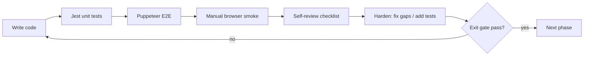

# Notation Editor Click/Selection — Deployment Guide

## How to use this guide

Deploy **one phase at a time**. Do not start phase N+1 until every **Exit gate** for phase N is checked.

Each phase follows the same loop:



**Commands (keep handy):**

```bash
# Terminal 1
npm start

# Terminal 2 — after each change batch
npm test -- --watchAll=false --testPathPattern=notation
npm run test:notation:e2e                              # P0 only (~15 tests)
NOTATION_E2E_TIER=1 npm run test:notation:e2e        # P0 + P1 (~37 tests)
npm run test:notation:all                              # Jest notation + P0 E2E
```

**Feature flags (Phase 2+):**

```javascript
// DevTools console or localStorage
localStorage.setItem('notationClickResolverV2', '1')  // enable new resolver
localStorage.setItem('notationClickResolverV2', '0')  // rollback
```

**Editor URL pattern:** `http://localhost:3000/#/editor/<tuneId>/music`

| Fixture | Tune ID suffix | Use |
|---------|----------------|-----|
| Basic | `…001` | P0 core |
| Multiline | `…003` | Line 2 clicks |
| Empty | `…004` | Note input from scratch |
| Two voice | `…002` | Voice switch on click |

---

## Phase 0 — Test harness and failing tests

**Goal:** Lock invariants in docs and tests *before* behavior changes. Some tests may fail until Phase 1/2 — mark them `test.skip` with `// fixed in phase N` or use `test.failing` if available.

### Write

| Task | Files |
|------|-------|
| Document click invariants | [`e2e/NOTATION.md`](e2e/NOTATION.md) new section "Click/caret invariants" |
| Add `globalMeasureFromAnalysis()` | `src/notation/staffClickResolve.js` (stub) or `voiceEventTiming.js` |
| Unit tests: measure line-local → global | `src/notation/staffClickResolve.test.js` |
| Unit tests: multiline index (mock events) | same |
| Stub e2e file (skipped scenarios) | `e2e/notation-click-regression.js` (skeleton) |

### Exit gate (all must pass)

- [ ] **G0.1** `npm test -- --testPathPattern=notation` — all **existing** Jest tests pass (no regressions)
- [ ] **G0.2** `NOTATION.md` lists 8 success invariants with pass/fail examples
- [ ] **G0.3** New unit file exists with ≥3 tests for `globalMeasureFromAnalysis` (pure functions, no DOM)
- [ ] **G0.4** `e2e/notation-click-regression.js` registered in [`e2e/notation-e2e.js`](e2e/notation-e2e.js) under tier `click` or P0 (scenarios may be skipped)
- [ ] **G0.5** `npm run test:notation:e2e` — current P0 suite still **37/37 or 15/15** green (unchanged product code)

**Manual:** none required.

---

## Phase 1 — Stabilize handlers and highlight

**Goal:** Stop double-firing, double-highlight, and line-local measure bugs. No new resolver yet.

### Write

| Task | Files |
|------|-------|
| Remove duplicate `onMouseDownCapture` | [`NotationEditor.js`](src/components/NotationEditor.js) |
| Unified `staffInputHandledRef` for all note-input abcjs paths | same |
| Fix right-click rest double-insert | same |
| CSS suppress `.abcjs-note_selected` in staff wrap | [`NotationEditor.css`](src/components/NotationEditor.css) |
| Fix measure: use `abcjs-mmN` / line+measure, not raw `analysis.measure` | [`voiceEventTiming.js`](src/notation/voiceEventTiming.js) |
| Drag pin via startChar where available | `NotationEditor.js` + `staffCaretPosition.js` |
| (Optional) Remove `key={mode}` on Abc | `NotationEditor.js` |
| (Optional) Skip placeholder in note-input display | `notationDisplayAbc.js` / `NotationEditor.js` |

### Automated checks

```bash
npm test -- --testPathPattern='notation|voiceEventTiming|staffCaretPosition'
npm run test:notation:e2e
```

### Exit gate

- [ ] **G1.1** Jest: all notation unit tests pass
- [ ] **G1.2** E2E P0: `Passed: 15 Failed: 0` (workflow + staff-core)
- [ ] **G1.3** E2E: `0 and right-click insert rest` — exactly **one** rest in `assertEvents` (not two)
- [ ] **G1.4** E2E: `drag 3rd note up transposes E→G (not wrong note)` still passes
- [ ] **G1.5** E2E: `barline button inserts | at caret between D and E` still passes

### Manual browser smoke (5 min)

Open basic tune `…001`, selection mode (Esc):

- [ ] **M1.1** Click D — **one** blue highlight (overlay box only; note fill does not also turn strong abcjs blue)
- [ ] **M1.2** Click E — selection moves to E; ghost/session matches (no stuck highlight on D)
- [ ] **M1.3** Drag F up one step — F transposes, not adjacent note

Note input (N):

- [ ] **M1.4** Right-click between two notes — **one** rest appears (count tokens in ABC or event list)
- [ ] **M1.5** Toggle N → Esc → N three times — no stuck caret or duplicate notes on first keypress

Multiline tune `…003`:

- [ ] **M1.6** Click `G` on line 1 — selects G, not a note from line 2
- [ ] **M1.7** Click `d` on line 2 — selects d (line 2), not C/D/E/F from line 1

**Rollback:** revert CSS + handler commits; no flag needed.

---

## Phase 1b — Plumb render artifacts

**Goal:** `renderedAbc` + `visualObj` available on every render for later resolver.

### Write

| Task | Files |
|------|-------|
| Add `onRender({ visualObj, renderedAbc })` prop | [`Abc.js`](src/components/Abc.js) |
| Store in refs on NotationEditor | [`NotationEditor.js`](src/components/NotationEditor.js) |
| Dev-only stale-render warning | same |

### Exit gate

- [ ] **G1b.1** Jest + P0 E2E unchanged green
- [ ] **G1b.2** Dev console: after editing a note, `onRender` fires (temporary `console.debug` removed before cutover)
- [ ] **G1b.3** `handleStaffClick` uses `renderedAbcRef` from parent ref, not `displayAbc` fallback, when ref is set

**Manual:**

- [ ] **M1b.1** Type note in note input — no console errors; staff updates

---

## Phase 2 — Shared resolver (flag off by default)

**Goal:** Implement `staffClickResolve.js`; wire behind `notationClickResolverV2` flag (default **off**).

### Write

| Task | Files |
|------|-------|
| `resolveStaffClick()`, `rectForEventIndex()` | `src/notation/staffClickResolve.js` |
| Flag reader `isClickResolverV2()` | same or `notationEditorFlags.js` |
| Integrate in `handleStaffClick` / pointer handlers when flag on | `NotationEditor.js` |
| Overlays use `rectForEventIndex` when flag on | `StaffCaretOverlay.js`, `StaffSelectionOverlay.js` |
| Dev log `{ source, eventIndex }` on click | `NotationEditor.js` |
| Unit tests for resolver | `staffClickResolve.test.js` |
| Enable skipped Phase 0 e2e with flag set in test | `e2e/notation-click-regression.js` |

### Automated checks

```bash
npm test -- --testPathPattern=staffClickResolve
npm run test:notation:e2e                    # flag OFF — must pass
# Run e2e with flag ON (add helper in e2e/helpers.js):
#   setNotationFlag(page, 'notationClickResolverV2', '1')
NOTATION_E2E_TIER=1 npm run test:notation:e2e  # after click-regression added
```

### Exit gate (flag **off** — production default)

- [ ] **G2.1** All Jest pass with flag off
- [ ] **G2.2** P0 + P1 E2E pass with flag **off** (no user-visible change yet)

### Exit gate (flag **on** — in browser or e2e)

- [ ] **G2.3** `staffClickResolve.test.js` — edge-case matrix rows for single-line, barline, trailing bar pass
- [ ] **G2.4** E2E click-regression (flag on): click D → `getSelection()` id matches D event
- [ ] **G2.5** E2E: note input click between D and E, type `a` → `assertEvents` shows A **between** D and E (not at start)
- [ ] **G2.6** E2E multiline (flag on): click line 2 note → correct pitch in `assertNoteSteps`
- [ ] **G2.7** Dev console on basic tune: ≥80% clicks log `source: 'startChar'` (not `dom`) on filled score

### Manual browser smoke (flag on via localStorage)

- [ ] **M2.1** Click caret between notes in note input — type letter — note appears **at caret**, caret advances one slot
- [ ] **M2.2** Insert barline toolbar — bar appears **at caret**, caret moves one slot right
- [ ] **M2.3** Selection click — overlay box aligns with clicked note (visual)
- [ ] **M2.4** No `clickAnchor` jump after typing (caret stable relative to inserted note)

**Do not cut over yet** — legacy path still default.

---

## Phase 2 cutover — Flag on, delete legacy

**Goal:** Default `notationClickResolverV2=1`; remove dead code.

### Write

| Task | Files |
|------|-------|
| Default flag on (or remove flag) | `staffClickResolve.js` |
| Delete `clickAnchor`, `staffNoteInputClickRef`, midi/measure staff fallbacks | multiple |
| Simplify overlays to resolver-only rects | overlay components |
| Remove flag branches for old path | `NotationEditor.js` |

### Exit gate

- [ ] **G2c.1** `NOTATION_E2E_TIER=1` — **37/37** pass
- [ ] **G2c.2** `npm run test:notation:all` pass
- [ ] **G2c.3** Grep: no `clickAnchor` / `staffNoteInputClickRef` in `NotationEditor.js`
- [ ] **G2c.4** Grep: `eventIndexFromAbcClick` midi fallback not called from staff click path
- [ ] **G2c.5** E2E: highlight test — count `.notation-staff-selection-box` === 1 and no visible abcjs-only selection mismatch

### Manual regression (15 min)

Run through on basic + multiline:

- [ ] **M2c.1** Full P0 manual checklist from Phase 1 (M1.1–M1.7) still passes
- [ ] **M2c.2** Barline at caret (note input + selection) — correct ABC token position
- [ ] **M2c.3** Undo/redo or edit several notes — clicks still accurate

**Rollback:** `localStorage.setItem('notationClickResolverV2','0')` until revert deploy.

---

## Phase 3 — Layout map prototype (spike only)

**Goal:** Measure Option C feasibility; **no production behavior change** unless go.

### Write

| Task | Files |
|------|-------|
| `staffLayoutMap.js` + `abcjsRenderBridge.js` | new modules |
| Coverage script or test output | `staffLayoutMap.test.js` |
| Go/no-go note in plan or `e2e/CLICK_RESOLVER_GATE.md` | docs |

### Exit gate

- [ ] **G3.1** Coverage report printed: note/chord %, barline %, rest % on fixtures `…001`, `…003`
- [ ] **G3.2** Decision recorded: **GO** (proceed Phase 4) or **NO-GO** (Option B is final)
- [ ] **G3.3** P0 + P1 E2E still pass (spike not wired to clicks)

**Manual:** none.

---

## Phase 4 — Empty-bar slots (optional, only if G3.2 = GO or Phase 2 insufficient)

**Goal:** Click empty measure areas to place caret.

### Write

| Task | Files |
|------|-------|
| Synthetic slots between DOM anchors | `staffLayoutMap.js` or extend resolver |
| Flag `notationEmptyBarSlots` | flags module |
| E2e empty-measure scenario | `notation-click-regression.js` |
| Help text limitation | `NotationEditorHelp.js` |

### Exit gate

- [ ] **G4.1** E2E: score with empty bar — click empty region — type note — **not** always at bar start (assert via `assertEvents`)
- [ ] **G4.2** Tier-1 E2E regression pass
- [ ] **G4.3** Manual: user can place caret in empty middle of 4/4 bar on multiline tune

**Known limitation (document, not gate):** spacing may not match MuseScore pixel-perfect.

---

## Phase 5 — CI hardening and documentation

**Goal:** Click regression in standard CI path; docs complete.

### Write

| Task | Files |
|------|-------|
| Move `notation-click-regression.js` into P0 or P1 tier | `notation-e2e.js` |
| Add `assertSelectionMatchesClick()` helper | `notation-assertions.js` |
| Expose `getResolverDebug()` on test hook (dev only) | `NotationEditor.js` |
| Update NOTATION.md walkthrough ↔ test map | `NOTATION.md` |

### Exit gate

- [ ] **G5.1** `npm run test:notation:all` — single command green
- [ ] **G5.2** `NOTATION_E2E_TIER=1` includes all click-regression scenarios
- [ ] **G5.3** NOTATION.md documents flags, invariants, and manual smoke checklist
- [ ] **G5.4** No skipped tests in click-regression without linked issue

---

## Review and harden checklist (every phase)

Before marking a phase complete, run this review:

### Code review

- [ ] Only one code path computes click → `eventIndex` for staff (after Phase 2 cutover)
- [ ] No new `midi` or line-local `analysis.measure` fallback without dev warning
- [ ] `renderedAbc` used for all `startChar` mapping
- [ ] abcjs drag still enabled in selection mode (`dragging: true`)

### Test hardening

- [ ] Every bug fixed has a test that would fail on old code
- [ ] E2E asserts session state (`getSelection`, `getCaretIndex`, `assertEvents`) not only pixels
- [ ] Multiline fixture covered before calling Phase 2 done

### Browser harden (manual, 10 min after Phase 2 cutover)

| Step | Action | Pass if |
|------|--------|---------|
| 1 | Open `…001`, click each of C,D,E,F | Selected pitch matches click |
| 2 | N, click between D and E, type `a` | ABC order `C D A E F` or events equivalent |
| 3 | Barline button at caret | `\|` at caret position in ABC |
| 4 | Esc, click F, drag up 2 steps | F→A (or diatonic equivalent), not wrong note |
| 5 | Open `…003`, click line 2 `d` | Selects d not line 1 |
| 6 | Right-click rest in note input | Single rest token |
| 7 | Inspect DOM | ≤1 `.notation-staff-selection-box`; no orphan `abcjs-note_selected` styling |

---

## Phase summary card

| Phase | Ship to users? | Key command | Gate count |
|-------|----------------|-------------|------------|
| 0 | No (tests only) | `npm test --testPathPattern=notation` | 5 |
| 1 | Yes | `npm run test:notation:e2e` | 5 auto + 7 manual |
| 1b | Yes (internal) | P0 e2e | 4 |
| 2 | No (flag off) / Yes (flag on dev) | e2e + flag on tests | 7 + 4 manual |
| 2 cutover | Yes | `NOTATION_E2E_TIER=1` | 5 + 3 manual |
| 3 | No | coverage report | 3 |
| 4 | Optional | empty-bar e2e | 3 |
| 5 | Yes | `test:notation:all` | 4 |

---

# Notation Editor Click/Selection Architecture Analysis

## Executive summary

The notation editor does not have **one** click-to-edit pipeline. It has **three overlapping coordinate systems** and **two parallel click handlers** that disagree about what was clicked. Visual feedback (caret line, blue borders, abcjs native highlight) is rendered by **three independent mechanisms** that are not guaranteed to show the same note.

The diagnosis is solid. The original prescription (full `StaffLayoutMap` rewrite + disable abcjs drag) is **directionally correct but over-scoped and high-risk**. This document includes **risks, mitigations, alternatives, and a revised phased plan** with prototype gate, cutover rules, and rollback strategy.

**Recommended path:** Option B (shared `staffClickResolve.js`) through Phases 0–2 + 5; Option C only if Phase 3 prototype passes coverage gate.

---

## End-to-end data flow (current state)

```mermaid
flowchart TB
  subgraph render [Render layer]
    SE["session.events"]
    DABC["displayAbc memo"]
    ABCJS["abcjs.renderAbc"]
    SVG["SVG DOM + abcjs classes"]
    VO["visualObj - stored but unused for clicks"]
    SE --> DABC
    DABC -->|"json2abc round-trip in Abc.js"| RABC["renderedAbcRef"]
    RABC --> ABCJS --> SVG
    ABCJS --> VO
  end

  subgraph click [Click input - TWO PARALLEL PATHS]
    CAP["wrap capture pointerdown"]
    ACL["abcjs clickListener"]
    CAP --> DOMPath["staffCaretPosition.js"]
    ACL --> ABCPath["voiceEventTiming.js"]
  end

  subgraph state [Editor state]
    CI["caretIndex"]
    SEL["selection.eventIds"]
    DOMPath --> CI
    ABCPath --> CI
    ABCPath --> SEL
  end

  subgraph visual [Visual feedback - THREE INDEPENDENT UIs]
    CO["StaffCaretOverlay"]
    SO["StaffSelectionOverlay"]
    NS["abcjs-note_selected"]
    CI --> CO
    SEL --> SO
    ACL --> NS
  end
```

---

## Root cause summary

### Three coordinate systems

| System | Index type | Used for |
|--------|------------|----------|
| **Event array** | `0..events.length` incl. barlines/lineBreaks | Inserts, caret, session |
| **abcjs semantic** | `startChar`, `analysis.measure` (line-local), `midi`, selectable index | Selection clicks, drag |
| **DOM ordinal** | Drawable #N, bar #N, Y-bucketed system lines | Caret overlay, note-input clicks, drag pin |

### Critical confirmed bugs

1. **`analysis.measure` (line-local) vs `event.measureIndex` (tune-global)** — wrong on multi-line scores.
2. **`abcjs-n` is per-measure** but matched globally — collision on multi-measure lines.
3. **Triple selection UI** — abcjs + overlay + session disagree.
4. **Dual handlers** — incomplete dedup (right-click, shift+click, double capture).
5. **Placeholder staff** — display `z4 |]`, events `[]` — phantom geometry.
6. **Two measure concepts** — beat-math vs abcjs bar-driven layout (layout map does not unify them).

---

## Symptom → root cause map

| User symptom | Most likely root cause |
|--------------|------------------------|
| Can only click caret at start of bar | Empty-staff fallback (55% rule); no beat-grid slots |
| Can't click in empty bars | No DOM targets; abcjs silent on empty areas in selection mode |
| Wrong line/bar selected, worse down page | `abcjs-n` collision; Y-bucketing; line-local measure |
| Note input vs selection inconsistent | Mode split with leaky handlers |
| Blue on one note, border on another | Triple highlight systems |
| Insert offset from caret | Overlay path ≠ insert index path |

---

## Risks and downsides (original "big guns" plan)

| # | Risk | Severity |
|---|------|----------|
| 1 | `getElementFromChar()` null for barlines/non-notes — hybrid map still required | High |
| 2 | Disabling abcjs drag breaks 37 e2e tests and pitch UX | High |
| 3 | Empty-bar beat grid ≠ abcjs non-linear spacing | Medium |
| 4 | `visualObj` semi-internal API; upgrade fragility | Medium |
| 5 | Parallel old+new pipelines during migration | High |
| 6 | Serialize/placeholder unification expands scope | Medium |
| 7 | Multi-voice background staves undefined | Medium |
| 8 | Beat-math vs barline semantics remain | Low–medium |

See **Mitigations catalog** below for each.

---

## Mitigations catalog

### Per-risk mitigations

**R1 — `getElementFromChar` gaps**
- Hybrid slot builder: notes/chords via `startChar` + `visualObj`; barlines via `.abcjs-bar` DOM in reading order; line breaks via next-line first element.
- Unit-test coverage matrix per event type (see Edge-case test matrix).
- Phase 3 prototype must report % mapped per type before Option C.

**R2 — abcjs drag regression**
- **Keep** `dragging: true` and `selectTypes: ['note']` in selection mode throughout Phases 1–2.
- Suppress **visual** abcjs selection only (see Highlight mitigation).
- Pin drag target at pointerdown via `startChar` from `analysis.selectableElement` + `renderedAbc`, not ordinal DOM index.
- Do not pursue manual drag unless Option C completes with parity tests.

**R3 — Empty-bar slot inaccuracy**
- Phase 4 optional; ship with user-visible limitation in help text.
- Prefer "click nearest note then use arrow keys" as interim UX rather than wrong synthetic slots.
- If implementing slots, interpolate between adjacent note/bar DOM rects (not uniform beat width).

**R4 — `visualObj` fragility**
- Pin abcjs version in mitigation tests; add `staffClickResolve.test.js` that runs against fixed ABC fixtures.
- Wrap `visualObj` access in thin adapter (`abcjsRenderBridge.js`) so abcjs API surface is one file to update on upgrade.
- Plumb `visualObj` in Phase 1b (read-only) before resolver depends on it.

**R5 — Migration middle states**
- Feature flag `notationClickResolverV2` (localStorage or env, default off → on after validation).
- **No dual index math:** when flag on, old fallbacks (midi, measure compare, ordinal overlay) must not run — fail loud in dev if resolver returns null.
- Explicit **cutover checklist** (Phase 2): delete dead code same PR that flips default flag, or within one follow-up PR.

**R6 — Serialize scope creep**
- **Separate ticket:** placeholder model, dirty/parser unify, chord-symbol round-trip.
- Click fix may use short-term placeholder mitigation (below) without full serialize rewrite.

**R7 — Multi-voice**
- **v1 default:** clicks on background voice call existing `handleVoiceSelect` (mirror ABC preview pane) then resolve click on newly active voice — one consistent behavior, documented.
- Alternative (stricter scope): ignore clicks where `analysis.voice !== activeVoiceStaffIndex` with subtle toast — only if voice-switch on click feels wrong in UX review.

**R8 — Two measure semantics**
- Click mapping uses abcjs/render semantics (`abcjs-mm`, `startChar`), not `event.measureIndex`, for all **click** resolution.
- Keep `measureIndex` for piano-roll/timing only; document that barline insert is **array-slot** based, not beat-quantized (existing behavior).
- Long-term (out of scope): optional "quantize barlines to meter" command.

### Cross-cutting mitigations

**Highlight (triple selection)**
- **Recommended:** Keep `StaffSelectionOverlay` + session as authority.
- Suppress abcjs native styling in editor staff only:
  ```css
  .notation-staff-wrap .abcjs-note_selected { fill: inherit; stroke: inherit; }
  .notation-staff-wrap .abcjs-note_selected path { /* no extra stroke */ }
  ```
- Do **not** set `selectTypes: false` (kills click events on some builds).
- Alternative: call `drag.setSelection` to sync abcjs to session after each click — only if CSS insufficient ( adds coupling ).

**`renderedAbc` authority**
- Rule: **never** map `startChar` against `displayAbc`; always `renderedAbcRef` from the render that produced the clicked SVG.
- Phase 1b: pass `renderedAbc` + `visualObj` to NotationEditor on every render via callback ref (not only on click).
- Add dev assertion if `renderedAbc` and `displayAbc` voice bodies differ when dirty.

**Mode remount (`key={'notation-staff-' + session.mode}`)**
- Mitigation: evaluate removing `key` so abcjs doesn't full-remount on note-input toggle; change only `selectTypes`/`dragging` via re-render.
- If remount stays: on mode switch, clear `staffClickAnchor`, reset drag ref, force overlay remeasure (already partial).
- Test: toggle N/Esc repeatedly; caret and selection must not stick to stale DOM.

**Placeholder staff (`z4 |]` vs `events: []`)**
- Short-term (Phase 1 or 2): in note-input mode, **omit** `withStaffDisplayPlaceholder` for active voice — render truly empty staff OR show empty staff without phantom rest token.
- Medium-term (separate ticket): synthetic `displayOnly` rest event stripped on first edit.
- Until fixed: DOM fallback must treat empty events + placeholder DOM as caret index `0` only, not map phantom rest to index 1.

**Keyboard caret (`prevEvent` / `nextEvent` / measure nav)**
- Must use same `rectForEventIndex(caretIndex)` as click path after Phase 2.
- Phase 0 test: keyboard advance caret → overlay rect monotonic on single line.

**Drag target pin**
- Pointerdown: resolve `eventId` via `startChar` when abcjs element available (`findStaffClickNoteEl` → map through resolver), not `eventIdFromStaffNoteElement` ordinal path.
- Keep id pin through drag; on release ignore `midi`, use pinned id + `drag.step` only.

**Performance (Option C / layout map)**
- Build map once per render in `useLayoutEffect`; cache keyed by `(displayAbc hash, caretIndex, voiceStaffIndex)`.
- Invalidate on: `session.events`, `displayAbc`, resize, voice switch — not every pointer move.
- Target: < 5ms build on typical tune; profile on 4-system multiline fixture.

**abcjs upgrade safety**
- Record package version in test file header.
- Smoke test: click listener still receives `startChar`; `getElementFromChar` behavior unchanged.
- Consider one integration test rendering fixture ABC through real abcjs in JSDOM or headless browser.

---

## Edge-case test matrix (Phase 0)

Must have unit or e2e coverage before declaring Phase 2 done:

| Case | Fixture / action | Expected |
|------|------------------|----------|
| Single line C D E F | click D | select D, caret at D index |
| Multiline line 2 | click note on line 2 | not line 1 event |
| Multi-measure one line | two measures on same SVG line | no `abcjs-n` collision |
| Barline before note | click between `\|` and note | caret at barline index |
| Trailing barline append | caret at `events.length` | overlay after `\|`, not after last note |
| Rest token | click rest | select rest event (not skip in selection) |
| Chord `[CEG]` | click chord | single chord event id |
| Grace note `{g}C` | click main note | main note id, not grace |
| Tie / slur | click tied note | correct note in tie pair |
| Duplicate pitch | two C notes | `startChar` disambiguates, not midi alone |
| Empty voice | note input click staff | caret 0, no phantom rest insert |
| Right-click rest | one insert only | single rest in events |
| Drag E up | E transposes, not adjacent note | pinned id |
| Shift+range | shift click second note | range between anchor and target indices |

---

## Implementation strategies compared

### Option A — Minimal surgery
startChar + hygiene; keep abcjs drag. Fastest; empty-bar weakness remains.

### Option B — Shared resolver (recommended default)
`staffClickResolve.js`; DOM fallback only when abcjs silent; one highlight authority.

### Option C — Full StaffLayoutMap
Only after Phase 3 gate: notes+barlines >95% mapped on multiline fixture.

### Decision gate (Option C)

| Metric | Go threshold |
|--------|----------------|
| Note/chord slot mapping | ≥ 98% |
| Barline slot mapping | ≥ 95% |
| Rest mapping | ≥ 90% |
| Empty-beat slot (synthetic) | documented + ≥ 1 fixture OR defer Phase 4 |
| Build time typical tune | < 5ms |

**No-go →** Option B is terminal architecture; delete spike code or keep behind flag for future.

---

## Success invariants (testable)

1. **Click identity:** pitch P clicked → selected event has pitch P.
2. **Caret consistency:** type after click → note at caret slot in serialized ABC.
3. **Single highlight:** one mechanism; overlay intersects selected note bbox.
4. **Monotonic caret:** left-to-right on one line, index non-decreasing.
5. **Multiline:** line 2 click → line 2 event (global measure semantics).
6. **No double actions:** one click → one state change.
7. **Keyboard parity:** after `nextEvent`, overlay matches `rectForEventIndex(caretIndex)`.
8. **Drag parity:** dragged note === pointerdown-pinned id.

---

## Revised implementation plan

### Phase 0 — Invariants and tests

- Document invariants in [`e2e/NOTATION.md`](e2e/NOTATION.md).
- Unit: `globalMeasureFromAnalysis(analysis, selectableElement)` — parse `abcjs-mmN` from classes, fallback `lineMeasuresOffset[analysis.line] + analysis.measure`.
- Unit: failing cases for multiline measure bug, right-click double-insert (fixed in Phase 1).
- Edge-case matrix tests (table above).

### Phase 1 — Stabilize (stop the bleeding)

**Handler hygiene**
- Remove `onMouseDownCapture` duplicate; keep `onPointerDownCapture` only.
- Single `staffInputHandledRef` for all note-input abcjs events (left, right, shift) — not just left-click.
- Route shift+click range through same index as caret when in note input (or disable shift+select in note input).

**Highlight**
- CSS suppress `.abcjs-note_selected` under `.notation-staff-wrap` (see Mitigations).
- Keep `StaffSelectionOverlay` as sole selection chrome.

**Measure fix**
- Replace `analysis.measure` vs `event.measureIndex` compares with tune-global measure from `abcjs-mmN` on `analysis.selectableElement`, or computed global from line+measure using rendered line structure.
- Remove or gate old measure fallback behind dev-only warning.

**Drag pin**
- Pointerdown: resolve event id via startChar path where possible.

**Mode remount (optional in Phase 1)**
- Try removing `key={'notation-staff-' + session.mode}`; verify selectTypes/dragging update without remount.

**Placeholder short-term**
- Note-input mode: skip placeholder rest for active voice display body.

**Do not:** disable abcjs drag; delete legacy modules.

### Phase 1b — Plumb render artifacts early

- [`Abc.js`](src/components/Abc.js): `onRender({ visualObj, renderedAbc })` callback after each `renderAbc`.
- NotationEditor stores in ref; available to resolver and overlays before any click.
- Dev warning if click uses stale `renderedAbc` (hash mismatch).

### Phase 2 — Shared click resolver (Option B)

**New module:** [`src/notation/staffClickResolve.js`](src/notation/staffClickResolve.js)

```javascript
// resolveStaffClick(ctx) → { eventIndex, eventId, rect?, source: 'startChar'|'dom'|'null' }
// rectForEventIndex(events, index, layoutCtx) → { left, top, height }
```

**Resolver priority (production):**
1. `abcelem.startChar` + `renderedAbc` → `mapAbcClickToVoiceCursor` → `eventIndexFromAbcCharPosition`
2. If note-input / empty staff: DOM `(x,y)` via simplified geometry (bar-aware, no global `abcjs-n`)
3. **No** midi fallback in production; **No** raw `analysis.measure` vs `measureIndex`

**Integration:**
- `handleStaffClick`, `handleStaffWrapPointerDown`, overlay components call resolver only.
- Feature flag `notationClickResolverV2` toggles new vs old path during development.

**Delete in cutover PR (when flag default on):**
- `clickAnchor` state
- `staffNoteInputClickRef` (replaced by unified handled ref)
- Midi/measure fallbacks in `eventIndexFromAbcClick` for staff clicks
- Independent ordinal walk in `staffSelectionAnchorRects` / `staffCaretAnchorRect` — replace with `rectForEventIndex`

### Phase 2 cutover checklist

- [ ] All Phase 0 matrix tests pass with flag on
- [ ] Tier-1 e2e (37 tests) pass with flag on
- [ ] No `abcjs-note_selected` visible during selection (CSS check in e2e)
- [ ] Dev console: zero resolver nulls on standard fixtures
- [ ] Flag default on; old path removed in same or immediate follow-up PR

### Phase 3 — Prototype gate (Option C spike)

- Experimental `StaffLayoutMap` in `src/notation/staffLayoutMap.js` (flag-gated, not wired to production clicks until go).
- Coverage report JSON or test output checked into `e2e/` or CI artifact.
- Adapter `abcjsRenderBridge.js` isolates visualObj API.

### Phase 4 — Empty-bar slots (conditional)

- Only if gate passes OR user testing proves Phase 2 insufficient.
- Interpolate between neighbor DOM rects; document non-linear limitation.
- Do not block Phases 1–2 on this.

### Phase 5 — E2e expansion

**Mitigate screen-coordinate fragility:**
- Prefer `window.__abc2bookNotationTest` session assertions (event ids, caret index, ABC body) over pixel clicks where possible.
- Use mouse clicks only for actions; verify outcome via session API.

**New scenarios:**
- Multiline fixture [`NOTATION_E2E_MULTILINE_ID`](e2e/notation-fixtures.js)
- Highlight consistency (count `.abcjs-note_selected` visible + overlay boxes === 1)
- Empty measure (conditional on Phase 4)

**Regression:** full tier-1 after every phase merge.

---

## Explicit v1 scope boundaries

**In scope**
- Active voice staff editing (with **default:** background voice click → switch active voice, re-resolve).
- Note-input caret, selection, abcjs drag transpose, barline at caret.
- Keyboard caret navigation aligned with resolver rects.

**Out of scope (separate tickets)**
- Piano roll click/coordinate unification
- Full serialize round-trip / chord symbols / lyrics in event model
- Pickup/anacrusis barline vs beat unification
- Manual abcjs drag replacement

---

## Rollback and feature-flag strategy

| Flag / control | Purpose |
|----------------|---------|
| `notationClickResolverV2` | Toggle Phase 2 resolver vs legacy paths |
| localStorage `notationClickResolverV2=0` | User/dev emergency rollback without deploy |

**Rollback per phase:**
- Phase 1: revert CSS + handler dedup (low risk)
- Phase 2: flip flag off; legacy paths remain until cutover deletes them
- Phase 3: spike isolated; no production rollback needed
- Phase 4: flag `notationEmptyBarSlots`

**Monitoring (dev only):**
- Log `{ source: 'startChar'|'dom'|'null', eventIndex, mode }` on each click when `NODE_ENV !== 'production'`.
- Alert if `dom` fallback rate > 20% on filled scores (signals abcjs click regression).

---

## Key files

| Concern | File |
|---------|------|
| abcjs render + click | [`src/components/Abc.js`](src/components/Abc.js) |
| Handler orchestration | [`src/components/NotationEditor.js`](src/components/NotationEditor.js) |
| DOM mapping (legacy → shrink) | [`src/notation/staffCaretPosition.js`](src/notation/staffCaretPosition.js) |
| Semantic mapping (legacy → shrink) | [`src/notation/voiceEventTiming.js`](src/notation/voiceEventTiming.js) |
| Voice/startChar | [`src/notation/notationDisplayAbc.js`](src/notation/notationDisplayAbc.js) |
| **Shared resolver (new)** | `src/notation/staffClickResolve.js` |
| **abcjs adapter (new)** | `src/notation/abcjsRenderBridge.js` |
| **Layout map spike (new)** | `src/notation/staffLayoutMap.js` |
| Overlays | [`StaffCaretOverlay.js`](src/components/StaffCaretOverlay.js), [`StaffSelectionOverlay.js`](src/components/StaffSelectionOverlay.js) |
| Styles | [`NotationEditor.css`](src/components/NotationEditor.css) |

---

## Architectural anti-patterns to avoid (post-fix)

1. Adding new fallbacks without logging which path fired
2. Mapping clicks against `displayAbc` instead of `renderedAbc`
3. Re-introducing abcjs selection styling alongside overlay
4. Using `abcjs-n` without `abcjs-mm` / measure context
5. Ordinal drawable index for selection overlay without startChar cross-check
6. Running two index algorithms behind feature flag without "fail loud" on disagreement

---

## Estimated impact

| Phase | Effort | Risk | User-visible gain |
|-------|--------|------|-------------------|
| 0 | Low | None | Test safety net |
| 1 | Low–medium | Low | Double-highlight, measure, double-insert fixed |
| 1b | Low | Low | Reliable startChar source |
| 2 | Medium | Medium | Click=caret=insert; single resolver |
| 2 cutover | Low | Medium | Remove legacy complexity |
| 3 | Medium | Low (spike) | Option C decision |
| 4 | High | High | Empty-bar (optional) |
| 5 | Medium | Low | Regression prevention |

---

## Original detailed analysis

Layer-by-layer analysis (abcjs click fields, Pipeline A/B, orchestration table, render drift table) from prior revision remains valid. Core patterns that guarantee bugs if unfixed:

1. Dual pipelines without shared slot identity
2. Ordinal DOM indexing vs `startChar` / event id identity
3. Re-serializing to map clicks vs using render product
4. Competing selection UIs
5. Placeholder render without model
6. Multiple ABC string sources

For full abcjs field reference and handler mode table, see git history of this plan file (revision before mitigation integration).
