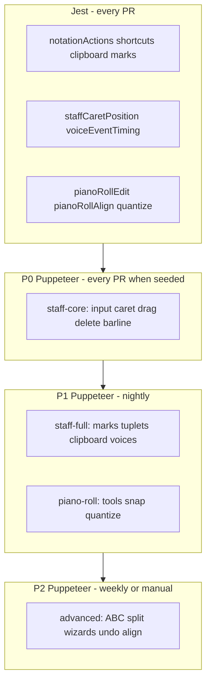

# Notation editor E2E testing (scope-driven)

## Product scope (source of truth)

The notation editor is documented as a **MuseScore-like** visual editor with ABC sync in:

- [NotationEditorHelp.js](src/components/NotationEditorHelp.js) — 17 help sections
- [NotationEditorWalkthrough.js](src/components/NotationEditorWalkthrough.js) — **35 steps** in **7 phases**

These define **what to test**, not an arbitrary toolbar checklist.

| Walkthrough phase | Help section | Editor surface |
|-------------------|--------------|----------------|
| Getting started | Overview, Views | Routes, view dropdown, header undo |
| Staff note input | Note input, Virtual piano | N/✎ mode, durations, dot, accidentals, A–G, rests, `\|`, virtual piano |
| Staff editing | Staff, Bar lines, Marks, Tuplets, Selection | Select, shift-range, drag pitch, barlines, marks, tuplets, Q/W, transpose, clipboard |
| MIDI keyboard | MIDI | Enable, chord modes, record (Chrome Web MIDI) |
| Piano roll | Piano roll | Sel/Draw/Split/Erase, drag/resize, snap, overlays, zoom, keyboard nudge |
| Advanced | Quantize, Wizards, ABC view | Split view, quantize, align, layout wizards |
| Shortcuts & history | Undo | Ctrl+Z, labelled history |

**Four views** ([notationConstants.js](src/notation/notationConstants.js)): Staff, Piano roll, Split, ABC — mounted via `/editor/:id/music`, `pianoRoll`, `notationAbc` ([NotationEditorHelp.js](src/components/NotationEditorHelp.js) lines 94–107).

---

## Test pyramid

| Layer | Runs when | Responsibility |
|-------|-----------|----------------|
| **Jest** (`src/notation/*.test.js`) | Every PR | Pure logic: insert, transpose, quantize math, shortcut map, caret geometry, clipboard |
| **P0 Puppeteer** | PR (once seed exists) + local | MuseScore **core loop**: enter notes, move caret, rest, select, delete, **drag correct note**, barline |
| **P1 Puppeteer** | Nightly | Full **staff-edit** + **staff-input** walkthrough steps; toolbar menus open; piano roll tools |
| **P2 Puppeteer** | Nightly/weekly | Advanced walkthrough: ABC view, split, wizards, align, undo |
| **Manual / skip E2E** | Checklist | Web MIDI hardware, clef/key transpose modal, media-linked downbeat/region, tap-to-play |

**Rule for new features:** logic → Jest; UI wiring → add row to [e2e/NOTATION.md](e2e/NOTATION.md) mapping walkthrough step → test tier.

---

## Decision: Puppeteer

Extend [e2e/playback-smoke.js](e2e/playback-smoke.js). Scripts:

- `npm run test:notation:e2e` — P0 (+ P1 when `NOTATION_E2E_TIER=1`)
- `npm run test:notation:all` — Jest notation unit + Puppeteer

Dev hook (`window.__abc2bookNotationTest`): `getVoiceAbc`, `getSessionEvents`, `getSelection`, `getMode` — assert ABC strings, not screenshots.

---

## Phase 0: Fix staff drag (P0 blocker)

Walkthrough step **transpose** + **selection** assume drag/↑ moves the **clicked** note ([NotationEditorWalkthrough.js](src/components/NotationEditorWalkthrough.js) steps `selection`, `transpose`).

Fix before expanding tests:

1. Store **`eventId`** at pointerdown (not index) in [NotationEditor.js](src/components/NotationEditor.js)
2. Voice-filter `drag.index` for multi-voice display
3. P0 repro: fixture `C D E F |`, drag 3rd note up → `C D G F`

---

## Phase 1: E2E infrastructure

| Artifact | Purpose |
|----------|---------|
| [e2e/helpers.js](e2e/helpers.js) | Launch, dismiss merge modal, navigate `/editor/:id/music`, focus editor |
| [e2e/notation-fixtures.js](e2e/notation-fixtures.js) | Tune bodies per walkthrough phase (single voice, multi-line, with barlines) |
| `?e2eSeed=notation-basic` or `__abc2bookE2ESeed()` | IndexedDB fixture (v1 — avoids profile copy) |

Fixtures should mirror walkthrough **Try it** steps (e.g. `C D E F G`, triplet triple, two voices).

---

## Phase 2: `data-testid` map (aligned to help sections)

| Help / walkthrough area | testids |
|-------------------------|---------|
| Note input | `notation-note-input-btn`, `notation-duration-{1-9}`, `notation-dot`, `notation-accidental-menu` |
| Staff | `notation-staff-wrap`, `notation-staff-caret`, `ghost-caret-label` |
| Bar lines & tools | `notation-barline`, `notation-barline-menu`, `notation-tools-menu`, `notation-system-break-btn`, `notation-wizard-btn` |
| Marks / tuplets | `notation-marks-menu`, `notation-tuplet-menu`, `notation-mode-badge-slur`, `notation-mode-badge-input` |
| Voices | `notation-voices-menu`, `notation-voice-tab-{key}` |
| Views | `notation-view-staff`, `notation-view-piano-roll`, `notation-view-split`, `notation-view-abc` (header dropdown) |
| Virtual piano | `virtual-piano`, `virtual-piano-octave-down`, `virtual-piano-octave-up` |
| Piano roll | `piano-roll-canvas`, `piano-roll-tool-{select|draw|split|erase}`, `piano-roll-snap`, `piano-roll-quantize` |
| ABC view | `notation-abc-textarea`, `notation-abc-preview` |
| Dev | `notation-editor` root |

Staff note clicks stay on `.abcjs-note` / coordinates; testids on **chrome**.

---

## Phase 3: Tiered test suites (mapped to walkthrough)

### P0 — `e2e/notation-staff-core.js` (MuseScore core — ship first)

Must pass before calling editor “usable”. Maps to walkthrough **staff-input** + **staff-edit** basics.

| # | Walkthrough step id | Test |
|---|---------------------|------|
| 1 | `modes` | N toggles `.notation-editor-note-input`; Esc exits; ghost label updates |
| 2 | `enter-notes` | N → caret click → `c d e` → ABC contains `C D E` |
| 3 | `enter-notes` | `0` and right-click insert `z` at caret |
| 4 | `modes` / `selection` | Click between notes line 1 & 2 → caret moves (ghost label index) |
| 5 | `selection` | Click note selects; Shift+click range |
| 6 | `clipboard` | Delete → rest; Ctrl+Delete → removed |
| 7 | `transpose` | **Drag note vertically** — correct note pitch changes (regression) |
| 8 | `transpose` | Select → ↑ — same note transposes |
| 9 | `barlines` | `\|` button inserts `\|` in ABC |
| 10 | `views` | `/editor/:id/music` renders staff + duration toolbar |

### P1 — `e2e/notation-staff-full.js` (full staff walkthrough)

| # | Walkthrough step id | Test |
|---|---------------------|------|
| 11 | `durations` | Keys 1–9 + dot change inserted note length |
| 12 | `accidentals` | `+` then `g` → sharp in ABC |
| 13 | `chords` | Shift+G after C → chord token |
| 14 | `virtual-piano` | Click key inserts note; enables input mode |
| 15 | `barlines` | Menu: `\|:`, `:\|`, `\|]` tokens |
| 16 | `layout-breaks` | System break ↵ / `!` → newline in body |
| 17 | `marks` | T tie; menu staccato on selection |
| 18 | `marks` | Slur mode two-click |
| 19 | `tuplets` | Triplet mode → 3 notes with tuplet |
| 20 | `duration-edits` | Q/W halve/double selection |
| 21 | `clipboard` | Ctrl+C/V, R repeat |
| 22 | `voices` | Switch voice tab; ABC body swaps |
| 23 | Toolbar smoke | Each dropdown opens (Help, Voices, Tools, Marks, Tuplets, MIDI panel visible) |

### P2 — `e2e/notation-piano-roll.js`

Maps to walkthrough **piano-roll** phase (steps `piano-roll-overview` through `piano-roll-zoom`).

| # | Step id | Test |
|---|---------|------|
| 24 | `piano-roll-tools` | Draw inserts note; Erase removes; Split splits |
| 25 | `piano-roll-drag` | Drag changes pitch and timing (assert via hook) |
| 26 | `piano-roll-snap` | Snap on/off affects placement |
| 27 | `quantize` | Quantize dialog Apply moves notes to grid |
| 28 | `align` | Slide +0.25 beat (no media required) |
| 29 | `piano-roll-keyboard` | Arrow nudge in piano roll focus |

### P3 — `e2e/notation-advanced.js`

| # | Step id | Test |
|---|---------|------|
| 30 | `abc-view` | Textarea edit updates preview; Enter line break |
| 31 | `split-view` | Split resizer changes ratio (localStorage) |
| 32 | `wizards` | Auto Fix / 4-bar layout changes ABC (multi-voice tune) |
| 33 | `undo` | Edit → header undo → ABC restored |
| 34 | `views` | Ctrl+Alt+P cycles staff / roll / split |

### Explicitly out of Puppeteer scope (manual or unit-only)

| Feature | Why |
|---------|-----|
| MIDI keyboard input/record | Requires Web MIDI device or heavy mocking |
| Staff click → playback seek | Audio/autoplay policy |
| Align to recording / match melody / downbeat / region | Needs linked media + timedMelody fixture |
| Clef/key → transpose modal | Tune-level modal; separate small test optional |
| Waveform / playhead sync | Media dependency |
| All 35 walkthrough menu items individually | P1 covers representative; full matrix is P2+ maintenance |

---

## Phase 4: CI

1. **Every PR:** `npm test -- --watchAll=false` (Jest, including notation unit)
2. **When seed lands:** P0 Puppeteer on nightly (server + headless Chrome)
3. **P1+** on nightly or manual `NOTATION_E2E_TIER=full`

---

## Phase 5: Process ([e2e/NOTATION.md](e2e/NOTATION.md))

When adding a notation feature:

1. Update help + walkthrough step if user-facing
2. **Logic** → `src/notation/*.test.js`
3. **UI** → add P0/P1/P2 row in NOTATION.md + Puppeteer case
4. **Bug fix** → regression in P0 if staff core, else appropriate tier

---

## Implementation order

1. E2E seed + P0 drag regression (failing)
2. Drag fix (`eventId`)
3. `e2e/helpers.js` + fixtures + testids for P0
4. `notation-staff-core.js` (P0 complete)
5. `notation-staff-full.js` (P1)
6. `NOTATION.md` walkthrough ↔ test matrix
7. Piano roll + advanced tiers
8. Puppeteer upgrade + nightly CI
