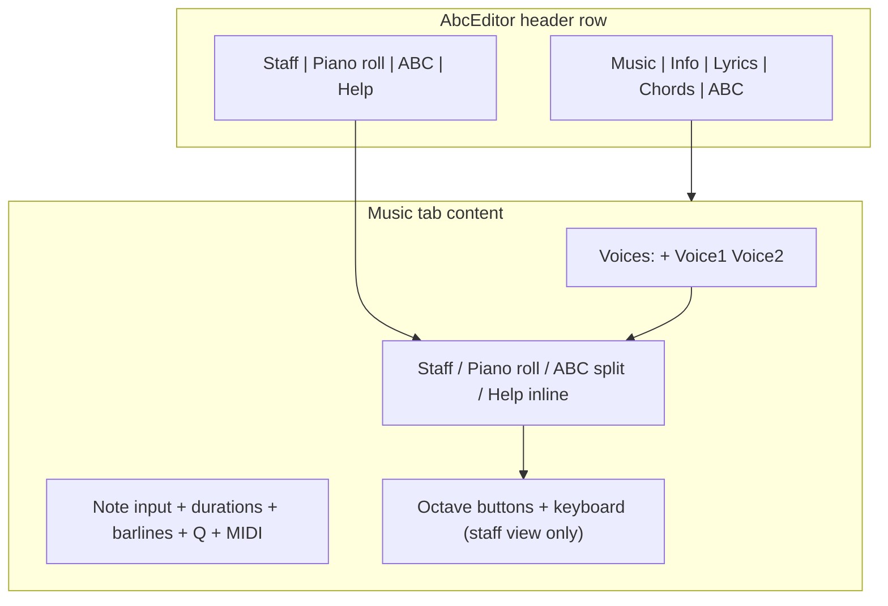

# Notation Editor Overhaul Plan

## Architecture overview

---

## 1. Layout restructure

### View toggle aligned with main tabs
- In [`AbcEditor.js`](src/components/AbcEditor.js), wrap the main `Tabs` and a portal slot in a flex header row:
  - Desktop (`md+`): tabs left, view toggle right, same baseline
  - Mobile: view toggle wraps directly under tab headers
- [`NotationEditor.js`](src/components/NotationEditor.js) renders the toggle via `createPortal` into `#notation-view-toggle-slot`, or lift `session.view` + `SET_VIEW` to a small context shared with AbcEditor
- Add **Help** as a fourth toggle option; remove standalone `?` button and [`NotationEditorHelpModal.js`](src/components/NotationEditorHelpModal.js) fullscreen modal
- When Help is selected, render [`NotationEditorHelp.js`](src/components/NotationEditorHelp.js) inline below the toggle, replacing all other editor content (no piano, no staff)

### Voice selector at top of content
- Update [`NotationVoiceSelector.js`](src/components/NotationVoiceSelector.js): add visible **Voices** label before tabs
- Reorder [`NotationEditor.js`](src/components/NotationEditor.js) stack:
  1. View toggle (portaled to header)
  2. **Voices** selector
  3. Contextual toolbars + view content
- **Active voice drives all views**: staff, piano roll, ABC textarea, and ABC preview show only the selected voice (change from current “all voices on staff” behavior documented in help)

### Toolbar consolidation (notation view only)
Restructure [`NotationToolbar.js`](src/components/NotationToolbar.js), [`NotationDurationToolbar.js`](src/components/NotationDurationToolbar.js), [`MidiInputPanel.js`](src/components/MidiInputPanel.js):

| Control | New placement | Visibility |
|---------|---------------|------------|
| Wizard icon | Left of barline `ButtonGroup`, `size="lg" outline-secondary` (same as barlines) | Notation view only |
| Note input (✎) | First button in duration `ButtonGroup` | Notation view only |
| Durations 1–9 + dot | Single joined `ButtonGroup`; dot same size, no gap | Notation view only |
| Barlines + ↵ | After wizard | Notation view only |
| Q (quantize) | After ↵ | Notation view only |
| MIDI enable + device + chord mode | Right of Q, `size="lg"` matching Q | Notation view only |
| Help (?) | Removed; replaced by Help view toggle | — |

CSS in [`NotationEditor.css`](src/components/NotationEditor.css): merge `.notation-dot-btn` into duration group (remove separate gap/font-size override).

### Virtual piano (staff / notation view only)
- [`NotationEditor.js`](src/components/NotationEditor.js): change render guard from `session.view !== EDITOR_VIEWS.ABC` to `session.view === EDITOR_VIEWS.STAFF` so the keyboard is **hidden** in piano roll, ABC, and Help views (currently it also shows in piano roll)
- [`VirtualPiano.js`](src/components/VirtualPiano.js): stack ◀ Oct / Oct ▶ vertically on the **left** of the keyboard using flex row (`octave-controls` column + `virtual-piano-keys`)

---

## 2. Wizard and media import relocation

### Move wizard from page header to notation toolbar
- Remove `<WizardOptionsModal />` from [`MusicEditor.js`](src/components/MusicEditor.js) (currently between search and undo, line ~101)
- Mount wizard modal from [`NotationEditor.js`](src/components/NotationEditor.js); trigger from new toolbar button (keep `tunebook.icons.wizard`)
- [`WizardOptionsModal.js`](src/components/WizardOptionsModal.js): remove `MediaImportEntryButton` and `MediaImportWizard` from modal body; keep Auto Fix / Halve / Double / 4-6-8 bar layout actions

### Restore Import from media in Links editor
- Add [`LinksEditor`](src/components/LinksEditor.js) to [`AbcEditor.js`](src/components/AbcEditor.js) Info tab (currently commented out at line ~541)
- In LinksEditor top header row (right side, alongside YouTube search):
  - Add `MediaImportEntryButton` styled like [`LinkPlaybackRegionScanControls`](src/components/LinkPlaybackRegionScanControls.js) scan button (`outline-secondary`, compact)
  - Host `MediaImportWizard` in LinksEditor (or AbcEditor) with same props currently passed from WizardOptionsModal
- Pass `token`, `searchIndex`, `loadTuneTexts`, `forceRefresh` through AbcEditor → LinksEditor

---

## 3. Hide books/tags from notation previews

Full-tune ABC from [`buildEditorDisplayAbc`](src/notation/notationDisplayAbc.js) → `json2abc` includes `B:` book lines and `N: AKA:` alias lines that abcjs renders as text under the staff (same issue [`MusicSingle.js`](src/components/MusicSingle.js) already solves for `B:` at line 297).

- Add `stripNotationDisplayMetadata(abcText)` in [`notationDisplayAbc.js`](src/notation/notationDisplayAbc.js):
  - Filter out lines starting with `B:`
  - Filter out `N: AKA:` lines (tag/alias display)
  - Optionally filter `% abcbook-tags` comment lines
- Apply in NotationEditor for:
  - Staff view `displayAbc`
  - ABC view right-hand preview ABC
- Also build **single-voice** display ABC (headers + one `V:` + active voice notes only) so previews never show duplicate multi-voice staves

---

## 4. Bug fixes: duplicate voice, line breaks, cursor sync

### Duplicate voice (beamed + unbeamed)
Root causes identified:
- Staff renders all voices while live active voice is merged via `buildEditorDisplayAbc`
- Possible duplicate note lines in `voice.notes[]` from ABC textarea vs event model divergence

Fixes:
- Show **single active voice** on staff (item 1 above)
- Ensure `buildEditorDisplayAbc` replaces (not appends) active voice notes
- On ABC textarea save, re-parse into `session.events` immediately (debounced) so models stay aligned
- Add regression test: single voice with eighth notes renders one staff, one beaming context

### Line breaks not rendering
- ABC textarea `\n` → `tune.voices[vk].notes[]` already splits lines; staff uses `session.events` which may lack `lineBreak` events until reload
- On ABC text change: parse body → dispatch `LOAD_VOICE` or `SET_EVENTS` so `lineBreak` events from [`parseVoiceEvents`](src/notation/voiceEventModel.js) propagate to staff
- System break (↵): optionally emit ABC `!` in serializer **or** keep newline-based breaks but ensure serializer and parser agree (update help text if needed)
- ABC preview: use `voice.notes[]` lines directly (forced line breaks) rather than one long unbroken string

### Cursor sync and note click behavior
- **Stop switching to ABC view** on staff note click ([`handleStaffClick`](src/components/NotationEditor.js) lines 326–330); only update caret/selection
- Replace measure-only [`eventIndexFromAbcClick`](src/notation/voiceEventTiming.js) with note-level mapping using `abcelem.startChar` / beat position; wire up unused `caretIndexForStartBeat`
- Add `eventIndexToAbcCharRange(events, index)` for reverse mapping
- ABC textarea: on `select`/`keyup`, update `session.caretIndex`; when staff caret moves, set textarea selection if ABC view is active
- Upgrade [`GhostNoteOverlay.js`](src/components/GhostNoteOverlay.js) to show caret at selected event in **both** normal and note-input modes (highlight via abcjs `selectTypes` or overlay positioned from click target)

---

## 5. ABC view split pane

When ABC view is active ([`NotationEditor.js`](src/components/NotationEditor.js) ~458):
- Two-column layout (`Row`/`Col`): monospace textarea left, live notation preview right
- Preview uses single-voice stripped ABC with forced line breaks from `notes[]` array
- Typing in textarea updates preview debounced (same as save path)

---

## 6. Piano roll Phase 1 (user-selected scope)

Current limitation: horizontal drag sets `startBeat` but [`reassignEventTiming`](src/notation/abcVoiceSerializer.js) resets timing from event order ([`beatGrid.js`](src/notation/beatGrid.js)).

### Phase 1 deliverables in [`PianoRollEditor.js`](src/components/PianoRollEditor.js)

| Feature | Approach |
|---------|----------|
| Horizontal move | Reorder events in array + insert/remove rests to preserve bar fill; new helper `moveEventInTime(events, eventId, newStartBeat)` |
| Duration resize | Drag left/right edge handles; update `duration` field |
| Draw notes | Click empty grid cell → insert note at snapped beat |
| Delete notes | Delete/Backspace or click+delete mode |
| Selection | Click note to select; highlight in roll |
| Visible grid | Subdivision lines at snap interval |
| Pitch drag | Keep existing vertical drag (already persists) |

Reaper features **deferred** to later phases: multi-select marquee, Alt-duplicate, velocity lane, CC lanes, scroll/zoom chrome.

---

## Key files to change

| File | Changes |
|------|---------|
| [`AbcEditor.js`](src/components/AbcEditor.js) | Tab header flex layout, portal slot, restore LinksEditor in Info tab |
| [`MusicEditor.js`](src/components/MusicEditor.js) | Remove wizard from top bar |
| [`NotationEditor.js`](src/components/NotationEditor.js) | Reorder layout, view modes, ABC split, single-voice display, cursor sync; gate `VirtualPiano` on `EDITOR_VIEWS.STAFF` only |
| [`NotationToolbar.js`](src/components/NotationToolbar.js) | Wizard button, notation-only controls |
| [`NotationDurationToolbar.js`](src/components/NotationDurationToolbar.js) | Merge note input + dot into group |
| [`NotationVoiceSelector.js`](src/components/NotationVoiceSelector.js) | "Voices" label |
| [`NotationEditor.css`](src/components/NotationEditor.css) | Header row, split pane, toolbar, octave stack |
| [`notationDisplayAbc.js`](src/notation/notationDisplayAbc.js) | Metadata strip + single-voice builder |
| [`voiceEventTiming.js`](src/notation/voiceEventTiming.js) | Note-level click mapping + char range helper |
| [`WizardOptionsModal.js`](src/components/WizardOptionsModal.js) | Remove media import; external trigger only |
| [`LinksEditor.js`](src/components/LinksEditor.js) | Import from media button (scan style, right-aligned) |
| [`VirtualPiano.js`](src/components/VirtualPiano.js) | Vertical octave buttons |
| [`PianoRollEditor.js`](src/components/PianoRollEditor.js) | Phase 1 editing features |
| [`NotationEditorHelp.js`](src/components/NotationEditorHelp.js) | Update for new layout/behavior |

---

## Test plan

- Single-voice tune: staff shows one line, beamed correctly; no duplicate staves
- Enter line break in ABC textarea → staff wraps to new system after debounce
- Click note on staff: stays on staff view, caret visible at clicked note
- ABC textarea cursor ↔ staff caret stay aligned when switching views
- Books/tags on tune: not visible under staff or ABC preview
- Wizard button in notation toolbar opens layout wizards; no wizard in page header
- Import from media appears in Links editor header (Info tab), not wizard dialog
- Piano roll: horizontal drag changes note timing in saved ABC; draw/delete/resize work
- Help view replaces content below toggle group; no virtual piano shown
- Virtual piano visible only in staff (notation) view; hidden in piano roll, ABC, and Help
- Mobile: view toggle wraps under main tabs
