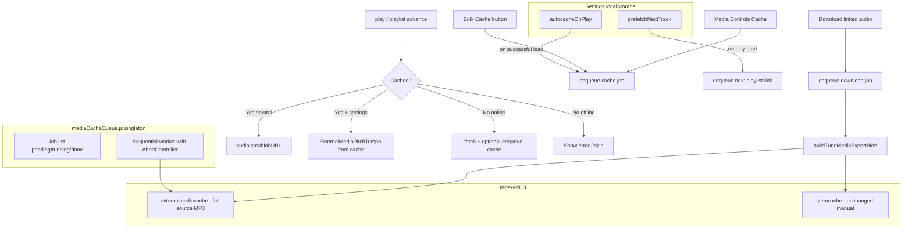

# Offline Media Caching — Implementation Plan

## Goal

Enable reliable offline media playlist playback by:

1. **Settings-gated autocache** (on play) and **prefetch** (next playlist track)
2. **Native playback from `externalmediacache`** even when settings are neutral
3. **One global queue** for cache and download jobs, with start/stop and per-item cancel
4. **Bulk Cache** button + **Download audio** in bulk download dropdown
5. **Trim to link start/end** and apply **persisted tempo/pitch/filter settings** on download (single + bulk)

**Scope decisions (confirmed):**

- Bulk cache: **active playback link only** per tune (route link index, else first cacheable link: HTTP audio or YouTube; skip ABC/data URIs)
- **YouTube included** in bulk cache, autocache, prefetch, and linked-audio download — same resolver path as single-tune Cache ([`downloadAndCacheExternalMedia`](src/externalMediaAudioCache.js)); offline playback uses cached MP3 via blob/processor path, **not** the YouTube iframe
- Autocache/prefetch: **source audio only**; stem analysis stays manual (filters won't work offline until user analyses stems)

---

## Current Gaps (baseline)

| Gap | Location |
|-----|----------|
| Neutral playback ignores cache | [`play()`](src/useTuneBookMediaController.js) → `playNativeMedia()` uses `<audio src={url}>` |
| No autocache on play | [`ExternalMediaPitchTempo.load()`](src/externalMediaPitchTempo.js) reads cache but never writes on network fetch |
| No prefetch | [`navigateToNextSong`](src/useTuneBook.js) only navigates |
| Download is raw full source | [`saveExternalMediaToFile`](src/useTuneBookMediaController.js) via `getExternalMediaMp3Blob` — no trim/settings |
| Bulk download audio = inline files only | [`collectAudioAssetsFromTune`](src/tuneDownloadActions.js) — not linked HTTP media |
| No shared queue | Cache button in [`MediaPlayerOptionsModal`](src/components/MediaPlayerOptionsModal.js) runs inline `downloadAndCacheExternalMedia` |

---

## Architecture



---

## 1. Settings

**New file:** [`src/offlineMediaSettings.js`](src/offlineMediaSettings.js) (pattern: [`practiceSessionSettings.js`](src/practiceSessionSettings.js))

```js
// localStorage key: bookstorage_offline_media_settings
{
  autocacheOnPlay: false,   // enqueue cache after successful media load
  prefetchNextTrack: false // enqueue cache for next mediaPlaylist tune on play
}
```

**UI:** [`src/pages/SettingsPage.js`](src/pages/SettingsPage.js) — new "Offline media" section with two checkboxes and short help text explaining source-only cache (stems still manual).

---

## 2. Global Media Cache Queue

**New file:** [`src/mediaCacheQueue.js`](src/mediaCacheQueue.js)

Singleton module (not React state) so one queue spans bulk ops, single-tune cache, autocache, prefetch, and downloads.

### Job model

```js
{
  id: string,
  type: 'cache' | 'download',
  tuneId, linkIndex, src, srcType,
  tuneName, linkTitle,
  status: 'pending' | 'running' | 'done' | 'cancelled' | 'error',
  error: string | null,
  abortController: AbortController,
  // download-only:
  filename, settings, regionStart, regionEnd
}
```

### API

| Method | Behavior |
|--------|----------|
| `enqueueCacheJob(options)` | Skip if already cached or duplicate pending job |
| `enqueueDownloadJob(options)` | Download processed export (settings + trim) |
| `enqueueTunesCacheJobs(tunes, tunebook)` | Bulk: resolve active link per tune |
| `start()` / `stop()` | Worker processes one job at a time; stop pauses after current |
| `cancelJob(id)` | Abort in-flight fetch; mark cancelled |
| `subscribe(listener)` | Notify React UI on state change |
| `getState()` | `{ running, paused, jobs[] }` |

Worker calls existing [`downloadAndCacheExternalMedia`](src/externalMediaAudioCache.js) for `cache` jobs. For `download` jobs, calls new export helper (section 5).

**Link resolution helper:** `resolveActiveLinkForTune(tune, preferredLinkIndex, tunebook)` — use route link index when provided; else first cacheable link (`audio` HTTP URL or `youtube`). Skip ABC links and inline `data:` URIs (already local). Returns `{ linkIndex, src, srcType }` or null.

**YouTube cache jobs** use the same worker path as HTTP audio: `downloadAndCacheExternalMedia` with `srcType: 'youtube'` and `youtubeGetId`. Queue UI shows a **YouTube** badge on those rows and surfaces resolver errors clearly (cookies, resolver down, extraction failed).

---

## 3. Queue UI

**New file:** [`src/components/MediaCacheQueueModal.js`](src/components/MediaCacheQueueModal.js)

- List of jobs: tune name, link, type (Cache / Download), status, error
- **Start** / **Stop** queue buttons (top)
- **Cancel** per row (pending or running)
- Summary: "3 pending, 1 running, 12 done"

**Integration points:**

| Location | Change |
|----------|--------|
| [`SelectedItemsModal.js`](src/components/SelectedItemsModal.js) | Add **Cache** bulk button → opens `MediaCacheQueueModal`, calls `enqueueTunesCacheJobs(selectedTunes)` |
| [`MediaPlayerOptionsModal.js`](src/components/MediaPlayerOptionsModal.js) | Cache/Download buttons enqueue to queue instead of blocking inline |
| [`App.js`](src/App.js) or [`Header.js`](src/components/Header.js) | Small queue badge/icon when jobs pending (optional, opens same modal) |

---

## 4. Native Playback from Cache

**Core change in** [`useTuneBookMediaController.js`](src/useTuneBookMediaController.js) `play()` / `playNativeMedia()`:

### New helper: `tryPlayFromExternalCache(srcType, settings)`

1. `isExternalMediaCached(tuneId, linkIndex, src)` — if miss, return false
2. `getCachedExternalMediaBlob()` → create `blob:` URL
3. If `playbackNeedsExternalProcessing(settings)` ([`pitchTempoUtils.js`](src/pitchTempoUtils.js)):
   - Use existing `prepareExternalMedia()` / `ExternalMediaPitchTempo` (already reads cache)
   - Respect link `startAt`/`endAt` via existing region seek logic
4. Else (neutral settings):
   - Set `playerRef.current.src = blobUrl` (revoke previous blob URL on tune change)
   - Apply region start via `getLinkStartAt()` on play
   - Existing `onTimeUpdate` / `onEnded` region end logic unchanged

### Offline-first play order

```
if (srcType === 'audio' || srcType === 'youtube') {
  if (await tryPlayFromExternalCache(...)) return   // blob <audio> or ExternalMediaPitchTempo
  if (!navigator.onLine) { show error; return }     // no iframe/stream fallback offline
}
// existing: canUseExternalPitchTempo → prepareExternalMedia (online, uncached)
// existing: playNativeMedia with remote URL / YouTube iframe (online only)
```

**YouTube offline:** cached tunes play from `externalmediacache` MP3 (native `<audio>` or processor). Uncached YouTube offline shows a clear error — iframe playback is never attempted without network.

### Autocache on play

After successful load (native or external), if `loadOfflineMediaSettings().autocacheOnPlay` and not cached and link is cacheable (`audio` or `youtube`):

```js
mediaCacheQueue.enqueueCacheJob({ tuneId, linkIndex, src, srcType, tuneName })
if (!mediaCacheQueue.getState().running) mediaCacheQueue.start()
```

### Prefetch next track

In `play()` after playback starts, if `prefetchNextTrack` and `mediaPlaylist` active:

- Compute next tune from playlist state (same index logic as [`navigateToNextSong`](src/useTuneBook.js))
- `resolveActiveLinkForTune(nextTune)` → `enqueueCacheJob` if cacheable

Prefetch is fire-and-forget; does not block current playback.

---

## 5. Settings-Aware Trimmed Export

**New file:** [`src/mediaExportUtils.js`](src/mediaExportUtils.js)

### `trimAudioBuffer(buffer, startSec, endSec)`

Slice `AudioBuffer` to link region using [`getLinkRegionStart` / `getLinkRegionEnd`](src/mediaPlaybackUtils.js) from the active link (or explicit overrides).

### `buildTuneMediaExportBlob(options)`

Pipeline (reuses [`processedMediaExport.js`](src/processedMediaExport.js)):

1. Load source: cache hit → decode MP3; else `fetchAndDecodeExternalMedia` (network)
2. Trim to region
3. If non-neutral filters: `loadStemBuffersForSource({ allowNetworkSeparation: false })` — error if stems missing; else `mixStemBuffersOffline`
4. Else: use trimmed source buffer
5. `applyPlaybackSettingsOffline(buffer, getMediaPlaybackSettings(tune))` for tempo/pitch/fine-tune
6. Encode MP3 via `MP3Converter`

**Update** [`saveExternalMediaToFile`](src/useTuneBookMediaController.js) to use `buildTuneMediaExportBlob` instead of raw `getExternalMediaMp3Blob`.

**Update** [`saveProcessedMediaToFile`](src/useTuneBookMediaController.js) to share same export path (trim + settings), removing duplicate logic.

---

## 6. Bulk Download Audio

**Extend** [`tuneDownloadActions.js`](src/tuneDownloadActions.js):

```js
{ id: 'linked-audio', label: 'Linked audio', icon: 'headphone',
  description: 'Cached/downloaded media with playback settings and trim applied' }
```

`executeTuneDownload('linked-audio')`:

- For each tune: `resolveActiveLinkForTune(tune)` → `mediaCacheQueue.enqueueDownloadJob(...)`
- Open queue modal (or show toast with link to queue)
- Start queue

Disable when no tune has a cacheable link (HTTP audio or YouTube).

Add to both [`TuneDownloadDropdown`](src/components/TuneDownloadMenu.js) and single-tune [`TuneDownloadModal`](src/components/MusicSingle.js).

**Note:** Existing `audio` format stays for **inline attached** files (recordings/data URIs); `linked-audio` is for HTTP linked media.

---

## 7. Cache Key Strategy

Keep existing key `extmedia:{tuneId}:{linkIndex}:{src}` for **full untrimmed source**.

- Playback applies trim + settings at runtime (no settings in cache key)
- Download renders on demand from cached source + settings
- Avoids cache explosion when user changes tempo/pitch

Stems remain separate in `stemcache` (manual analysis only per scope decision).

---

## 8. Files to Create / Modify

| Action | File |
|--------|------|
| Create | `src/offlineMediaSettings.js` |
| Create | `src/mediaCacheQueue.js` |
| Create | `src/mediaExportUtils.js` |
| Create | `src/components/MediaCacheQueueModal.js` |
| Create | `src/mediaCacheQueue.test.js`, `src/mediaExportUtils.test.js` |
| Modify | `src/pages/SettingsPage.js` |
| Modify | `src/useTuneBookMediaController.js` (cache-first play, autocache, prefetch hooks) |
| Modify | `src/components/MediaPlayerMedia.js` (blob URL lifecycle if needed) |
| Modify | `src/components/SelectedItemsModal.js` (bulk Cache button) |
| Modify | `src/components/MediaPlayerOptionsModal.js` (queue integration) |
| Modify | `src/tuneDownloadActions.js` + `src/components/TuneDownloadMenu.js` |
| Modify | `src/components/MusicSingle.js` (single download uses export helper) |
| Modify | `src/formFieldHelpText.js` (settings help text) |

---

## 9. Edge Cases

| Case | Behavior |
|------|----------|
| YouTube link (active) | **Queue for cache** via resolver (same as single-tune Cache); show YouTube badge + resolver-required note in queue UI; on failure surface resolver/cookie error on job row |
| YouTube offline + cached | Play cached MP3 via blob `<audio>` or processor — **do not** load iframe |
| YouTube offline + uncached | Error toast; no iframe fallback |
| Resolver unavailable | YouTube cache/download jobs fail with clear error; HTTP audio links may still cache if directly fetchable |
| Offline + uncached (any type) | `tryPlayFromExternalCache` fails → error toast, no silent fallback to dead URL |
| Settings change after cache | Playback uses current `getMediaPlaybackSettings(tune)` at play time |
| Filters without stems | Download errors with "Analyse stems first"; playback applies tempo/pitch only |
| Queue stopped mid-job | Current job completes or aborts on cancel; pending stay pending |
| Clear Audio Cache | Existing `resetAudioCache` clears `externalmediacache`; queue should drop/cancel jobs for evicted keys |
| Blob URL leaks | Revoke `blob:` URLs in `destroyExternalMedia` / tune change cleanup |

---

## 10. Test Plan

**Automated:**

- `resolveActiveLinkForTune` — route index, fallback first audio then YouTube, skip ABC/data URIs
- `trimAudioBuffer` — start/end boundaries, empty region
- Queue dedup, cancel, start/stop sequencing
- `buildTuneMediaExportBlob` with mocked cache + settings (tempo-only case)

**Manual:**

1. Enable autocache + prefetch in Settings; start media playlist; verify queue fills while playing
2. Go offline; neutral-settings tune plays from cache via native `<audio>`
3. Tune with pitch offset plays correctly from cache (external processor path)
4. Bulk Cache selected tunes (mix of HTTP + YouTube) → queue modal shows jobs with YouTube badge; cancel one; stop/start
5. YouTube tune: cache while online, go offline, verify plays from cached MP3 (not iframe)
6. Bulk Download → Linked audio → files trimmed and tempo-adjusted (including YouTube sources)
7. Single Media Controls Download → same trimmed/settings output as bulk
