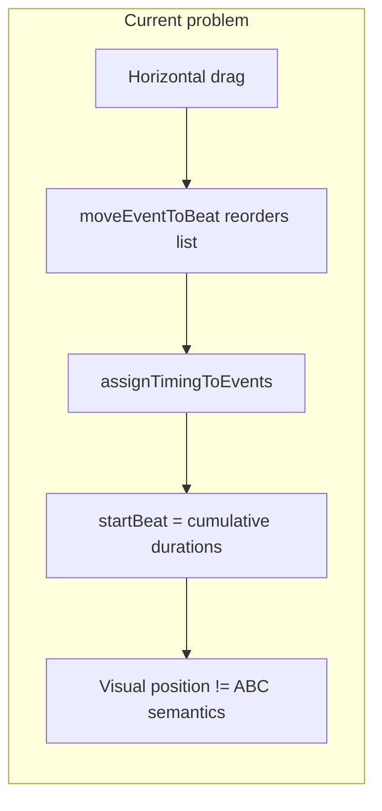
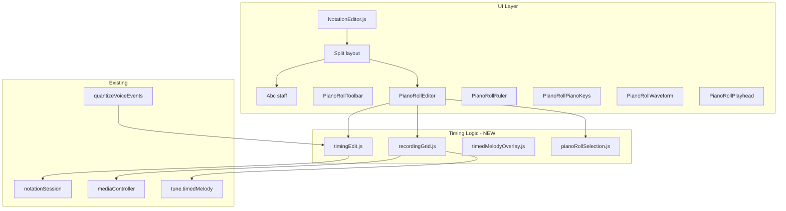
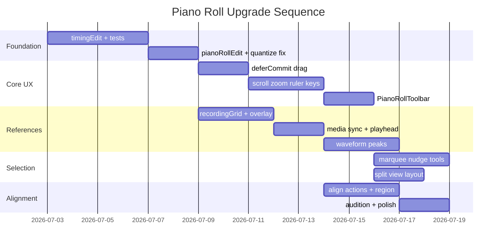

# Piano Roll REAPER-Class Upgrade — Implementation Plan

## Goals and constraints

- **Staff** remains the authority for pitch, ties, articulations, and note input.
- **Piano roll** becomes the authority for **when** notes happen, with explicit round-trip to valid ABC (rests + durations).
- **Split view** is a new optional mode alongside existing `staff` and `pianoRoll` exclusive views (per your preference).
- Reuse existing infrastructure: `notationSession`, `quantizeVoiceEvents`, `timedMelody`, `mediaController`, `tuneEditHistory` coalescing, `backgroundPianoRollEvents`.

## Current gaps (must fix first)



[`moveEventToBeat`](src/notation/pianoRollEdit.js) splices events by index; [`assignTimingToEvents`](src/notation/beatGrid.js) recomputes `startBeat` from sequential durations. Horizontal drag does **not** set absolute beat positions. The same issue affects quantize: [`quantizeVoiceEvents`](src/notation/quantizeVoiceEvents.js) writes `startBeat`, but [`SET_EVENTS`](src/notation/notationSession.js) runs `reassignEventTiming`, which overwrites it.

**Foundation fix:** introduce a timing materialization layer that converts absolute beat goals into ABC-valid event sequences (rest insertion, duration adjustment, reordering).

---

## Architecture overview



---

## Phase 1 — Timing foundation (blocking)

### 1.1 New module: [`src/notation/timingEdit.js`](src/notation/timingEdit.js)

Pure functions; all piano roll timing mutations go through here instead of raw `moveEventToBeat`.

| Function | Purpose |
|----------|---------|
| `materializeAbsoluteTiming(events, tuneMeta)` | Sort by `startBeat`, insert rests for gaps, resolve overlaps, return ABC-valid sequence |
| `achieveStartBeat(events, eventId, targetBeat, tuneMeta, opts)` | Move one note/chord to absolute beat via rest extend/insert or prior-rest shrink |
| `achieveDuration(events, eventId, durationBeats, tuneMeta)` | Wrap/replace `resizeEventDuration` |
| `moveNoteTiming(events, eventId, targetBeat, tuneMeta, opts)` | `achieveStartBeat` + `materializeAbsoluteTiming` |
| `moveNotePitch(events, eventId, toneIndex, midi, tuneMeta)` | Pitch-only change (extract from current inline logic in `PianoRollEditor`) |
| `splitEventAtBeat(events, eventId, splitBeat, tuneMeta)` | Scissors: two events, preserve total duration; handle ties (`tieEnd`/`tieStart`) |
| `insertRestGap(events, beforeIndex, beats, tuneMeta)` | Insert or coalesce adjacent rest |
| `shrinkPrefixByBeats(events, beforeIndex, beats, tuneMeta)` | Remove/shrink rests then shorten prior note tail if needed |
| `slideEventsInRange(events, startBeat, endBeat, deltaBeat, tuneMeta)` | Bar-slide / ripple for selected range |
| `setGlobalBeatOffset(events, offsetBeats, tuneMeta)` | Shift all note/rest timing by inserting leading rest or shrinking prefix |
| `splitChordsToSingleNotes(events, eventIds, tuneMeta)` | Optional helper for per-tone timing in chords |

**`achieveStartBeat` algorithm (core):**
1. `assignTimingToEvents` → read `currentStart`, `delta = targetBeat - currentStart`
2. `delta > 0` → `insertRestGap` before event (extend prior rest if adjacent)
3. `delta < 0` → `shrinkPrefixByBeats` by `|delta|`
4. `materializeAbsoluteTiming` → validate; clamp to grid if `opts.snap`

**Minimum rest/duration granularity:** use `unitLengthDecimal * 4 / 64` (or existing `0.125` beat floor from `pianoRollEdit`).

### 1.2 Refactor [`src/notation/pianoRollEdit.js`](src/notation/pianoRollEdit.js)

- `moveEventToBeat` → delegate to `moveNoteTiming`
- `resizeEventDuration` → delegate to `achieveDuration` + materialize
- `insertNoteAtBeat` → use `moveNoteTiming` for placement after insert
- `deleteEventById` → optionally collapse adjacent rests (new `collapseRests`)

### 1.3 Fix quantize round-trip

In [`src/notation/quantizeVoiceEvents.js`](src/notation/quantizeVoiceEvents.js):
- After snapping `startBeat`/`durationBeats`, call `materializeAbsoluteTiming` before return
- Remove reliance on `resolveOverlaps` alone (it sets `startBeat` without ABC encoding)

In [`src/components/NotationEditor.js`](src/components/NotationEditor.js) quantize `onApply`: merged sort still valid; materialization ensures persistence through `reassignEventTiming`.

### 1.4 Tests: [`src/notation/timingEdit.test.js`](src/notation/timingEdit.test.js)

Cases:
- Move note later → rest inserted
- Move note earlier → rest shrunk/removed
- Move into occupied beat → overlap resolved via materialize
- Split at midpoint → two notes, sum of durations preserved
- Quantize + materialize round-trip through `reassignEventTiming`
- Slide range by +0.5 beat

---

## Phase 2 — Split view mode

### 2.1 Constants and view wiring

[`src/notation/notationConstants.js`](src/notation/notationConstants.js):
```javascript
EDITOR_VIEWS.SPLIT = 'split'
```

[`src/viewModeUtils.js`](src/viewModeUtils.js): add `{ id: 'split', label: 'Staff + Roll', group: 'music' }`, extend `editorViewModeToNotationView`, `isNotationEditorView`.

[`src/components/NotationViewSelector.js`](src/components/NotationViewSelector.js): add Split entry.

### 2.2 Layout in [`src/components/NotationEditor.js`](src/components/NotationEditor.js)

New branch (keep existing `STAFF`, `PIANO_ROLL`, `ABC` branches unchanged):

```
notation-split-view (flex column, min-height)
├── notation-split-staff (flexible, overflow auto)
│   ├── Abc (same props as staff view, linked selection)
│   └── GhostNoteOverlay
├── notation-split-resizer (draggable horizontal bar, 6px)
└── notation-split-roll (flexible, min-height 200px)
    ├── PianoRollToolbar
    └── PianoRollEditor (expanded)
```

- **Shared session:** same `session.events`, `session.selection`, `session.caretIndex`
- **Staff click** → existing `handleStaffClick` → `SET_SELECTION` + `SET_CARET`
- **Roll select** → `SET_SELECTION`; update `caretIndex` via `caretIndexForStartBeat` from [`voiceEventTiming.js`](src/notation/voiceEventTiming.js)
- **Toolbars:** show `NotationToolbar` + `NotationDurationToolbar` above split (same as staff); `VirtualPiano` below split (staff pitch entry still available)
- **Split ratio:** persist in `localStorage` key `notationSplitRatio` (default `0.55` staff / `0.45` roll); resizer updates on pointer drag

### 2.3 CSS: [`src/components/NotationEditor.css`](src/components/NotationEditor.css)

- `.notation-split-view`, `.notation-split-resizer`, `.notation-split-roll`
- Staff padding adjusted when `VirtualPiano` dock visible

### 2.4 Shortcuts: [`src/notation/notationShortcuts.js`](src/notation/notationShortcuts.js)

- `Ctrl+Alt+P` → cycle `staff` → `pianoRoll` → `split` → `staff` (update handler in `NotationEditor`)
- Document in [`NotationEditorHelp.js`](src/components/NotationEditorHelp.js)

---

## Phase 3 — Reference layers (recording, media, voices)

### 3.1 New module: [`src/notation/recordingGrid.js`](src/notation/recordingGrid.js)

Extract/share logic from [`melodyFormatter.js`](src/melodyFormatter.js):
- `findBeatIndex(beatTimes, seconds)`
- `getBeatDuration(beatTimes, beatIndex)`
- `secondsToBeat(seconds, beatTimes, tempoFallback)`
- `beatToSeconds(beat, beatTimes, tempoFallback)`
- `buildRecordingGridLines(beatTimes, downbeatTimes, maxBeat)` → `{ beatLines, downbeatLines }`

### 3.2 New module: [`src/notation/timedMelodyOverlay.js`](src/notation/timedMelodyOverlay.js)

```javascript
export function timedMelodyToOverlayEvents(timedMelody, tuneMeta)
// Returns readonly events: { id, type:'note', startBeat, durationBeats, pitch, source:'timedMelody' }
```

Uses `timedMelody.notes[]` (seconds) + `beatTimes` via `recordingGrid`.

### 3.3 New hook: [`src/hooks/usePianoRollMediaSync.js`](src/hooks/usePianoRollMediaSync.js)

Inputs: `mediaController`, `tune`, `activeLinkIndex`, `beatTimes`, `tempo`

Returns:
- `playheadBeat` (number | null)
- `playbackRegion` `{ startBeat, endBeat }` from link `startAt`/`endAt` via `getLinkStartAt`/`getLinkEndAt`
- `seekToBeat(beat)` → `mediaController.seekToSeconds(...)`
- `isPlaying`

Poll `getPlaybackProgress()` at 60ms when playing; map `currentTime - linkStart` → beat.

### 3.4 Waveform peaks: [`src/hooks/useWaveformPeaks.js`](src/hooks/useWaveformPeaks.js)

- Resolve audio blob via existing [`mediaLinkResolve.js`](src/mediaLinkResolve.js) / [`mediaCacheQueue.js`](src/mediaCacheQueue.js)
- `AudioContext.decodeAudioData` → downsample to ~2 peaks per pixel column
- Return `{ peaks, durationSeconds, loading, error }`
- Graceful fallback: if decode fails, show beat-marker lane only

### 3.5 New components

| Component | File | Role |
|-----------|------|------|
| `PianoRollWaveform` | [`src/components/PianoRollWaveform.js`](src/components/PianoRollWaveform.js) | SVG `path` or canvas strip above grid; aligned to beat axis |
| `PianoRollPlayhead` | [`src/components/PianoRollPlayhead.js`](src/components/PianoRollPlayhead.js) | Vertical line + optional triangle in ruler |
| `PianoRollPlaybackRegion` | [`src/components/PianoRollPlaybackRegion.js`](src/components/PianoRollPlaybackRegion.js) | Shaded `startAt`–`endAt` region; draggable handles call link update callback |

### 3.6 Wire in `NotationEditor` / `PianoRollEditor`

New `PianoRollEditor` props:
```javascript
referenceEvents      // timedMelody overlay (orange/amber, readonly)
recordingGrid        // { beatTimes, downbeatTimes, useRecordingGrid }
waveformPeaks        // from useWaveformPeaks
playheadBeat         // from usePianoRollMediaSync
playbackRegion       // { startBeat, endBeat }
backgroundEvents     // existing other voices (gray)
onSeekBeat(beat)     // click ruler/waveform → seek media
```

Render order (bottom → top): waveform → recording grid lines (downbeats thicker) → bar grid → background voices → timedMelody ghosts → rests → active notes → playhead → region overlay.

**Background voices** already rendered in [`PianoRollEditor.js`](src/components/PianoRollEditor.js) (`.piano-roll-note-background`); extend CSS only.

### 3.7 Rests and ties in roll

In `PianoRollEditor`, add layer for `type === 'rest'`:
- Gray hatched rects spanning `durationBeats`
- Label `z` optional at zoom > threshold

Ties: if `tieEnd`, draw thin connector to next note at same pitch (lookup next event).

---

## Phase 4 — Piano roll UX overhaul

### 4.1 Refactor `PianoRollEditor` into scrollable workspace

Replace flat SVG wrapper with:

```
piano-roll-workspace (overflow auto, ref for scroll)
├── piano-roll-sticky-header (position sticky top)
│   └── PianoRollRuler
├── piano-roll-body (flex row)
│   ├── PianoRollPianoKeys (sticky left)
│   └── piano-roll-canvas (SVG, dynamic width/height)
```

Extract geometry to [`src/notation/pianoRollGeometry.js`](src/notation/pianoRollGeometry.js):
- `beatToX(beat, beatWidth)`, `midiToY(midi, pitchRange, rowHeight)`, inverses
- Zoom defaults: `beatWidth=48`, `rowHeight=14`; range `16–120` / `8–24`

**Zoom:** Alt+wheel = horizontal; Alt+Shift+wheel = vertical; toolbar +/- buttons.
**Scroll:** wheel pans; middle-drag pans (optional).

### 4.2 New component: [`src/components/PianoRollRuler.js`](src/components/PianoRollRuler.js)

- Bar numbers, beat ticks, downbeat emphasis
- Click → `onSeekBeat`; double-click → set playhead + seek

### 4.3 New component: [`src/components/PianoRollPianoKeys.js`](src/components/PianoRollPianoKeys.js)

- B/W key stripes synced to `pitchRange`
- Note names at C rows; click key → audition pitch (Phase 7)

### 4.4 New component: [`src/components/PianoRollToolbar.js`](src/components/PianoRollToolbar.js)

Visible when `session.view === PIANO_ROLL || SPLIT`:

| Control | Action |
|---------|--------|
| Tool: Select / Draw / Split / Erase | `session.pianoRollTool` |
| Snap toggle + subdivision dropdown | `SET_MIDI_STATE` (`snapEnabled`, `snapSlotsPerBeat`) |
| Recording grid toggle | `session.pianoRollUseRecordingGrid` |
| Timed melody overlay toggle | `session.pianoRollShowTimedMelody` |
| Waveform toggle | `session.pianoRollShowWaveform` |
| Quantize | opens existing `QuantizeDialog` |
| Align menu | Phase 6 actions |
| H/V zoom | adjust `session.pianoRollZoom` |

### 4.5 Session state additions: [`src/notation/notationSession.js`](src/notation/notationSession.js)

```javascript
pianoRollTool: 'select',           // select | draw | split | erase
pianoRollZoom: { beatWidth: 48, rowHeight: 14 },
pianoRollUseRecordingGrid: false,
pianoRollShowTimedMelody: true,
pianoRollShowWaveform: true,
```

Reducer: extend `SET_MIDI_STATE` or add `SET_PIANO_ROLL_STATE` patch action.

### 4.6 Commit-on-release (undo-friendly drags)

In `PianoRollEditor`:
- `pointerdown` → snapshot `dragSession` with cloned events
- `pointermove` → mutate local `previewEvents` only (React state); **no `onChange`**
- `pointerup` → single `onChange(previewEvents, caretIndex, { historyLabel: 'Piano roll drag' })`

In `NotationEditor.applyEvents`:
- Add optional 4th arg `opts: { deferCommit?: boolean }`
- When `deferCommit`, dispatch `SET_EVENTS` but skip `commitToAbc` until `flushCommit()` on pointer up
- Call `props.onBeforeHistoryEdit?.()` / use existing `flushPendingTune` from tunebook if exposed, to avoid coalescing with pre-drag state

### 4.7 Modifier keys (in `PianoRollEditor` pointer handlers)

| Modifier | Effect |
|----------|--------|
| Shift | Horizontal-only drag (timing); block pitch delta |
| Alt | Vertical-only drag (pitch); block timing delta |
| Ctrl+drag | Duplicate selection at drop position (after release) |
| Alt+click draw | Erase note under cursor |

---

## Phase 5 — Selection and editing tools

### 5.1 New module: [`src/notation/pianoRollSelection.js`](src/notation/pianoRollSelection.js)

- `hitTestNote(events, beat, midi, opts)` → `{ eventId, toneIndex }`
- `marqueeSelect(events, rect, pitchRange, geometry)` → `eventIds[]`
- `nudgeSelection(events, eventIds, deltaBeat, deltaMidi, tuneMeta, opts)` → updated events via `timingEdit`
- `duplicateSelection(events, eventIds, beatOffset, tuneMeta)` → new IDs via `createEventId`

### 5.2 Selection UX in `PianoRollEditor`

- Click → single select (existing)
- Shift+click → range select along beat order (reuse `selectEventRange` pattern from staff)
- Marquee (pointer down on background + drag) → `SET_SELECTION` with multiple IDs
- Arrow keys (when roll focused): Left/Right ±1 grid unit beat; Up/Down ±1 semitone
- `Delete`/`Backspace` → delete all selected (existing, extend multi)
- Copy/Cut/Paste: wire [`notationClipboard.js`](src/notation/notationClipboard.js) in `NotationEditor.handleShortcutAction` when view is `PIANO_ROLL` or `SPLIT`:
  - Paste at `caretIndexForStartBeat(events, playheadBeat || firstSelected.startBeat)`

### 5.3 Tool modes

| Tool | Behavior |
|------|----------|
| **select** | Default; move, resize, marquee |
| **draw** | Background click inserts note (existing); respects duration toolbar |
| **split** | Click note → `splitEventAtBeat` at snapped beat |
| **erase** | Click note → delete |

### 5.4 Split note (scissors)

Uses `splitEventAtBeat` from `timingEdit`. Snap split point to grid unless Alt held.

---

## Phase 6 — Alignment automation

### 6.1 New module: [`src/notation/pianoRollAlign.js`](src/notation/pianoRollAlign.js)

| Function | Behavior |
|----------|----------|
| `alignSelectionToRecordingGrid(events, ids, beatTimes, opts)` | Per-note `quantizeMelodyTime` on beat→seconds→beat; then `materializeAbsoluteTiming` |
| `matchToTimedMelody(events, ids, timedMelody, tuneMeta, opts)` | Snap starts to nearest `timedMelody.notes[].midpoint` within tolerance |
| `applyDownbeatOffset(events, tuneMeta, offsetBeats)` | `setGlobalBeatOffset` |
| `snapToPlaybackRegionStart(events, ids, regionStartBeat, tuneMeta)` | Align selection start to region |

### 6.2 Toolbar "Align" dropdown in `PianoRollToolbar`

Actions (selection-aware, else all notes):
- Align to recording grid (opens mini panel: strength, slots — reuse quantize defaults)
- Match to detected melody
- Slide selection… (modal: beat delta input)
- Set downbeat from playhead (uses current `playheadBeat`)
- Snap selection to playback region start

### 6.3 Playback region overlay editing

`PianoRollPlaybackRegion`:
- Drag start/end handles → compute seconds → call parent `onPlaybackRegionChange({ startAt, endAt })` → update tune link via existing `updateLinkPlaybackLoops` / tune save path in `MusicEditor`
- Notes inside region optionally tinted

### 6.4 Optional timing-offset preview mode (advanced)

Add optional per-event `timingOffsetBeats` field (not serialized to ABC by default):
- Used only for display + playback preview in roll
- Toolbar action **Bake timing offsets** → `materializeAbsoluteTiming` → clear offsets
- Implement only if rest-auto-fill proves insufficient for dense polyrhythms; defer to Phase 6b if schedule tight

---

## Phase 7 — Audition and polish

### 7.1 Note audition: [`src/hooks/useNoteAudition.js`](src/hooks/useNoteAudition.js)

- Lazy-load `soundfont-player` (same as [`SoundfontProvider.js`](src/SoundfontProvider.js))
- `auditionMidi(midi, durationMs = 200)`
- Call on: note hover (debounced 80ms), drag scrub (every 3 semitones), piano key click in `PianoRollPianoKeys`

### 7.2 CSS/theme: [`src/components/PianoRollEditor.css`](src/components/PianoRollEditor.css)

- Layer colors: background voices `#495057` 55%, timedMelody `#e67e22` 40%, rests `#3d3d3d` hatched, selected `#ffd43b`, playhead `#ff6b6b`
- Sticky ruler/keys z-index
- Recording downbeat lines `#666` vs subdivision `#2a2a2a`

### 7.3 Help and docs

Update [`src/components/NotationEditorHelp.js`](src/components/NotationEditorHelp.js) piano-roll section: split view, tools, modifiers, align actions, recording overlay.

---

## File manifest

### New files (17)

| File | Phase |
|------|-------|
| `src/notation/timingEdit.js` | 1 |
| `src/notation/timingEdit.test.js` | 1 |
| `src/notation/recordingGrid.js` | 3 |
| `src/notation/recordingGrid.test.js` | 3 |
| `src/notation/timedMelodyOverlay.js` | 3 |
| `src/notation/pianoRollGeometry.js` | 4 |
| `src/notation/pianoRollSelection.js` | 5 |
| `src/notation/pianoRollAlign.js` | 6 |
| `src/notation/pianoRollEdit.test.js` | 1 |
| `src/hooks/usePianoRollMediaSync.js` | 3 |
| `src/hooks/useWaveformPeaks.js` | 3 |
| `src/hooks/useNoteAudition.js` | 7 |
| `src/components/PianoRollToolbar.js` | 4 |
| `src/components/PianoRollRuler.js` | 4 |
| `src/components/PianoRollPianoKeys.js` | 4 |
| `src/components/PianoRollWaveform.js` | 3 |
| `src/components/PianoRollPlayhead.js` | 3 |
| `src/components/PianoRollPlaybackRegion.js` | 6 |

### Major edits (10)

| File | Changes |
|------|---------|
| [`src/components/PianoRollEditor.js`](src/components/PianoRollEditor.js) | Full refactor: scroll/zoom, layers, tools, preview/commit, modifiers |
| [`src/components/PianoRollEditor.css`](src/components/PianoRollEditor.css) | Sticky layout, layer styles |
| [`src/components/NotationEditor.js`](src/components/NotationEditor.js) | Split view, toolbar, media hooks, clipboard in roll, deferCommit |
| [`src/components/NotationEditor.css`](src/components/NotationEditor.css) | Split layout |
| [`src/notation/pianoRollEdit.js`](src/notation/pianoRollEdit.js) | Delegate to timingEdit |
| [`src/notation/quantizeVoiceEvents.js`](src/notation/quantizeVoiceEvents.js) | Materialize after quantize |
| [`src/notation/notationSession.js`](src/notation/notationSession.js) | Piano roll session fields |
| [`src/notation/notationConstants.js`](src/notation/notationConstants.js) | `EDITOR_VIEWS.SPLIT`, tool constants |
| [`src/viewModeUtils.js`](src/viewModeUtils.js) | Split mode in editor shell |
| [`src/notation/notationShortcuts.js`](src/notation/notationShortcuts.js) | View cycle, roll-specific keys |

### Minor edits

- [`src/components/NotationViewSelector.js`](src/components/NotationViewSelector.js)
- [`src/components/ViewModeSelectorModal.js`](src/components/ViewModeSelectorModal.js)
- [`src/components/NotationEditorHelp.js`](src/components/NotationEditorHelp.js)
- [`src/melodyFormatter.js`](src/melodyFormatter.js) — import `findBeatIndex` from `recordingGrid` (re-export to avoid duplication)

---

## Testing strategy

| Area | Tests |
|------|-------|
| Timing materialization | `timingEdit.test.js` — rest insert/shrink, split, slide, quantize round-trip |
| Recording grid | `recordingGrid.test.js` — seconds↔beat with variable `beatTimes` |
| Piano roll edit integration | `pianoRollEdit.test.js` — insert/move/resize through timingEdit |
| Selection | `pianoRollSelection.test.js` — marquee hit test, nudge |
| Align | `pianoRollAlign.test.js` — match to timed melody mock |
| Regression | Extend `quantizeVoiceEvents.test.js` to assert post-`reassignEventTiming` positions |

No component snapshot tests initially; pure logic first.

---

## Implementation order (recommended)



**Critical path:** Phase 1 (`timingEdit`) must land before meaningful horizontal drag, quantize-to-recording, or align actions.

---

## Risk notes

1. **ABC measure overflow:** materializing rests may push measure over capacity — add `validateMeasureFits` check from [`beatGrid.js`](src/notation/beatGrid.js); auto-insert barline or warn user.
2. **Chord per-tone timing:** ABC chords share one onset; vertical drag of one chord tone changes pitch only; horizontal drag moves whole chord (document; optional "explode chord" in align menu).
3. **Waveform decode cost:** lazy-load on first piano roll open; cache peaks on tune object or IndexedDB keyed by link URL.
4. **Undo granularity:** `deferCommit` + single `saveTune` on pointer up aligns with existing 800ms coalescing; use distinct `historyLabel` per operation type.
5. **Media sync without link:** playhead/waveform hidden when no scannable link; MIDI route uses synthetic beat grid from tempo.
