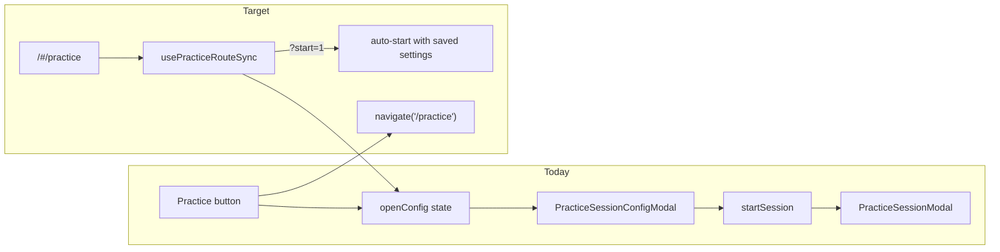

# Practice route and router coverage plan

## Current state

Routing lives in [`src/App.js`](src/App.js) using `HashRouter` (URLs look like `/#/practice`). Practice is **modal-only**: [`usePracticeSession`](src/usePracticeSession.js) holds `configOpen` / `sessionOpen` state in App, and [`PracticeSessionButton`](src/components/PracticeSessionButton.js) in the Header renders the modals. There is **no** `/practice` route today.

The closest existing pattern is **Gig Mode** on [`SetsPage`](src/pages/SetsPage.js): visiting `/#/gig/:setId` loads the set and auto-opens the fullscreen modal via a `useEffect` on route params.



**Out of scope:** Review, Recordings, and Files pages are historic and will not be wired up. Bulk background research queue and media cache queue remain indicator-only (no routes).

---

## 1. Implement `/practice` (primary deliverable)

### Route shape

| URL | Behavior |
|-----|----------|
| `/#/practice` | If session active → show session modal. Else → open config dialog. |
| `/#/practice?start=1` | Try to start immediately using `loadPracticeSettings()` + empty book/tag filters. On plan error → fall back to config with error shown. |
| Optional future params | `minutes`, `instrument`, `skill`, `warmups`, `book`, `tags` (comma-separated) to pre-fill config before showing or starting |

### Implementation approach

**A. New hook: `usePracticeRouteSync`** (e.g. [`src/usePracticeRouteSync.js`](src/usePracticeRouteSync.js))

Mount from App (next to `usePracticeSession`) so it always runs when tunes are loaded:

- **On enter `/practice`:**
  - If `practiceSession.sessionOpen` → do nothing (session modal already visible)
  - Else if `searchParams.get('start') === '1'` → call `startSession({ ...loadPracticeSettings(), bookFilter: '', tagFilter: [] })`; if it returns false, call `openConfig()`
  - Else → `openConfig()`
- **On config/session close while still on `/practice`:** `navigate('/tunes', { replace: true })` (or previous location if stashed on entry)
- **On Practice button click:** `navigate('/practice')` instead of only toggling state
- **On successful `startSession`:** stay on `/practice` so the URL is bookmarkable mid-session
- **On `stopSession`:** `navigate('/tunes', { replace: true })`

**B. Add route in App.js**

```jsx
<Route path="practice" element={
  <MusicPage /* same props as /tunes index */ />
} />
```

**C. Wire navigation in [`PracticeSessionButton`](src/components/PracticeSessionButton.js)**

- `handleOpenConfig` → `navigate('/practice')`
- `onHide` on config modal → navigate away from `/practice` if session not starting
- `onStop` / session close → navigate away

**D. Config modal URL pre-fill**

In [`PracticeSessionConfigModal`](src/components/PracticeSessionConfigModal.js), read `useSearchParams()` when opening. V1 requires `?start=1`; other params optional fast follow.

**E. Analytics + help**

Add `practice` to [`src/analytics.js`](src/analytics.js) and note in [`helpContent.js`](src/helpContent.js).

### Edge cases

- Guard route effect against double-open (Strict Mode)
- Practice playback via [`PracticeSessionPlaybackHost`](src/components/PracticeSessionPlaybackHost.js) must not depend on tune page navigation
- `?start=1` with invalid plan → config + `planError`

---

## 2. Tier 1 — in scope

| Feature | Route | Implementation notes |
|---------|-------|---------------------|
| **Bulk tune check** | `/#/tunes/check?tab=links` (`completeness`, `abc`) | Route opens [`BulkCheckModal`](src/components/BulkCheckModal.js) on MusicPage; sync tab with `tab` param; use route instead of [`bulkCheckReturnContext`](src/bulkCheckReturnContext.js) sessionStorage for return-from-editor |
| **Editor view mode** | `/#/editor/:tuneId/:view` | `view` ∈ `staff`, `pianoRoll`, `split`, `notationAbc`, `lyrics`, `chords`, `sourceAbc`; sync [`MusicEditor`](src/components/MusicEditor.js) `editorViewMode` bidirectionally |
| **Tune display view** | `/#/tunes/:tuneId?view=chordsInline` | Query param on existing tune route; sync [`MusicSingle`](src/components/MusicSingle.js) / global `viewMode` |
| **Performance set editor** | `/#/sets/:setId` | [`SetsPage`](src/pages/SetsPage.js) already reads `params.setId`; add route distinct from `/gig/:setId` (gig auto-opens modal; sets route only opens editor) |
| **Sheet / chord import** | `/#/import/sheet-image`, `/#/import/chord-sheet`, `/#/import/chord-url` | Thin route hosts on ImportPage or MusicPage that auto-open modals from [`ImportOptionsModal`](src/components/ImportOptionsModal.js) |

---

## 3. Tier 3 — in scope (except background queues)

| Feature | Route | Implementation notes |
|---------|-------|---------------------|
| **Gig mode picker** | `/#/gig` | New route on SetsPage: show set list with “Play” actions; keep `/#/gig/:setId` auto-starting GigModeModal |
| **Lyrics autoscroll** | `/#/tunes/:tuneId?autoscroll=1` | On MusicSingle mount, open [`LyricsAutoscrollModal`](src/components/LyricsAutoscrollModal.js); clear param on close |
| **Chord record** | `/#/editor/:tuneId/chords?record=1` | Navigate to editor chords view; auto-activate [`ChordRecordControls`](src/components/ChordRecordControls.js) |

**Explicitly excluded:** bulk background research queue, media cache queue (indicator/modal only).

---

## 4. Excluded (historic, no routes)

- Review (`ReviewPage`)
- Recordings (`RecordingsPage`, `RecordingPage`)
- Files / images (`FilesPage`)

These pages may remain in the repo but will not be registered in App.js.

---

## 5. Rollout order

1. **`/practice`** (+ `?start=1`)
2. **`/sets/:setId`** — small; SetsPage partially ready
3. **`/editor/:tuneId/:view`** — notation editor deep links
4. **`/tunes/check`** — bulk check modal + return-from-editor flow
5. **Tune view query param** — `?view=` on tune pages
6. **Import modal routes** — sheet-image, chord-sheet, chord-url
7. **`/gig`** — gig set picker
8. **`?autoscroll=1`** — lyrics autoscroll on tune page
9. **`/editor/:tuneId/chords?record=1`** — chord record deep link

Shared pattern across items: small `use*RouteSync` hooks or route-host components that read `useLocation` / `useSearchParams`, open the modal or set local state, and update the URL when the user opens/closes the feature from UI buttons.

---

## 6. Testing

- Unit tests for `usePracticeRouteSync` and any shared route-sync helpers
- Extend `analytics.test.js` for new static segments (`practice`, `gig`, import subpaths, `check`)
- Manual smoke per route: direct URL entry, UI button → URL update, close → URL cleanup, browser back/forward
