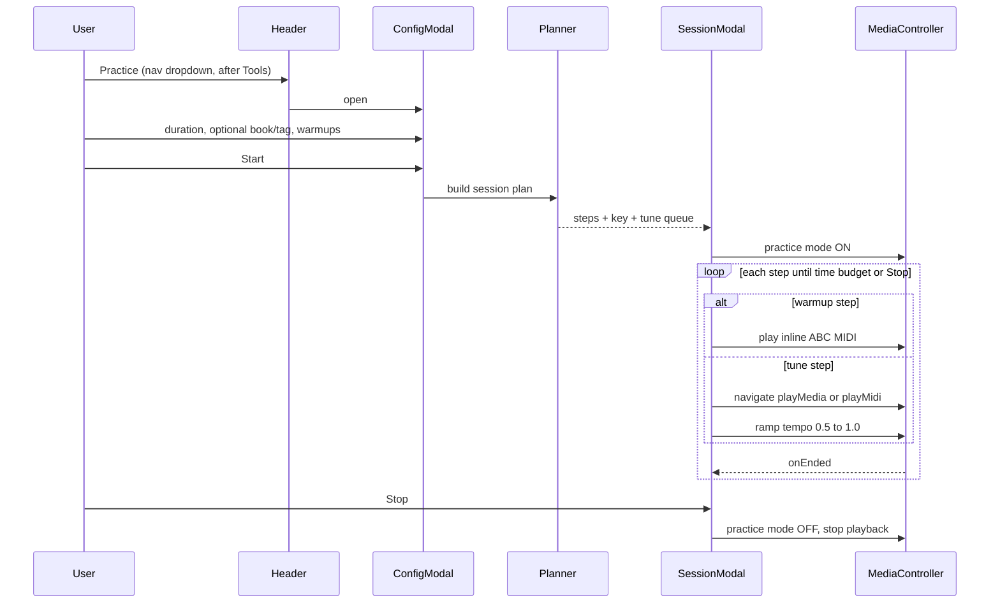

# Practice Session Tool

## User flow



## Entry point

Add a **new dropdown section** in [`src/components/Header.js`](src/components/Header.js) immediately after the Tools row (Metronome / Tuner / Chords / Keyboard, lines 176–205):

```jsx
<Dropdown.Divider />
<div className="header-dropdown-section">
  <PracticeSessionButton ... />
</div>
```

[`PracticeSessionButton.js`](src/components/PracticeSessionButton.js) renders a single button styled like other `header-dropdown-btn` entries; clicking opens the config modal (does not navigate away).

Wire props from `App.js` through `Header`: `tunebook`, `tunes`, `mediaController`, `setBlockKeyboardShortcuts`, `currentTuneBook`, `tagFilter` (as defaults only).

## Configuration modal

New [`PracticeSessionConfigModal.js`](src/components/PracticeSessionConfigModal.js):

| Field | Control | Notes |
|-------|---------|-------|
| Practice duration | Three large toggle buttons (not a free-form picker) | **5, 10, or 20 min only**; default 10; store as minutes |
| Book filter | Reuse [`BookSelectorModal`](src/components/BookSelectorModal.js) pattern | Optional; clear button |
| Tag filter | Reuse [`TagsSearchSelectorModal`](src/components/TagsSearchSelectorModal.js) | Optional; multi-tag AND, same as tune list |
| Include warmups | `Form.Check type="switch"` | Default on |
| Start | Primary footer button | Validates at least one playable tune exists |

Reuse existing modal conventions: `useResponsiveModalProps()`, block keyboard shortcuts while open, `onClick={e => e.stopPropagation()}` on dropdown item.

**Tune pool rule (important):** Do not use bare `filterSearch` with empty filters (that returns orphan-only tunes). New planner helper uses:
- book/tag from modal when set
- otherwise **all** tunes where `hasNotesOrChords(tune) || hasLinks(tune)` (same eligibility as [`fillAnyPlaylist`](src/useTuneBook.js))

## Session planner (pure logic)

New [`src/practiceSessionPlanner.js`](src/practiceSessionPlanner.js) + tests:

1. **Collect candidates** from tune pool; shuffle; sort by `boost` (reuse `fillAnyPlaylist` ordering).
2. **Pick practice key** via majority vote on `tune.key` (fallback: `timedMelody.detectedKey`, then `C`).
3. **Same-key preference:** partition candidates into matching-key vs other; fill queue from matching first; for non-matching tunes, record a semitone offset to apply via playback pitch (not mutating saved tune data).
4. **Warmup budget:** if enabled, reserve min(20% of session, 2 min) for warmups; remainder for tunes. At 5 min this is ~1 min of warmups (one short scale + arpeggio); at 10/20 min the full scale + arpeggio pair fits comfortably.
5. **Warmup steps:** call [`practiceWarmupGenerator.js`](src/practiceWarmupGenerator.js) for:
   - major/minor scale up + down (one octave, moderate QPM)
   - tonic arpeggio up + down (root–3rd–5th–octave)
   - Use `parseKeySignature` from [`melodyPitchSpelling.js`](src/melodyPitchSpelling.js)
6. **Tune steps:** estimate duration per tune (MIDI: abcjs timing; media: link region length or element duration); pack tunes until tune budget exhausted; each step stores `{ tuneId, route: 'media'|'midi', linkIndex?, pitchOffset? }`.
7. **Route selection per tune:** prefer linked media when `hasLinks(tune)` (user preference); else MIDI when `hasNotesOrChords(tune)` — mirrors [`resolvePlaybackTarget`](src/tunePlaybackActions.js) priority inverted to media-first.

Output shape:

```js
{
  practiceKey: 'D',
  totalMinutes: 10,
  warmupMinutes: 2,
  steps: [
    { type: 'warmup', id: 'scale', title: 'D major scale', abc: '...' },
    { type: 'warmup', id: 'arpeggio', title: 'D major arpeggio', abc: '...' },
    { type: 'tune', tuneId, route: 'media', linkIndex: 0, pitchOffset: 0, tempoStart: 0.5, tempoEnd: 1.0 }
  ]
}
```

## Warmup generator

New [`src/practiceWarmupGenerator.js`](src/practiceWarmupGenerator.js) + tests:

- Input: `{ key, meter?, tempo? }`
- Output: valid ABC strings via `abcTools.emptyABC(title)` + generated note lines
- Major: use `MAJOR_SCALE`; minor keys (`Am`, `Dmin`): `NATURAL_MINOR_SCALE` from `melodyPitchSpelling.js`
- Keep warmups short (~30–45 s each at QPM 80–100) so they fit the budget
- No persistence to tunebook

## Practice session runner

New [`src/usePracticeSession.js`](src/usePracticeSession.js) hook + [`PracticeSessionModal.js`](src/components/PracticeSessionModal.js):

### Fullscreen overlay

- `Modal` with `fullscreen={true} backdrop="static"` (match [`AddSongModal`](src/components/AddSongModal.js))
- **Stop** button fixed top-right (`Modal.Header` or custom bar)

#### Instruction block (top, prominent)

When practice is **active** (not during config), the top of the modal body is a large instruction panel — the primary focal point. Styled via `PracticeSessionModal.css`:

- Large type (`font-size: 1.5–2rem` on desktop, slightly smaller on narrow viewports)
- High contrast background (e.g. light tint or subtle border) spanning full modal width
- Two lines of copy:
  1. **What is happening** — current phase in plain language
  2. **What to do** — explicit user action

Context-aware messages (computed in `practiceSessionCopy.js` from current step + tempo):

| Phase | What is happening | What to do |
|-------|-------------------|------------|
| Warmup scale | "Warming up — D major scale" | "Play along with the scale. Focus on even notes and relaxed hands." |
| Warmup arpeggio | "Warming up — D major arpeggio" | "Play the arpeggio up and down. Keep a steady pulse." |
| Tune (media) | "Now playing — {tune name}" | "Play along with the recording. Tempo is {N}% and will speed up gradually." |
| Tune (MIDI) | "Now playing — {tune name}" | "Play along with the notation below. Tempo is {N}% and will speed up gradually." |
| Session ending | "Practice session complete" | "Nice work. Tap Stop to close." |

Below the instruction block: session time remaining, current tempo %, step N of M, and optional compact `Abc` preview for warmup notation (scale prop ~0.6). Tune steps rely on the tune page underneath for notation/media; the instruction block stays readable on top.

### State machine

`idle → running → (warmup | tune)* → ended`

### Warmup playback

- Mount [`Abc`](src/components/Abc.js) inside modal with inline `abc` prop (pattern from [`ReviewPage.js`](src/pages/ReviewPage.js))
- `repeat={1}`, custom `onEnded` → advance to next step (do **not** call `navigateToNextSong`)
- `hidePlayer={true}`; auto-start when step begins

### Tune playback

- Set `mediaController` tune; navigate to `/tunes/:id/playMedia/:n` or `/playMidi` via [`startTunePlayback`](src/tunePlaybackActions.js) with media-first override
- On step start: `updateTunePlaybackSettings(0.5, pitchOffset, fineTune)` — restore saved tune settings on session end
- **Tempo ramp (new):** `requestAnimationFrame` or 1 s interval while playing; linear interpolate `tempo` from `tempoStart` (0.5) to `tempoEnd` (1.0) over estimated tune duration; call `mediaController.updateTunePlaybackSettings(tempo, …)` — works for both MIDI ([`PitchTempoShifter`](src/useAbcSynth.js)) and native media (`playbackRate` in [`useTuneBookMediaController.js`](src/useTuneBookMediaController.js))
- On tune end: clear ramp timer; advance to next step

### Practice mode interception

Extend [`useTuneBookMediaController.js`](src/useTuneBookMediaController.js):

- Add `practiceSessionRef` + `setPracticeSessionHandler(handler | null)`
- In `onEnded` (~line 2278): if handler set, call `handler()` instead of `navigateToNextSong`
- Session hook registers handler on start; clears on stop/end

### Stop / cleanup

- Stop playback (`mediaController.stop()`)
- Clear practice handler, tempo ramp timer, saved playback overrides
- Close modal; re-enable keyboard shortcuts

## App wiring

In [`App.js`](src/App.js):

- Instantiate `usePracticeSession({ tunebook, mediaController, navigate, location })`
- Pass `startPractice`, `practiceSession` state to `Header`
- Practice session does **not** mutate `abcPlaylist` / `mediaPlaylist` (isolated queue)

## Icons and help

- Add `practice` icon to [`Icons.js`](src/icons.js) (simple metronome+note or reuse `wizard` initially)
- Optional short entry in [`helpContent.js`](src/helpContent.js) under Tools (can defer)

## Testing

| File | Coverage |
|------|----------|
| `practiceWarmupGenerator.test.js` | ABC output for D, Am, Bb; major vs minor patterns |
| `practiceSessionPlanner.test.js` | key majority, same-key ordering, media-first routing, time budget, empty-filter pool |
| `usePracticeSession` (light) | stop cleanup clears handler |

## Implementation order

1. `practiceWarmupGenerator` + tests
2. `practiceSessionPlanner` + tests
3. `usePracticeSession` hook + mediaController practice handler
4. `PracticeSessionConfigModal` + `PracticeSessionButton`
5. `PracticeSessionModal` (fullscreen UI + warmup Abc + tune orchestration)
6. Header dropdown integration + App wiring
7. Manual test: 10 min session, warmups on, book filter, media tune with tempo ramp, instruction block updates per step, Stop mid-session

## Out of scope (v1)

- Persisting practice history / stats
- Custom warmup editor
- YouTube tempo ramp (YouTube API rate changes are coarser; v1 can ramp MIDI and native audio; log limitation for YT-only tunes)
- Changing global list filters when practice starts
