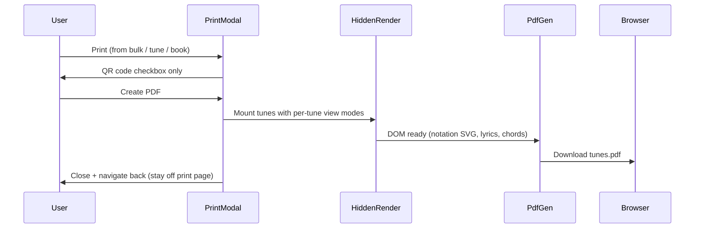

# Print-to-PDF with per-tune view modes

## Problem

[`PrintPage.js`](src/pages/PrintPage.js) navigates to `/print`, shows a modal with legacy layout radios (`auto`, `justnotation`, etc.), renders a full-page preview, then calls `window.print()`. After printing, the user remains on the bare print route with no header/footer.

The layout logic is **not** aligned with the modern view-mode system in [`viewModeUtils.js`](src/viewModeUtils.js) / [`MusicSingle.js`](src/components/MusicSingle.js).

## Target behavior



- **PDF download**, not `window.print()`
- **Per-tune layout** from each tune's view settings
- **Dialog** shows only "Add QR code for playable links"
- **Return to previous page** after PDF or cancel

## View mode resolution (per tune)

Reuse the same rules as [`MusicSingle.setupTune`](src/components/MusicSingle.js) (lines 286–297):

1. Start from app-wide `viewMode` (must be passed into print from [`App.js`](src/App.js))
2. If `tune.viewMode` is set → `normalizeViewMode(tune.viewMode)`
3. Else apply content-based defaults (chords block for lyric-only sheets, `musicAndLyrics`, `music`, etc.)
4. Final pass through `resolveViewModeForTune(...)` with `tuneHasExplicitChords`

Also respect existing display sub-settings already used on the tune page:
- **Voice visibility** via [`abcVoiceViewSettings.js`](src/abcVoiceViewSettings.js) (`getVisibleVoiceKeys`)
- **Transpose** from `tune.transpose` (capo fingering is interactive-only; print uses sounding/transposed pitch like default single view)
- **Notation fit** for staff width: use horizontal fit to page width (reuse helpers from [`gigNotationFit.js`](src/gigNotationFit.js), similar to [`GigModeModal`](src/components/GigModeModal.js))

Extract a small helper, e.g. `resolvePrintViewMode(tune, globalViewMode, tunebook, abcjsParser)` in a new [`src/printTuneViewMode.js`](src/printTuneViewMode.js), with unit tests mirroring [`practiceTuneViewUtils.test.js`](src/practiceTuneViewUtils.test.js).

## Layout component

Create [`src/components/TunePrintSheet.js`](src/components/TunePrintSheet.js) — a **static, non-interactive** renderer for one tune:

- Input: `tune`, resolved `viewMode`, `useQR`, `tunebook`
- Derive `displayFlags` via `viewModeToDisplayFlags` + `resolveDisplayFlagsForTune`
- Render the same structural panels as MusicSingle/GigMode:
  - Notation (abcjs via existing ABC prep: `buildAbcWithNoteSpacing`, `stripLyricLinesFromAbc`, `stripEmbeddedChordsFromAbc`)
  - Lyrics (`TimedLyricsChordsView` / plain lyrics panel)
  - Chord block column
  - Info (`MarkdownContent` for `tune.backgroundInfo`)
  - Optional QR code (first playable link, existing `useQRCode` pattern from PrintPage)
- Wrap each tune in `.print-pdf-tune-page` with `break-after: page` for PDF pagination
- Fixed content width (~794px / A4 at 96dpi) in off-screen container

Remove the old `option` radio logic and [`AbcPrint`](src/components/AbcPrint.js) usage from the print path (component can remain for now).

## PDF generation

Add dependencies: **`jspdf`** + **`html2canvas`**.

Create [`src/generateTunesPdf.js`](src/generateTunesPdf.js):

1. Accept rendered container element + filename
2. Wait for fonts (`document.fonts.ready`) and abcjs SVG layout (short `requestAnimationFrame` chain)
3. Pre-process abcjs `<svg>` nodes → inline `` (data URLs) so html2canvas captures notation reliably
4. Iterate `.print-pdf-tune-page` elements; add each as a PDF page via html2canvas → jsPDF
5. Trigger download via blob URL (add a small `downloadBlob(filename, blob)` helper alongside existing [`utilsFunctions.download`](src/utilsFunctions.js))

Show a generating spinner/disabled button while PDF is building; surface errors in the modal.

## Refactor PrintPage → modal-first, no stranded route

Refactor [`src/pages/PrintPage.js`](src/pages/PrintPage.js):

| Remove | Keep / add |
|--------|------------|
| Layout radio options (`auto`, `justnotation`, …) | QR checkbox (default on) |
| Visible full-page tune preview | Off-screen `#print-pdf-render-host` (position fixed, left -10000px) |
| `window.print()` | "Create PDF" button → `generateTunesPdf` → `navigate(-1)` or `history.back()` |
| Stranded print page UX | Cancel also navigates back immediately |

Pass `viewMode` from App:

```jsx
<PrintPage tunes={tunes} tunebook={tunebook} selected={selected} viewMode={viewMode} />
```

Tune selection logic stays the same (book param, `location.state.tuneIds`, or `selected`).

## Entry points (minimal changes)

These already route to `/print`; they continue to work once PrintPage navigates back after PDF:

- [`SelectedItemsModal.js`](src/components/SelectedItemsModal.js) — bulk Print link
- [`MusicSingle.js`](src/components/MusicSingle.js) — "Print (formatted)"
- [`TuneBookOptionsModal.js`](src/components/TuneBookOptionsModal.js) — print book
- [`HomePage.js`](src/pages/HomePage.js) — print tunebook link

Optional follow-up (not required for this task): replace `<Link to="/print">` with an App-level modal host to avoid navigation entirely.

## CSS

Add print-PDF styles in [`src/App.css`](src/App.css):

- `.print-pdf-render-host` — off-screen, white background, fixed width
- `.print-pdf-tune-page` — page break, padding, avoid-break for QR + title blocks
- Reuse existing `.print-qrcode` sizing rules where applicable

## Tests

- [`src/printTuneViewMode.test.js`](src/printTuneViewMode.test.js) — view mode resolution for tunes with/without saved `viewMode`, lyric-only, notation+lyrics
- Manual test checklist:
  - Single tune from tune page → PDF downloads, returns to tune
  - Bulk selected tunes → each tune uses its own view mode
  - QR on/off
  - Chords block, inline chords, lyrics only, info-only tunes

## Files touched (summary)

| File | Change |
|------|--------|
| `package.json` | Add `jspdf`, `html2canvas` |
| `src/printTuneViewMode.js` | New — per-tune view mode resolver |
| `src/components/TunePrintSheet.js` | New — static tune layout for PDF |
| `src/generateTunesPdf.js` | New — DOM → PDF pipeline |
| `src/pages/PrintPage.js` | Major refactor — simplified modal + PDF flow |
| `src/App.js` | Pass `viewMode` to PrintPage |
| `src/App.css` | Print-PDF container styles |
| `src/utilsFunctions.js` | Optional `downloadBlob` helper |
