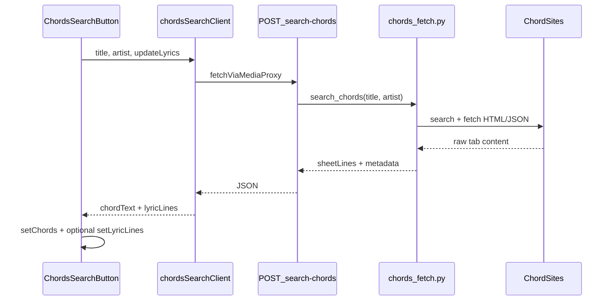

# Resolver-backed chord search with synced lyrics

## Goal

When the media resolver is available, **Search Chords** fetches a chord tab from the web, normalizes it, and imports:
- **Chords** into the Chords wizard textarea format (`C Am F G|` per line, blank lines between sections)
- **Lyrics** into `tune.wLines` (plain lyric lines + section headers + stanza blanks), when the **“Also update lyrics”** checkbox is checked (default **on**)

When the resolver is unavailable, keep the current Google `site:tabs.ultimate-guitar.com OR …` link.

## Architecture



**Division of responsibility** (reuse existing app logic):
- **Resolver** ([`local-resolver/chords_fetch.py`](local-resolver/chords_fetch.py)): discover tab URLs, fetch pages, parse site-specific markup (UG `[ch]…[/ch]`, HTML pre blocks, ads/noise), return **`sheetLines`** (interleaved headers / chord lines / lyric lines / blanks).
- **Client** ([`src/chordSheetImportUtils.js`](src/chordSheetImportUtils.js)): convert `sheetLines` → wizard `chordText` and `lyricLines` using [`classifyLyricChordLines`](src/chordSheetUtils.js) (preserves `[Verse]` headers; avoids [`parseChordsAndText`](src/useAbcjsParser.js) which strips brackets).

This matches the documented manual workflow in [`HelpPage.js`](src/pages/HelpPage.js): paste UG chord sheet → delete lyrics for chords / delete chords for lyrics.

## Backend

### New module: [`local-resolver/chords_fetch.py`](local-resolver/chords_fetch.py)

Mirror patterns from [`lyrics_fetch.py`](local-resolver/lyrics_fetch.py):
- Shared httpx client, browser User-Agent, per-source try/except (one failure must not abort the whole search)
- Allowed hosts list aligned with app sites: `tabs.ultimate-guitar.com`, `azchords.com`, `chordsbase.com`, `chords-and-tabs.net`, `guitaretab.com` (akordy.kytary.cz as best-effort)
- Search discovery order:
  1. **Ultimate Guitar** — tab search/API when reachable; parse `content` field / `[ch]C[/ch]` chordpro markup into separate chord + lyric lines
  2. **HTML fallbacks** — DuckDuckGo `site:` search for title+artist on allowed domains, then site-specific extractors
- Noise filtering: “Advertisement”, “Submit correction”, “You are reading …”, capo/key boilerplate, empty chord rows
- Scoring candidates by title/artist match (reuse scoring approach from lyrics search)

**Response shape:**
```json
{
  "sheetLines": ["[Verse]", "C G", "Amazing grace how sweet the sound", "", "[Chorus]", "..."],
  "source": "tabs.ultimate-guitar.com",
  "sourceUrl": "https://…",
  "title": "…",
  "artist": "…"
}
```

Optional `url` body field (like `/search-lyrics`) to fetch a specific supported tab URL.

### Endpoint: `POST /search-chords` in [`local-resolver/server.py`](local-resolver/server.py)

- Auth + analytics via existing `maybe_require_auth` / `track_resolver_usage('search-chords')`
- Register in root endpoint list and [`Dockerfile`](local-resolver/Dockerfile) `COPY`
- Add to dev bind mount in [`docker-compose.dev.yml`](local-resolver/docker-compose.dev.yml)

### Tests: [`local-resolver/test_chords_fetch.py`](local-resolver/test_chords_fetch.py)

Unit tests with fixture HTML/UG content strings:
- UG `[ch]` markup → `sheetLines`
- Noise line removal
- Section header preservation

**Risk (document in README):** many chord sites use Cloudflare; scraping may work from a home resolver but fail from some datacenter IPs. The Google fallback remains the escape hatch.

## Frontend

### Shared config: [`src/chordSearchSites.js`](src/chordSearchSites.js)

Extract duplicated `allowedChordSites` string from [`ChordsWizard.js`](src/components/ChordsWizard.js) and [`AbcEditor.js`](src/components/AbcEditor.js) for Google fallback URL building.

### Import conversion: [`src/chordSheetImportUtils.js`](src/chordSheetImportUtils.js)

```js
// sheetLines → "C G|" lines + blank section breaks (ChordsWizard format)
sheetLinesToWizardChords(sheetLines)

// sheetLines → wLines (headers + lyrics only, blanks between stanzas)
sheetLinesToLyricLines(sheetLines)
```

Use `tokenIsChord` / `classifyLyricChordLines` from [`chordSheetUtils.js`](src/chordSheetUtils.js). Each chord line becomes one wizard bar (`chords.join(' ') + '|'`); blank classified lines become empty lines (double-bar section breaks in wizard).

### Client: [`src/chordsSearchClient.js`](src/chordsSearchClient.js)

- `searchChords({ title, artist, url, accessToken })` → `fetchViaMediaProxy('/search-chords', …)`
- Normalize response; run import utils to produce `{ chordText, lyricLines, lyricText, source, sourceUrl }`
- Add route to [`mediaProxyClient.js`](src/mediaProxyClient.js) analytics map
- Tests in [`src/chordsSearchClient.test.js`](src/chordsSearchClient.test.js)

### UI component: [`src/components/ChordsSearchButton.js`](src/components/ChordsSearchButton.js)

Modeled on [`LyricsSearchButton.js`](src/components/LyricsSearchButton.js):
- Resolver available → button runs search; otherwise Google link with `allowedChordSites`
- **Checkbox (default checked):** “Also update lyrics from the same source”
- Loading / success (source attribution) / error alerts + “Open web search instead”
- Props: `title`, `artist`, `token`, `onChords({ chordText, … })`, `onLyrics({ lines, text })`, `showLyricsCheckbox` (default true)

### Wire into all Search Chords entry points

| Location | Chord import target | Lyrics import target |
|---|---|---|
| [`ChordsWizard.js`](src/components/ChordsWizard.js) | `setChords(chordText)` | new prop `onLyricsImport(lines)` from parent |
| [`AbcEditor.js`](src/components/AbcEditor.js) Lyrics tab | lift `pendingChordText` state; pass into `ChordsWizard` via prop/effect | `setWLinesText` + `setLyricLines` when checkbox on |
| [`AbcEditor.js`](src/components/AbcEditor.js) Chords tab | via `ChordsWizard` | via `ChordsWizard` |

**AbcEditor state lift** (needed because chord textarea lives inside `ChordsWizard`):
- Add `pendingChordImport` state in [`AbcEditor.js`](src/components/AbcEditor.js)
- Lyrics-tab `ChordsSearchButton` sets `pendingChordImport` + optional lyrics
- `ChordsWizard` accepts `pendingChordImport` prop; `useEffect` applies it to local `chords` state once and clears via callback

`ChordsWizard` remains the primary chords-editing surface; Lyrics-tab search still imports chords even though the textarea is on the Chords tab.

## Docs

- [`local-resolver/README.md`](local-resolver/README.md): document `POST /search-chords`, supported hosts, Cloudflare caveat
- [`src/pages/HelpPage.js`](src/pages/HelpPage.js): brief note that Search Chords can auto-import when resolver is available (optional one-liner)

## Verification

1. Resolver up + dev bind mount: edit `chords_fetch.py`, confirm uvicorn reload
2. Chords tab: Search Chords on a well-known song (e.g. “Amazing Grace”) → chord textarea populated; lyrics checkbox on → Lyrics tab / wLines updated with matching stanza structure
3. Resolver down → button opens Google chord search
4. Run `python3 local-resolver/test_chords_fetch.py` and `npm test -- --testPathPattern=chordsSearchClient`
