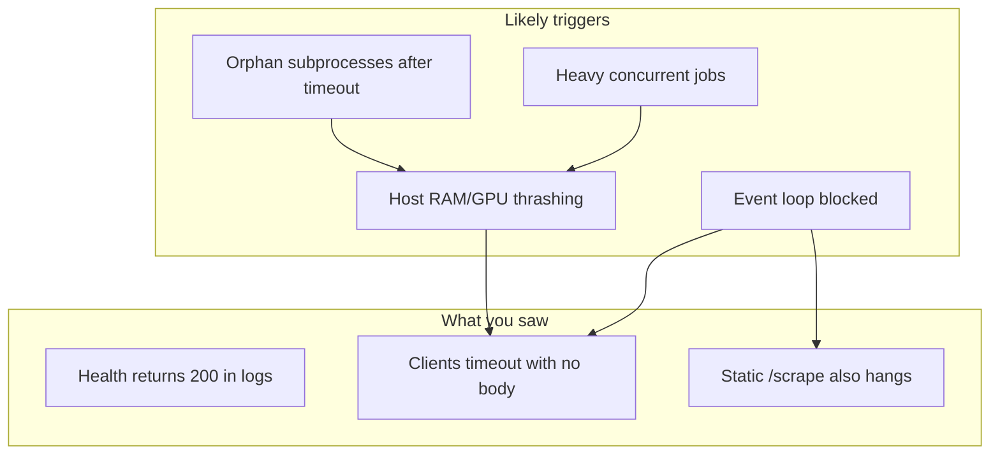
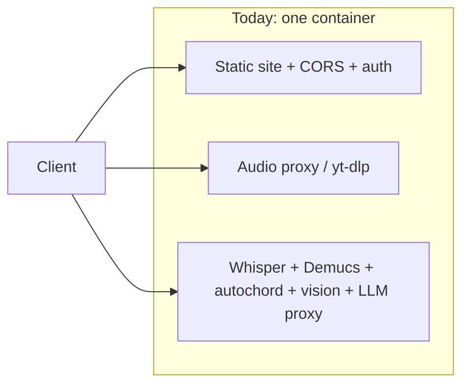
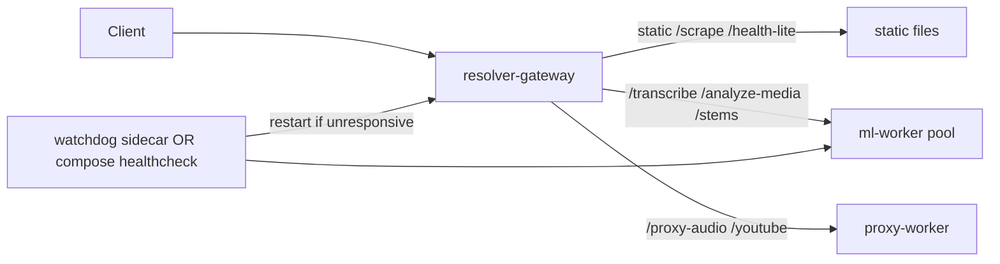

# Resolver hang diagnosis and service-split options

## What probably happened (your incident)

The container was **Up** but **unresponsive**: TCP connected on `:8787`, logs showed `200 OK` for `/health`, yet clients timed out with no response body. That pattern is a **wedge**, not a clean crash.

Most likely causes in this codebase, in order:

| Cause | Evidence in code | Why it wedges static `/scrape` too |
|-------|------------------|-------------------------------------|
| **Single uvicorn process, single event loop** | [`Dockerfile`](local-resolver/Dockerfile) runs one `uvicorn server:app` with no workers | All routes share one loop; heavy work starves static responses |
| **Orphan subprocesses after HTTP timeout** | [`server.py`](local-resolver/server.py) cancels `communicate_task` on timeout but often **does not kill** whisper/demucs/autochord children | Zombies keep eating CPU/GPU/RAM; new requests queue forever |
| **Unbounded concurrency for heavy jobs** | Only Demucs has `MAX_CONCURRENT_STEM_JOBS=1`; whisper/chords/melody/vision have **no global cap** | `/analyze-media` can spawn 4+ long subprocesses per request |
| **`/health` does real work** | Calls `resolver_features()` → sync `subprocess.run` probes for PaddleOCR/homr (up to ~40s) on the event loop | Frequent app probes can block the same loop serving `/scrape` |
| **Unbounded I/O** | yt-dlp `communicate()` and proxy `httpx timeout=None` | Connections hang indefinitely |
| **No Docker resource limits** | [`docker-compose.yml`](local-resolver/docker-compose.yml) has no `mem_limit` / `cpus` | OOM/swap thrash looks like a hang; `restart: unless-stopped` does not help until manual restart |

**Less likely for your scrape-import hang:** a prior bug where curated imports hit wrong URLs or a wedged resolver — both were addressed in the frontend/proxy changes. The resolver restart fixing `/scrape` confirms the gateway process was the bottleneck.

---

## Is a control-plane + separate worker services a good idea?

**Yes, in phases — but not as the first move.**

A dedicated “controls” service that actively manages worker lifecycles is **appropriate for GPU/ML workloads**, but building it first is high cost and adds its own failure modes. The current monolith already mixes three very different concerns:

**Recommended target shape (medium term):**

| Service | Keep / extract | Rationale |
|---------|----------------|-----------|
| **gateway** | Keep static site, CORS, auth, routing, cheap JSON endpoints | Must stay responsive for imports (`/scrape`) even when ML is busy |
| **ml-worker** | Extract whisper, demucs, autochord, sheet-image, analyze-media | CPU/GPU-bound, long-running, subprocess-heavy; safe to kill/restart |
| **proxy-worker** (optional) | Extract yt-dlp + upstream streaming | Unbounded I/O; isolates stalls from gateway |
| **llm-bridge** | Already separate | Keep as-is |
| **supervisor** | Lightweight watchdog first; full control plane later | Restart wedged workers without touching static serving |

**When a full control-plane is worth it:**
- You routinely run overlapping analyze/transcribe/stem jobs
- Manual `docker restart` happens more than rarely
- You want queueing, backpressure, and “busy” responses instead of hangs

**When it is overkill:**
- Single-user homelab, one heavy job at a time, and subprocess cleanup + healthchecks fix the issue

---

## Phased plan (recommended order)

### Phase 1 — Fix the wedge in the monolith (highest ROI, days)

Changes confined to [`local-resolver/server.py`](local-resolver/server.py) and compose:

1. **Kill process trees on timeout/cancel** — shared helper: on `asyncio.TimeoutError` or task cancel, `proc.terminate()` → `proc.kill()` + reap children (whisper, demucs, autochord, vision subprocess).
2. **Global heavy-job semaphore** — extend the existing Demucs pattern (`MAX_CONCURRENT_STEM_JOBS`) to whisper + autochord + vision (env: `MAX_CONCURRENT_ML_JOBS`, default 1–2).
3. **Split health endpoints:**
   - `GET /health` — cheap liveness only (`ok`, version, staticSite); **no subprocess probes**
   - `GET /health/ready` — optional deep feature probe (current `resolver_features()`), called rarely
4. **Add timeouts** to ffmpeg convert and yt-dlp `communicate()`.
5. **Docker healthcheck** on `local-resolver` using cheap `/health` with short timeout; `restart: unless-stopped` then auto-recovers wedges.
6. **Optional resource limits** — `mem_limit` / `cpus` in compose to fail fast instead of thrashing the host.

Frontend: point [`mediaProxyClient.js`](src/mediaProxyClient.js) at `/health` (already 6s timeout) — no change needed if gateway stays lightweight.

### Phase 2 — Compose service split (1–2 weeks)

Without a custom control plane yet:

- **`resolver-gateway`**: FastAPI/uvicorn serving static + proxy routes + forwards ML requests over HTTP to workers (or returns `503` + `Retry-After` when worker busy).
- **`resolver-ml`**: Same image, different `CMD` / env (`SERVE_STATIC=false`, ML endpoints only).
- **Shared volumes**: `/models`, `/tmp/stem-cache`, `/app/www` (read-only on gateway).
- **Compose `healthcheck` + `depends_on: condition: service_healthy`** so gateway starts even if ML is down, but ML jobs get clear errors.

Job dispatch can start as **synchronous HTTP** (gateway → ml-worker) with the global semaphore moved to the ML container.

### Phase 3 — Supervisor / queue (only if Phase 1–2 insufficient)

Add a small **`resolver-supervisor`** (Python or Go) that:
- Polls `GET /health` on gateway and ML with tight timeouts
- Tracks consecutive failures → `docker compose restart resolver-ml`
- Optionally maintains a **Redis/SQLite job queue** so gateway enqueues work and ML workers pull jobs (true backpressure)

Avoid building custom orchestration until compose healthchecks + worker split do not stabilize the box.

---

## Direct answers

**What might have crashed/wedged the resolver?**
Most likely: **resource exhaustion from long ML subprocesses** (possibly orphaned after a prior timeout) blocking the single event loop, compounded by **heavy `/health` feature probes**. Less likely: OOM/swap thrash with no memory limit. Unlikely: static scrape bug alone (that was a separate frontend issue).

**Should you extract risky elements + central lifecycle manager?**
- **Extract risky elements:** **Yes** — at minimum isolate ML from static gateway.
- **Central control service:** **Yes eventually**, but start with **Docker healthchecks + subprocess cleanup + job limits**; evolve to a supervisor only if wedges persist under normal use.

**Practical next step if you want implementation:** Phase 1 in the monolith gives most of the reliability benefit without compose complexity. Phase 2 is the right time to split containers if you still see imports or `/health` hang while ML jobs run.
