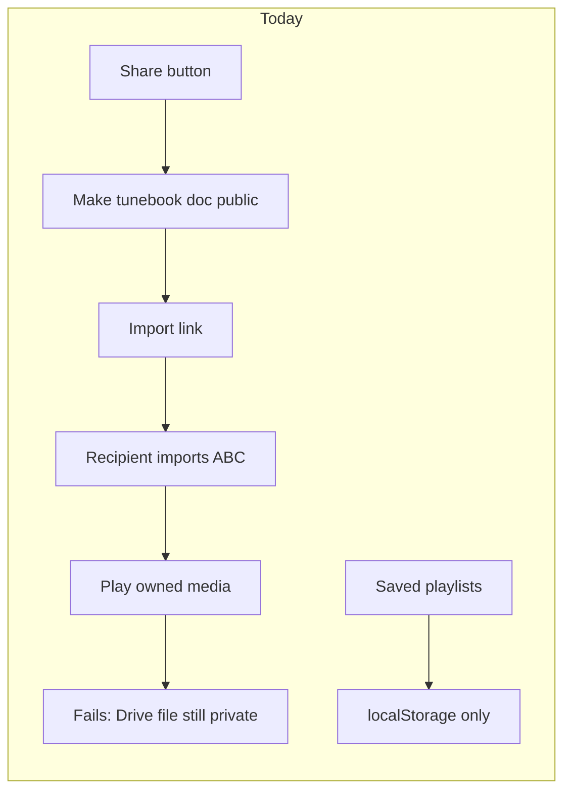
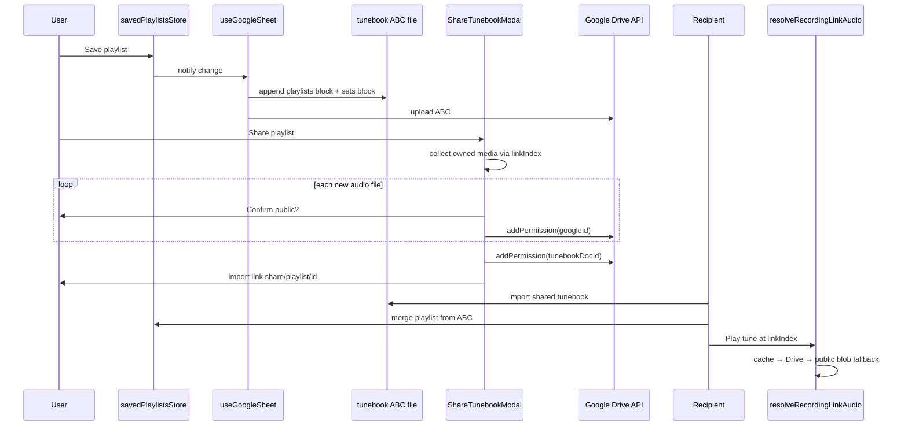

# Share owned audio with playlists

## Problem

Today, [ShareTunebookModal.js](src/components/ShareTunebookModal.js) only calls `addPermission(..., anyone/reader)` on the **tunebook Google Doc**. Owned audio files uploaded to Drive (`link.googleId` in tune ABC metadata) stay private, so recipients who import a shared set/tune/book get tune metadata but playback fails in [resolveRecordingLinkAudio](src/linkRecording.js).

Saved playlists are **localStorage-only** ([savedPlaylistsStore.js](src/savedPlaylistsStore.js)) and never written to the tunebook ABC, unlike performance sets which sync via a comment block appended on upload ([performanceSetSync.js](src/performanceSetSync.js), [useGoogleSheet.js](src/useGoogleSheet.js) lines 75–81).

There is orphaned groundwork in [ShareAudioModal.js](src/components/ShareAudioModal.js) (per-recording public share + confirm) and [ImportGoogleAudioPage.js](src/pages/ImportGoogleAudioPage.js) (no route in App.js), but nothing is wired into the main share path.



## Target behaviour

1. **Playlists persist in ABC** — a comment block at the end of the tunebook file (after the performance-sets block), using the same chunked-JSON + tombstone pattern as setlists.
2. **Playlists sync like setlists** — upload on sheet save, merge on download, conflict resolution via the same compare/merge flow as performance sets.
3. **Share dialog** (set / tune / book / playlist): discover owned media in scope, upload pending Drive uploads, grant `anyone/reader` on each Drive audio file **not already public**, with a **separate warning per new file**.
4. **Recipient playback**: download public audio, play via existing blob-URL path; cache in `externalMediaAudioCache` after first successful fetch.

---

## Is “play directly” problematic?

**No for typical song-length MP3s**, given how the app already works:

| Approach | Status | Notes |
|----------|--------|-------|
| Download full blob → `URL.createObjectURL` → `<audio>` | **Current design** | Reliable; first play waits for download (latency ∝ file size). |
| Cache to IndexedDB (`externalMediaAudioCache`) | **Already exists** | Used on playback when `autocacheOnPlay` is enabled ([offlineMediaSettings.js](src/offlineMediaSettings.js)); recommend caching public Drive downloads always. |
| True HTTP streaming (range requests / MediaSource) | Not implemented | Unnecessary for MVP; larger change. |

**Technical caveat for recipients:** the app uses `drive.file` OAuth scope ([App.js](src/App.js) line 205). Recipients may not be able to read another user's file via `getDocumentBlob` even when it is public. Mitigation: after authenticated Drive fetch fails, fall back to **unauthenticated public download** via `getPublicDocumentBlob` in [useGoogleDocument.js](src/useGoogleDocument.js). Test CORS in browser; if blocked, add a small proxy endpoint on `local-resolver` as last resort.

Playback does **not** stream from the owner's live Google session at play time — sharing grants public read; the file is served from Google's CDN once permissions are set.

---

## Architecture



---

## Implementation plan

### 1. Playlist ABC sync (mirror performance sets)

Create a parallel sync stack following the exact pattern in [performanceSetSync.js](src/performanceSetSync.js):

**New module [src/playlistSync.js](src/playlistSync.js)**

ABC comment block at end of tunebook (after performance-sets section):

```
% abcbook-playlists-begin
% abcbook-playlist {playlistId} {updatedAt}
% abcbook-playlist-json {playlistId} 1/2 {"name":"…","items":[{"tuneId":"…","linkIndex":0,"prefer":"auto"}],"followTune":false,"loop":false,"autoAdvance":true,"updatedAt":…}
% abcbook-playlist-json {playlistId} 2/2 …}
% abcbook-deleted-playlist {playlistId} {deletedAt} {name}
% abcbook-playlists-end
```

Functions (mirror setlist names):
- `parsePlaylistsFromAbc`, `renderPlaylistsToAbc`, `stripPlaylistLines`
- `comparePlaylists`, `buildMergedPlaylists`, `localPlaylistsDiffer`
- Chunk size: reuse 180-char chunks (same as `SET_JSON_CHUNK_SIZE`)

Playlist JSON body fields (from [savedPlaylistsStore.js](src/savedPlaylistsStore.js)):
- `name`, `items` (`tuneId`, optional `linkIndex`, optional `prefer`), `followTune`, `loop`, `autoAdvance`, `updatedAt`

**New [src/playlistSyncClient.js](src/playlistSyncClient.js)** — mirror [performanceSetSyncClient.js](src/performanceSetSyncClient.js):
- `mergePlaylistsFromTuneBookAbc`, `importSinglePlaylistFromAbc`, `syncPlaylistsFromTuneBookAbc`
- Incoming merge UI: [PlaylistMergeModal.js](src/components/PlaylistMergeModal.js) + [PlaylistMergeHost.js](src/components/PlaylistMergeHost.js) (mirror performance set merge components), or generalize merge host if straightforward.

**Update [src/savedPlaylistsStore.js](src/savedPlaylistsStore.js)**:
- Keep as localStorage cache (like [performanceSetStore.js](src/performanceSetStore.js))
- Add `notifyPlaylistsChanged` / change handler wired to sheet upload
- Add `setPlaylistsChangeHandler` called from App.js (same pattern as performance sets)

**Update [src/tuneBookAbc.js](src/tuneBookAbc.js)**:
- `appendPlaylistsToTuneBookAbc(tuneBookAbc, playlistsMap, deletedPlaylistsMap)` chained after `appendPerformanceSetsToTuneBookAbc`
- `stripTuneBookAbcForTunes` strips both set and playlist lines

**Wire into [src/useGoogleSheet.js](src/useGoogleSheet.js)**:
- On upload: read playlists + deleted tombstones from localStorage, append to ABC (same as lines 75–81 for sets)
- On download/sync: parse playlists from remote ABC, run merge client (alongside existing performance-set merge in sync worker path)

**Migration**: on first sync after upgrade, if localStorage has playlists but ABC has none, treat local as `localInserts` and upload on next sheet save (same as local-only sets).

**Optional DRY**: extract shared chunk render/parse (`renderJsonChunks`, `applyJsonChunks`, tombstone helpers) into `src/abcJsonBlockSync.js` used by both set and playlist sync — reduces duplication without coupling the two entity types.

### 2. Owned-media discovery utility

Add [src/shareOwnedMediaUtils.js](src/shareOwnedMediaUtils.js) (with tests):

- `collectOwnedMediaForShareScope(tunes, scope)` where `scope` is `{ shareKind, tuneId?, bookName?, setId?, sets?, playlistId?, playlists? }`.
- Walk tunes in scope; for each owned link (`isOwnedMediaLink` from [linkRecording.js](src/linkRecording.js)), emit `{ googleId, recordingId, tuneId, tuneName, linkTitle, linkIndex, status }`.
- For playlist/set items with `linkIndex`, only include that specific link; otherwise include all owned links on the tune.
- Classify: `synced` / `pending` / `local`; detect `alreadyPublic` via `listPermissions`.

Add `prepareOwnedMediaForShare(driveApi, token, files, options)`:
- Upload pending files first (`uploadOwnedMediaLinksForTune` / `syncPendingRecordingUploads`)
- Per-file confirm for each new `googleId` not yet public (`localStorage` key `bookstorage_audio_public_{googleId}`)
- Return summary `{ shared, skipped, failed, notUploadable }`

### 3. Extend ShareTunebookModal + share routes

**[ShareTunebookModal.js](src/components/ShareTunebookModal.js)**:
- Props: `tunes`, `sets`, `playlists`
- `prepareShare()` flow: tunebook-doc confirm → owned-media step → `finishShare()`
- Summary in modal body ("3 audio files shared publicly")

**[shareTunebookUtils.js](src/shareTunebookUtils.js)** — add `playlist` share kind:
- `buildShareImportLink`: `/#/importdoc/{docId}/share/playlist/{playlistId}`
- `tuneIdsForPlaylist(playlistRecord)` — unique tune IDs from items
- `shareModalTitle` / `shareEmailSubject` for playlist
- `parseImportDocRouteParams` — parse `playlistId`
- `SHARE_KINDS` includes `'playlist'`

**[App.js](src/App.js)** — route: `importdoc/:googleDocumentId/share/playlist/:playlistId`

**[ImportGoogleDocumentPage.js](src/pages/ImportGoogleDocumentPage.js)** + **[ImportScopePicker.js](src/components/ImportScopePicker.js)**:
- "Import playlist" scope option when `playlistId` in route
- Filter tunes to `tuneIdsForPlaylist`; import playlist via `importSinglePlaylistFromAbc`

**[shareImportSession.js](src/shareImportSession.js)**:
- Handle `scope === 'playlist'` → `importSinglePlaylistFromAbc`

**Share button** in [SavedPlaylistsOpenModal.js](src/components/SavedPlaylistsOpenModal.js) (and optionally [PlaylistModal.js](src/components/PlaylistModal.js) when `savedPlaylistId` set):
- `<ShareTunebookModal shareKind="playlist" playlistId={…} playlistName={…} … />`

Wire props from existing call sites: SetsPage, MusicSingle, TuneBookOptionsModal.

### 4. Recipient playback fixes

Update [resolveRecordingLinkAudio](src/linkRecording.js):

```javascript
// After authenticated getDocumentBlob fails or no token:
if (googleId && driveApi.getPublicDocumentBlob) {
  const publicBlob = await driveApi.getPublicDocumentBlob(googleId)
  // convert to MP3 if needed, cache, return
}
```

Add `getPublicDocumentBlob(id)` to [useGoogleDocument.js](src/useGoogleDocument.js) — blob `responseType`, detect virus-scan HTML responses.

**Caching policy:** always `putExternalMediaCache` on successful Drive/public download (not only when `autocacheOnPlay`).

**Error messages** in [checkTuneLinkPlayback.js](src/checkTuneLinkPlayback.js): distinguish not-shared / login-required / download-failed.

### 5. Cleanup / deprecate orphans

- Do **not** revive `/#/importaudio/` route — tunebook import + public Drive files is sufficient.
- Repurpose [ShareAudioModal.js](src/components/ShareAudioModal.js) confirm logic into `shareOwnedMediaUtils` (key by `googleId`, not `recordingId`).

### 6. Tests

- [playlistSync.test.js](src/playlistSync.test.js) — parse/render round-trip, chunking, merge, tombstones
- [playlistSyncClient.test.js](src/playlistSyncClient.test.js) — import single playlist from ABC
- [shareOwnedMediaUtils.test.js](src/shareOwnedMediaUtils.test.js) — scope collection for tune/book/set/playlist-with-linkIndex
- [shareTunebookUtils.test.js](src/shareTunebookUtils.test.js) — playlist share link + `tuneIdsForPlaylist`
- [linkRecording.test.js](src/linkRecording.test.js) — public-blob fallback

---

## ABC file layout (end of tunebook)

```
[tune ABC bodies + metadata comments]
% abcbook-performance-sets-begin
  … setlist chunks …
% abcbook-performance-sets-end
% abcbook-playlists-begin
  … playlist chunks …
% abcbook-playlists-end
```

Both blocks are stripped before tune parsing ([tuneBookAbc.js](src/tuneBookAbc.js) `stripTuneBookAbcForTunes`) and re-appended on upload.

---

## Edge cases

| Case | Behaviour |
|------|-----------|
| Audio not uploaded to Drive | Warn in share modal; tunebook still shareable without audio |
| Upload pending | Auto-upload before permission grant |
| User cancels one file's confirm | Skip that file; continue with others |
| File already public | No per-file dialog |
| Playlist item references missing tune | Dropped on `queueFromSavedPlaylist` (existing behaviour); preserved in stored playlist |
| Playlist merge conflict | Same interactive merge as performance sets |
| Existing localStorage playlists | Migrated to ABC on first post-upgrade sync |
| Recipient offline, never played | Needs prior cache; optional future: prefetch owned media on import |

---

## Files to touch (primary)

- **New playlist sync:** `src/playlistSync.js`, `src/playlistSyncClient.js`, `src/playlistIncomingMergeUtils.js`, `src/playlistMergeUtils.js`, `src/components/PlaylistMergeModal.js`, `src/components/PlaylistMergeHost.js`, tests
- **Optional shared:** `src/abcJsonBlockSync.js` (chunk/tombstone helpers)
- **Store + ABC:** `src/savedPlaylistsStore.js`, `src/tuneBookAbc.js`, `src/useGoogleSheet.js`, `src/App.js`
- **Share flow:** `src/shareOwnedMediaUtils.js`, `src/components/ShareTunebookModal.js`, `src/shareTunebookUtils.js`, `src/shareImportSession.js`, `src/pages/ImportGoogleDocumentPage.js`, `src/components/ImportScopePicker.js`, `src/components/SavedPlaylistsOpenModal.js`
- **Playback:** `src/linkRecording.js`, `src/useGoogleDocument.js`
