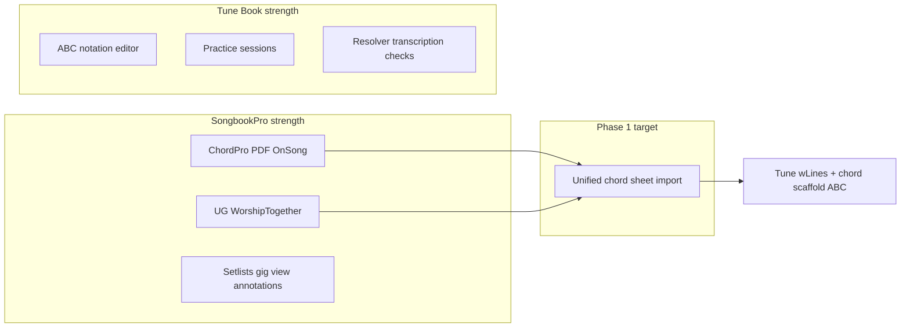
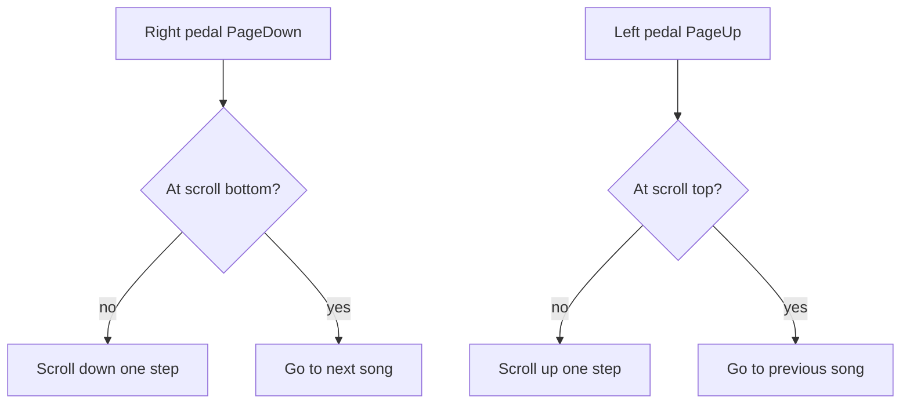
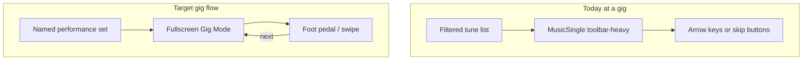

# SongbookPro vs Tune Book — Import-Focused Adoption Plan

## Feature comparison

| Area | SongbookPro | ABC Tune Book today | Gap? |
|------|-------------|---------------------|------|
| **Core model** | Chord charts, lyrics, PDF sheet music | ABC notation, optional chord scaffold + lyrics | Different focus; complement, not replace |
| **ChordPro / OnSong files** | Native import | Renders ChordPro-style inline ([`TimedLyricsChordsView.js`](src/components/TimedLyricsChordsView.js)); no file import | **Yes** |
| **PDF charts** | Primary display mode | Legacy attachment code exists; **skipped** — not in scope | N/A |
| **Web chord sites** | One-tap UG, WorshipTogether, e-chords | Resolver `/search-chords` already scrapes UG + e-chords ([`chords_fetch.py`](local-resolver/chords_fetch.py)); used per-tune via [`ChordsSearchButton`](src/components/ChordsSearchButton.js), not bulk import | **Partial** |
| **Transpose / capo** | Quick live controls | Yes (tune page + modal) | Parity |
| **Auto-scroll** | Duration-based (default 90s) | [`LyricsAutoscrollModal`](src/components/LyricsAutoscrollModal.js) with media sync + speed multiplier | Parity / TB ahead on media sync |
| **Setlists** | Named dated sets, notes, timers, swipe live | Ephemeral media/MIDI playlists; auto-tag "Current Playlist" ([`generateCurrentPlaylist.js`](src/generateCurrentPlaylist.js)) | TB weaker for gigs |
| **Annotations** | Freehand + typed overlays on charts | Background markdown only | Out of scope |
| **Display styling** | Chord colors, chorus highlighting, font size | Hardcoded chord colors in [`TimedLyricsChordsView.js`](src/components/TimedLyricsChordsView.js); theme tokens in progress | **Partial** |
| **Lyrics-only mode** | Live toggle | Print-only ([`PrintPage.js`](src/pages/PrintPage.js)) | **Yes** (later phase) |
| **Foot pedals** | Configurable Bluetooth page-turn | Arrow keys prev/next tune ([`Header.js`](src/components/Header.js)) | **Partial** |
| **Backing tracks** | Local / Spotify / pads | Linked YouTube/audio + stem mixing | Different but capable |
| **Sync / share** | Cross-platform + Groups | Google Drive sync; [`ShareTunebookModal`](src/components/ShareTunebookModal.js) disabled (`return null`) | **Partial** |
| **Practice** | Basic (metronome, scroll) | Rich practice sessions ([`practiceSessionPlanner.js`](src/practiceSessionPlanner.js)) | TB ahead |
| **ABC / folk notation** | Minimal | Full editor, piano roll, MIDI, thesession.org | TB ahead — preserve |



**Tune Book should not try to become SongbookPro.** Adopt SBP ideas that fit chord-chart users without diluting the ABC/folk core.

---

## Phase 1 — Import and formats (your priority)

### 1A. ChordPro file import

**Goal:** Import `.cho`, `.pro`, `.crd`, or pasted ChordPro text as first-class tunes (not only via manual paste in the editor).

**Approach:**
- Add dependency: [`chordsheetjs`](https://www.npmjs.com/package/chordsheetjs) (`ChordProParser` + `ChordsOverWordsParser` for "chords over lyrics" files).
- New module [`src/chordProFormatUtils.js`](src/chordProFormatUtils.js):
  - Parse file → extract `title`, `subtitle`/`artist`, `key`, `capo`, `tempo`, section headers (`{soc}`/`{eoc}`, `{c: Verse}`).
  - Emit **two parallel representations** Tune Book already understands:
    - `lyricLines` → `wLines` via [`setLyricLines`](src/wLinesUtils.js) (block lyrics + section headers)
    - `chordText` → pipe-bar chord grid via existing [`sheetLinesToWizardChords`](src/chordSheetImportUtils.js) after converting inline `[Am]` chords to chord lines
  - Optionally store raw source in `tune.meta.chordProSource` for future round-trip export.
- New `createTuneFromChordSheet()` helper (can live in same file):
  - Build minimal ABC skeleton (title, meter default `4/4`, key, tempo) using [`useAbcTools.abc2json`](src/useAbcTools.js) patterns from [`AddSongModal`](src/components/AddSongModal.js).
  - Call `abcjsParser.mergeChords(chordText, abc)` → set `timingScaffold: true` when no real melody.
  - Apply metadata (capo, composer, tags from `{x_sbp_tags: ...}` if present).
- New UI: [`src/components/ImportChordSheetModal.js`](src/components/ImportChordSheetModal.js)
  - Paste text + multi-file upload (mirror [`ImportAbcModal`](src/components/ImportAbcModal.js) UX).
  - Preview: title, bar count, section list, duplicate-name handling.
  - Wire into [`ImportOptionsModal`](src/components/ImportOptionsModal.js) as **Chord Sheet** import button.
- Tests: parser fixtures for `{title}`, inline chords, `{soc}`/`{eoc}`, capo/key directives; integration test for scaffold tune creation.

### 1B. OnSong import

**Goal:** Support OnSong exports without a separate code path where possible.

**Approach:**
- OnSong files are largely ChordPro-compatible; use `ChordProParser` first.
- Add lightweight format sniffing (OnSong metadata headers, `{{tag}}` patterns) and a small normalizer in `chordProFormatUtils.js` that rewrites known OnSong-only directives to supported equivalents or plain section comments.
- Accept `.onsong` extension in the same import modal.
- Document unsupported directives in import preview warnings (e.g. custom `{textfill}` — defer styling to Phase 2).

### 1C. ~~PDF-as-tune~~ — SKIPPED

**Not in scope** per user decision. No PDF import-as-tune, PDF view mode, or PDF export work in this plan.

### 1D. Streamlined chord-site import (UG / e-chords / WorshipTogether)

**Goal:** SongbookPro-style "import from URL or search" at the **library** level, not only inside the chord editor.

**Frontend:**
- New [`src/components/ImportChordUrlModal.js`](src/components/ImportChordUrlModal.js):
  - **By URL:** paste `tabs.ultimate-guitar.com/...`, `e-chords.com/...`, etc. → call existing [`searchChords({ url })`](src/chordsSearchClient.js) → `createTuneFromChordSheet()`.
  - **By title:** reuse resolver search + [`SearchResultPickerModal`](src/components/SearchResultPickerModal.js) (same as [`ChordsSearchButton`](src/components/ChordsSearchButton.js)).
  - **Bulk:** textarea of URLs or `title — artist` lines (extend [`ImportListModal`](src/components/ImportListModal.js) pattern); queue imports with progress + duplicate detection.
- Add button to [`ImportOptionsModal`](src/components/ImportOptionsModal.js).

**Backend (small extension):**
- Add `worshiptogether.com` to `CHORD_PAGE_HOST_SUFFIXES` in [`local-resolver/chords_fetch.py`](local-resolver/chords_fetch.py) with a site-specific HTML extractor (follow existing `AZCHORDS_CONTENT_RE` / `CHORD_SPAN_RE` patterns).
- Verify `search-chords` URL path already accepts direct URLs (it does via `url` param); add tests in [`local-resolver/test_chords_fetch.py`](local-resolver/) if present.

**Help update:** Replace the manual UG paste workflow in [`helpContent.js`](src/helpContent.js) § "Ultimate Guitar / chord-sheet paste" with the new import paths while keeping paste as fallback.

### 1E. Export new formats (Download buttons)

**Goal:** Symmetric import/export — users can download tunes in the same formats they can import, via existing Download UI ([`TuneDownloadMenu.js`](src/components/TuneDownloadMenu.js), bulk ops on Tunes page).

**Extend [`TUNE_DOWNLOAD_FORMATS`](src/tuneDownloadActions.js):**

| Format id | Label | Extension | Source |
|-----------|-------|-----------|--------|
| `chordpro` | ChordPro | `.cho` / `.pro` | Generate from tune `wLines` + chord scaffold via ChordSheetJS `ChordProFormatter` |
| `onsong` | OnSong | `.onsong` | ChordPro-compatible export with OnSong-friendly metadata headers |

**Export module** — extend [`src/chordProFormatUtils.js`](src/chordProFormatUtils.js) (rename from import-only; handles both directions):

- **`exportTuneToChordPro(tune)`** — map tune fields to ChordSheetJS `Song` model:
  - `{title}`, `{subtitle}` (composer), `{key}`, `{capo}`, `{tempo}`
  - Inline `[Chord]` lyrics from `wLines` / interleaved chord+lyric tokens (reuse [`classifyLyricChordLines`](src/chordSheetUtils.js) + [`TimedLyricsChordsView`](src/components/TimedLyricsChordsView.js) tokenization logic in reverse)
  - Section headers as `{c: Verse}` / `{soc}`/`{eoc}` where detectable
  - Prefer round-trip from `tune.meta.chordProSource` when present and still valid
- **`exportTuneToOnSong(tune)`** — same content with OnSong file header conventions (`{{title:...}}` style where needed)

**Wire into [`executeTuneDownload`](src/tuneDownloadActions.js):**

```javascript
case 'chordpro':
  utils.download(sanitizeDownloadFilename(tune.name) + '.cho', exportTuneToChordPro(tune))
case 'onsong':
  utils.download(sanitizeDownloadFilename(tune.name) + '.onsong', exportTuneToOnSong(tune))
```

- **Multi-tune:** sequential downloads (same pattern as MIDI) — one `.cho` / `.onsong` per tune.
- **`isTuneDownloadFormatDisabled`:** disable `chordpro`/`onsong` when tune has no lyrics/chords (`!hasChordLines && !getLyricLines`).
- **Tests:** round-trip fixture — import sample `.cho` → export → parse again; metadata and section headers preserved.

**UI:** No new components — formats appear automatically in [`TuneDownloadModal`](src/components/TuneDownloadMenu.js) and bulk Download dropdown via `TUNE_DOWNLOAD_FORMATS`.

---

## Phase 2 — Bluetooth page turning (committed)

**User request:** Foot pedals scroll the chart up/down; only when already at the **top** or **bottom** of the scrollable content does the next pedal press advance to the **previous** or **next** song.

**Technical note:** Pedals (AirTurn, PageFlip, etc.) act as **Bluetooth HID keyboards** (`PageDown`, `PageUp`, etc.). No Web Bluetooth API needed.



### Scroll-then-song behaviour

**Primary pedal actions** (not direct tune-skip):

| Pedal | Default key | Behaviour |
|-------|-------------|-----------|
| Scroll down | `PageDown` | Scroll content down ~80% viewport; if already at bottom (within threshold), `navigateToNextSong` |
| Scroll up | `PageUp` | Scroll content up ~80% viewport; if already at top, `navigateToPreviousSong` |

Applies to **all tune views** with scrollable content — chord/lyrics charts, music notation, music+lyrics — not PDF-specific. Uses the same scroll root detection as lyrics autoscroll ([`findLyricsScrollRoot`](src/lyricsAutoscrollUtils.js) / `window`).

### Implementation

**1. Scroll helpers** — [`src/performanceScrollUtils.js`](src/performanceScrollUtils.js)

- `getPerformanceScrollRoot()` — locate scroll container for current tune view (reuse `findLyricsScrollRoot` from [`.music-single`](src/components/MusicSingle.js))
- `isAtScrollTop(root, thresholdPx)` / `isAtScrollBottom(root, thresholdPx)` — e.g. 8px tolerance
- `scrollPageStep(root, direction)` — scroll by `root.clientHeight * 0.8` (configurable step fraction in settings)
- `getWindowScrollMetrics()` fallback when content scrolls via `window`

**2. Settings model** — [`src/performanceKeyBindings.js`](src/performanceKeyBindings.js)

- Store in `localStorage` (`bookstorage_performance_keys`):
  ```javascript
  {
    scrollDown: ['PageDown'],
    scrollUp: ['PageUp'],
    scrollStepFraction: 0.8,
    scrollEdgeThresholdPx: 8,
  }
  ```
- `matchAction(event)` returns `scrollDown` | `scrollUp` | null

**3. Global hook** — [`src/usePerformanceKeyBindings.js`](src/usePerformanceKeyBindings.js)

- Single `keydown` listener; on `scrollDown`/`scrollUp`:
  1. Resolve scroll root for active tune view
  2. If at edge in pedal direction → call `tunebook.navigateToNextSong` / `navigateToPreviousSong` (respects playlist / future setlist)
  3. Else → `scrollPageStep` and `preventDefault()`
- Register from [`MusicSingle.js`](src/components/MusicSingle.js) and Gig Mode (Phase 3)
- Skip when `blockKeyboardShortcuts` or focus is in input/textarea/editor
- **Do not** bind arrow keys to tune-skip by default — arrows remain for editor; pedals use Page Up/Down
- Remove duplicate tune-skip [`useKeyPress`](src/useKeyPress.js) in [`Header.js`](src/components/Header.js) for arrow keys OR keep arrows as optional secondary bindings in settings

**4. Settings UI** — [`SettingsPage.js`](src/pages/SettingsPage.js) section **Foot pedal**

- Record/customize keys for scroll up / scroll down
- Slider for scroll step size (% of viewport)
- Help: pair pedal in OS Bluetooth settings; right pedal scrolls down through song, advances at bottom

**5. Tests**

- `isAtScrollTop` / `isAtScrollBottom` with mock DOM
- At bottom + `scrollDown` → `navigateToNextSong` called; not at bottom → scroll only
- At top + `scrollUp` → `navigateToPreviousSong` called

### Foot-pedal success criteria

- Right pedal scrolls down through a long chord chart; only after reaching the bottom does the next press go to the next song.
- Left pedal scrolls up; at top, previous press goes to previous song.
- Works on chord/lyrics views without autoscroll mode enabled.
- Bindings configurable in Settings.

---

## Phase 3 — Gig / live performance (after page turning + import/export)

Tune Book is strong for practice and editing but weak for **on-stage use**. SongbookPro's core value is "open set → swipe through songs → hands-free scroll." Today's gaps:

- **No persistent setlists** — [`mediaPlaylist`](src/useTuneBook.js) / [`abcPlaylist`](src/useTuneBook.js) are ephemeral session state; [`generateCurrentPlaylist`](src/generateCurrentPlaylist.js) is a heuristic tag, not a curated gig order.
- **Navigation follows the tune index** — [`navigateToNextSong`](src/useTuneBook.js) walks filtered/sorted tunes alphabetically unless a playlist is active; useless mid-gig if filters change.
- **Tune page is editor-heavy** — [`MusicSingle.js`](src/components/MusicSingle.js) toolbar has zoom, capo, view mode, autoscroll buried among practice/editing affordances.
- **Arrow keys only** — [`Header.js`](src/components/Header.js) handles prev/next today; Phase 2 adds configurable pedal keys (see above).
- **Lyrics-only is print-only** — no live toggle to hide chords once memorized.

**Good news:** [`PracticeSessionModal`](src/components/PracticeSessionModal.js) already proves the right pattern — `fullscreen`, `backdrop="static"`, step progress, playback host. Gig mode can reuse this shell rather than inventing a new UX paradigm.



### Recommended gig features (priority order)

#### Tier 1 — Highest impact, moderate effort

**1. Performance setlists**

Persistent, user-curated ordered lists for events — the single biggest gig gap.

- **Data model** — store in tunebook document (alongside tunes), e.g. `sets: { [id]: { name, date, venue?, notes, items: [...] } }` where each item is:
  - `{ type: 'tune', tuneId, viewMode?, capo?, transpose? }` — per-set overrides without changing the base tune
  - `{ type: 'note', text }` — "Tuning break", "Announce CD", etc. (SongbookPro supports non-song set items)
- **UI** — `/sets` list + set editor (drag-reorder, add from book/tag/search, duplicate set for next gig)
- **Entry point** — "Play set" button launches Gig Mode with set bound as the navigation context
- **Persistence** — serialize in Google Drive sync like tunes; optional `% abcbook-sets` JSON chunk in ABC export for backup

**2. Gig Mode (fullscreen live view)**

A dedicated performance surface, not the regular tune page.

- New [`GigModeModal.js`](src/components/GigModeModal.js) or route `/gig/:setId` — model on [`PracticeSessionModal`](src/components/PracticeSessionModal.js):
  - Fullscreen, static backdrop (no accidental dismiss)
  - Large chord/lyric display via [`TimedLyricsChordsView`](src/components/TimedLyricsChordsView.js)
  - **Set progress bar**: "4 / 12 — next: Drowsy Maggie"
  - Prominent **Prev / Next** touch targets (thumb-reachable on tablet)
  - **Stop set** returns to set list; no editor chrome
- Default view per tune: chord layout (`chordsInline`) for pop songs, notation for trad — honour `tune.viewMode` or set-item override
- Optional dark background + high-contrast chord color (gig preset in [`theme.css`](src/theme.css))

**3. Set-aware navigation**

Extend [`navigateToNextSong` / `navigateToPreviousSong`](src/useTuneBook.js):

- When `setPlaylist` is active, walk **set order** (not alphabetical index)
- **Stop at end** of set (show "End of set" with option to loop or exit) — gigs rarely want wrap-around
- Populate `setPlaylist` when Gig Mode starts; clear on exit
- Preserve existing `mediaPlaylist` / `abcPlaylist` behaviour when not in gig context

#### Tier 2 — Quick wins for stage use

**4. Lyrics-only toggle**

- Add `lyricsOnly` to [`VIEW_MODES`](src/viewModeUtils.js) or a gig-toolbar toggle that hides chord rows in [`TimedLyricsChordsView`](src/components/TimedLyricsChordsView.js)
- One tap during performance; persist as session-only (don't save to tune)

**5. Quick transpose / capo steppers**

- In Gig Mode toolbar: `−` / `+` semitone and capo fret without opening [`TransposeModal`](src/components/TransposeModal.js)
- Apply to **session transpose** (like playback pitch offset) so the saved tune is unchanged
- Show "Capo 3 · Key G" badge prominently

**6. Foot-pedal integration in Gig Mode**

- Gig Mode registers with the same [`usePerformanceKeyBindings`](src/usePerformanceKeyBindings.js) hook (built in Phase 2) — scroll-then-song behaviour unchanged.
- Set-aware: at scroll bottom + `scrollDown` when on last tune in set → show "End of set" instead of wrapping.

**7. Autoscroll in one tap**

- Surface [`LyricsAutoscrollModal`](src/components/LyricsAutoscrollModal.js) as a single **Scroll** button in Gig Mode (already syncs to linked media — advantage over SongbookPro)
- Pre-fill duration from tune tempo + estimated length when no media linked

#### Tier 3 — Polish and reliability

**8. Offline set preparation**

- "Prepare set for offline" action — run [`mediaCacheQueue`](src/mediaCacheQueue.js) for all tunes in set
- Show readiness indicator per set item (cached / needs network)

**9. Font scale for charts**

- [`MusicSingle.js`](src/components/MusicSingle.js) already has chord zoom buttons — expose a **global gig font scale** in Gig Mode (larger default, persist in localStorage)

**10. Performance-safe mode**

- In Gig Mode: disable edit gestures, hide delete/share, prevent navigation to editor
- Wake-lock API (`navigator.wakeLock`) to keep screen on during set

**11. Setlist export**

- Export set as ordered tune list (JSON or text) for backup — not full tunebook sharing

### What NOT to do for gigs

- Don't repurpose **practice sessions** as setlists.
- Don't use **tags alone** for setlists.
- Don't implement Phase 4 items (annotations, chord colours, tunebook sharing, etc.).

### Suggested gig implementation order

1. Foot-pedal scroll-then-song (Phase 2 — before/alongside gig mode)
2. Set data model + set editor UI
3. `setPlaylist` navigation in `useTuneBook.js`
4. Gig Mode fullscreen component
5. Lyrics-only toggle + quick transpose/capo
6. Offline set preparation

### Gig success criteria

- Build a 10-song set, tap **Play set**, scroll through long charts with foot pedal; pedal advances to next song only at bottom of chart.
- Transpose +2 on stage without saving changes to the tune.
- Toggle lyrics-only mid-song.
- Complete a pub session with phone in airplane mode after preparing the set.

---

## Implementation order

### Phase 1 — Import + export

1. **`chordProFormatUtils.js` + tests** — import and export conversion.
2. **Export formats** — add `chordpro`, `onsong` to [`tuneDownloadActions.js`](src/tuneDownloadActions.js).
3. **`ImportChordSheetModal`** — ChordPro/OnSong paste + multi-file.
4. **`ImportChordUrlModal`** — URL/title/bulk web import.
5. **Resolver:** WorshipTogether host support.
6. **Help** — document import, export, and foot-pedal setup.

### Phase 2 — Page turning

7. **`performanceScrollUtils.js`** — scroll root, edge detection, page step.
8. **`performanceKeyBindings.js` + `usePerformanceKeyBindings`** — scroll-then-song handler.
9. **Settings UI** — record/customize pedal keys, scroll step size.
10. **Integrate** — MusicSingle (register scroll root); optional Header arrow-key cleanup.

### Phase 3 — Gig mode (later)

11. Setlists → Gig Mode → set-aware navigation.

## Key reuse points (avoid reinventing)

- Chord grid → ABC: [`finalizeChordSheetToTune`](src/timedImportFinalizer.js), [`abcjsParser.mergeChords`](src/useAbcjsParser.js)
- Sheet line classification: [`classifyLyricChordLines`](src/chordSheetUtils.js)
- Add-tune chord merge pattern: [`AddSongModal.handleChordsMerged`](src/components/AddSongModal.js)
- Web chord fetch: [`chordsSearchClient.js`](src/chordsSearchClient.js) + [`chords_fetch.py`](local-resolver/chords_fetch.py)

## Success criteria

**Import/export**
- Import a ChordPro file → tune appears with lyrics + chords in **Lyrics with Chords** view.
- Download same tune as **ChordPro** from tune page or bulk Download → valid `.cho` that re-imports cleanly.
- Import a UG URL from Import modal → tune created without opening editor.

**Page turning**
- Right pedal scrolls down through chart; at bottom, next press goes to next song.
- Left pedal scrolls up; at top, previous press goes to previous song.

**Unchanged**
- Existing ABC/folk workflows; new features are additive.

## Out of scope

- **1C PDF-as-tune** — import, view mode, PDF export (skipped)
- **Phase 4 items** — chord display customization, freehand annotations, re-enable tunebook sharing, section colours, swipe gestures, metronome-in-gig-bar, Spotify pads
- Spotify/pad backing tracks (TB already has linked media)
- SongbookPro Groups / subscription sync model
- Word (.docx) import
- Full ChordPro directive styling (`textfill`, section colors)
