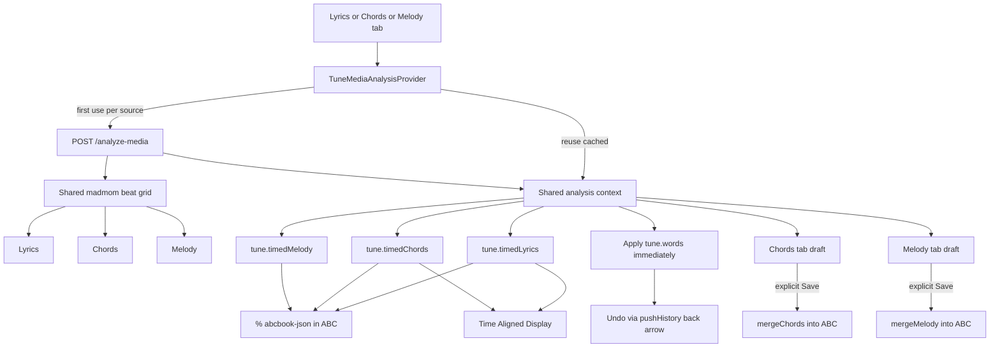

# Timed Lyrics And Chords Plan

## Current State

- Lyrics are stored as plain lines in [`src/useAbcTools.js`](src/useAbcTools.js) via `tune.words`, emitted as `W:` headers by `renderWordHeaders`, and displayed as blank-line-separated blocks in [`src/components/MusicSingle.js`](src/components/MusicSingle.js) and [`src/pages/PrintPage.js`](src/pages/PrintPage.js).
- The resolver already returns lyric `segments` from `/transcribe` in [`src/lyricsTranscriptionClient.js`](src/lyricsTranscriptionClient.js), but [`src/components/LyricsTranscriptionControls.js`](src/components/LyricsTranscriptionControls.js) currently persists only `result.text` and keeps the transcription dialog state in React only.
- Chord discovery already returns timed chord `segments` and `beatTimes` from `/detect-chords` in [`src/chordDiscoveryClient.js`](src/chordDiscoveryClient.js), but [`src/chordDiscoveryFormatter.js`](src/chordDiscoveryFormatter.js) collapses them into a compressed grid held in [`src/components/ChordsWizard.js`](src/components/ChordsWizard.js) component state — lost on navigation unless merged into ABC.
- Tunes persist locally via localforage (`bookstorage_tunes` in [`src/useTuneBook.js`](src/useTuneBook.js)) and sync to Google as ABC via [`src/useGoogleSheet.js`](src/useGoogleSheet.js).
- The tune page view selector in [`src/components/ViewModeSelectorModal.js`](src/components/ViewModeSelectorModal.js) is currently a two-state toggle (`music` ↔ `chords`); it will become a three-option dropdown.
- The editor in [`src/components/AbcEditor.js`](src/components/AbcEditor.js) has tabs for Lyrics and Chords ([`ChordsWizard`](src/components/ChordsWizard.js)); there is no melody-from-audio workflow yet. The resolver has `/transcribe` (lyrics), `/detect-chords`, and `/midi2xml` but no melody transcription endpoint.
- ABC has two lyric mechanisms per the [ABC words tutorial](https://trillian.mit.edu/~jc/music/abc/doc/ABCtut_Words.html): `W:` for poetry-style lyrics, and `w:` for note-aligned lyrics using `~`, `-`, `*`, `_`, and `|`. These are useful **derived** outputs but are lossy when there is no melody or when media-time alignment must be preserved.

## Design Principle: Three Layers

Do not treat ABC lyrics or chord symbols as the canonical timing store. Use three layers instead:

| Layer | Role | Survives navigation | Survives Google sync |
|-------|------|---------------------|----------------------|
| **Canonical timed data** | Source of truth for media-time lyrics, chords, melody notes, sections | Yes, via tune object + localforage | Yes, via `% abcbook-json` ABC comments |
| **Local per-tune cache** | AI results, transcription dialog text, chord-grid and melody ABC textarea edits | Yes, localforage keyed by `tuneId` | No — UI/session convenience only |
| **Derived ABC views** | Best-effort notation for display, merge, print, abcjs | Regenerated from canonical data | Partially (`w:`, chord symbols, scaffold in voices) |



## Proposed Data Model

### Canonical fields on each tune

```js
// tune.timedLyrics — canonical lyric timing
{
  version: 1,
  source: { kind, id, label, startAt, endAt, backend, generatedAt },
  lines: [
    {
      id, sectionId, text, start, end,
      words: [{ text, start, end, charStart, charEnd, timingSource }]
    }
  ],
  sections: [
    { id, label, type, startLine, endLine }  // verse, chorus, bridge, etc.
  ]
}

// tune.timedChords — canonical chord timing
{
  version: 1,
  source: { kind, id, label, startAt, endAt, backend, generatedAt },
  meter, noteLength, tempo,
  beatTimes: [],
  segments: [{ label, start, end }],
  bars: [{ index, start, end, beats: [{ index, start, end, chord }] }]
}

// tune.timedMelody — canonical melody note timing (from audio transcription)
{
  version: 1,
  source: { kind, id, label, startAt, endAt, backend, generatedAt },
  key, meter, noteLength, tempo,
  detectedKey, detectedMeter,
  melodySource, separated,
  processing: { sourceSeparation, noiseMode, confidenceThreshold, minNoteSeconds, quantizeStrength },
  notes: [
    { pitch, midi, start, end, duration, confidence, timingSource }
  ],
  silences: [{ start, end }],
  noise: [{ start, end, reason }],
  beatTimes: [],
  downbeatTimes: [],
  beatsPerBar: 0,
}

```

Keep `tune.words` as a human-readable mirror derived from `timedLyrics.lines` (and still editable manually). `W:` headers remain a simple export for tools that only understand poetry lyrics.

The **compressed chord grid** and **melody ABC draft** (MelodyWizard textarea) are **not** stored in ABC/Google. They live only in the local per-tune cache. Regenerate from `timedChords` / `timedMelody` when reopening the editor.

### Local per-tune cache (localforage)

Add a small cache module, e.g. [`src/timedMediaCache.js`](src/timedMediaCache.js), using the same localforage pattern as `bookstorage_tunes`:

- Key: `bookstorage_timed_media_{tuneId}`
- Value: `{ timedLyrics, timedChords, timedMelody, chordGridText, melodyAbcText, transcriptionText, barsPerLine, lastUpdated }`
- `chordGridText` / `melodyAbcText` — editor textarea content; **local only**, not synced to Google.
- Write immediately when unified analysis completes, and debounced on chord-grid / melody textarea edits.
- Read on mount of editor tabs — restore UI state after navigation.
- On unified analysis complete: persist `timedLyrics` / `timedChords` / `timedMelody` to tune + `saveTune`; populate tab drafts. Lyrics also update `tune.words` immediately (undoable). Chords/melody ABC merge only on explicit Save.

This fixes navigation loss without waiting for Google round-trip.

## ABC Persistence Strategy

Encode canonical timed data in ABC using the existing `% abcbook-*` comment convention in [`src/useAbcTools.js`](src/useAbcTools.js):

```
% abcbook-json timedLyrics 1/3 {"version":1,"lines":[...]}
% abcbook-json timedLyrics 2/3 ...
% abcbook-json timedChords 1/2 ...
% abcbook-json timedMelody 1/2 ...
```

- Encode `timedLyrics`, `timedChords`, and `timedMelody` — not editor textarea drafts (chord grid, melody ABC).
- Chunk JSON to stay under safe line lengths (same approach as file/recording data comments).
- Parse on `abc2json`; emit on `json2abc` / `tunesToAbc`.
- Include in tune content hashing so sync detects changes.
- On import, rebuild in-memory tune fields from comments; regenerate chord grid from `timedChords` when opening ChordsWizard.

**Why not only `w:` / chord symbols?** Without a melody, `w:` cannot represent media-time word positions and loses section structure. Chord symbols tied to note slots collapse beat-level timing. The JSON comments preserve full fidelity; ABC notation becomes a **view** regenerated from that data.

## Derived ABC Generation (best-effort, not canonical)

### When melody notation exists (including after Melody merge)

- Prefer note timeline from `tune.timedMelody` or parsed merged ABC voice (abcjs).
- Map timed word/syllable midpoints onto notes/rests.
- Emit `w:` lines under the matching staff using [ABC lyric alignment rules](https://trillian.mit.edu/~jc/music/abc/doc/ABCtut_Words.html).
- Merge chord symbols from `timedChords` or the reviewed chord grid via existing `mergeChords` — **chords and melody merges are independent; each preserves the other** (chord `"symbols"` stay on notes; melody fills note pitches/rests).

### When there is no melody (chord + lyrics songs)

- Do **not** force lossy `w:` alignment.
- Generate a **rhythmic scaffold** ABC: bars of chord-root notes or rests on the beat grid from `beatTimes`, meter, and chord segments.
- Use lyric `sections` to insert part markers (`P:Verse`, `P:Chorus`) and line breaks in the scaffold.
- Mark scaffold tunes clearly (e.g. `% abcbook-timing-scaffold true`) so users know this is timing structure, not transcribed melody.
- Time-aligned display and print continue to use `timedLyrics` + `timedChords` directly.

### Unified editor analysis (Lyrics + Chords + Melody tabs work together)

**Already started in codebase** — extend rather than replace:
- [`src/useTuneMediaAnalysis.js`](src/useTuneMediaAnalysis.js) + [`TuneMediaAnalysisProvider`](src/useTuneMediaAnalysis.js) wraps all three editor tabs in [`src/components/AbcEditor.js`](src/components/AbcEditor.js).
- [`src/components/TuneMediaAnalysisButton.js`](src/components/TuneMediaAnalysisButton.js) on Lyrics (**Transcribe**), Chords (**Listen**), Melody (**Listen**).
- [`src/mediaAnalysisClient.js`](src/mediaAnalysisClient.js) → `POST /analyze-media` on resolver ([`local-resolver/server.py`](local-resolver/server.py) `analyze_media_from_audio`).
- [`src/components/ChordsWizard.js`](src/components/ChordsWizard.js) / [`MelodyWizard.js`](src/components/MelodyWizard.js) subscribe to shared `analysis` context and populate their textareas.

**Required behaviour (product decision):**

| Tab | Button | On first analysis (any tab) | After analysis |
|-----|--------|----------------------------|----------------|
| **Lyrics** | Transcribe | Triggers shared `/analyze-media` if not cached for this source | `tune.words` updated **immediately** via `pushHistory` + `saveTune`; undo with existing **back arrow** |
| **Chords** | Listen | Reuses in-flight or cached analysis — **no second server hit** for same source | Chord grid textarea filled from `analysis.formatted.chordsText`; `timedChords` stored on tune; **Save** merges via `mergeChords` |
| **Melody** | Listen | Same shared analysis | Melody ABC textarea filled from `analysis.formatted.melodyText`; `timedMelody` stored on tune; **Save** merges via `mergeMelody` |

**Client orchestration rules:**
- `useTuneMediaAnalysis.runAnalysis` caches by `sourceId`; switching tabs does not re-fetch unless source changes or user explicitly re-runs (`force`).
- While analysis is in progress, all three buttons show the same in-progress state (shared `isAnalyzing` / `status`).
- On success: normalize raw response → `timedLyrics` / `timedChords` / `timedMelody` on tune + local cache; format tab drafts; apply lyrics immediately only.
- Partial failures: return per-part `error` fields (already in resolver); UI shows which parts succeeded.

**Server `/analyze-media` evolution (single hit, aligned timing):**
1. Resolve audio once → one `wav` file.
2. Run **madmom beat/downbeat/meter** once on the wav (shared `beatTimes`, `downbeatTimes`, `beatsPerBar`, `tempo`, `detectedKey`, `detectedMeter`).
3. Run lyrics (Whisper), chords (autochord), melody (Demucs+CREPE) **against the same wav**, passing the shared beat grid into each step.
4. Return one JSON payload:
   ```json
   { "lyrics": {...}, "chords": {...}, "melody": {...}, "timing": { "beatTimes", "downbeatTimes", "beatsPerBar", "tempo", "key", "meter" } }
   ```
5. Deprecate separate UI calls to `/transcribe`, `/detect-chords`, `/transcribe-melody` from editor tabs (keep endpoints for backward compatibility / CLI).

Individual endpoints (`/transcribe`, `/detect-chords`, `/transcribe-melody`) remain available but **editor tabs use `/analyze-media` only**.

### Chord grid editor integration

- Unified analysis → populate grid from `analysis.formatted.chordsText` + store `timedChords` on tune.
- User edits compressed grid in [`src/components/ChordsWizard.js`](src/components/ChordsWizard.js) → debounce-save `chordGridText` to local cache only.
- Explicit "Save/Merge" → `mergeChords` writes chord symbols into `tune.voices` via `saveTune`; `timedChords` unchanged; grid text remains in local cache.
- Reopening the wizard: load `chordGridText` from cache if present, else `timedChordsToGrid(tune.timedChords)`, else `renderChords` from merged ABC.

### Melody editor tab (new)

Add a **Melody** tab in [`src/components/AbcEditor.js`](src/components/AbcEditor.js), parallel to the Chords tab, implemented as [`src/components/MelodyWizard.js`](src/components/MelodyWizard.js):

| Step | Chords pattern | Melody equivalent |
|------|----------------|-------------------|
| Source pick | Linked media / recording | Same (`getLinkedMediaSources`) |
| AI capture | Shared `/analyze-media` → `timedChords` | Same shared analysis → `timedMelody` |
| Review/edit | Compressed chord grid textarea | ABC note-line textarea (`melodyAbcText` in local cache) |
| Merge | `mergeChords` → chord symbols in voice | `mergeMelody` → note pitches/rests in voice, **keeping existing `"chord"` symbols** |
| Reset | Re-render from ABC | Re-render melody lines from ABC or regenerate from `timedMelody` |

#### Resolver endpoint design — `POST /analyze-media` (primary) and melody pipeline

**Primary editor endpoint:** `POST /analyze-media` — one request runs lyrics + chords + melody on the same audio with a **shared madmom timing grid**. Individual endpoints below are implementation details / backward-compat only.

**Current implementation** ([`analyze_media_from_audio`](local-resolver/server.py)): parallel `gather` of lyrics, chords, melody on one wav. **Enhance** to compute madmom timing first and pass `beatTimes`/`tempo`/`meter`/`key` into all three subprocesses before returning.

**Melody subprocess** ([`local-resolver/transcribe_melody.py`](local-resolver/transcribe_melody.py) or `detect_melody_from_path`):

Reuse the existing resolver pattern exactly (see `detect_chords_from_audio` / `_run_detect_chords` and `forward_to_whisper` in [`local-resolver/server.py`](local-resolver/server.py)):

1. **Endpoint** mirrors `/detect-chords`: accept `UploadFile` OR JSON `{sourceUrl, sourceType, sourceName}`; resolve YouTube/audio via existing `fetch_youtube_audio_bytes` / `fetch_upstream_audio_bytes`; enforce `MAX_STREAM_BYTES`; write temp file; honor `request.is_disconnected()` cancellation and a `MELODY_TIMEOUT_SECONDS`.
2. **Subprocess** [`local-resolver/transcribe_melody.py`](local-resolver/transcribe_melody.py) runs in an **isolated venv** (same approach as the autochord venv, because the note models pull heavy deps / TensorFlow). Convert to wav via `ffmpeg` (reuse `_convert_audio_to_wav`), then run the chosen pipeline and print JSON to stdout (parsed with `_parse_subprocess_json`).
3. **Audio prep**: 16k/22.05k mono wav. Optionally pre-isolate the melodic stem (see below).

**Decisions (from product owner):** primary input is **full-band mixes**; **GPU is available**; **long latency is fine**; **monophonic melody only**; image size increase is acceptable. Therefore source separation is the **default**, not optional, and the primary engine path is separation → monophonic pitch tracking.

**Primary pipeline (full mix → melody):**

```
audio (full mix)
  └─ Demucs source separation → isolated vocal/lead stem            [DEFAULT for melodySource=auto|vocal]
       └─ CREPE monophonic f0 (GPU) → voiced/unvoiced + confidence
            └─ note segmentation (group stable f0, split on silence/gaps, drop low-confidence as Noise)
                 └─ automatic key + meter detection
                      └─ quantize onsets/durations to meter + L: + shared beat grid
  └─ beat/tempo grid: madmom beat + downbeat tracking (primary); reconcile with /detect-chords beatTimes/tempo when available
```

**Alternate paths:**
- `melodySource=instrument` (clean solo): skip separation; use CREPE/pyin monophonic tracking on the source, or basic-pitch only as a helper to pick a single lead line.
- `light` fallback (no GPU / fast): `librosa.pyin` on the stem (or raw audio) — lower quality, dependency-light, used if Demucs/CREPE unavailable.

**Request body (extends the chord/transcribe shape):**
- `sourceUrl` / `sourceType` / `sourceName` (or upload `file`).
- `melodySource`: `'vocal' | 'instrument' | 'auto'` (default `auto`; `auto` means run separation for full mixes).
- `monophonic`: always true for v1.
- `beatTimes`, `tempo`: optional hints from `/detect-chords`; use as the preferred shared timing grid when present.
- `meter`, `noteLength`, `key`: optional tune hints; if absent, detect automatically and return detected values.
- Simple processing settings exposed in UI:
  - `sourceSeparation`: `auto | on | off` (default `auto`, effectively on for mixes).
  - `noiseMode`: `sparse | balanced | permissive` controlling confidence/min-note thresholds; low-confidence regions are labeled `Noise`.
  - `minNoteSeconds`, `confidenceThreshold`, `quantizeStrength` as advanced-but-simple sliders.
  - `minFreq`, `maxFreq` as optional instrument/vocal range presets.

**Response:**
```json
{
  "notes": [{ "pitch": "C5", "midi": 72, "start": 1.02, "end": 1.41, "confidence": 0.83 }],
  "beatTimes": [],
  "downbeatTimes": [],
  "beatsPerBar": 4,
  "tempo": 0,
  "key": "",
  "meter": "",
  "duration": 0,
  "melodySource": "vocal",
  "separated": true,
  "noise": [{ "start": 2.1, "end": 2.6, "reason": "low-confidence" }],
  "silences": [{ "start": 4.2, "end": 5.0 }],
  "backend": "demucs+crepe+madmom"
}
```

**Engine plan (full-mix target, GPU + long latency OK):** primary = **Demucs (vocal isolation) + CREPE (GPU monophonic f0) + madmom (beat/downbeat/meter)**. Use basic-pitch only as an optional helper for clean instrument sources, not for polyphony. Fallback = **librosa.pyin** for pitch only when GPU/models unavailable; **madmom remains required** for rhythm/meter (no librosa beat fallback in the default path). Each engine reports its name in `backend`; response also returns `separated: true|false`.

**Accuracy expectations (set UX accordingly):**
- Full mix → Demucs+CREPE: usable melody draft for vocal-forward songs; quality drops with dense arrangements, heavy effects, or backing vocals.
- Known error modes: octave errors, onset/offset jitter, rhythm quantization, accidental spelling, residual accompaniment after imperfect separation. Mitigations: automatic key/meter detection plus optional tune hints, min-note-length, snapping to chord beat grid, confidence threshold, drop/label low-confidence regions as `Noise`.
- Vibrato, slides, and breaths should be ignored as expressive/noise detail, not represented as separate notes. Silence is critical timing information: preserve rests/silence regions so melody ABC, lyric alignment, and chord timing keep the original gaps.
- Output is an **editable ABC draft** reviewed before merge — "good enough to correct" is the bar.

- Client: [`src/melodyTranscriptionClient.js`](src/melodyTranscriptionClient.js) + [`src/melodyTranscriptionFormatter.js`](src/melodyTranscriptionFormatter.js) to convert timed notes + silences + noise regions → editable ABC lines (quantized to detected meter/`L:`/key, snapped to shared chord beat grid).
- Docker: add `requirements-melody.txt` + a venv build stage in [`local-resolver/Dockerfile`](local-resolver/Dockerfile) mirroring the autochord stage; predownload Demucs, CREPE, and **madmom** RNN downbeat models at build time; ensure GPU passthrough for torch/Demucs/CREPE. Env: `MELODY_TIMEOUT_SECONDS`, `MELODY_VENV_PYTHON`, `MELODY_SOURCE_SEPARATION` (default `true`), `MELODY_ENGINE` (`crepe|pyin`), `MELODY_BACKEND_PREFERENCE` (`gpu|cpu|auto`).

#### Key and meter auto-detection

Detection runs inside the melody subprocess and returns `detectedKey` / `detectedMeter` (plus confidences). It uses multiple corroborating signals rather than one estimator.

**Key detection (pitch-class based, Krumhansl-Schmuckler):**
1. Build a pitch-class profile (12-bin histogram). Two sources are combined:
   - Chroma of the full mix and/or isolated stem: `librosa.feature.chroma_cqt` / `chroma_cens`, averaged over time.
   - Pitch-class histogram of the detected monophonic melody notes (duration-weighted), which biases toward the actual tune.
2. Correlate the profile against the 24 major/minor key templates (Krumhansl-Kessler, or Temperley/Albrecht-Shanahan profiles). Highest correlation = candidate key; the correlation gap to the runner-up gives a confidence.
3. **Corroborate with chords**: the `/detect-chords` segments strongly constrain key (chord set, most frequent/longest chords, and any cadential V→I). Reconcile the chroma result with the chord-implied key; agreement raises confidence, disagreement lowers it.
4. `music21` is already a dependency (`requirements.txt`); `stream.analyze('key')` (Krumhansl-Schmuckler) can be used directly on the detected melody notes as a quick, well-tested implementation, with chroma/chords as tie-breakers.
5. Key sets accidental spelling for ABC output (sharps vs flats). Fallback: C major / A minor if confidence is very low.

**Meter / time signature detection (madmom primary):**

Use **madmom** as the authoritative rhythm engine for best results:

1. **Beat + downbeat tracking** on the isolated stem (or full mix if separation skipped):
   - `madmom.features.beats.RNNBeatProcessor` + `DBNBeatTrackingProcessor` → beat times + tempo.
   - `madmom.features.downbeats.RNNDownBeatProcessor` + `DBNDownBeatTrackingProcessor` → beat times, downbeat times, and **beats-per-bar** directly.
2. **Reconcile with chord detector**: when `/detect-chords` `beatTimes`/`tempo` are available (same audio take), align madmom beats to the chord grid (cross-correlate or snap to nearest beat); prefer madmom downbeats for bar boundaries, chord beatTimes for tempo anchor when they agree.
3. **Corroborate with chord-change periodicity**: chord-segment boundaries vote for bars-per-measure; resolve conflicts with madmom downbeats (madmom wins on bar grouping unless confidence is low).
4. Map madmom `beats_per_bar` + subdivision to ABC `M:` (4→`4/4`, 3→`3/4`, 2→`2/4`, compound triple→`6/8`) and choose `L:` (typically `1/8`). Return `downbeatTimes[]` and `beatsPerBar` in the response.
5. **Quantization**: snap note onsets/offsets and silence boundaries to the madmom beat grid (strength controlled by `quantizeStrength` setting). Rests align to beat/downbeat slots.
6. Fallback only if madmom fails at runtime: librosa `beat_track` + accent autocorrelation heuristic — log a warning and lower rhythm confidence; do not silently substitute in the happy path.

**Precedence and reconciliation:**
- If the tune already has `key`/`meter`, use them by default and still return detected values so the UI can offer "use detected instead".
- If absent, apply detected values and surface them as editable in the MelodyWizard (and via the simple settings panel).
- Detection confidence is stored on `timedMelody` so low-confidence results can be flagged for user confirmation rather than silently trusted.

**Deps (melody venv, all required for default path):** `madmom` (beat/downbeat/meter — **required**), `librosa` (chroma/audio I/O), `music21` (key analysis), `demucs`, `crepe`/torch. Prefetch madmom downbeat RNN weights at Docker build (same pattern as `prefetch_autochord.py` → add `prefetch_madmom.py`). librosa beat tracking is emergency fallback only.

#### Decisions and remaining open questions

Decided:
- Primary input = **full-band mixes**; compute = **heavy OK (GPU available)**; long latency OK; image size increase OK → default pipeline is **Demucs + CREPE** with source separation on by default.
- Monophonic lead melody only for v1; no polyphony requirement.
- **Unified `/analyze-media`** is the only editor entry point; first Listen/Transcribe on any tab runs all three parts once per source; tab switches reuse cached analysis.
- Lyrics apply immediately with undo via existing `pushHistory` back arrow; chords/melody require explicit Save to merge into ABC.
- **madmom is required** (not optional) for rhythm/meter in the melody pipeline.
- Key and meter should be detected automatically when not already supplied by the tune.
- Vibrato, slides, and breaths should be ignored; silence/rests must be preserved.
- Failure mode is configurable through simple audio processing settings; low-confidence material can be labeled `Noise`.

Still to confirm during build:
1. How strongly should detected key/meter vs existing tune key/meter constrain quantization and accidental spelling when they disagree?
2. Octave/transposition handling for instruments and capo?
3. Exact simple UI labels/defaults for audio processing settings (`noiseMode`, `sourceSeparation`, confidence, min note length, quantize strength).
4. Specific Demucs model (e.g. htdemucs) and CREPE model size (tiny→full) vs speed trade-off, though latency is not critical.
5. GPU runtime for torch (CUDA image) vs the current Vulkan whisper base — confirm container GPU stack for Demucs/CREPE.

#### Chord merge analysis (`mergeChords`) — limits, bugs, and melody relevance

Current flow in [`src/useAbcjsParser.js`](src/useAbcjsParser.js):
1. `parseChordText` — compressed grid (`C|F|G|`) → per-line/per-bar beat-slot chord map.
2. `parse` (abcjs) — ABC → parsed symbol tree.
3. **Mutate** parsed tree: clear all `symbol.chord`, reconcile line/bar counts (add/remove rest-only bars/lines), assign chords to note symbols via `barIndex` lookup.
4. `render` — parsed tree → ABC string (round-trip).
5. ChordsWizard [`Save`] → `justNotes(mergeChords(...))` → write into `tune.voices[0]` ([`ChordsWizard.js`](src/components/ChordsWizard.js) ~158–168).

**Known limits:**
- **Voice 0 only** — `line.staff[0].voices[0]`; other voices ignored.
- **Slot-based, not time-based** — chord grid distributes symbols evenly across `getNoteLengthsPerBar` slots per bar; no media-time alignment (timed chord data is collapsed before merge).
- **Compound meter** — `getNoteLengthsPerBar` treats `6/8` as 6 eighth-note slots; musically it's often 2 beats × 3 eighths. Beat assignment can feel wrong in compound time.
- **Round-trip loss** — `render()` rebuilds ABC from abcjs objects; ties, slurs, grace notes, spacers, barline variants, and spacing can change. [`ParserProblemsDiff`](src/components/ParserProblemsDiff.js) warns on merge diffs but does not block save.
- **Creates scaffold** — when the chord grid has more lines/bars than existing ABC, merge adds **rest-only** bars with chord symbols attached (good for chord-only songs; this is the pattern melody merge should extend).
- **No unit tests** for `mergeChords` / `renderChords` / `parseChordText`.

**Suspected bugs / fragile spots:**
- **Line index mismatch** — `barIndex` is keyed by original abcjs `lineNumber`, but chord assignment uses `lineCount` incremented only over non-empty chord lines (after filtering blanks). Empty chord lines can desync indices.
- **Added-bar chord lookup** — when padding bars (`barCountDiff > 0`), loop uses `chordLinesNotEmpty[lineNumber][k]` with `k` from `0..barCountDiff-1` rather than the actual new bar index; wrong chords may attach to added bars.
- **Object.keys sort** — `Object.keys(bar).sort((a,b) => a < b ? -1 : 1)` never returns `0` for equal keys.
- **beat slot floor** — assignment uses `Math.floor(barKey)` on fractional positions from `parseChordText`; can collapse nearby slots.
- **ChordsWizard voice key** — `parseInt(useVoiceKey)` fails for non-numeric voice ids (e.g. `"default"`).
- **Invalid meter** — `barSize <= 0` logs and skips merge silently aside from `console.log`.

**Optimisation opportunities:**
- Extract shared **bar index** builder (`line → bar → beat slot → symbol indices`) for both chord and melody merge.
- When `timedChords` / madmom `beatTimes` exist, map chords/notes by **time** instead of even slot distribution.
- Consider patching chord `"..."` prefixes on the existing ABC string for chord-only updates (avoid full `render` round-trip) — higher effort, lower priority.
- Add regression tests + extend `ParserProblemsDiff` to cover melody merge.

**Relevance to `mergeMelody` (preserve chords):**
- Use the **same abcjs mutate → render** architecture, but **invert the mutation rule**:
  - `mergeChords`: clears `symbol.chord`, leaves pitches/rests.
  - `mergeMelody`: updates `symbol.pitches` / `symbol.duration` / rest→note, **must not clear or overwrite `symbol.chord`**.
- Reuse bar/line reconciliation (add/remove bars of rests) when melody grid has more/fewer bars than ABC — replace rests with pitched notes where `timedMelody` aligns; keep chord annotations on those symbols.
- Melody from AI should target the **same beat grid** as chords (madmom + chord `beatTimes`) so slot assignment and time assignment agree.
- Run `ParserProblemsDiff` (or equivalent) before melody save; warn on round-trip damage.
- **Order independence**: merging chords then melody (or vice versa) must leave both intact — test explicitly.
- Do **not** share the "clear all annotations then reassign" step across merges.

**Plan action:** refactor a shared `buildBarIndex(abc, meter, noteLength)` and implement `mergeMelody` alongside fixes for the line-index and added-bar bugs in `mergeChords` before wiring AI melody capture.

**`mergeMelody` semantics** (new, in [`src/useAbcjsParser.js`](src/useAbcjsParser.js)):
- Parse melody ABC draft (or map from `timedMelody` notes) into bar/beat layout aligned with existing voice structure.
- Walk abcjs parsed symbols: update note pitches/durations; convert rests to notes where melody aligns; **never clear `symbol.chord`**.
- If tune has chord-only scaffold (rests + chord symbols), replace rests with melody notes on the shared beat grid.
- Explicit Save/Merge only — same as ChordsWizard; show `ParserProblemsDiff` warning on round-trip changes.

**Alignment metadata** — `timedMelody` enables:
- Accurate `w:` lyric generation (`deriveWLines` uses melody note midpoints).
- Shared `beatTimes` with `timedChords` when captured from the same audio take.
- Music Notation view auto-scroll and karaoke-style highlight (future).

**Melody ABC draft** — local cache only (like chord grid); `timedMelody` syncs to Google. On reopen: cache → `timedMelodyToAbc()` → parse from merged voice.

## Implementation Steps

1. **Timed lyric model** — [`src/timedLyricsModel.js`](src/timedLyricsModel.js):
   - Convert resolver `segments` + formatted text into `lines`, `words`, and `sections`.
   - Preserve resolver pause-aware line/stanza grouping.
   - Estimate per-word timing when Whisper only provides segment-level timestamps; mark `timingSource`.
   - Provide `timedLyricsToWords()` to keep `tune.words` in sync.

2. **Timed chord model** — [`src/timedChordsModel.js`](src/timedChordsModel.js):
   - Normalize labels (reuse [`src/chordDiscoveryFormatter.js`](src/chordDiscoveryFormatter.js)).
   - Build `bars`/`beats` from `segments` + `beatTimes` + meter.
   - Provide `timedChordsToGrid()` and `gridToTimedChords()` where the grid is edited.

2b. **Timed melody model** — [`src/timedMelodyModel.js`](src/timedMelodyModel.js):
   - Normalize resolver note events; quantize to meter, `L:`, and key.
   - `timedMelodyToAbc(timedMelody, options)` → editable ABC note lines for MelodyWizard textarea.
   - `abcToNoteTimeline(abcString)` → note midpoints for lyric alignment (used by `deriveWLines`).

3. **Local per-tune cache** — [`src/timedMediaCache.js`](src/timedMediaCache.js):
   - `loadTimedMediaDraft(tuneId)`, `saveTimedMediaDraft(tuneId, draft)`, `clearTimedMediaDraft(tuneId)`.
   - Wire into transcription and chord discovery UIs; restore on component mount.
   - On Apply/Save, merge draft into tune and call `saveTune`.

4. **ABC comment persistence** — [`src/useAbcTools.js`](src/useAbcTools.js):
   - Add `parseAbcbookJsonComments` / `renderAbcbookJsonComments` for chunked JSON fields.
   - Round-trip `timedLyrics`, `timedChords`, and `timedMelody` (not editor textarea drafts).
   - Keep emitting `W:` from `tune.words` for compatibility.

5. **Capture at source** — unified editor flow:
   - [`src/useTuneMediaAnalysis.js`](src/useTuneMediaAnalysis.js): on analysis success, build `timedLyrics` / `timedChords` / `timedMelody` from raw response + shared `timing`; `saveTune`; apply lyrics immediately with `pushHistory` for undo.
   - [`src/components/LyricsTranscriptionControls.js`](src/components/LyricsTranscriptionControls.js): `TuneMediaAnalysisButton` only; remove separate Apply dialog for first-run analysis (lyrics already in editor).
   - [`src/components/ChordsWizard.js`](src/components/ChordsWizard.js) / [`MelodyWizard.js`](src/components/MelodyWizard.js): consume shared `analysis`; debounce-save textarea drafts to local cache; merge to ABC only on explicit Save.
   - [`src/timedMediaCache.js`](src/timedMediaCache.js): persist analysis results + drafts per tune for navigation survival.
   - Normalize media `startAt`/`endAt` offsets on all timestamps.

6. **Display and print** — prefer canonical timed data:
   - New `TimedLyricsChordsView`: chords positioned above words by media time; section blocks for verse/chorus.
   - Use in [`src/pages/PrintPage.js`](src/pages/PrintPage.js) and as the **Chords Inline** tune-page view (see below).
   - Fall back to current `tune.words` blocks and `renderChords` when timed data absent.

6b. **Tune page view mode dropdown** — replace the current music/chords toggle in [`src/components/ViewModeSelectorModal.js`](src/components/ViewModeSelectorModal.js) (eye button toggles `'music'` ↔ `'chords'`) with a **dropdown** offering three modes:

   | Mode | `viewMode` value | Layout |
   |------|------------------|--------|
   | Music Notation | `music` | Existing ABC staff view ([`src/components/Abc.js`](src/components/Abc.js)); auto-scroll when playing |
   | Chords Inline | `chordsInline` | Lyrics with chord labels aligned above words by time (`TimedLyricsChordsView`); uses `timedLyrics` + `timedChords` when available |
   | Chords Block | `chordsBlock` | Current chords/lyrics layout: lyric blocks on the left, chord diagram panel on the right ([`src/components/MusicSingle.js`](src/components/MusicSingle.js) `viewMode === 'chords'` today) |

   Implementation notes:
   - Extend `viewMode` in [`src/useAppData.js`](src/useAppData.js) from `'music' | 'chords'` to `'music' | 'chordsInline' | 'chordsBlock'`.
   - Map legacy `'chords'` → `'chordsBlock'` on load for backward compatibility.
   - Replace toggle button with a `Dropdown` or `Form.Select` showing the current mode label; persist choice in app state (optional: `localStorage` key `bookstorage_view_mode`).
   - Update [`src/components/MusicSingle.js`](src/components/MusicSingle.js) auto-selection logic: lyrics-only tunes default to `chordsBlock` or `chordsInline` if timed data exists; notation-only tunes default to `music`.
   - `chordsInline` and `chordsBlock` both hide/offscreen the ABC container (same as current non-music behavior); only `music` enables `autoScroll` on the Abc player.
   - When timed data is missing, `chordsInline` degrades gracefully (e.g. show chords above lyric lines without precise word alignment, or prompt to transcribe/discover).

7. **Derive ABC from timed data** — [`src/timedAbcDeriver.js`](src/timedAbcDeriver.js):
   - `deriveWLines(timedLyrics, noteTimeline)` → `w:` strings; `noteTimeline` from `timedMelody` or merged ABC.
   - `deriveRhythmicScaffold(timedChords, timedLyrics, meter)` → minimal ABC voice (when no melody yet).
   - `deriveChordSymbols(gridText | timedChords, existingAbc)` → input for `mergeChords`.
   - `mergeMelody` in [`src/useAbcjsParser.js`](src/useAbcjsParser.js) — melody into voice, preserve chord symbols.
   - Expose as explicit actions in respective wizards.
   - Store derived `w:` lines in tune only after user confirms.

7b. **Complete unified analysis + melody pipeline** (see sections above):
   - Enhance `/analyze-media` with shared madmom timing block in [`local-resolver/server.py`](local-resolver/server.py).
   - Wire `timedLyrics` / `timedChords` / `timedMelody` persistence from [`src/mediaAnalysisClient.js`](src/mediaAnalysisClient.js) through model formatters.
   - [`src/components/MelodyWizard.js`](src/components/MelodyWizard.js) Save → `mergeMelody`.

8. **Tests and validation**:
   - Unit tests: model conversion, local cache read/write, ABC JSON chunk round-trip, `w:` token generation, scaffold generation.
   - Navigation test: transcribe / edit chord grid → navigate away → return → local cache restores UI; Google sync does not need chord grid text.
   - Sync test: save tune → export ABC → re-import → timed data intact.
   - Manual: transcribe lyrics + discover chords + transcribe melody → edit drafts → merge chords and melody (order-independent) → generate `w:` lines → switch view modes → verify Google round-trip.

## Risks And Decisions

- **Whisper word timing** may be segment-level only initially; estimated word timings are acceptable if labeled and overridable.
- **Melody transcription quality** (target = full-band mixes): Demucs vocal isolation + CREPE is the default pipeline; expect usable-but-imperfect drafts for vocal-forward songs, weaker on dense mixes. Always an editable AI draft, never silent auto-merge. basic-pitch handles clean instruments; librosa.pyin is the no-GPU fallback.
- **Melody compute cost**: Demucs + CREPE are heavy but acceptable per product decision (GPU available). Guard with `MELODY_TIMEOUT_SECONDS`, run in an isolated venv subprocess, and support a CPU/pyin fallback so the feature degrades instead of failing when the GPU is busy.
- **Merge order**: chords and melody merges should commute — merging chords then melody (or vice versa) must preserve both. Test explicitly.
- **ABC `w:` without melody** will always be approximate; canonical timed data handles the no-melody case; `w:` is generated once `timedMelody` exists or user merges melody.
- **Payload size** for long songs: chunked `% abcbook-json` comments; consider gzip/base64 in a later phase if needed.
- **localStorage vs localforage**: use localforage (existing app pattern) keyed per tune; same durability goal as localStorage but consistent with `bookstorage_tunes` and larger payloads.
