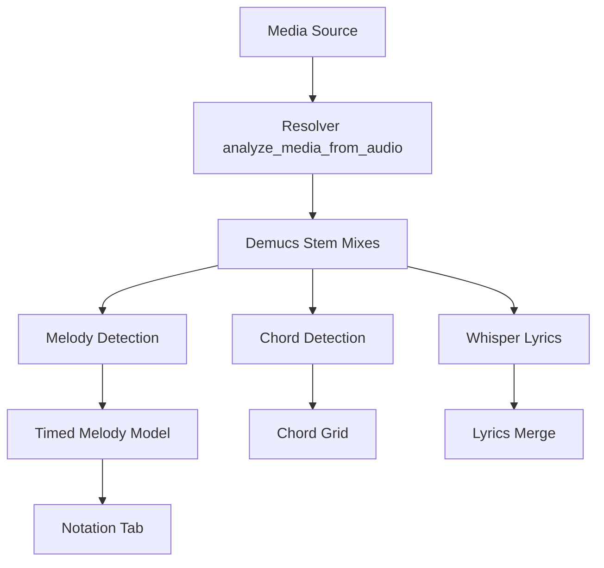

# Transcription Accuracy Plan

## Goal
Improve media transcription enough to make the feature usable again, with the biggest focus on notation. The work will stay behind explicit resolver/config flags where it adds dependencies or changes behavior substantially, so the currently hidden Import from media UI can remain hidden until results are validated.

## Current Flow

## Phase 1: Measurement Harness
Before changing algorithms, add a repeatable evaluation path so changes can be compared.

- Add small local resolver fixtures under `local-resolver/test-fixtures/` or document user-provided fixture paths via env vars.
- Add backend smoke/eval scripts for one audio file through lyrics, chords, and melody without needing the UI.
- Add frontend unit tests around formatting/regression-prone transforms.
- Record baseline output snapshots for:
  - Whisper text and stanza breaks.
  - Chord segments and bar grid.
  - Melody note events, ABC output, and detected key.

Primary files:
- [`local-resolver/server.py`](local-resolver/server.py)
- [`local-resolver/detect_melody.py`](local-resolver/detect_melody.py)
- [`local-resolver/detect_chords.py`](local-resolver/detect_chords.py)
- [`src/melodyFormatter.js`](src/melodyFormatter.js)
- [`src/melodyRefilterUtils.js`](src/melodyRefilterUtils.js)

## Phase 2: Lyrics Accuracy
Improve Whisper input quality and timing while keeping stanza preservation.

- Add resolver config/env options in [`local-resolver/server.py`](local-resolver/server.py):
  - `WHISPER_CPP_BEST_OF`, default still configurable but recommend `5` for quality mode.
  - Beam size if supported by the local `whisper-cli` build.
  - Language option instead of hardcoding downstream assumptions.
  - Initial prompt assembled from tune title/composer and any existing lyrics.
- Thread prompt/options from frontend analysis payload:
  - [`src/melodyProcessingSettings.js`](src/melodyProcessingSettings.js)
  - [`src/mediaAnalysisClient.js`](src/mediaAnalysisClient.js)
  - [`src/useTuneMediaAnalysis.js`](src/useTuneMediaAnalysis.js)
- Enable word-level JSON timestamps if the installed `whisper-cli` supports them, then parse real word offsets in `_normalize_whisper_segments`.
- Update [`src/timedLyricsModel.js`](src/timedLyricsModel.js) so `buildTimedLyricsFromTranscription` uses real word offsets when present and only falls back to even word timing when unavailable.
- Keep stanza blank lines from `_format_transcribed_lyrics`; add tests for stanza + word timestamp round-tripping.

Expected result: lyrics should improve mostly from cleaner vocal stems, stronger Whisper search settings, and better prompting; timing/alignment should become less arbitrary.

## Phase 3: Chord Accuracy
Smooth and constrain chord output before it reaches the wizard.

- In [`local-resolver/detect_chords.py`](local-resolver/detect_chords.py), add a post-processing step after `autochord.recognize`:
  - Merge very short chord segments.
  - Median-filter beat-level labels over a small window.
  - Prefer bar/half-bar persistence for folk/bluegrass-style material.
- Add a Viterbi-like smoother if median filtering is not enough:
  - Penalize rapid changes.
  - Penalize unlikely jumps.
  - Prefer `N` or previous chord during low-confidence/noisy spans if confidence is available.
- Add key-constrained vocabulary:
  - Pass key hints into chord detection from timing/melody metadata in [`local-resolver/server.py`](local-resolver/server.py).
  - Allow diatonic triads/sevenths plus common secondary dominants.
  - Keep unconstrained mode behind an env/config option for unusual music.
- Improve chord stem preset:
  - In [`local-resolver/audio_analysis_filters.py`](local-resolver/audio_analysis_filters.py), make chord mix more harmonic-focused: strong `other` + `bass`, lower or zero `drums`, lower vocals.
  - Mirror preset defaults in [`src/melodyProcessingSettings.js`](src/melodyProcessingSettings.js).
- Add tests for chord label smoothing in [`src/timedChordsModel.js`](src/timedChordsModel.js) and/or backend detector helper functions.

Expected result: fewer one-beat false chords, more stable roots, and chord grids that are musically plausible before manual correction.

## Phase 4: Notation Backend Upgrade
This is the highest-impact work. Add `basic-pitch` as an optional melody backend, while retaining the existing CREPE/pYIN path.

- Add a backend selector in [`local-resolver/detect_melody.py`](local-resolver/detect_melody.py):
  - `MELODY_BACKEND=auto|basic-pitch|crepe|pyin`.
  - `auto` tries `basic-pitch` if installed, then existing CREPE/pYIN fallback.
- Add `basic-pitch` to [`local-resolver/requirements-melody.txt`](local-resolver/requirements-melody.txt) or a separate optional requirements file if dependency size is a concern.
- Implement `_track_basic_pitch(...)` returning normalized note events directly:
  - start/end seconds
  - MIDI pitch
  - confidence
  - optional velocity/amplitude
- Preserve `candidateNotes` in the resolver response so the Notation tab can still re-filter without re-analysis.
- Keep existing CREPE/pYIN flow as fallback for environments where `basic-pitch` fails or is not installed.
- Add resolver logs/backend metadata so the UI can show which backend produced the transcription.

Expected result: instrumental and polyphonic melody extraction should improve substantially because `basic-pitch` detects note events rather than forcing frame-level monophonic pitch into notes.

## Phase 5: Improve Existing Pitch Path
Even with `basic-pitch`, improve the current monophonic path for vocal material.

- In [`local-resolver/detect_melody.py`](local-resolver/detect_melody.py), add f0 post-processing before `_segment_notes`:
  - Median filter the frequency contour.
  - Suppress isolated confidence spikes.
  - Correct octave jumps by comparing semitone distance against a local median.
- Replace exact-MIDI segmentation with tolerant segmentation:
  - Keep a note through vibrato if pitch stays within a semitone tolerance.
  - Require pitch changes to persist for N frames before starting a new note.
  - Merge fragments shorter than `minNoteSeconds` into neighboring compatible notes instead of always dropping them.
- Add onset-aware boundaries using `librosa.onset.onset_detect`:
  - Use onsets as candidate note starts.
  - Use pitch changes as secondary evidence.
- Ensure `candidateNotes` reflects the best unfiltered note candidates, not frame noise.

Expected result: vocal notation should stop fragmenting every vibrato wobble into separate notes.

## Phase 6: Rhythm Quantization
Replace crude nearest-beat timing with a musical grid fit.

- In [`src/melodyFormatter.js`](src/melodyFormatter.js), replace fixed `slotsPerBeat: 2` assumptions with configurable subdivisions:
  - Try 2, 3, and 4 subdivisions per beat.
  - Choose the lowest timing-error grid per bar or phrase.
  - Support dotted and triplet-like durations where they fit better.
- In [`src/melodyRefilterUtils.js`](src/melodyRefilterUtils.js), update `quantizeMelodyTime` to snap to subdivision grid points rather than blending only toward beats.
- In [`local-resolver/detect_melody.py`](local-resolver/detect_melody.py), reduce backend quantization or make it optional so the frontend formatter owns musical notation quantization.
- Adjust [`src/timedMelodyModel.js`](src/timedMelodyModel.js) to pass key, note length, and quantization options through cleanly.
- Add tests for:
  - straight eighths
  - sixteenths
  - triplet-ish passages
  - dotted rhythms
  - variable meter bars

Expected result: output should become readable ABC instead of over-rested or over-snapped note grids.

## Phase 7: Key-Aware Pitch Spelling
Make ABC output match the detected/selected key.

- Replace sharp-only `midiToAbcPitch` in [`src/melodyFormatter.js`](src/melodyFormatter.js) with key-aware spelling:
  - Use flats in flat keys.
  - Use sharps in sharp keys.
  - Prefer diatonic spellings from the current `K:` header.
  - Keep accidentals explicit where needed.
- Pass key into `formatMelodyNotes` from:
  - [`src/timedMelodyModel.js`](src/timedMelodyModel.js)
  - [`src/melodyRefilterUtils.js`](src/melodyRefilterUtils.js)
  - [`src/mediaAnalysisClient.js`](src/mediaAnalysisClient.js)
- Add optional low-confidence scale snapping:
  - If a detected note is off-scale and confidence is below a threshold, snap to nearest scale tone.
  - Keep this behind a setting because blues/chromatic passages should not be forcibly diatonic.
- Add unit tests in [`src/melodyFormatter.test.js`](src/melodyFormatter.test.js) for C, G, D, F, Bb, minor keys, and accidentals.

Expected result: notation becomes much more readable and musically plausible, especially in flat keys.

## Phase 8: UI and Validation
Keep the feature hidden until quality clears a threshold, but make tuning visible when re-enabled.

- Keep **Import from media** hidden in [`src/components/WizardOptionsModal.js`](src/components/WizardOptionsModal.js) until validation is complete.
- Add resolver backend/status details to the wizard when re-enabled:
  - Melody backend used.
  - Whether Demucs filtering was applied.
  - Whisper settings used.
- In [`src/components/mediaImportWizard/NotationStep.js`](src/components/mediaImportWizard/NotationStep.js), extend the note settings UI only after backend improvements are stable:
  - backend selector if useful
  - snap-to-scale toggle
  - quantization subdivision mode
  - confidence preview if candidate note confidence is exposed well enough
- Add an A/B comparison mode for internal testing:
  - current backend vs `basic-pitch`
  - old chord labels vs smoothed/key-constrained labels
  - Whisper default vs quality settings

## Verification Plan
- Run frontend unit tests:
  - `npm test -- --watchAll=false --testPathPattern='melodyFormatter|melodyRefilter|timedModels|timedChords|lyrics'`
- Run backend smoke tests on fixture media:
  - lyrics-only check: text/stanzas/word timestamps
  - chords check: segment count, min-duration smoothing, key constraints
  - melody check: note count, duration distribution, backend used, ABC renderability
- Manually validate at least three representative tracks:
  - clear vocal song
  - instrumental tune with lead melody
  - noisy live/YouTube recording

## Rollout Strategy
- Land in small commits/PRs by phase, with config flags defaulting conservatively.
- Keep the UI entry hidden until Phase 4 or Phase 5 produces acceptable notation on fixtures.
- Prefer `basic-pitch` as the default melody backend only after fixture results beat the current backend consistently.
- Document resolver env vars and dependencies in [`local-resolver/README.md`](local-resolver/README.md).

## Risks
- `basic-pitch` may add a heavy TensorFlow dependency; if it causes Docker size/runtime pain, keep it in an optional image or separate requirements file.
- Word timestamps depend on the installed `whisper-cli` build supporting the needed JSON output.
- Key constraints can damage modal, blues, or chromatic music; constraints must be toggleable.
- Rhythm quantization can make notation look cleaner while becoming less faithful; fixture-based A/B checks are important.